# Configuration Flow

This diagram shows how Gateway API resources map to NGINX configurations.

## Simple Overview

```mermaid
%%{init: {'theme':'dark', 'themeVariables': {'fontSize': '16px', 'darkMode': true, 'primaryColor': '#4f46e5', 'primaryTextColor': '#e5e7eb', 'primaryBorderColor': '#6b7280', 'lineColor': '#9ca3af', 'secondaryColor': '#1f2937', 'tertiaryColor': '#374151', 'background': '#111827', 'mainBkg': '#1f2937', 'secondBkg': '#374151', 'tertiaryTextColor': '#d1d5db'}}}%%
graph TB
    %% User Actions
    USER[👤 User] --> K8S

    %% Kubernetes API Layer
    subgraph "Kubernetes API"
        K8S[🔵 API Server]
        GW[Gateway]
        ROUTE[HTTPRoute]
        SVC[Service]
    end

    %% Control Plane
    subgraph "Control Plane Pod"
        NGF[🎯 NGF Controller]
    end

    %% Data Plane
    subgraph "Data Plane Pod"
        AGENT[🔧 NGINX Agent]
        NGINX[🌐 NGINX]
        CONF[nginx.conf]
    end

    %% Flow
    K8S --> NGF
    GW --> NGF
    ROUTE --> NGF
    SVC --> NGF

    NGF --> AGENT
    AGENT --> CONF
    CONF --> NGINX

    %% Dark-friendly styling
    style USER fill:#fbbf24,stroke:#f59e0b,stroke-width:2px,color:#1f2937
    style NGF fill:#3b82f6,stroke:#2563eb,stroke-width:2px,color:#ffffff
    style NGINX fill:#8b5cf6,stroke:#7c3aed,stroke-width:2px,color:#ffffff
    style K8S fill:#6b7280,stroke:#4b5563,stroke-width:2px,color:#ffffff
```



## Step-by-Step Process

### 1. User Creates Resources

```yaml
# User applies Gateway API resources
apiVersion: gateway.networking.k8s.io/v1
kind: Gateway
metadata:
  name: my-gateway
```

### 2. Kubernetes Stores Resources

- Gateway, HTTPRoute, Service resources stored in etcd
- Kubernetes API Server notifies controllers(watchers) of changes

### 3. NGF Controller Processes Changes

```text
NGF Controller:
├── Watches Gateway API resources
├── Validates configurations
├── Builds internal config graph
└── Generates NGINX configuration
```

### 4. Configuration Sent to Data Plane

```text
Control Plane → Data Plane:
├── gRPC connection (secure)
├── nginx.conf file contents
├── SSL certificates
└── Other config files
```

### 5. NGINX Agent Updates Configuration

```text
NGINX Agent:
├── Receives config from control plane
├── Validates NGINX syntax
├── Writes files to disk
├── Tests configuration
└── Reloads NGINX (if valid)
```

## Detailed Configuration Flow


## What Gets Generated?

### NGINX Configuration Files

NGF generates various NGINX configuration files dynamically based on the Gateway API resources.

### Example Generated Config

```nginx
# Generated from Gateway API resources
server {
    listen 80;
    server_name api.example.com;

    location /users {
        proxy_pass http://user-service;
    }

    location /orders {
        proxy_pass http://order-service;
    }
}
```

## Error Handling

### Invalid Configuration

1. **NGF validates** Gateway API resources
2. **NGINX Agent tests** generated config
3. **Rollback** if configuration is invalid
4. **Status updates** report errors to Kubernetes

### Recovery Process

- Keep last known good configuration
- Report errors in resource status
- Retry configuration updates
- Graceful degradation when possible
