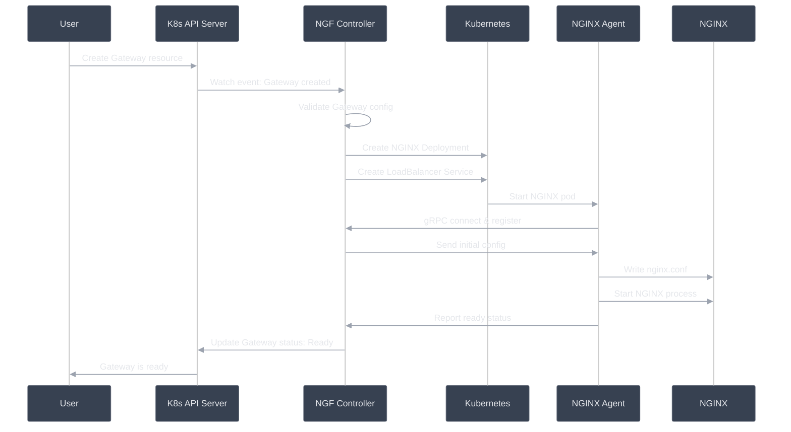
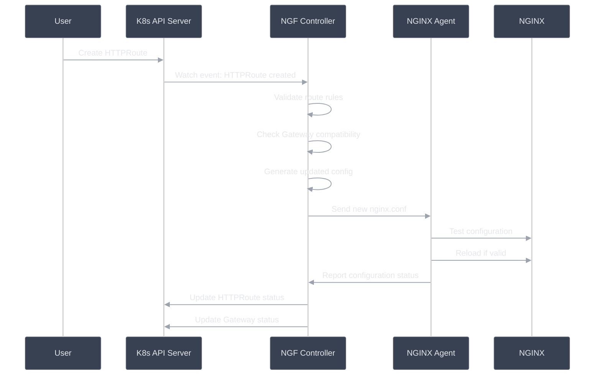
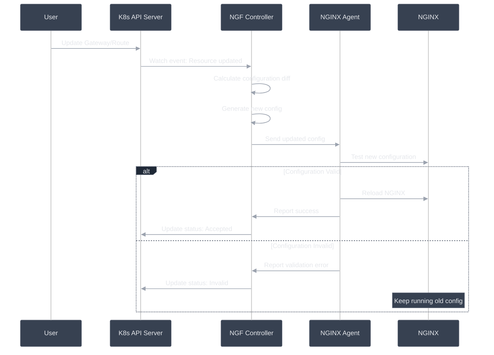
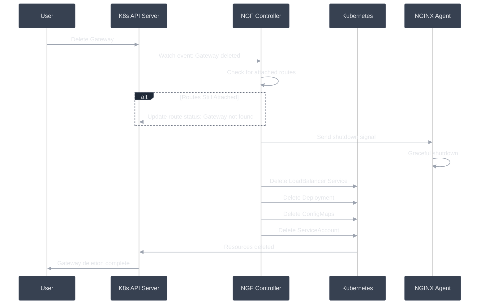

# Gateway Lifecycle

This shows what happens when you create, update, or delete a Gateway.

## Gateway Creation Flow



## What Happens During Creation

### 1. User Creates Gateway

```yaml
apiVersion: gateway.networking.k8s.io/v1
kind: Gateway
metadata:
  name: my-gateway
  namespace: default
spec:
  gatewayClassName: nginx
  listeners:
  - name: http
    port: 80
    protocol: HTTP
```

### 2. NGF Controller Validates

```text
Validation Checks:
├── GatewayClass exists and is valid
├── Listener configuration is correct
├── Required permissions are available
├── Resource limits are acceptable
└── No conflicting Gateways exist
```

### 3. Kubernetes Resources Created

```text
Resources Created (not exhaustive):
├── Deployment: nginx-gateway-{gateway-name}
├── Service: nginx-gateway-{gateway-name}
├── ConfigMap: nginx-config-{gateway-name}
├── ServiceAccount: nginx-gateway-{gateway-name}
└── Secrets: TLS certificates (if needed)
```

### 4. NGINX Pod Starts

```text
Pod Startup:
├── Pull NGINX + Agent image
├── Mount configuration files
├── Start NGINX Agent process
├── Agent connects to control plane
└── Download initial configuration
```

### 5. Gateway Becomes Ready

```text
Ready Conditions:
├── Deployment is available
├── Service has endpoints
├── NGINX is serving traffic
├── Health checks pass
└── Status updated in Kubernetes
```

## HTTPRoute Attachment Flow



### Route Configuration Process

```text
HTTPRoute Processing:
├── Parse route rules and matches
├── Validate backend references
├── Check Gateway listener compatibility
├── Generate NGINX location blocks
├── Update upstream definitions
├── Apply filters and policies
└── Send complete config to data plane
```

## Gateway Update Flow

### Configuration Changes



### Scaling Changes

```text
Scaling Operations:
├── Update Deployment replica count
├── New pods start and register
├── Load balancer adds new endpoints
├── Traffic distributes to all pods
└── Old pods drain gracefully
```

## Gateway Deletion Flow



### Graceful Shutdown Process

```text
Shutdown Steps:
├── Stop accepting new connections
├── Finish processing existing requests
├── Close upstream connections
├── Terminate NGINX process
└── Remove pod from endpoints
```
