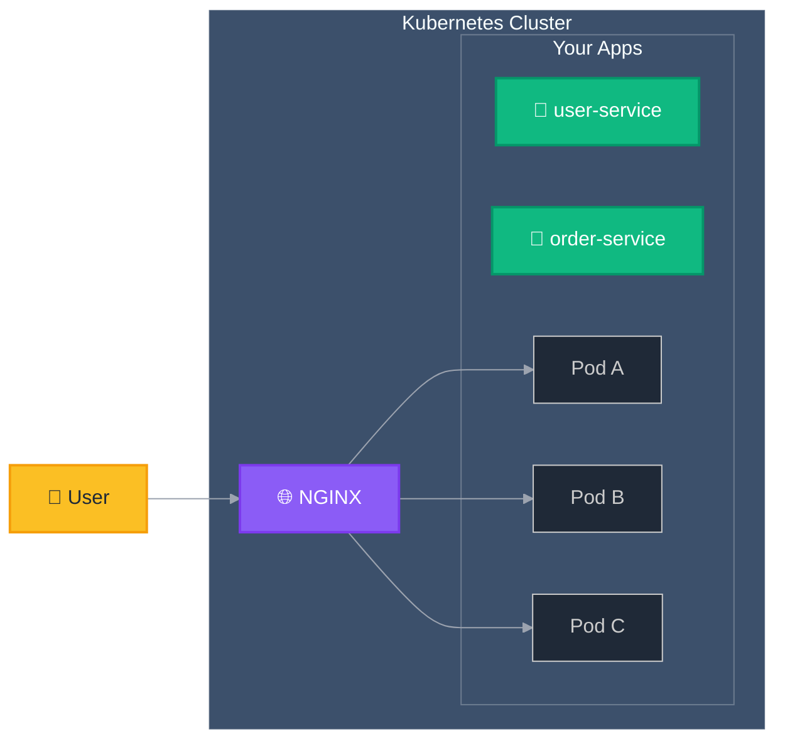
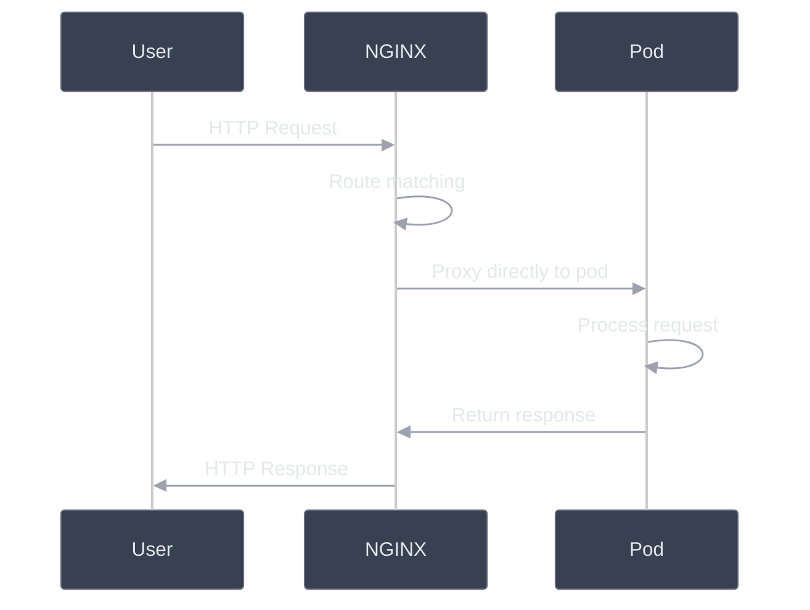

# Traffic Flow

This diagram shows how user requests travel through NGINX Gateway Fabric.

## Simple Overview

**Note:** NGINX routes traffic directly to Pods. Services are used for Pod information gathering, not as routing intermediaries.



## Traffic Processing Steps

### 1. User Sends Request

```text
User Request:
├── GET /users
├── POST /orders
├── Headers: Authorization, Content-Type
└── Body: JSON data (if needed)
```

### 2. NGINX Receives Request

```text
NGINX Gateway:
├── Receives request from user
├── Applies SSL termination (only if a user configures it to do so)
├── Matches routing rules
└── Selects backend pod
```

### 3. Pod Processes Request

```text
Backend Pod:
├── Receives request from NGINX
├── Processes business logic
├── Queries database (if needed)
├── Generates response
└── Returns response to NGINX
```

### 4. Response Returns to User

```text
Response Flow:
├── Pod → NGINX
├── NGINX → User
└── Request complete
```

## Detailed Request Flow



## Request Routing Logic

Routes use both hostname and path for traffic routing decisions.

### Combined Host and Path Routing

```nginx
# Routes combine hostname and path matching
server {
    server_name api.example.com;

    location /users {
        proxy_pass http://user-service;
    }

    location /orders {
        proxy_pass http://order-service;
    }
}

server {
    server_name admin.example.com;

    location /dashboard {
        proxy_pass http://admin-service;
    }

    location /settings {
        proxy_pass http://config-service;
    }
}
```
