# Traffic Flow

This diagram shows how user requests travel through NGINX Gateway Fabric.

## Simple Overview

**Note:** NGINX routes traffic directly to Pods. Services are used for Pod information gathering, not as routing intermediaries.

```mermaid
%%{init: {'theme':'dark', 'themeVariables': {'fontSize': '16px', 'darkMode': true, 'primaryColor': '#4f46e5', 'primaryTextColor': '#e5e7eb', 'primaryBorderColor': '#6b7280', 'lineColor': '#9ca3af', 'secondaryColor': '#1f2937', 'tertiaryColor': '#374151', 'background': '#111827', 'mainBkg': '#1f2937', 'secondBkg': '#374151', 'tertiaryTextColor': '#d1d5db'}}}%%
graph LR
    %% Simple traffic flow
    USER[👤 User]

    subgraph "Kubernetes Cluster"
        NGINX[🌐 NGINX]

        subgraph "Your Apps"
            SVC1[🔵 user-service]
            SVC2[🔵 order-service]
            POD1[Pod A]
            POD2[Pod B]
            POD3[Pod C]
        end
    end

    %% Simple flow - NGINX routes directly to Pods
    USER --> NGINX
    NGINX --> POD1
    NGINX --> POD2
    NGINX --> POD3

    %% Dark-friendly styling
    style USER fill:#fbbf24,stroke:#f59e0b,stroke-width:2px,color:#1f2937
    style NGINX fill:#8b5cf6,stroke:#7c3aed,stroke-width:2px,color:#ffffff
    style SVC1 fill:#10b981,stroke:#059669,stroke-width:2px,color:#ffffff
    style SVC2 fill:#10b981,stroke:#059669,stroke-width:2px,color:#ffffff
```



## Traffic Processing Steps

### 1. User Sends Request

```text
User Request:
├── GET /users
├── POST /orders
├── Headers: Authorization, Content-Type
└── Body: JSON data (if needed)
```

### 2. NGINX Receives Request

```text
NGINX Gateway:
├── Receives request from user
├── Applies SSL termination (only if a user configures it to do so)
├── Matches routing rules
└── Selects backend pod
```

### 3. Pod Processes Request

```text
Backend Pod:
├── Receives request from NGINX
├── Processes business logic
├── Queries database (if needed)
├── Generates response
└── Returns response to NGINX
```

### 4. Response Returns to User

```text
Response Flow:
├── Pod → NGINX
├── NGINX → User
└── Request complete
```

## Detailed Request Flow


## Request Routing Logic

Routes use both hostname and path for traffic routing decisions.

### Combined Host and Path Routing

```nginx
# Routes combine hostname and path matching
server {
    server_name api.example.com;

    location /users {
        proxy_pass http://user-service;
    }

    location /orders {
        proxy_pass http://order-service;
    }
}

server {
    server_name admin.example.com;

    location /dashboard {
        proxy_pass http://admin-service;
    }

    location /settings {
        proxy_pass http://config-service;
    }
}
```
