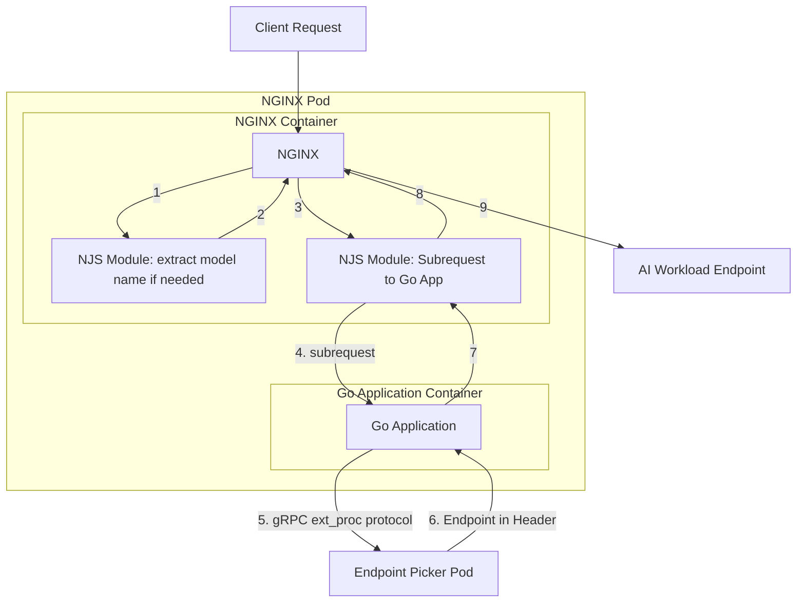

# Enhancement Proposal-3716: Gateway API Inference Extension

- Issue: https://github.com/nginx/nginx-gateway-fabric/issues/3716
- Status: Implementable

## Summary

Enable NGINX Gateway Fabric to support the [Gateway API Inference Extension](https://gateway-api-inference-extension.sigs.k8s.io/), allowing dynamic routing to AI workloads. The goal for now is a basic implementation that meets the core functionality based on the API spec. There are likely many enhancements and improvements that can be made to this, but those should be considered after feedback around the usage and worth of this feature.

The [References section](#references) contains many useful links for describing the extension in depth.

## Goals

- Define and implement the basic solution to meet the API's core specifications.
- Determine which resources (e.g. InferencePool) NGF needs to watch, and what configuration should be built based upon this.
- Define the process in which NGF should integrate with the [Endpoint Picker](https://github.com/kubernetes-sigs/gateway-api-inference-extension/tree/main/pkg/epp) (EPP).
- Determine what NGINX needs to do in order to forward incoming traffic to an AI workload.

## Non-Goals

- Define new APIs.
- Determine how to integrate with AI Gateway.
- Any functionality beyond the core API specification.

## Terminology

The terms AI workload, LLM workload, and model workload are used interchangeably in this doc. Most of this is based on terminology provided by the Gateway API Inference Extension documentation.

## Introduction

The intention of the Gateway API Inference Extension is to optimize load-balancing for self-hosted GenAI models in Kubernetes. These workloads can serve massive amounts of data, and their performance is influenced greatly by the infrastructure that they are running on (e.g. GPUs). Routing client requests to these types of backends requires specialized decision making to ensure the best performance and responses.

To make these routing decisions, a component known as the [Endpoint Picker (EPP)](https://gateway-api-inference-extension.sigs.k8s.io/#endpoint-picker) is deployed. The EPP uses configuration and metrics to determine which AI workload in an InferencePool should receive the request. It returns this endpoint in a header to the `inference Gateway` (which would be NGINX in our case) to forward the request to that endpoint. The model name that the request should be routed to can be contained in the body of the request, or in a header.

Check out the [request flow](https://gateway-api-inference-extension.sigs.k8s.io/#request-flow) section of the Gateway API documentation to learn more.

## Use Cases

Gateway API Inference Extension provides optimized load-balancing for self-hosted Generative AI Models on Kubernetes. The project’s goal is to improve and standardize routing to inference workloads across the ecosystem.

Use cases include:

- Route traffic based on model names instead of just a path.
- Enable varying priorities of models, ensuring that more critical requests are routed to the proper model.
- Incrementally roll out new models.
- Overall reduce latency and improve accelerator (GPU) utilization for AI workloads.

## Design

This feature should be gated behind a feature flag. This is due to the API being in an alpha state and things may be subject to change. User feedback will be valuable, and telemetry data could help us understand if anyone uses it and if it's worth pursuing improvements in the future.

### Integration with EPP

The Endpoint Picker uses Envoy's [ext_proc protocol](https://github.com/kubernetes-sigs/gateway-api-inference-extension/tree/main/docs/proposals/004-endpoint-picker-protocol). NGINX needs to be able to forward the client request to the EPP and use the endpoint returned in the header response to then forward the request to that endpoint (the AI workload). Because the EPP listens for gRPC, we cannot use NGINX natively (or NJS) to make that call. For our initial implementation, we can write a simple Go application that is called by an NJS module via subrequest to get the endpoint from the EPP. NGINX would then `proxy_pass` to that endpoint.

The Go application could be built into the existing `nginx-gateway` binary, and deployed as an additional container in the NGINX Deployment when an InferencePool is created. The NJS module would then call this application over localhost. The connection from Go -> EPP should be secure if possible, as discussed in the [Security Considerations](#security-considerations).

See the [Alternatives section](#alternatives) for a future improvement to this workflow.

### Model Name extraction

When a client sends a request to an AI workload, the desired model name (e.g. gpt-4o, llama, etc.) is included in the request body.

By default, the EPP gets the model name from the request body, and then picks the proper endpoint for that model name. However, the model name could also be provided via header (`X-Gateway-Model-Name`). For example, a user could specify a desire for a traffic split or model name redirect, and therefore NGINX would need to change the model name by setting the header.

Example that redirects requests to model name `food-review` to `food-review-v1`:

```yaml
kind: HTTPRoute
apiVersion: gateway.networking.k8s.io/v1
metadata:
  name: my-route
spec:
  parentRefs:
    - name: my-inference-gateway
  rules:
  - matches:
    - headers:
      - type: Exact
        name: X-Gateway-Model-Name
        value: food-review
    backendRefs:
    - name: vllm-llama3-8b-instruct
      kind: InferencePool
      group: inference.networking.x-k8s.io
      - filters:
        - type: RequestHeaderModifier
          requestHeaderModifier:
            set:
            - name: X-Gateway-Model-Name
              value: food-review-v1
```

Example with traffic splitting:

```yaml
kind: HTTPRoute
apiVersion: gateway.networking.k8s.io/v1
metadata:
  name: my-route
spec:
  parentRefs:
    - name: my-inference-gateway
  rules:
  - matches:
    - headers:
      - type: Exact
        name: X-Gateway-Model-Name
        value: food-review
    backendRefs:
    - name: vllm-llama3-8b-instruct
      kind: InferencePool
      group: inference.networking.x-k8s.io
      weight: 90
      - filters:
        - type: RequestHeaderModifier
          requestHeaderModifier:
            set:
            - name: X-Gateway-Model-Name
              value: food-review-v1
    - name: vllm-llama3-8b-instruct
      kind: InferencePool
      group: inference.networking.x-k8s.io
      weight: 10
      - filters:
        - type: RequestHeaderModifier
          requestHeaderModifier:
            set:
            - name: X-Gateway-Model-Name
              value: food-review-v2
```

In both cases, NGINX would need to extract the model name from the request body. This will probably require an NJS module. If that model name matches the condition set in the Route, then NGINX sets the header appropriately when sending the request to the EPP. For the redirect example, NGINX would set the header to `food-review-v1`. For the traffic splitting example, NGINX would set the header to either `food-review-v1` or `food-review-v2` depending on the weighted traffic decision.

### Managing InferencePools

By default, the EPP should know which endpoints are a part of an InferencePool, and then pick the correct endpoint to send to. This means that NGINX does not need to have an upstream for the AI workload servers, since it just gets the endpoint it needs to send to from the EPP.

However, there could still be a valid use case for NGF to track and configure NGINX with the endpoints that are a part of the InferencePool. For one, there is currently a `FailOpen` mode which says that if the EPP is unavailable, NGINX should pick an endpoint to send to. There's also value in verifying that the endpoint given to us by the EPP is trusted.

Because of this, NGF should watch the endpoints associated with an InferencePool, and create an upstream. One way to accomplish this is for NGF to create a Headless "shadow" Service that encompasses those endpoints. By defining this Service, NGF can use all of its existing Service/EndpointSlice logic to build the upstreams as if it was a normal Service.

**The main point of concern with this is how can we fallback to use the upstream servers if the EPP is unavailable to give us an endpoint?** This may have to be discovered during implementation.

### Flow Diagram



## API, Customer Driven Interfaces, and User Experience

The infrastructure provider or cluster operator would first need to install the Gateway API Inference Extension CRDs, similar to how they install the Gateway API CRDs today. Two new CRDs are introduced, the `InferencePool` and `InferenceObjective`.

### InferencePool

InferencePool represents a set of Inference-focused Pods and an extension that will be used to route to them. Within the broader Gateway API resource model, this resource is considered a "backend". In practice, that means that you'd replace a Kubernetes Service with an InferencePool. This resource has some similarities to Service (a way to select Pods and specify a port), but has some unique capabilities. With InferencePool, you can configure a routing extension as well as inference-specific routing optimizations.

### InferenceObjective

InferenceObjective represents the desired state of a specific model use case. As of writing this, this API is still undergoing changes.

It is my impression that this API is purely for the EPP to handle, and does not need to be handled by NGINX Gateway Fabric.

### Personas and Processes

Two new personas are introduced, the `Inference Platform Owner/Admin` and `Inference Workload Owner`.

The Inference Platform Owner creates and manages the infrastructure necessary to run LLM workloads. They create InferencePool resources (and an associated EPP). They can do so using [this helm chart](https://github.com/kubernetes-sigs/gateway-api-inference-extension/tree/main/config/charts/inferencepool). An EPP is required per InferencePool.

The Inference Workload Owner persona is someone that trains, verifies, and leverages a large language model from a model frontend, drives the lifecycle and rollout of new versions of those models, and defines the specific performance and latency goals for the model. These workloads are expected to operate within an InferencePool sharing compute capacity with other InferenceObjectives. The Inference Workload Owner would create their InferenceObjective resources for their model workloads.

Once all resources are created, the application developers can reference the InferencePool as a BackendRef in an HTTPRoute. This will trigger NGINX Gateway Fabric to configure the specialized routing for that pathway involving the AI workloads in the InferencePool.

## Testing

The Gateway API Inference Extension repository provides [conformance tests](https://github.com/kubernetes-sigs/gateway-api-inference-extension/tree/main/conformance) that we should be able to integrate with, similar to our existing conformance suite. We'll need to evaluate if these tests are sufficient at covering all cases. If not, we'll likely need to add some functional tests as well.

At a high level, testing should ensure that traffic can be routed from a client, through NGINX, to the proper inference workload, based on the contents of the request.

For development purposes, the [Getting started guide](https://gateway-api-inference-extension.sigs.k8s.io/guides/) explains how to deploy some sample model servers.

## Security Considerations

If the Endpoint Picker (EPP) supports it, we should use a secure TLS connection. This ensures an encrypted and authenticated communication channel between the NGINX data plane and the EPP. For production environments, an integration with `cert-manager` is likely the best solution, as we recommend this for various other secure channels within the NGF ecosystem. Otherwise, our control plane may have to provision certificates in the default case (similar to NGF's startup `cert-generator` Job).

At some point, there may be opportunities for attaching Policies (like a BackendTLSPolicy) to an InferenceModel to secure the NGINX -> AI workload connection, however that is not in scope for now.

## Alternatives

Instead of building an NJS and Go connector to communicate with the EPP, we could build everything natively into NGINX using a [Rust module](https://github.com/nginx/ngx-rust). [nginx-acme](https://github.com/nginx/nginx-acme) is an example NGINX module that was built using Rust.

Advantages:

- Native integration without the need for an extra container, multiple steps, and overhead.
- Learn some Rust and writing NGINX modules!

Disadvantages:

- Learning curve.
- Would need a custom build of NGINX OSS/Plus to support Rust bindings.

If this Inference Extension feature gains traction and usage, it could be worth pursuing this as an improvement.

## Future work

- Use a Rust module, as described in the [Alternatives section](#alternatives).
- Integrate with [F5 AI Gateway](https://www.f5.com/products/ai-gateway). AI Gateway could offer a number of beneficial features that we could take advantage of for the request lifecycle of AI workloads, especially around security. Ideally, we could utilize the AI Gateway's "processors" in some way without the need for deploying the entire product. This could be dependent on architectural changes by AI Gateway itself. Policy CRDs could be defined to allow users configure various security and other processing settings for this integration. If pursued, this will require a dedicated design doc.
- Instead of `proxy_pass` directly to the endpoint returned by the EPP, we find a way to proxy to that endpoint via the upstream block that its contained in (which is the same way that we proxy to backends today). The upstream block could contain multiple endpoints for the pool, but we still only want to route to the specific endpoint that the EPP gave us. Maybe `sticky route` could be used to ensure we send to that endpoint. The benefits of routing to the upstream block versus directly to the endpoint include more robust metrics (NGINX Plus) and the ability to utilize policies (like BackendTLSPolicy) for the upstream as a whole.

## References

- [Gateway API Inference Extension](https://gateway-api-inference-extension.sigs.k8s.io/)
- [Gateway API Inference Extension Github](https://github.com/kubernetes-sigs/gateway-api-inference-extension/tree/main)
- [Implementor's Guide](https://gateway-api-inference-extension.sigs.k8s.io/guides/implementers/)
- [API specification](https://gateway-api-inference-extension.sigs.k8s.io/reference/spec/)
- [Endpoint Picker](https://github.com/kubernetes-sigs/gateway-api-inference-extension/tree/main/pkg/epp)
- [Endpoint Picker and InferencePool Helm Chart](https://github.com/kubernetes-sigs/gateway-api-inference-extension/tree/main/config/charts/inferencepool)
- [Traffic splitting/redirect doc](https://docs.google.com/document/d/1s4U4T_cjQkk4UeIDyAJl2Ox6FZoBigXBXn9Ai0qV7As/edit?tab=t.0#heading=h.9re863ochpnv)
