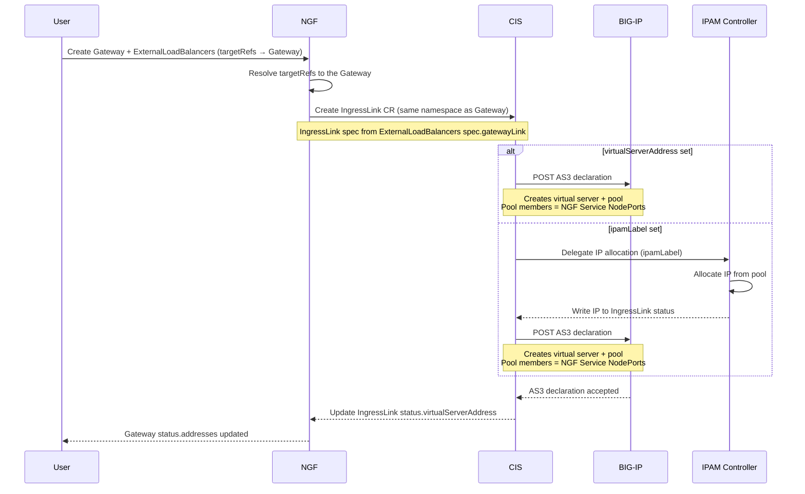
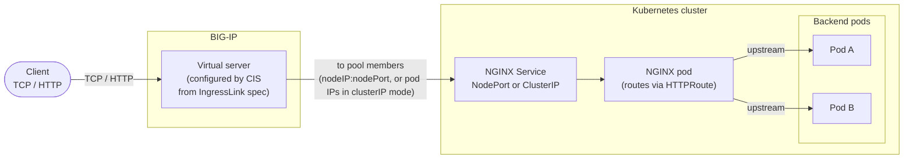

# Enhancement Proposal-5432: BIG-IP GatewayLink Integration

- Issue: https://github.com/nginx/nginx-gateway-fabric/issues/5432
- Status: Provisional

## Summary

This Enhancement Proposal introduces a standalone `ExternalLoadBalancers` CRD to support integrations with external load balancers that front NGINX Gateway Fabric. The resource references a Gateway through `targetRefs`. The first supported integration is with F5 BIG-IP through F5 Container Ingress Services (CIS). NGINX Gateway Fabric provisions a CIS `IngressLink` resource for the referenced Gateway. CIS uses it to create a virtual server and its pool on BIG-IP that fronts NGINX Gateway Fabric as an external load balancer.

## Goals

- Add an `ExternalLoadBalancers` CRD that references a Gateway and supports integrations with different external load balancers.
- Add `gatewayLink` to the `ExternalLoadBalancers` API to support integration with BIG-IP as an external load balancer configured using the F5 CIS IngressLink CRD.
- Expose the IngressLink fields through the `gatewayLink` API, so the BIG-IP virtual server can be configured. The `selector` field is auto-set: NGINX Gateway Fabric sets it internally to match the data plane Service it provisions for the Gateway.
- Tie the IngressLink lifecycle to its Gateway, so it is created and deleted alongside the Gateway.

## Non-Goals

- Modifying the F5 Container Ingress Service's Ingress resource.
- Setting up the BIG-IP stack. Installing and configuring the BIG-IP stack is the operator's responsibility.

## Introduction

[F5 BIG-IP](https://www.f5.com/products/big-ip) is commonly deployed as the external load balancer in front of Kubernetes ingress. [F5 CIS](https://github.com/F5Networks/k8s-bigip-ctlr) watches Kubernetes resources and configures BIG-IP declaratively via a configuration API named Application Services 3 (AS3). CIS supports an `IngressLink` custom resource definition (`ingresslinks.cis.f5.com`) that is designed to link an external load balancer to an in-cluster ingress data plane. An IngressLink resource creates a BIG-IP [virtual server](https://techdocs.f5.com/kb/en-us/products/big-ip_ltm/manuals/product/ltm-basics-11-6-0/2.html) and a [pool](https://techdocs.f5.com/kb/en-us/products/big-ip_ltm/manuals/product/ltm-basics-11-6-0/4.html#unique_1127536889) whose members are selected from a Kubernetes Service based on selector labels. The IngressLink's `selector` matches the labels on a Service, reads that Service's endpoints, and programs them as the pool members. As the Service's endpoints change, CIS keeps the pool in sync.

We will use the IngressLink resource to configure BIG-IP so that it acts as an external load balancer in front of NGINX Gateway Fabric. Client connections arrive at BIG-IP, which forwards them to the NGINX data plane to be routed to the backend applications. The data plane is provisioned per Gateway, so each Gateway gets its own Service whose endpoints are the data plane pods. A user creates an `ExternalLoadBalancers` resource that references a Gateway through `targetRefs`, and NGINX Gateway Fabric creates one IngressLink for that Gateway. CIS reads that IngressLink and configures a BIG-IP virtual server and pool from it. The pool members are the data plane pods behind that Service, so scaling the Deployment up or down updates the pool to match. This gives per-Gateway isolation that maps naturally onto BIG-IP virtual servers and partitions.

## API, Customer Driven Interfaces, and User Experience

### Architecture and data flow

To better understand how resources are created in the cluster and reflected into BIG-IP, the diagram below shows the control flow:



The flow for a Gateway is:

1. A user creates a Gateway and an `ExternalLoadBalancers` resource whose `targetRefs` points at that Gateway.
2. NGF provisions the data plane Deployment and Service for the Gateway, and resolves the `ExternalLoadBalancers` `targetRefs` to the Gateway.
3. NGF creates one IngressLink resource in the Gateway's namespace, owned by the Gateway, with its spec built from the `ExternalLoadBalancers` `gatewayLink` configuration.
4. CIS sees the IngressLink and configures BIG-IP. If `virtualServerAddress` is set, CIS posts an AS3 declaration that creates the virtual server and pool directly. If `ipamLabel` is set instead, the F5 IPAM Controller first allocates an IP from the labelled pool and writes it to the IngressLink status, and then CIS posts the AS3 declaration using that IP.
5. CIS writes the virtual server address back to the IngressLink status.
6. NGF reads the IngressLink status and writes the virtual server address into `Gateway.status.addresses`.
7. IngressLink is owned by the Gateway so deleting the Gateway removes the IngressLink and, in turn, the BIG-IP virtual server and pool.

At runtime, traffic flows from the client through the BIG-IP virtual server to NGINX Gateway Fabric, which routes it to the backends:



### Reconciliation

The IngressLink is built together with the Gateway's data plane Service and Deployment and reconciled as one set, so it is kept in sync and is not orphaned when the Gateway is reprovisioned.

Its content comes from two stable sources. The IngressLink `spec` (such as `virtualServerAddress`, `partition`, `iRules`, and `tls`) comes from the `ExternalLoadBalancers` `gatewayLink` configuration, so it changes only when that resource is edited. The IngressLink `selector` is set by NGINX Gateway Fabric to match the data plane Service and is derived from the Gateway, not from the `NginxProxy`.

As a result, the changes an `NginxProxy` drives on the Service or Deployment do not rewrite the IngressLink. The IngressLink selects the Service by stable, NGF-controlled labels, so those changes leave it unchanged. Pool membership is not carried in the IngressLink either; CIS watches the selected Service's endpoints directly and updates the BIG-IP pool as they change, for example when the Deployment scales. Changing the Service type between `NodePort` and `ClusterIP` likewise leaves the IngressLink unchanged, but the pool stays healthy only if the CIS pool member type is set to match the new Service type.

### API definitions

`ExternalLoadBalancers` is a standalone CRD in the `gateway.nginx.org` group. It references a Gateway through `targetRefs` and holds the external load balancer configuration under `gatewayLink`. See [Why a standalone CRD](#why-a-standalone-crd) and [ExternalLoadBalancers and its targetRefs](#externalloadbalancers-and-its-targetrefs) for the rationale and the mapping to Gateways.

```go
// ExternalLoadBalancers configures an external load balancer that fronts a Gateway.
// It references a Gateway through TargetRefs. NGINX Gateway Fabric provisions the
// external load balancer integration for the Gateway's data plane Service.
type ExternalLoadBalancers struct {
	metav1.TypeMeta   `json:",inline"`
	metav1.ObjectMeta `json:"metadata,omitempty"`

	// Spec defines the desired state of the ExternalLoadBalancers.
	Spec ExternalLoadBalancersSpec `json:"spec"`

	// Status defines the state of the ExternalLoadBalancers.
	Status ExternalLoadBalancersStatus `json:"status,omitempty"`
}

// ExternalLoadBalancersSpec defines the desired state of ExternalLoadBalancers.
//
// +kubebuilder:validation:XValidation:message="exactly one external load balancer backend must be set",rule="has(self.gatewayLink)"
type ExternalLoadBalancersSpec struct {
	// GatewayLink configures F5 BIG-IP as the external load balancer using F5
	// Container Ingress Services. It is the first supported backend. Additional
	// backend types may be added as sibling fields in the future.
	//
	// +optional
	GatewayLink *GatewayLinkConfig `json:"gatewayLink,omitempty"`

	// TargetRefs identifies the Gateways this external load balancer applies to.
	// Each object must be in the same namespace as the ExternalLoadBalancers resource.
	// Exactly one Gateway is supported for now; the field is a list so that support
	// for multiple Gateways can be added later.
	// Support: Gateway.
	//
	// +kubebuilder:validation:MaxItems=1
	// +kubebuilder:validation:MinItems=1
	// +kubebuilder:validation:XValidation:message="TargetRef Kind must be Gateway",rule="self.all(ref, ref.kind=='Gateway')"
	// +kubebuilder:validation:XValidation:message="TargetRef Group must be gateway.networking.k8s.io",rule="self.all(ref, ref.group=='gateway.networking.k8s.io')"
	TargetRefs []gatewayv1.LocalPolicyTargetReference `json:"targetRefs"`
}

// GatewayLinkConfig defines the configuration for integrating with F5 BIG-IP
// as the external load balancer for NGINX Gateway Fabric using F5
// Container Ingress Services.
// IngressLink API Definition: https://github.com/F5Networks/k8s-bigip-ctlr/blob/master/docs/config_examples/customResourceDefinitions/customresourcedefinitions.yml
//
// +kubebuilder:validation:XValidation:message="virtualServerAddress and ipamLabel are mutually exclusive",rule="!(has(self.virtualServerAddress) && has(self.ipamLabel))"
// +kubebuilder:validation:XValidation:message="one of virtualServerAddress or ipamLabel must be set",rule="has(self.virtualServerAddress) || has(self.ipamLabel)"
// +kubebuilder:validation:XValidation:message="partition cannot be Common",rule="!has(self.partition) || self.partition != 'Common'"
//
//nolint:lll
type GatewayLinkConfig struct {
	// VirtualServerAddress is the static IP address to configure on BIG-IP for the virtual server.
	// This is mutually exclusive with IPAMLabel.
	//
	// +kubebuilder:validation:Pattern=`^(([0-9]|[1-9][0-9]|1[0-9]{2}|2[0-4][0-9]|25[0-5])\.){3}([0-9]|[1-9][0-9]|1[0-9]{2}|2[0-4][0-9]|25[0-5])$`
	// +optional
	VirtualServerAddress *string `json:"virtualServerAddress,omitempty"`

	// VirtualServerName is a custom name for the BIG-IP virtual server.
	//
	// +kubebuilder:validation:Pattern=`^[a-zA-Z]+([A-z0-9-._+])*([A-z0-9])$`
	// +optional
	VirtualServerName *string `json:"virtualServerName,omitempty"`

	// IPAMLabel is the label used by F5 IPAM Controller to allocate an IP address.
	// The IPAM controller will assign an IP from the pool associated with this label.
	// This is mutually exclusive with VirtualServerAddress.
	//
	// +kubebuilder:validation:Pattern=`^[a-zA-Z]+[-A-z0-9_.:]+[A-z0-9]+$`
	// +optional
	IPAMLabel *string `json:"ipamLabel,omitempty"`

	// Host is the hostname for the BIG-IP virtual server.
	//
	// +optional
	// +kubebuilder:validation:Pattern=`^(([a-zA-Z0-9\*]|[a-zA-Z0-9][a-zA-Z0-9\-]*[a-zA-Z0-9])\.)*([A-Za-z0-9]|[A-Za-z0-9][A-Za-z0-9\-]*[A-Za-z0-9])$`
	Host *string `json:"host,omitempty"`

	// Partition is the BIG-IP partition where resources will be created.
	// The partition must already exist on BIG-IP and cannot be "Common".
	//
	// +kubebuilder:validation:Pattern=`^[a-zA-Z]+[-A-Za-z0-9_.]+$`
	// +optional
	Partition *string `json:"partition,omitempty"`

	// BigIPRouteDomain is the route domain ID for the BIG-IP virtual server.
	//
	// +kubebuilder:validation:Minimum=0
	// +kubebuilder:validation:Maximum=65535
	// +optional
	BigIPRouteDomain *int32 `json:"bigipRouteDomain,omitempty"`

	// TLS defines the TLS configuration for the BIG-IP virtual server.
	//
	// +optional
	TLS *GatewayLinkTLS `json:"tls,omitempty"`

	// MultiCluster defines the multi-cluster configuration for load balancing traffic
	// across NGINX instances in multiple clusters.
	//
	// +optional
	MultiCluster *GatewayLinkMultiCluster `json:"multiCluster,omitempty"`

	// IRules is a list of BIG-IP iRules to apply to the virtual server.
	// Each iRule must be specified using the full path format /partition/irule_name,
	// for example "/Common/Proxy_Protocol_iRule".
	//
	// +kubebuilder:validation:items:Pattern=`^\/[a-zA-Z]+([A-z0-9-_+]+\/)+([-A-z0-9_.:]+\/?)*$`
	// +optional
	IRules []string `json:"iRules,omitempty"`

	// Monitors is a list of BIG-IP health monitors to associate with the virtual server pool.
	//
	// +optional
	Monitors []GatewayLinkMonitor `json:"monitors,omitempty"`

	// ServiceAddress configures Layer 3 settings for the BIG-IP virtual server address.
	//
	// +optional
	ServiceAddress *GatewayLinkServiceAddress `json:"serviceAddress,omitempty"`

	// AdditionalIngressLinkSpec is an escape hatch for IngressLink fields that are not yet
	// modeled by GatewayLink. Its contents are merged verbatim into the generated IngressLink
	// spec and are NOT validated by NGINX Gateway Fabric. Fields set here take lower precedence
	// than the explicitly modeled GatewayLink fields above; NGINX Gateway Fabric always sets the
	// IngressLink selector internally and it cannot be overridden through this field. Use with
	// caution - contents bypass schema validation, defaulting, and CEL rules, and flow through to
	// BIG-IP via F5 CIS.
	//
	// +kubebuilder:validation:XPreserveUnknownFields
	// +optional
	AdditionalIngressLinkSpec *apiextv1.JSON `json:"additionalIngressLinkSpec,omitempty"`
}

// GatewayLinkServiceAddress configures Layer 3 settings for the BIG-IP virtual server address.
type GatewayLinkServiceAddress struct {
	// ICMPEcho controls whether the virtual server address responds to ICMP echo (ping).
	//
	// +optional
	ICMPEcho *ICMPEcho `json:"icmpEcho,omitempty"`

	// TrafficGroup is the BIG-IP traffic group that owns the virtual server address,
	// in the full path format, for example "/Common/traffic-group-test".
	//
	// +kubebuilder:validation:Pattern=`^\/([A-z0-9-_+]+\/)+([-A-z0-9_.:]+\/?)*$`
	// +optional
	TrafficGroup *string `json:"trafficGroup,omitempty"`
}

// ICMPEcho controls whether the BIG-IP virtual server address responds to ICMP echo.
// +kubebuilder:validation:Enum=enable;disable;selective
type ICMPEcho string

const (
	// ICMPEchoEnable means the virtual server address always responds to ICMP echo.
	ICMPEchoEnable ICMPEcho = "enable"

	// ICMPEchoDisable means the virtual server address never responds to ICMP echo.
	ICMPEchoDisable ICMPEcho = "disable"

	// ICMPEchoSelective means BIG-IP responds to ICMP echo based on the state of the virtual server.
	ICMPEchoSelective ICMPEcho = "selective"
)

// TLSReferenceType specifies where the BIG-IP SSL profiles come from.
// +kubebuilder:validation:Enum=bigip;secret
type TLSReferenceType string

const (
	// TLSReferenceBigIP means the SSL profiles already exist on BIG-IP.
	TLSReferenceBigIP TLSReferenceType = "bigip"

	// TLSReferenceSecret means the SSL profiles are sourced from Kubernetes secrets.
	TLSReferenceSecret TLSReferenceType = "secret"
)

// GatewayLinkTLS defines the TLS configuration for the BIG-IP virtual server.
type GatewayLinkTLS struct {
	// Reference specifies the source of the SSL profiles. "bigip" means the profiles already
	// exist on BIG-IP. "secret" means they come from Kubernetes secrets of type kubernetes.io/tls.
	//
	// +optional
	Reference *TLSReferenceType `json:"reference,omitempty"`

	// ClientSSLs is a list of client SSL profiles that BIG-IP uses to terminate TLS from the client.
	// When reference is "bigip", each entry is the full path of a profile on BIG-IP in the form
	// /partition/profile_name, for example /Common/clientssl. When reference is "secret", each entry
	// is the name of a Kubernetes secret of type kubernetes.io/tls that holds the certificate and key.
	//
	// +kubebuilder:validation:items:Pattern=`^\/?[a-zA-Z]+([-A-z0-9_+]+\/)*([-A-z0-9_.:]+\/?)*$`
	// +optional
	ClientSSLs []string `json:"clientSSLs,omitempty"`

	// ServerSSLs is a list of server SSL profiles that BIG-IP uses to re-encrypt traffic to NGINX.
	// When reference is "bigip", each entry is the full path of a profile on BIG-IP in the form
	// /partition/profile_name, for example /Common/serverssl. When reference is "secret", each entry
	// is the name of a Kubernetes secret of type kubernetes.io/tls that holds the certificate and key.
	//
	// +kubebuilder:validation:items:Pattern=`^\/?[a-zA-Z]+([-A-z0-9_+]+\/)*([-A-z0-9_.:]+\/?)*$`
	// +optional
	ServerSSLs []string `json:"serverSSLs,omitempty"`
}

// GatewayLinkMonitor defines a BIG-IP health monitor reference.
type GatewayLinkMonitor struct {
	// Name is the full path of the health monitor on BIG-IP (e.g., "/Common/http").
	//
	// +kubebuilder:validation:Pattern=`^\/[a-zA-Z]+([A-z0-9-_+]+\/)+([-A-z0-9_.:]+\/?)*$`
	Name string `json:"name"`

	// Reference specifies the source of the monitor. Currently only "bigip" is supported.
	//
	// +kubebuilder:validation:Enum=bigip
	Reference string `json:"reference"`
}

// GatewayLinkMultiCluster defines the multi-cluster configuration for GatewayLink.
// When configured, CIS load balances traffic across NGINX instances
// in multiple clusters. This is set only on the cluster that runs CIS. The other
// clusters run NGINX with a matching Gateway and Service but not CIS,
// so they do not set multiCluster. CIS reaches those clusters over a kubeconfig.
type GatewayLinkMultiCluster struct {
	// LocalClusterName is the name of this cluster as configured in the CIS deployment
	// via the --local-cluster-name flag. NGINX Gateway Fabric uses it as the cluster name
	// for the local entry in the IngressLink's multiClusterServices, which points at this
	// cluster's own Gateway Service. It must match the name CIS knows this cluster by,
	// otherwise CIS cannot resolve the local service.
	LocalClusterName string `json:"localClusterName"`

	// RemoteClusters is the list of remote clusters that also run NGINX Gateway Fabric.
	//
	// +kubebuilder:validation:MinItems=1
	RemoteClusters []GatewayLinkRemoteCluster `json:"remoteClusters"`
}

// GatewayLinkRemoteCluster defines a remote cluster for multi-cluster load balancing.
type GatewayLinkRemoteCluster struct {
	// ClusterName is one of the names of the remote clusters as configured in the CIS deployment.
	//
	// +kubebuilder:validation:Required
	ClusterName *string `json:"clusterName"`

	// Namespace is the namespace of the NGINX service in the remote cluster.
	// If not specified, defaults to the local Gateway's namespace.
	//
	// +optional
	Namespace *string `json:"namespace,omitempty"`

	// Service is the name of the NGINX service in the remote cluster.
	// If not specified, defaults to the local Gateway's service name.
	//
	// +optional
	Service *string `json:"service,omitempty"`

	// Weight is the load balancing weight for this cluster's service.
	//
	// +kubebuilder:validation:Minimum=0
	// +kubebuilder:validation:Maximum=256
	// +optional
	Weight *int32 `json:"weight,omitempty"`
}
```

Below is an example of an `ExternalLoadBalancers` resource that fronts a Gateway named `gateway` with BIG-IP:

```yaml
apiVersion: gateway.nginx.org/v1alpha1
kind: ExternalLoadBalancers
metadata:
  name: gateway-bigip
  namespace: default
spec:
  targetRefs:
    - group: gateway.networking.k8s.io
      kind: Gateway
      name: gateway
  gatewayLink:
    virtualServerAddress: "10.8.3.101"   # or ipamLabel
    partition: k8s
    iRules:
      - "/Common/Proxy_Protocol_iRule"
```

The data plane Service type and the client IP preservation settings live on the Gateway's `NginxProxy`, not on `ExternalLoadBalancers`. The Service type must match the CIS pool member type (see [service type and pool member type](#understanding-the-correlation-between-service-type-and-cis-pool-member-type)), and PROXY protocol is configured through `rewriteClientIP` (see [Preserving the real ClientIP](#preserving-the-real-clientip)):

```yaml
apiVersion: gateway.nginx.org/v1alpha2
kind: NginxProxy
metadata:
  name: nginx-proxy
spec:
  kubernetes:
    service:
      type: NodePort          # must match CIS --pool-member-type
  rewriteClientIP:
    mode: ProxyProtocol
    trustedAddresses:
      - type: CIDR
        value: "10.8.0.0/14"
```

The supported fields for configuring BIG-IP through the IngressLink CRD:

| Field | Type | Default | Description |
| --- | --- | --- | --- |
| `virtualServerAddress` | IPv4 string | — | The static IP address for the BIG-IP virtual server. This is mutually exclusive with `ipamLabel`. |
| `ipamLabel` | string | — | A label that tells the F5 IPAM Controller to allocate the virtual server IP from a pool. This is mutually exclusive with `virtualServerAddress`. |
| `virtualServerName` | string | CIS-generated | A custom name for the BIG-IP virtual server. |
| `host` | hostname | — | The hostname for the virtual server. BIG-IP uses it for host-based matching. |
| `partition` | string | — | The BIG-IP partition where CIS creates resources. The partition must already exist on BIG-IP and it cannot be `Common`. |
| `bigipRouteDomain` | int32 | 0 | The route domain for the virtual server. It is used for segmented Layer 3 address spaces and accepts a value from 0 to 65535. |
| `iRules` | []string | — | The iRules to attach to the virtual server. Each entry is a full path in the form `/partition/name`. CIS currently requires at least one. |
| `monitors` | []object | — | The BIG-IP health monitors for the pool. Each entry has a `name`, which is a full path, and a `reference`, which is set to `bigip`. |
| `tls.reference` | enum | — | The source of the SSL profiles. Use `bigip` for profiles that exist on BIG-IP, or `secret` for profiles sourced from Kubernetes secrets. |
| `tls.clientSSLs` | []string | — | The client SSL profiles that BIG-IP uses to terminate TLS from the client. |
| `tls.serverSSLs` | []string | — | The server SSL profiles that BIG-IP uses to re-encrypt traffic to NGINX. |
| `multiCluster.localClusterName` | string | — | The name of this cluster as configured in CIS. Setting it enables load balancing a single virtual server across clusters. |
| `multiCluster.remoteClusters[]` | list | — | The list of remote clusters. Each entry has a `clusterName`, an optional `namespace` and `service`, and an optional `weight` from 0 to 256. |
| `selector` | labelSelector | — | Selects the backend Service for the pool. NGINX Gateway Fabric sets this itself to match the data plane Service, so it is not user configurable. |
| `serviceAddress` | object | — | The Layer 3 settings for the virtual server address. It models `trafficGroup`, the failover unit for HA, and `icmpEcho`. Other Layer 3 settings such as `arpEnabled`, `routeAdvertisement`, and `spanningEnabled` are set through `additionalIngressLinkSpec`. |
| `additionalIngressLinkSpec` | object | — | A passthrough for IngressLink fields that GatewayLink does not model. Contents are forwarded verbatim and are not validated by NGF. Modeled fields take precedence, and the `selector` cannot be overridden. |

### Why a standalone CRD

The configuration started as an `externalLoadBalancers` field on the `NginxProxy` CRD. NginxProxy configures the NGINX data plane itself, and the external load balancer configuration is a separate concern that grew large and made NginxProxy convoluted. A dependency on NginxProxy remains, since the data plane Service type has to match the CIS pool member type.

A standalone `ExternalLoadBalancers` CRD keeps that concern separate and is easier to expand. New external load balancer integrations are added as sibling fields alongside `gatewayLink`. The resource references a Gateway through `targetRefs`, so the lifecycle and scope of the load balancer configuration are tied to a Gateway rather than to the data plane parameters.

`ExternalLoadBalancers` is not a Gateway API policy. It does not drive any NGINX configuration; it provisions a sibling IngressLink for the Gateway.

### ExternalLoadBalancers and its targetRefs

An `ExternalLoadBalancers` resource holds the configuration for one external load balancer, and each Gateway has its own data plane Service that the load balancer fronts. For now the mapping is one-to-one: a resource targets a single Gateway, and a Gateway is fronted by a single `ExternalLoadBalancers`. When more than one `ExternalLoadBalancers` targets the same Gateway, the oldest is accepted and the others are rejected with `Accepted=False`, so a Gateway always resolves to a single configuration.

`targetRefs` is defined as a list with `maxItems` of one rather than a single reference. This keeps the current behavior strictly one-to-one while leaving room to support multiple Gateways per resource later without a breaking API change, for example a shared configuration fronting several Gateways once the semantics are worked out. Whether one configuration can sensibly front several Gateways depends on the specific external load balancer, so the constraint is enforced here and revisited per backend as needed.

### Understanding the correlation between service type and CIS pool member type

The Gateway data plane Service type (`kubernetes.service.type`) must match the CIS pool member type. The pool member type is a CIS setting, the `--pool-member-type` flag chosen when CIS is installed, and it is either `nodeport` or `cluster`. It is set by whoever installs CIS, not through the NginxProxy CRD, and it is separate from the `selector`. The `selector` chooses which Service CIS reads, while the pool member type decides how CIS turns that Service's endpoints into pool members. NGINX Gateway Fabric sets the `selector` itself, but the operator must set the CIS pool member type to match the NGINX Service type. The Service type determines how BIG-IP reaches NGINX, so it decides what CIS puts into the pool of the virtual server it creates on BIG-IP.

CIS is installed separately from NGINX Gateway Fabric, typically with the F5 Helm chart. Its install-time settings, including `--pool-member-type` and the BIG-IP partition and credentials, are the operator's responsibility and are not managed by NGINX Gateway Fabric.

With CIS in `nodeport` mode, the Service must be `NodePort` and CIS populates the pool with each node's IP and the Service's allocated node port. BIG-IP needs reachability to the node IP and node port, and traffic takes an extra hop through `kube-proxy` on the node before reaching a pod. With CIS in `cluster` mode, the Service must be `ClusterIP` and CIS programs the pod IPs directly as pool members, but this requires BIG-IP to have a network path to the pod network using a static route to the pod CIDR via the node. If the Service type and the pool member type do not match, the pool will not be populated.

### BIG-IP HA mode

BIG-IP can run as a pair of devices, one active and one standby. If the active device fails, the standby takes over, so the virtual server IP has to move to whichever device is currently active.

To make the IP move, set `serviceAddress.trafficGroup` to a floating traffic group such as `/Common/traffic-group-test`. This ties the virtual server IP to the failover unit. When the standby becomes active it takes over the IP, and traffic keeps flowing without any change in Kubernetes.

This assumes the two BIG-IPs are already set up as a working HA pair on the BIG-IP side. They must be in the same device trust group and have config sync enabled so that both devices share the same configuration. That setup is the operator's responsibility. NGF only sets the traffic group through `serviceAddress`.

### Multi-cluster configuration and operator setup

A single BIG-IP virtual server can load balance across NGINX instances in multiple clusters using `gatewayLink.multiCluster`. NGINX Gateway Fabric translates this into the IngressLink's `multiClusterServices`, with one entry for the local cluster and one for each remote cluster, so the virtual server ends up with one pool per cluster. This was verified on hardware, where a single virtual server sent traffic to pods in two clusters.

Setting `multiCluster` requires `localClusterName` and at least one entry in `remoteClusters`. The local cluster must not be listed among the remote clusters. NGINX Gateway Fabric builds its `multiClusterServices` entry from `localClusterName` and the Gateway's own Service. If there are no remote clusters, use the normal single-cluster configuration instead of `multiCluster`.

The multi-cluster mode is a CIS installation flag (`--multi-cluster-mode`) set by the operator, not driven by NGF. This integration was verified with standalone mode, where a single CIS watches all clusters. CIS also offers an HA mode with a coordinating pair of CIS instances, which could not be validated now and will be verified during the support work. This is separate from BIG-IP HA, which is a device-level failover concern configured through `serviceAddress` and covered above.

Only one cluster runs CIS, and it reaches the other clusters over a kubeconfig. That requires setup on the CIS cluster that NGINX Gateway Fabric does not manage:

- CIS install flags `--multi-cluster-mode=standalone`, `--local-cluster-name=<name>`, and `--extended-spec-configmap=<namespace>/<name>`.
- An extended ConfigMap, labeled `f5nr: "true"`, with `mode: default` and an `externalClustersConfig` list that maps each remote cluster name to the Secret holding its kubeconfig.
- One kubeconfig Secret per remote cluster. Its server URL must be the remote cluster's real API address reachable from the CIS cluster, not a loopback such as `127.0.0.1`.

Each remote cluster runs NGINX Gateway Fabric with a Gateway of the same name and namespace the configuration references and a NodePort Service, but it does not run CIS. Multi-cluster therefore requires `nodeport` pool mode. The cluster names must match in three places: `gatewayLink.multiCluster` (both `localClusterName` and each `remoteClusters[].clusterName`), the extended ConfigMap, and the CIS `--local-cluster-name` flag.

#### Running multiple CIS against one BIG-IP

Running more than one CIS against a single BIG-IP is only safe under specific conditions, which were established on hardware. Each CIS owns an entire AS3 tenant, which corresponds to a BIG-IP partition, and every update replaces that whole tenant. Separately, BIG-IP requires each virtual server destination address to be unique across the whole device, regardless of partition.

| Partition | Virtual server address | Result |
| --- | --- | --- |
| same | same | One CIS overwrites the other; last writer wins and the other's virtual server is removed. |
| same | different | Same overwrite. Each CIS owns the whole partition, so a different address does not help. |
| different | same | BIG-IP rejects the declaration, since the address is not unique device-wide. |
| different | different | Both coexist cleanly, even with mutual multi-cluster references. |

The rule for operators is that two CIS instances against one BIG-IP must use both a different partition and a different `virtualServerAddress`, or target different BIG-IPs. The partition is set through the CIS `--bigip-partition` flag and `gatewayLink.partition`, which must agree, and it must already exist on BIG-IP.

### Preserving the real ClientIP

BIG-IP opens its own connection to the data plane, so by default NGINX sees BIG-IP as the client instead of the real caller. To preserve the original client IP, BIG-IP prepends a PROXY protocol header by following the `Proxy_Protocol_iRule`, set on the `ExternalLoadBalancers` resource, and NGINX is told to read it through `rewriteClientIP` on the Gateway's `NginxProxy` using the existing [`rewriteClientIP`](rewrite-client-ip.md) API:

```yaml
apiVersion: gateway.nginx.org/v1alpha1
kind: ExternalLoadBalancers
spec:
  gatewayLink:
    iRules:
      - "/Common/Proxy_Protocol_iRule"
---
apiVersion: gateway.nginx.org/v1alpha2
kind: NginxProxy
spec:
  rewriteClientIP:
    mode: ProxyProtocol
    trustedAddresses:
      - type: CIDR
        value: "10.145.32.0/19"   # the BIG-IP self-IP subnet
```

`trustedAddresses` is a security control. NGINX only honors a PROXY header from a source listed in this field, so the field must contain the BIG-IP self-IP that originates traffic to the pods. Set it to that self-IP's subnet. In an HA pair, cover both devices' self-IPs, because either one can be the active sender. Both sides also have to agree on whether PROXY protocol is in use. If NGINX expects a PROXY header but BIG-IP is not sending one, or BIG-IP sends one but NGINX is not expecting it, the connection fails.

## Use Cases

- Expose NGINX Gateway Fabric behind an existing BIG-IP without manually configuring virtual servers and pools.
- Get per-tenant isolation, since each Gateway maps to its own virtual server on BIG-IP.
- Manage virtual server IPs centrally through the F5 IPAM Controller instead of hand-assigning them.
- Preserve the client IP through BIG-IP using PROXY protocol together with the existing Rewrite Client IP feature.

## Known Limitations

Within `serviceAddress`, the `icmpEcho` and `trafficGroup` settings were verified to take effect on BIG-IP. The `arpEnabled`, `spanningEnabled`, and `routeAdvertisement` settings reached BIG-IP and were applied to the virtual server address, but their runtime behavior was not exercised, since that needs a more involved network setup such as a dynamic routing peer for route advertisement.

Rather than model every IngressLink setting as a typed field, we expose `additionalIngressLinkSpec`, a passthrough that forwards fields verbatim into the generated IngressLink spec. It preserves unknown fields and is not validated by NGINX Gateway Fabric, so the modeled fields keep their schema validation and CEL rules while any IngressLink field NGF does not model can still be set. The `arpEnabled`, `spanningEnabled`, and `routeAdvertisement` settings are set through it, and it covers any other unmodeled IngressLink field. The precedence is selector > modeled > raw. A modeled `gatewayLink` field overrides the same key in `additionalIngressLinkSpec`, while a field left unset in `gatewayLink` keeps whatever the raw spec provides. NGF always sets the `selector` itself, so it can never be overridden through the passthrough.

## Testing

We will add integration tests that exercise the integration end to end against a real BIG-IP. We have access to a long-standing BIG-IP instance to run them against. These tests require a BIG-IP stack, so they cannot run in the CI pipelines and are run manually.

The test flow:

1. Install NGF and CIS, with the `ExternalLoadBalancers` CRD applied.
2. Mount the BIG-IP public key into the test environment and create a dedicated partition on BIG-IP for the test run.
3. Run the test in two configurations. The first uses a static `virtualServerAddress`. The second uses the F5 IPAM Controller with an `ipamLabel` so that the address is allocated dynamically.
4. Create a Gateway and an `ExternalLoadBalancers` resource targeting it, then verify that NGF provisions the `IngressLink` and that CIS configures the virtual server and pool on BIG-IP.
5. Send traffic to the virtual server IP and confirm that it reaches the application through NGF.
6. Tear down the test by deleting the partition and removing the public key from the BIG-IP stack.

These tests need to be run manually since they need a configured BIG-IP stack. They should be run before every major release to ensure all functionalities work as expected or when we update the CIS version in use.

## Security Considerations

- We do not hold BIG-IP credentials. CIS holds them, and securing the communication between BIG-IP and CIS is an operator responsibility.
- Client IP preservation via PROXY protocol requires `trustedAddresses` to be scoped to the BIG-IP source range. An overly broad range would let untrusted sources spoof client IPs.
- When `tls.reference: secret` is used, CIS reads the referenced TLS secrets, so controlling access to those secrets is an operator responsibility.

## Alternatives

- Integrate with a different external load balancer. The `ExternalLoadBalancers` CRD is general, so support for other external load balancers can be added alongside `gatewayLink` as a sibling field in the future.
- Use a LoadBalancer Service with a cloud or MetalLB controller. This works where a Service LoadBalancer implementation exists, but it does not use BIG-IP features such as iRules, profiles, monitors, and partitions, or the F5 operational model.
- Configure BIG-IP manually, where operators define virtual servers and pools by hand. This loses the declarative automation driven by the Gateway lifecycle and drifts as the data plane endpoints change.

## References

- [IngressLink CRD](https://github.com/F5Networks/k8s-bigip-ctlr/blob/master/docs/config_examples/customResourceDefinitions/customresourcedefinitions.yml)
- [NginxProxy API](../../apis/v1alpha2/nginxproxy_types.go)
- [F5 BIG-IP](https://www.f5.com/products/big-ip)
- [F5 CIS](https://github.com/F5Networks/k8s-bigip-ctlr)
- [BIG-IP virtual server](https://techdocs.f5.com/kb/en-us/products/big-ip_ltm/manuals/product/ltm-basics-11-6-0/2.html)
- [BIG-IP Pool](https://techdocs.f5.com/kb/en-us/products/big-ip_ltm/manuals/product/ltm-basics-11-6-0/4)
