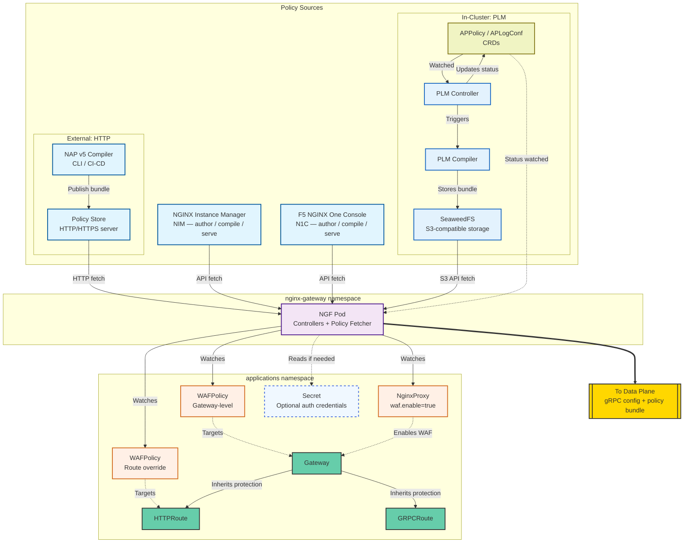
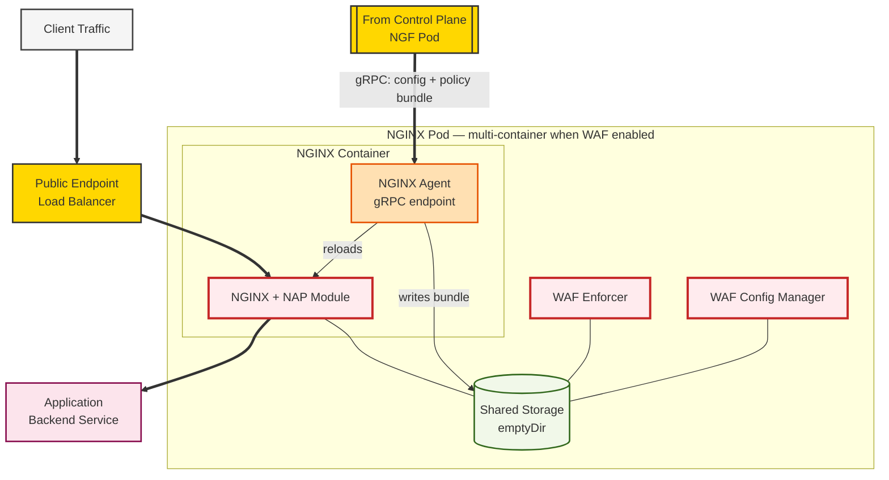
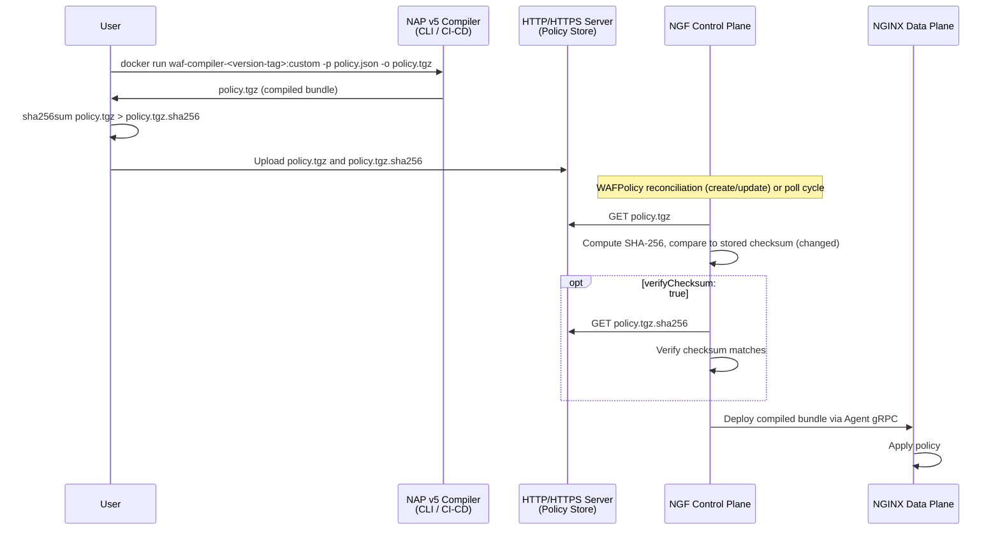
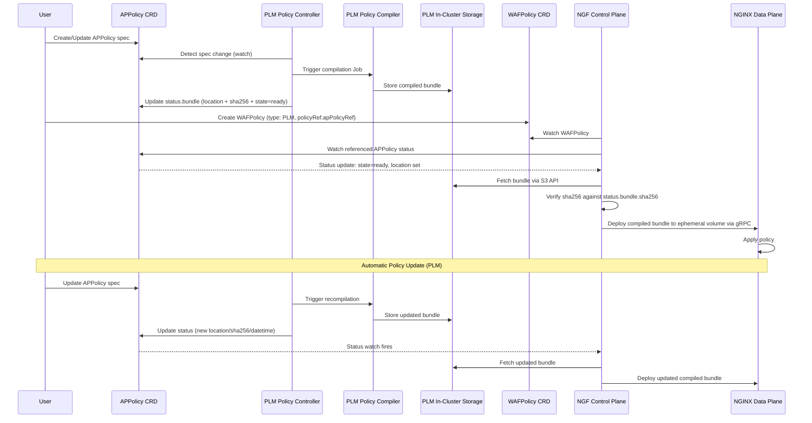

# Enhancement Proposal-3341: F5 WAF for NGINX Integration

- Issue: https://github.com/nginx/nginx-gateway-fabric/issues/3341
- Status: Implementable

## Summary

This proposal describes the integration of F5 WAF for NGINX into NGINX Gateway Fabric (NGF) to provide comprehensive WAF protection at Gateway and Route levels while working within NAP v5's architectural constraints of multi-container deployment and pre-compiled policy requirements. The design uses Gateway API inherited policy attachment to provide flexible, hierarchical WAF protection.

Four policy source types are supported, selected via the top-level `spec.type` field:

| Type   | Description                                                                                         |
|--------|-----------------------------------------------------------------------------------------------------|
| `NIM`  | NGINX Instance Manager — policy fetched by name or UID via NIM API                                  |
| `N1C`  | F5 NGINX One Console — policy fetched by name or object ID via N1C API                              |
| `PLM`  | Policy Lifecycle Management — APPolicy/APLogConf CRD references, fetched from in-cluster S3 storage |
| `HTTP` | Direct HTTP/HTTPS URL to a compiled bundle file                                                     |

The `NIM`, `N1C`, and `HTTP` source types use GitOps-friendly static policy references with automatic polling and change detection. The `PLM` source type integrates with F5's Policy Lifecycle Management system for fully Kubernetes-native policy lifecycle management with event-driven updates.

> **Note:** `PLM` support is not yet implemented. The API design is included here for completeness and will be finalised as PLM matures.

## Goals

- Extend NginxProxy resource to enable WAF for GatewayClass/Gateway with multi-container orchestration
- Design WAFPolicy custom resource using inherited policy attachment for hierarchical WAF configuration
- Define deployment workflows that accommodate NAP v5's external policy compilation requirements
- Provide secure and automated policy distribution from external sources (HTTP/HTTPS, NIM, F5 NGINX One Console) and from PLM in-cluster storage
- Support GitOps workflows with static compiled bundle references and automatic change detection via polling (HTTP/NIM/N1C)
- Support Kubernetes-native policy lifecycle management via PLM CRD references with event-driven updates (PLM)
- Design a complete polling mechanism for periodic bundle change detection using checksum comparison
- Design a retry policy for transient fetch failures during initial policy acquisition
- Deliver enterprise-grade WAF capabilities through Kubernetes-native APIs with intuitive policy inheritance
- Maintain alignment with NGF's existing security and operational patterns
- Support configurable security logging for WAF events and policy violations
- Support both HTTPRoute and GRPCRoute protection

## Non-Goals

- Compiling or updating WAF policies (handled by external tooling, NGINX Instance Manager, F5 NGINX One Console, or PLM Policy Compiler)
- Providing inline policy definition (not supported by NAP v5 architecture)
- Supporting NGINX OSS (F5 WAF  does not require NGINX Plus, but OSS support is out of scope at this time)
- Real-time policy editing interfaces
- Policy version management system
- Persistent storage management for compiled bundle files
- Native cloud authentication (IRSA, Workload Identity, GCP WI) is out of scope at this time — only HTTP Basic Auth and Bearer Token are supported for HTTP/NIM/N1C
- Managing PLM controller deployment and lifecycle (handled by PLM team)

## Introduction

### Containerized WAF Architectural Constraints

Containerized F5 WAF for NGINX imposes specific architectural requirements that fundamentally shape this integration design:

- **Multi-container deployment**: Requires separate `waf-enforcer` and `waf-config-mgr` containers alongside the main NGINX container
- **Pre-compiled policies**: WAF policies must be compiled externally using NAP tooling before deployment (cannot be defined inline in Kubernetes resources)
- **Shared volume architecture**: Containers communicate through shared filesystem volumes rather than direct API calls

### Design Philosophy

This proposal provides the best possible Kubernetes-native experience while respecting the above constraints, abstracting complexity from end users where possible while maintaining operational flexibility for enterprise environments. The design uses Gateway API's inherited policy attachment pattern to provide intuitive hierarchical security with the ability to override policies at more specific levels.

### Terminology

The following terms are used consistently throughout this document:

| Term              | Meaning                                                                                               |
|-------------------|-------------------------------------------------------------------------------------------------------|
| Policy definition | The JSON file authored by the user specifying the WAF security posture                                |
| Compiled bundle   | The `.tgz` artifact produced by the NAP v5 compiler, consumable by the WAF engine                     |
| Policy source     | Where NGF fetches compiled bundles from (HTTP server, NIM, N1C, or PLM storage)                       |
| WAFPolicy         | The Kubernetes CRD that tells NGF where to fetch a compiled bundle and which Gateway/Route to protect |

### WAFPolicy Structure

The `WAFPolicy` spec is organised around a single `type` discriminator at the top level. Non-CRD bundle fetch configuration (HTTP, NIM, N1C) lives inside `policySource`, while CRD-backed policy references (PLM) live inside `policyRef`. Similarly, each `securityLogs` entry uses `logSource` for non-CRD log profile sources and `logRef` for CRD-backed log profile references. This separation cleanly distinguishes remote fetch config from Kubernetes-native CRD references.

```shell
spec.type                              → selects which sub-field is relevant
spec.policySource.httpSource           → direct URL fetch configuration (type: HTTP)
spec.policySource.nimSource            → NIM fetch configuration (type: NIM)
spec.policySource.n1cSource            → N1C fetch configuration (type: N1C)
spec.policyRef.apPolicyRef             → APPolicy CRD reference (type: PLM)
spec.securityLogs[*].logSource         → non-CRD log fetch config (defaultProfile, httpSource, nimSource, n1cSource)
spec.securityLogs[*].logRef.apLogConfRef → APLogConf CRD reference (type: PLM)
```

`policySource` and `logSource` are optional pointer fields — they are omitted entirely for `type: PLM`, which uses `policyRef` and `logRef` instead. CEL validation rules enforce that `policySource` is not set for PLM (and vice versa), that the correct source sub-field is set for the declared `type`, and that mutually exclusive sub-fields are not set together.

### Policy Lifecycle Model

A WAF security posture is defined as a JSON **policy definition** and must be **compiled** into a `.tgz` **compiled bundle** before it can be applied to the WAF engine. These are two distinct artifacts with different owners, lifecycles, and failure modes.

**NGF's scope begins at "Fetch bundle."** Everything to the left of that step is external to NGF and handled by the operator, a management platform (NIM or N1C), or the PLM system:

```text
Author policy definition → Compile to bundle → Publish/store bundle → NGF fetches → Deploy to data plane
```

The table below shows who owns each step for each source type:

| Step                     | HTTP                                   | NIM                                     | N1C                                                                                   | PLM                        |
|--------------------------|----------------------------------------|-----------------------------------------|---------------------------------------------------------------------------------------|----------------------------|
| Author policy definition | User (any editor / git)                | NIM UI or API                           | N1C console or API                                                                    | APPolicy CRD spec          |
| Compile to bundle        | User (CLI / CI-CD)                     | User-triggered via NIM UI or API        | User-triggered via N1C UI or API; or NGF-triggered on first fetch if no bundle exists | PLM Controller (automatic) |
| Store compiled bundle    | User (upload to HTTP server)           | NIM (internal)                          | N1C (internal)                                                                        | PLM (SeaweedFS)            |
| Fetch bundle             | NGF (reconciliation; optional polling) | NGF (reconciliation; optional polling)  | NGF (reconciliation; optional polling)                                                | NGF (Kubernetes watch)     |
| Deploy to data plane     | NGF → Agent gRPC                       | NGF → Agent gRPC                        | NGF → Agent gRPC                                                                      | NGF → Agent gRPC           |

### Policy Source Types Overview

#### NIM/N1C/HTTP Sources

- NGF fetches compiled policy bundles directly from the configured URL or management platform API
- Polling-based change detection: NGF periodically checks for policy changes using SHA-256 checksum comparison
- Authentication via Kubernetes Secrets (HTTP Basic Auth or Bearer/APIToken)
- The relevant `policySource.*Source` sub-field is required; others must not be set

#### PLM Source

> **Note:** PLM is not yet implemented.

- Policies are defined as `APPolicy` and `APLogConf` CRDs and compiled automatically by the PLM Policy Controller
- Compiled bundles are stored in PLM's in-cluster S3-compatible storage (SeaweedFS)
- Bundle locations are written to the `status` of the respective CRDs by PLM
- NGF watches `APPolicy` and `APLogConf` status and fetches bundles via S3 API when a new compilation is detected
- No polling required — updates are event-driven via Kubernetes watch
- PLM storage access is configured cluster-wide via CLI flags/Helm values (not per-WAFPolicy)
- `policyRef.apPolicyRef` is required; `policySource.*Source` fields must not be set
- Log sources use `logRef.apLogConfRef` instead of `logSource.*Source`
- Cross-namespace `APPolicy`/`APLogConf` references require a `ReferenceGrant`

### GitOps Integration

A key design principle for all sources is seamless GitOps workflow support through automatic change detection

- **Automatic Polling**: When polling is enabled, NGF/ PLM periodically check for policy changes
- **Efficient Updates**: Only downloads policy definitions (PLM only) and bundles when content actually changes
- **CI/CD Friendly**: Teams can update policies without modifying Kubernetes resources

#### GitOps Integration (PLM)

- PLM supports pulling remote JSON policy definitions and compiled policies. See the APPolicy and APLogConf API definitions for details on how to configure this approach.

#### GitOps Integration - Policy Polling Design (NIM/N1C/HTTP)

When `polling.enabled: true` is set on a `policySource` or `logSource`, NGF runs a background goroutine per WAFPolicy that periodically re-fetches the bundle and compares its SHA-256 checksum against the last successfully fetched value.

**Polling mechanism:**

- NGF starts one polling goroutine per WAFPolicy (covering the `policySource` and each `logSource` entry that has polling enabled)
- The default polling interval is 5 minutes; this applies when `polling.enabled: true` but no `interval` field is set
- On each poll cycle, the mechanism differs by source type:

  **NIM policy bundles, N1C policy bundles, and N1C log-profile bundles** (two-phase fetch):
  1. Fetch only the checksum/metadata from the remote source (no bundle download)
  2. Compare to the stored checksum from the last successful fetch
  3. If **unchanged**: take no action — no push to the data plane, no NGINX reload
  4. If **changed**: download the full bundle, then deploy via Agent gRPC and update the stored checksum

  **NIM log-profile bundles** (single-phase fetch with checksum comparison):
  1. Download the full bundle (NIM does not expose a metadata-only hash for log profiles)
  2. Compute the SHA-256 checksum of the downloaded content
  3. If **unchanged** (matches stored checksum): take no action — no push to the data plane, no NGINX reload
  4. If **changed**: deploy via Agent gRPC and update the stored checksum

  **HTTP sources** (conditional GET):
  1. Send a conditional `GET` using the stored `ETag` (`If-None-Match`) or `Last-Modified` (`If-Modified-Since`) from the previous fetch, if available
  2. If the server returns `304 Not Modified`: take no action — no push to the data plane, no NGINX reload
  3. If the server returns `200 OK` with a new bundle: compute its SHA-256 checksum and compare to the stored value
  4. If **unchanged** (same checksum): update the stored conditional token (ETag or Last-Modified) in case the server has rotated its validator, but do not push to the data plane or trigger an NGINX reload
  5. If **changed**: deploy the new bundle via Agent gRPC, then update the stored checksum and conditional token (ETag or Last-Modified)

**Relationship to `validation.verifyChecksum`:**
The checksum used for polling change detection is computed by NGF itself from the downloaded bundle bytes. It is independent of `validation.verifyChecksum`. Polling always performs its own internal checksum comparison regardless of whether the user has configured `.verifyChecksum`.

**Poll failure handling:**

- If a poll attempt fails (network error, authentication failure, etc.), NGF logs the error and updates the status condition
- The existing deployed compiled bundle remains active — no disruption to WAF protection
- The goroutine retries on the next scheduled interval (not using `retryAttempts` — that field governs only the initial fetch)

**Polling scope:**
Each control plane replica polls for WAF bundles associated with the NGINX pods currently connected to it. When an NGINX pod connects, the replica starts polling for that deployment's relevant bundles. When the pod disconnects, polling stops. No leader coordination is required since configuration delivery is replica-local — each replica maintains its own broadcaster and only pushes config to its connected agents.

**Graceful shutdown:**
All polling goroutines are started with the controller's context and are cancelled via that context when NGF shuts down. No goroutines are leaked.

**State tracking:**

- NGF stores the last-known checksum per bundle (one for `policySource` and one per `logSource` entry) in memory
- For HTTP sources, NGF also stores the `ETag` or `Last-Modified` conditional token from the last successful `200 OK` fetch, used to issue conditional GETs on subsequent polls; this token is also updated when a `200 OK` response is received but the checksum is unchanged, so that server-side validator rotation does not cause unnecessary full re-downloads
- Stored state (checksums and conditional tokens) does not survive process restarts; on startup or reconcile, NGF performs an unconditional fetch regardless of any prior state
- The polling interval timer restarts from the time of the last successful fetch

Polling applies only to `type: HTTP`, `type: NIM`, and `type: N1C`. It is not applicable to `type: PLM`, which uses event-driven status watching instead.

**When to enable polling:**

Polling is effective when the compiled bundle at the configured source can change without a corresponding change to the `WAFPolicy` resource — for example, when the same URL or policy name always resolves to the latest compiled bundle. If a specific version is pinned (via `policySource.nimSource.policyUID` for NIM, or `policySource.n1cSource.policyVersionID` for N1C, or a version-specific URL for HTTP), the source will always return the same compiled bundle and every poll cycle will detect "unchanged" — no reload will ever be triggered. In that case, polling adds unnecessary network traffic and should be left disabled.

### Policy Attachment Strategy

The design uses **inherited policy attachment** following Gateway API best practices:

- **Multiple targets per policy of the same type**: A WAFPolicy can target multiple resources via `targetRefs`, but all refs in a single policy must be the same Kind
- **Gateway-level policies** provide default protection for all routes attached to the Gateway
- **Route-level policies** can override Gateway-level policies for specific routes requiring different protection
- **Policy precedence**: More specific policies (Route-level) override less specific policies (Gateway-level)
- **Automatic inheritance**: New routes automatically receive Gateway-level protection without explicit configuration

### Storage Architecture

The integration uses ephemeral volumes (emptyDir) for NAP v5's required shared storage, consistent with NGF's existing ReadOnlyRootFilesystem security pattern. This applies regardless of policy source type:

- **Security alignment**: No persistent state that could be compromised
- **Operational simplicity**: No persistent volume lifecycle management
- **Clean failure recovery**: Fresh volumes on pod restart with current policies
- **Immutable infrastructure**: Policy files cannot be modified at runtime

### Overall System Architecture


```mermaid
graph TB
    subgraph PolicySources["Policy Sources"]
        direction LR
        subgraph ExtHTTP["External: HTTP"]
            Compiler[NAP v5 Compiler<br/>CLI / CI-CD]
            Store[Policy Store<br/>HTTP/HTTPS server]
            Compiler -->|Publish bundle| Store
        end
        NIM[NGINX Instance Manager<br/>NIM — author / compile / serve]
        N1C[F5 NGINX One Console<br/>N1C — author / compile / serve]
        subgraph InCluster["In-Cluster: PLM"]
            APCRDs[APPolicy / APLogConf<br/>CRDs]
            PLMCtrl[PLM Controller]
            PLMComp[PLM Compiler]
            PLMStore[SeaweedFS<br/>S3-compatible storage]
            APCRDs -->|Watched| PLMCtrl
            PLMCtrl -->|Triggers| PLMComp
            PLMComp -->|Stores bundle| PLMStore
            PLMCtrl -->|Updates status| APCRDs
        end
    end

    subgraph AppNs["applications namespace"]
        Gateway[Gateway]
        HTTPRoute[HTTPRoute]
        GRPCRoute[GRPCRoute]
        NginxProxy[NginxProxy<br/>waf.enable=true]
        GwWAF[WAFPolicy<br/>Gateway-level]
        RtWAF[WAFPolicy<br/>Route override]
        Secret[Secret<br/>Optional auth credentials]
    end

    subgraph NgfNs["nginx-gateway namespace"]
        NGFPod[NGF Pod<br/>Controllers + Policy Fetcher]
    end

    Handoff[[To Data Plane<br/>gRPC config + policy bundle]]

    GwWAF -.->|Targets| Gateway
    RtWAF -.->|Targets| HTTPRoute
    Gateway -->|Inherits protection| HTTPRoute
    Gateway -->|Inherits protection| GRPCRoute
    NginxProxy -.->|Enables WAF| Gateway

    NGFPod -->|Watches| NginxProxy
    NGFPod -->|Watches| GwWAF
    NGFPod -->|Watches| RtWAF
    NGFPod -.->|Reads if needed| Secret

    Store -->|HTTP fetch| NGFPod
    NIM -->|API fetch| NGFPod
    N1C -->|API fetch| NGFPod
    PLMStore -->|S3 API fetch| NGFPod
    APCRDs -.->|Status watched| NGFPod

    NGFPod ==> Handoff

    classDef source fill:#e1f5fe,stroke:#01579b,stroke-width:2px
    classDef plm fill:#e3f2fd,stroke:#1565c0,stroke-width:2px
    classDef gw fill:#66CDAA,stroke:#333,stroke-width:2px
    classDef policy fill:#fff0e6,stroke:#d2691e,stroke-width:2px
    classDef crd fill:#f0f4c3,stroke:#827717,stroke-width:2px
    classDef control fill:#f3e5f5,stroke:#4a148c,stroke-width:2px
    classDef optional fill:#f0f8ff,stroke:#4169e1,stroke-width:2px,stroke-dasharray: 5 5
    classDef handoff fill:#FFD700,stroke:#333,stroke-width:2px

    class Compiler,Store,NIM,N1C source
    class PLMCtrl,PLMComp,PLMStore plm
    class APCRDs crd
    class Gateway,HTTPRoute,GRPCRoute gw
    class GwWAF,RtWAF,NginxProxy policy
    class NGFPod control
    class Secret optional
    class Handoff handoff
```


```mermaid
graph TB
    Handoff[[From Control Plane<br/>NGF Pod]]

    subgraph NginxPod["NGINX Pod — multi-container when WAF enabled"]
        direction TB
        subgraph NGINXContainer["NGINX Container"]
            Agent[NGINX Agent<br/>gRPC endpoint]
            NGINX[NGINX + NAP Module]
        end
        WafEnforcer[WAF Enforcer]
        WafConfigMgr[WAF Config Manager]
        SharedStorage[(Shared Storage<br/>emptyDir)]
    end

    Client[Client Traffic]
    LB[Public Endpoint<br/>Load Balancer]
    App[Application<br/>Backend Service]

    Handoff ==>|gRPC: config + policy bundle| Agent
    Agent -->|writes bundle| SharedStorage
    Agent -->|reloads| NGINX
    NGINX --- SharedStorage
    WafEnforcer --- SharedStorage
    WafConfigMgr --- SharedStorage

    Client ==> LB ==> NGINX ==> App

    classDef handoff fill:#FFD700,stroke:#333,stroke-width:2px
    classDef agent fill:#ffe0b2,stroke:#e65100,stroke-width:2px
    classDef waf fill:#ffebee,stroke:#c62828,stroke-width:3px
    classDef storage fill:#f1f8e9,stroke:#33691e,stroke-width:2px
    classDef endpoint fill:#FFD700,stroke:#333,stroke-width:2px
    classDef app fill:#fce4ec,stroke:#880e4f,stroke-width:2px
    classDef client fill:#f5f5f5,stroke:#424242,stroke-width:2px

    class Handoff handoff
    class Agent agent
    class NGINX,WafEnforcer,WafConfigMgr waf
    class SharedStorage storage
    class LB endpoint
    class App app
    class Client client
```

### Network Access Requirements

#### HTTP/NIM/N1C Sources

- HTTPS/HTTP access to policy storage endpoints or management platform APIs
- DNS resolution for policy storage hostnames
- Standard HTTP client behavior including proxy environment variable support (`HTTP_PROXY`, `HTTPS_PROXY`, `NO_PROXY`)

#### PLM Source

All communication occurs within the cluster:

- NGF communicates with PLM storage via Kubernetes service DNS (`plm-storage-service.plm-system.svc.cluster.local`)
- No external network access required
- Optional TLS with CA certificate validation (recommended for production)
- Optional mutual TLS for high-security environments

#### Air-Gapped Environments

For HTTP/NIM/N1C: deploy NIM or an HTTP server within cluster boundaries. For PLM: use PLM natively — it is entirely in-cluster by design.

### Policy Development Workflows

#### Option A — F5 NGINX One Console → type: N1C

1. Author a policy definition in the N1C console or via the N1C API
2. Trigger compilation manually in N1C via the console or API; if the compiled bundle does not yet exist, NGF will trigger compilation via the N1C API when it first reconciles the WAFPolicy and will wait for it to complete
3. Create `WAFPolicy` with `type: N1C` and `policySource.n1cSource` set with the N1C tenant URL, namespace, and policy name or object ID
4. On WAFPolicy create or update, NGF immediately fetches the compiled bundle from N1C and deploys it to the data plane — this fetch happens on reconciliation regardless of whether polling is enabled

For subsequent policy definition updates, trigger recompilation in N1C (steps 1–2). If polling is enabled (`policySource.polling.enabled: true`), NGF automatically detects the new compiled bundle on the next poll cycle and redeploys without any change to the `WAFPolicy` resource. Without polling, update the WAFPolicy to trigger a new reconciliation and fetch.

#### Option B — NGINX Instance Manager → type: NIM

1. Author a policy definition in the NIM console or via the NIM API
2. Trigger compilation manually in NIM via the console or API; NIM stores the resulting compiled bundle internally
3. Verify that compilation succeeded by checking the policy status in the NIM console or API — NGF is not notified of compilation success or failure
4. Create `WAFPolicy` with `type: NIM` and `policySource.nimSource` set with the NIM base URL and policy name or UID
5. On WAFPolicy create or update, NGF immediately fetches the compiled bundle from NIM and deploys it to the data plane — this fetch happens on reconciliation regardless of whether polling is enabled

For subsequent policy definition updates, repeat steps 1–3 in NIM. If polling is enabled (`policySource.polling.enabled: true`), NGF automatically detects the new compiled bundle on the next poll cycle and redeploys without any change to the `WAFPolicy` resource. Without polling, update the WAFPolicy to trigger a new reconciliation and fetch.

#### Option C — Policy Lifecycle Management → type: PLM

> **Note:** PLM is not yet implemented.

1. Create an `APPolicy` CRD (and optionally `APLogConf` CRDs) in Kubernetes
2. PLM Policy Controller watches the CRD, triggers compilation, stores the bundle in in-cluster S3 storage, and updates `APPolicy.status` with the bundle location and checksum
3. Create `WAFPolicy` with `type: PLM` and `policyRef.apPolicyRef` pointing to the `APPolicy` by name and namespace
4. NGF watches `APPolicy.status`; when `status.bundle.state` becomes `ready`, NGF fetches the bundle from PLM storage via S3 API and deploys it
5. Subsequent `APPolicy` spec changes trigger PLM recompilation, a status update, and a new NGF fetch — no polling required

#### Option D — NAP v5 Compiler (CLI/CI-CD) → type: HTTP

1. Author a policy definition JSON file using the NAP v5 policy schema
2. Compile the policy definition into a compiled bundle using the NAP v5 compiler CLI or a CI-CD pipeline - see [the F5 WAF on NGINX compiler documentation](https://docs.nginx.com/waf/configure/compiler/).
3. Optionally generate a companion checksum file: `sha256sum policy.tgz > policy.tgz.sha256`
4. Upload the compiled bundle (and optionally the `.sha256` file) to an accessible HTTP/HTTPS server
5. Create `WAFPolicy` with `type: HTTP` and `policySource.httpSource.url` set to the bundle URL; on create or update, NGF immediately fetches the compiled bundle and deploys it — regardless of whether polling is enabled

For subsequent policy definition updates, repeat steps 1–4. If polling is enabled (`policySource.polling.enabled: true`), NGF automatically detects the checksum change on the next poll cycle and redeploys without any change to the `WAFPolicy` resource. Without polling, update the WAFPolicy to trigger a new reconciliation and fetch.


```mermaid
sequenceDiagram
    participant User
    participant Compiler as NAP v5 Compiler<br/>(CLI / CI-CD)
    participant HTTPServer as HTTP/HTTPS Server<br/>(Policy Store)
    participant NGF as NGF Control Plane
    participant DataPlane as NGINX Data Plane

    User->>Compiler: docker run waf-compiler-<version-tag>:custom -p policy.json -o policy.tgz
    Compiler->>User: policy.tgz (compiled bundle)
    User->>User: sha256sum policy.tgz > policy.tgz.sha256
    User->>HTTPServer: Upload policy.tgz and policy.tgz.sha256

    Note over NGF: WAFPolicy reconciliation (create/update) or poll cycle
    NGF->>HTTPServer: GET policy.tgz
    NGF->>NGF: Compute SHA-256, compare to stored checksum (changed)
    opt verifyChecksum: true
        NGF->>HTTPServer: GET policy.tgz.sha256
        NGF->>NGF: Verify checksum matches
    end
    NGF->>DataPlane: Deploy compiled bundle via Agent gRPC
    DataPlane->>DataPlane: Apply policy
```

### Compilation Failure Visibility

Policy compilation happens entirely outside NGF. When compilation fails, NGF's visibility into that failure depends on the source type:

| Source type | Is compilation failure visible to NGF?                                                                      | User feedback mechanism                                                                          |
|-------------|-------------------------------------------------------------------------------------------------------------|--------------------------------------------------------------------------------------------------|
| HTTP        | No — NGF only sees whatever compiled bundle was last uploaded                                               | Validate compilation in CI/CD before upload; gate uploads on successful `waf-compiler` exit code |
| NIM         | No — compilation is triggered manually by the user; NGF only sees the fetch result                          | Check NIM UI or API for compilation status before creating the WAFPolicy                         |
| N1C         | Yes — NGF triggers compilation if no bundle exists yet, and surfaces the N1C API error if compilation fails | NGF sets `Programmed=False/FetchError`; the N1C API error is included in the status message      |
| PLM         | Yes — `status.bundle.state` is `invalid` on the APPolicy CRD                                                | NGF sets `ResolvedRefs=False/InvalidRef`; visible on both the WAFPolicy and APPolicy CRD status  |

**Recommendations:**

- **HTTP source**: CI/CD pipelines should gate bundle uploads on a successful `waf-compiler` exit code. If an invalid compiled bundle is uploaded, the only NGF signal is `DeploymentError` in the WAFPolicy status with no trace back to the specific policy definition change.
- **NIM source**: Operators must trigger compilation manually in NIM and verify it succeeded before creating the WAFPolicy. NGF cannot distinguish "the policy definition has not changed" from "a policy definition change failed to compile in NIM" — both appear identical to NGF (no new compiled bundle detected on the next reconciliation or poll).
- **N1C source**: If no compiled bundle exists for the referenced policy, NGF triggers compilation via the N1C API and waits for it to complete. A compilation failure in N1C is returned as an API error and surfaced in WAFPolicy status.
- **PLM source**: Compilation failure is surfaced via `APPolicy.status.bundle.state: invalid`, which NGF reflects as `ResolvedRefs=False`.


```mermaid
sequenceDiagram
    participant User
    participant APPolicy as APPolicy CRD
    participant PLMController as PLM Policy Controller
    participant PLMCompiler as PLM Policy Compiler
    participant PLMStorage as PLM In-Cluster Storage
    participant WAFPolicy as WAFPolicy CRD
    participant NGF as NGF Control Plane
    participant DataPlane as NGINX Data Plane

    User->>APPolicy: Create/Update APPolicy spec
    PLMController->>APPolicy: Detect spec change (watch)
    PLMController->>PLMCompiler: Trigger compilation Job
    PLMCompiler->>PLMStorage: Store compiled bundle
    PLMController->>APPolicy: Update status.bundle (location + sha256 + state=ready)

    User->>WAFPolicy: Create WAFPolicy (type: PLM, policyRef.apPolicyRef)
    NGF->>WAFPolicy: Watch WAFPolicy
    NGF->>APPolicy: Watch referenced APPolicy status
    APPolicy-->>NGF: Status update: state=ready, location set
    NGF->>PLMStorage: Fetch bundle via S3 API
    NGF->>NGF: Verify sha256 against status.bundle.sha256
    NGF->>DataPlane: Deploy compiled bundle to ephemeral volume via gRPC
    DataPlane->>DataPlane: Apply policy

    Note over User,DataPlane: Automatic Policy Update (PLM)
    User->>APPolicy: Update APPolicy spec
    PLMController->>PLMCompiler: Trigger recompilation
    PLMCompiler->>PLMStorage: Store updated bundle
    PLMController->>APPolicy: Update status (new location/sha256/datetime)
    APPolicy-->>NGF: Status watch fires
    NGF->>PLMStorage: Fetch updated bundle
    NGF->>DataPlane: Deploy updated compiled bundle
```

### Security Logging Configuration

The `securityLogs` section supports multiple logging configurations, each generating an `app_protect_security_log` directive. All log source configuration lives inside `logSource` within each entry.

Within each `securityLogs` entry, exactly one of `logSource` or `logRef` must be set. `logSource` is an optional pointer field — it is omitted for PLM-backed log profiles. When `logSource` is set, exactly one of the following must be set:

| Field                        | Description                                              | Applicable types |
|------------------------------|----------------------------------------------------------|------------------|
| `logSource.defaultProfile`   | A built-in NAP log profile name                          | All              |
| `logSource.httpSource`       | Direct URL to a compiled log profile bundle              | HTTP             |
| `logSource.nimSource`        | NIM log profile bundle configuration                     | NIM              |
| `logSource.n1cSource`        | N1C log profile bundle configuration                     | N1C              |
| `logRef.apLogConfRef`        | Reference to an `APLogConf` CRD compiled by PLM          | PLM only         |

When `logSource.httpSource`, `logSource.nimSource`, or `logSource.n1cSource` is set, the same `auth`, `tlsSecret`, `validation`, `polling`, `timeout`, `retryAttempts`, and `insecureSkipVerify` fields on `logSource` apply as for `policySource`.

**Built-in Log Profiles (`logSource.defaultProfile`):**

- `log_default`, `log_all`, `log_blocked`, `log_illegal`, `log_grpc_all`, `log_grpc_blocked`, `log_grpc_illegal`

**Generated NGINX Configuration Examples:**

```nginx
# Built-in profile to stderr
app_protect_security_log log_illegal stderr;

# Remote log bundle to file (HTTP)
app_protect_security_log "/etc/app_protect/bundles/applications_custom-log_0.tgz" /var/log/app_protect/security.log;

# PLM-compiled log profile to stderr
app_protect_security_log "/etc/app_protect/bundles/security_log-blocked-profile.tgz" stderr;

# Built-in profile to syslog
app_protect_security_log log_blocked syslog:server=syslog-svc.default:514;
```

### Policy Fetch Failure Handling

**First-Time Policy Fetch Failure:**

The behaviour when a WAFPolicy bundle (policy or log profile) has never been successfully fetched is controlled by the `waf.bundleFailOpen` field on the `NginxProxy` resource (default: `false`).

- **Fail-closed (default, `bundleFailOpen: false`):** The NGINX configuration push is withheld entirely until the bundle is available. No config changes — including unrelated route additions — are applied to the data plane while any pending bundle exists for the Gateway. The WAFPolicy directive is **not** emitted, and the Gateway status reflects the withheld push. This is the safe default: the operator must resolve the bundle fetch before traffic is served.

- **Fail-open (`bundleFailOpen: true`):** NGINX configuration is pushed normally. The pending WAFPolicy is omitted from the generated config (no `app_protect_policy_file` directive is emitted), so NGINX loads successfully without WAF protection. Traffic flows unprotected until the bundle becomes available, at which point the policy is included in the next config push. The WAFPolicy status continues to show `Programmed=False/Pending` so the operator is aware the bundle has not yet arrived.

In both cases the WAFPolicy status condition is set to `Programmed=False` with reason `Pending`
until the bundle is successfully fetched.

> **Note — upgrades and control plane restarts:** The first-time fetch rules apply whenever NGF starts without an already-fetched bundle on disk. This includes NGF upgrades, control plane pod restarts, and new Gateway deployments. Bundles are not persisted across pod restarts, so after a restart NGF re-fetches every bundle before it can include the corresponding WAFPolicy directives in the generated config. With the default fail-closed setting, this means config pushes are withheld until all bundles have been re-fetched after each restart. Operators who need traffic to flow immediately after a restart (accepting a window without WAF protection) should set `bundleFailOpen: true`.

**Policy Update Failure:**

- **Existing compiled bundle remains in effect** — no disruption to current protection
- WAF protection continues with the last successfully deployed compiled bundle

- **Referenced Policy Deleted from NIM/N1C:**
- NGF has no mechanism to prevent a compiled bundle from being deleted directly in NIM or N1C after it has been referenced by a WAFPolicy. There is no admission webhook or finalizer that can protect an external system resource. If the referenced compiled bundle is deleted:
  - The currently deployed compiled bundle remains active — no disruption to WAF protection
  - On the next poll cycle, the fetch will fail with HTTP 404; NGF sets Programmed=False with reason FetchError and retains the existing deployed compiled bundle
  - The WAFPolicy status message will indicate the compiled bundle was not found at the configured source
  - Operators should treat FetchError caused by 404 as a signal to either restore the compiled bundle in NIM/N1C or update the WAFPolicy to reference a valid policy source

**Retry Behavior (HTTP/NIM/N1C — initial fetch only):**

- **Default behavior** (`retryAttempts` not set): 3 attempts (kubebuilder default)
- **Transient errors** (network timeout, HTTP 5xx): retried up to `retryAttempts` times
- **Non-transient errors** (HTTP 4xx, checksum mismatch): not retried; fail immediately
- **Backoff**: exponential backoff with jitter; base delay 1s, max delay 30s
- **Timeout constraint**: all attempts must complete within the `timeout` field duration
- **Polling vs. initial fetch**: `retryAttempts` applies only to the initial fetch; during polling a single attempt is made per interval

**PLM Fetch Failures:**

- If the S3 fetch fails after NGF detects an `APPolicy` or `APLogConf` status update, NGF sets `Programmed=False` with reason `FetchError` and retains the current deployed bundle
- NGF retries on the next status change event or controller reconcile

### Policy Inheritance and Precedence

**Inheritance Hierarchy:**

- Gateway-level WAFPolicy → HTTPRoute (inherited)
- Gateway-level WAFPolicy → GRPCRoute (inherited)

**Override Precedence (most specific wins):**

- Route-level WAFPolicy > Gateway-level WAFPolicy

**Conflict Resolution:**

- Multiple policies targeting the same resource at the same level = error/rejected
- More specific policy completely overrides less specific policy
- Clear status reporting indicates which policy is active for each route

### NGF Integration Architecture

- **Single NGF Deployment**: Centralized control plane in `nginx-gateway` namespace manages all WAF operations and policy fetching
- **Per-Gateway Deployment**: Each Gateway with WAF enabled gets a dedicated multi-container NGINX Pod
- **Selective WAF Enablement**: Only Gateways configured with WAF-enabled NginxProxy resources deploy NAP v5 containers
- **Centralized Policy Management**: NGF controllers fetch policies and distribute them to appropriate NGINX Pods via the existing Agent gRPC connection
- **Bundle Path Convention**: Policy bundles are written to `/etc/app_protect/bundles/<namespace>_<n>.tgz`

---

## API, Customer Driven Interfaces, and User Experience

### PLM Storage Configuration (for type: PLM)

> **Note:** PLM is not yet implemented. The exact authentication and TLS requirements may evolve as PLM matures. This section will be updated as the PLM storage API is finalised.

NGF requires cluster-wide configuration to communicate with PLM's in-cluster S3 storage service. This configuration is set once at install time and applies to all WAFPolicy resources that use `type: PLM`.

#### CLI Arguments

```bash
# PLM storage service URL (required when any WAFPolicy uses type: PLM)
--plm-storage-url=https://plm-storage-service.plm-system.svc.cluster.local

# Secret containing S3 credentials (optional)
# Must have "seaweedfs_admin_secret" field (S3 secret access key)
# The S3 access key ID is "admin" by default for SeaweedFS
# This Secret is automatically created by the PLM installation
--plm-storage-credentials-secret=plm-storage-credentials

# TLS configuration (optional)
--plm-storage-ca-secret=plm-ca-secret              # Secret with ca.crt for server verification
--plm-storage-client-ssl-secret=plm-client-secret  # Secret with tls.crt/tls.key for mutual TLS
--plm-storage-skip-verify=false                    # Skip TLS verification (dev/test only)
```

Secret names may include a namespace prefix (`namespace/name`). If no namespace is specified, the NGF controller's namespace is assumed.

#### Secrets Format

**Credentials Secret** (automatically created by PLM installation):

```yaml
apiVersion: v1
kind: Secret
metadata:
  name: plm-storage-credentials
  namespace: nginx-gateway
type: Opaque
data:
  seaweedfs_admin_secret: <base64-encoded-secret-access-key>
```

**TLS CA Certificate Secret** (optional):

```yaml
apiVersion: v1
kind: Secret
metadata:
  name: plm-ca-secret
  namespace: nginx-gateway
type: Opaque
data:
  ca.crt: <base64-encoded-ca-certificate>
```

**TLS Client Certificate Secret** (optional, for mutual TLS):

```yaml
apiVersion: v1
kind: Secret
metadata:
  name: plm-client-secret
  namespace: nginx-gateway
type: kubernetes.io/tls
data:
  tls.crt: <base64-encoded-client-certificate>
  tls.key: <base64-encoded-client-key>
```

#### Helm Chart Configuration

```yaml
# values.yaml
nginxGateway:
  plmStorage:
    url: "https://plm-storage-service.plm-system.svc.cluster.local"
    credentialsSecretName: "plm-storage-credentials"  # seaweedfs_admin_secret field
    tls:
      caSecretName: "plm-ca-secret"             # Secret with ca.crt
      clientSSLSecretName: "plm-client-secret"  # Secret with tls.crt/tls.key
      insecureSkipVerify: false                 # Use only for testing
```

#### Configuration Options Table

| CLI Argument                          | Description                                                        | Default | Required when PLM used |
|---------------------------------------|--------------------------------------------------------------------|---------|------------------------|
| `--plm-storage-url`                   | PLM storage service URL (HTTP or HTTPS)                            | —       | Yes                    |
| `--plm-storage-credentials-secret`    | Secret containing S3 secret access key (`seaweedfs_admin_secret`)  | —       | No*                    |
| `--plm-storage-ca-secret`             | Secret containing CA certificate (`ca.crt`)                        | —       | No                     |
| `--plm-storage-client-ssl-secret`     | Secret containing client cert/key (`tls.crt`/`tls.key`)            | —       | No                     |
| `--plm-storage-skip-verify`           | Skip TLS certificate verification                                  | false   | No                     |

#### Dynamic Secret Watching

PLM secrets are watched dynamically by NGF, allowing rotation without pod restarts. When a PLM secret changes, NGF automatically rebuilds its S3 client configuration, consistent with how NGF handles other credential secrets.

#### Security Recommendations

- **Production**: Always use HTTPS with TLS verification via `--plm-storage-ca-secret`
- **High Security**: Enable mutual TLS by providing `--plm-storage-client-ssl-secret`
- **Development**: HTTP without TLS is acceptable for local clusters only
- **Never use** `--plm-storage-skip-verify=true` in production

### NginxProxy Resource Extension

Users enable WAF through the NginxProxy resource. This is the same regardless of policy source type:

```yaml
apiVersion: gateway.nginx.org/v1alpha2
kind: NginxProxy
metadata:
  name: nginx-proxy-waf
  namespace: nginx-gateway
spec:
  waf:
    enable: true
    # disableCookieSeed: false  # See note below
  # Optional container image overrides:
  # kubernetes:
  #   deployment:
  #     container:
  #       image:
  #         repository: private-registry.nginx.com/nginx-gateway-fabric/nginx-plus-waf
  #         tag: "2.6.0"
  #     wafContainers:
  #       enforcer:
  #         image:
  #           repository: private-registry.nginx.com/nap/waf-enforcer
  #           tag: "5.12.0"
  #       configManager:
  #         image:
  #           repository: private-registry.nginx.com/nap/waf-config-mgr
  #           tag: "5.12.0"
```

#### Cookie Seed

When WAF is enabled, NGF automatically sets the `app_protect_cookie_seed` NGINX directive to a stable value derived from the Gateway's UID. This ensures that WAF session cookies issued by one NGINX replica can be decrypted by any other replica in the same deployment — without this, each replica generates its own random seed at startup, causing cross-replica cookie validation failures.

Set `waf.disableCookieSeed: true` if you have pre-compiled the cookie seed into your WAF policy bundles via the [compiler global settings](https://docs.nginx.com/waf/configure/compiler/#global-settings), to avoid the runtime directive conflicting with the compiled-in value.

### WAFPolicy Custom Resource

The `WAFPolicy` CRD is used for all source types. The top-level `type` field selects the source, and `policySource` holds all policy fetch configuration for that type.

#### PolicySourceType Enum

| Value  | Description                                                                           |
|--------|---------------------------------------------------------------------------------------|
| `HTTP` | Direct HTTP/HTTPS URL to a compiled bundle file                                       |
| `NIM`  | NGINX Instance Manager — policy fetched by name or UID via NIM API                    |
| `N1C`  | F5 NGINX One Console — policy fetched by name or object ID via N1C API                |
| `PLM`  | Policy Lifecycle Management — APPolicy/APLogConf CRD references (not yet implemented) |

```go
// +kubebuilder:validation:Enum=HTTP;NIM;N1C;PLM
type PolicySourceType string
```

#### CEL Validation Rules

The following rules are enforced at admission time:

- `policySource` must not be set when `type` is `PLM`; `policyRef` must not be set when `type` is not `PLM`
- When `policySource` is set, exactly one of `httpSource`, `nimSource`, or `n1cSource` must be set, and it must match the declared `type`
- When `type` is `PLM`, `policyRef.apPolicyRef` is required
- `policySource.validation.verifyChecksum` is only supported for `type: HTTP`
- Within each `securityLogs` entry, exactly one of `logSource` or `logRef` must be set
- When `logSource` is set, exactly one of `defaultProfile`, `httpSource`, `nimSource`, or `n1cSource` must be set
- `logRef.apLogConfRef` may only be set when `spec.type` is `PLM`

#### type: HTTP Example

```yaml
apiVersion: gateway.nginx.org/v1alpha1
kind: WAFPolicy
metadata:
  name: gateway-protection-policy
  namespace: applications
spec:
  type: HTTP
  targetRefs:
  - group: gateway.networking.k8s.io
    kind: Gateway
    name: secure-gateway
  policySource:
    httpSource:
      url: https://bundles.example.com/waf/gateway-policy-v1.2.3.tgz
    auth:
      secretRef:
        name: bundle-credentials
    validation:
      verifyChecksum: true
    polling:
      enabled: true
      interval: 5m
    retryAttempts: 3
    timeout: 30s
  securityLogs:
  - destination:
      type: stderr
    logSource:
      defaultProfile: log_all
  - destination:
      type: file
      file:
        path: "/var/log/app_protect/security.log"
    logSource:
      httpSource:
        url: https://bundles.example.com/waf/custom-log-profile.tgz
      auth:
        secretRef:
          name: bundle-credentials
      validation:
        verifyChecksum: true
  - destination:
      type: syslog
      syslog:
        server: syslog-svc.default.svc.cluster.local:514
    logSource:
      defaultProfile: log_blocked
```

#### type: NIM Example

```yaml
apiVersion: gateway.nginx.org/v1alpha1
kind: WAFPolicy
metadata:
  name: nim-gateway-policy
  namespace: applications
spec:
  type: NIM
  targetRefs:
  - group: gateway.networking.k8s.io
    kind: Gateway
    name: secure-gateway
  policySource:
    nimSource:
      url: https://nim.example.com
      policyName: NginxStrictPolicy
    auth:
      secretRef:
        name: nim-credentials
  securityLogs:
  - destination:
      type: stderr
    logSource:
      defaultProfile: log_blocked
```

When `type: NIM`, NGF calls:

```text
GET <url>/api/platform/v1/security/policies/bundles?includeBundleContent=true&policyName=<policyName>
```

and base64-decodes `items[0].content` to obtain the bundle. When `policyUID` is set instead of `policyName`, the `policyUID` query parameter is used.

#### type: N1C Example

```yaml
apiVersion: gateway.nginx.org/v1alpha1
kind: WAFPolicy
metadata:
  name: n1c-gateway-policy
  namespace: applications
spec:
  type: N1C
  targetRefs:
  - group: gateway.networking.k8s.io
    kind: Gateway
    name: secure-gateway
  policySource:
    n1cSource:
      url: https://my-tenant.console.ves.volterra.io
      namespace: default  # N1C namespace the policy belongs to
      policyName: ProductionStrictPolicy
    auth:
      secretRef:
        name: n1c-api-credentials  # Secret with "token" key
  securityLogs:
  - destination:
      type: stderr
    logSource:
      defaultProfile: log_blocked
```

When `type: N1C`, NGF first fetches the policy object ID:

```text
GET <url>/api/nginx/one/namespaces/{namespace}/app-protect/policies?filter_values={name}&filter_fields=name
Authorization: APIToken <token>
```

And then using the response `items[0].object_id`:

```text
GET <url>/api/nginx/one/namespaces/{namespace}/app-protect/policies/{nap_policy_object_id}/bundle
Authorization: APIToken <token>
```

When `policyObjectID` is set instead of `policyName`, the name lookup step is skipped and the bundle is fetched directly. When `policyVersionID` is set, it is appended as a path segment to pin a specific version.

#### type: PLM Example

> **Note:** PLM is not yet implemented. This example documents the intended API.

For `type: PLM`, `policyRef.apPolicyRef` references an `APPolicy` CRD. No `policySource.*Source` fields may be set. Log sources use `logRef.apLogConfRef` to reference `APLogConf` CRDs.

```yaml
apiVersion: gateway.nginx.org/v1alpha1
kind: WAFPolicy
metadata:
  name: gateway-plm-policy
  namespace: applications
spec:
  type: PLM
  targetRefs:
  - group: gateway.networking.k8s.io
    kind: Gateway
    name: secure-gateway
  policyRef:
    apPolicyRef:
      name: "production-web-policy"
      namespace: "security"
      # Cross-namespace references require a ReferenceGrant in the "security" namespace
  securityLogs:
  - destination:
      type: stderr
    logRef:
      apLogConfRef:
        name: "log-blocked-profile"
        namespace: "security"
  - destination:
      type: file
      file:
        path: "/var/log/app_protect/admin-security.log"
    logRef:
      apLogConfRef:
        name: "log-all-verbose-profile"
        namespace: "security"

---
# Route-level override using PLM
apiVersion: gateway.nginx.org/v1alpha1
kind: WAFPolicy
metadata:
  name: admin-strict-plm-policy
  namespace: applications
spec:
  type: PLM
  targetRefs:
  - group: gateway.networking.k8s.io
    kind: HTTPRoute
    name: admin-route
  policyRef:
    apPolicyRef:
      name: "admin-strict-web-policy"
      namespace: "security"
  securityLogs:
  - destination:
      type: stderr
    logRef:
      apLogConfRef:
        name: "log-all-verbose-profile"
        namespace: "security"
```

### APPolicy CRD (Managed by PLM)

> **Note:** PLM is not yet implemented.

This resource is created by users/security teams. PLM controllers handle compilation and status updates. NGF only reads this resource.

```yaml
apiVersion: appprotect.f5.com/v1
kind: APPolicy
metadata:
  name: production-web-policy
  namespace: security
spec:
  policy:
    name: "prod-web-protection"
    template:
      name: "POLICY_TEMPLATE_NGINX_BASE"
    applicationLanguage: "utf-8"
    enforcementMode: "blocking"
    signatures:
    - signatureSetRef:
        name: "high-accuracy-signatures"
status:
  # PLM updates this after compilation
  bundle:
    state: ready  # pending | processing | ready | invalid
    location: "s3://bucket_name/folder1/folder2/bundle.tgz"
    sha256: "abcd1234efgh5678ijkl9012mnop3456qrst7890uvwx5678yzab9012cdef3456"
    compilerVersion: "11.582.0"
    signatures:
      attackSignatures: "2024-12-29T19:01:32"
      botSignatures: "2024-12-13T10:01:02"
      threatCampaigns: "2024-12-21T00:01:02"
  processing:
    isCompiled: true
    datetime: "2025-01-17T20:19:43"
    errors: []
```

NGF reads `status.bundle.state`, `status.bundle.location`, and `status.bundle.sha256`. NGF only proceeds to fetch when `state == "ready"`.

### APLogConf CRD (Managed by PLM)

> **Note:** PLM is not yet implemented.

```yaml
apiVersion: appprotect.f5.com/v1
kind: APLogConf
metadata:
  name: log-blocked-profile
  namespace: security
spec:
  content:
    format: splunk
    max_message_size: "10k"
    max_request_size: "any"
  filter:
    request_type: "blocked"
status:
  bundle:
    state: ready
    location: "s3://bucket_name/log-profiles/log-blocked-profile-v1.0.0.tgz"
    sha256: "def456789012345678901234567890123456789012345678901234567890abcd"
    compilerVersion: "11.582.0"
  processing:
    isCompiled: true
    datetime: "2025-01-17T20:20:00"
    errors: []
```

### Cross-Namespace Policy References (PLM)

> **Note:** PLM is not yet implemented.

When `policyRef.apPolicyRef` or `logRef.apLogConfRef` references a resource in a different namespace, a `ReferenceGrant` is required in the target namespace:

```yaml
apiVersion: gateway.networking.k8s.io/v1
kind: ReferenceGrant
metadata:
  name: allow-wafpolicy-refs
  namespace: security
spec:
  from:
  - group: gateway.nginx.org
    kind: WAFPolicy
    namespace: applications
  to:
  - group: appprotect.f5.com
    kind: APPolicy
  - group: appprotect.f5.com
    kind: APLogConf
```

Cross-namespace references are not applicable to `type: HTTP`, `type: NIM`, or `type: N1C` — those source types use URLs and Secrets rather than CRD references.

### Authentication Methods (HTTP/NIM/N1C)

The Secret referenced in `policySource.auth.secretRef` must be in the same namespace as the WAFPolicy. NGF infers the authentication method from which keys are present — no `type` key is required:

```yaml
# HTTP Basic Auth
apiVersion: v1
kind: Secret
type: Opaque
data:
  username: <base64>
  password: <base64>

---
# Bearer Token (NIM) or APIToken (N1C)
apiVersion: v1
kind: Secret
type: Opaque
data:
  token: <base64>
```

| Secret keys present     | Source type | Authorization header sent          |
|-------------------------|-------------|------------------------------------|
| `username` + `password` | HTTP        | `Authorization: Basic <b64>`       |
| `token`                 | NIM         | `Authorization: Bearer <token>`    |
| `token`                 | N1C         | `Authorization: APIToken <token>`  |
| None                    | Any         | No Authorization header            |

### TLS Options (HTTP/NIM/N1C)

```yaml
policySource:
  httpSource:
    url: https://internal-server.example.com/policy.tgz
  tlsSecret:
    name: custom-ca-secret  # Secret must have a "ca.crt" key; appended to system CA pool
  # insecureSkipVerify: true  # for testing only
```

### Bundle Integrity Verification

#### HTTP Source

When `validation.verifyChecksum: true` is set on a `policySource` or `logSource` with `type: HTTP`, NGF fetches `<url>.sha256` and compares its first whitespace-delimited token against the SHA-256 of the downloaded bundle. Applies to `type: HTTP` only.

```bash
sha256sum compiled-policy.tgz > compiled-policy.tgz.sha256
```

#### PLM Source

Checksum verification uses `status.bundle.sha256` from the `APPolicy`/`APLogConf` CRD status — no sidecar file is needed. Any mismatch results in `IntegrityError` and the bundle is not deployed.

**Note:** Polling change detection (HTTP/NIM/N1C) uses an internal checksum computed by NGF from the downloaded bytes and is independent of `validation.verifyChecksum`.

### HTTP Client Behavior (HTTP/NIM/N1C)

#### Download Failures

- **HTTP 4xx**: non-transient; not retried; immediately sets `FetchError` or `AuthenticationError`
- **HTTP 5xx**: transient; retried up to `retryAttempts` times with exponential backoff
- **Network-level errors**: transient; retried up to `retryAttempts` times

#### Timeouts

The `timeout` field applies to the entire HTTP request lifecycle for a single attempt. Default: 30 seconds. Applies independently to each attempt and to the `.sha256` sidecar fetch.

#### URI Handling

- `type: HTTP`: URL used verbatim; operator is responsible for percent-encoding
- `type: NIM`: `policyName` or `policyUID` passed as a query parameter; encoded via `url.Values.Encode()`
- `type: N1C`: `namespace` and `policyName` are path segments; encoded via `url.PathEscape()`

The `url` field must begin with `https://` or `http://` (enforced at admission) and is capped at 2083 characters. `policyName`, `policyUID`, `policyObjectID`, and `namespace` are limited to 253 characters.

#### HTTP Redirects

Go's `net/http` client follows up to 10 redirects automatically. `Authorization` headers are stripped on cross-host redirects (standard Go secure behavior).

#### HTTP Caching Headers

For **plain HTTP sources**, NGF stores the `ETag` or `Last-Modified` response header from each successful fetch. On subsequent polls, NGF sends a conditional `GET` using `If-None-Match` (for ETags) or `If-Modified-Since` (for Last-Modified). A `304 Not Modified` response is treated as unchanged — the bundle is not downloaded and the deployed policy is not touched. ETag takes precedence over Last-Modified when both are present in a response.

For **NIM and N1C sources**, conditional GET is not used. Instead, the two-phase checksum-only fetch is used to avoid downloading the full bundle unnecessarily (see polling mechanism below).

### Gateway and Route Resources

#### Gateway Configuration

```yaml
apiVersion: gateway.networking.k8s.io/v1
kind: Gateway
metadata:
  name: secure-gateway
  namespace: applications
spec:
  gatewayClassName: nginx
  infrastructure:
    parametersRef:
      name: nginx-proxy-waf
      group: gateway.nginx.org
      kind: NginxProxy
  listeners:
  - name: http
    port: 80
    protocol: HTTP
  - name: grpc
    port: 9090
    protocol: HTTP
    hostname: "grpc.example.com"
```

HTTPRoute and GRPCRoute resources are unchanged — they inherit WAF protection via the Gateway-level WAFPolicy automatically, regardless of the policy source type.

---

## Status

### CRD Label

The `WAFPolicy` CRD must have the `gateway.networking.k8s.io/policy: inherited` label (per GEP-713).

### Conditions on WAFPolicy

Three condition types are set on `WAFPolicy`:

#### `Accepted` (upstream Gateway API condition type)

| Status  | Reason           | When                                                                     |
|---------|------------------|--------------------------------------------------------------------------|
| `True`  | `Accepted`       | Policy is syntactically valid and targets a known resource               |
| `False` | `Invalid`        | Policy spec fails validation (e.g. wrong `*Source` field for the `type`) |
| `False` | `TargetNotFound` | The `targetRef` resource does not exist                                  |
| `False` | `Conflicted`     | Another WAFPolicy already targets the same resource at the same level    |

#### `ResolvedRefs` (NGF-specific)

| Status  | Reason            | When                                                                                |
|---------|-------------------|-------------------------------------------------------------------------------------|
| `True`  | `ResolvedRefs`    | All referenced Secrets, APPolicy, and APLogConf resources are resolved              |
| `False` | `InvalidRef`      | A referenced Secret was not found or is missing expected keys                       |
| `False` | `InvalidRef`      | The referenced APPolicy or APLogConf does not exist (PLM)                           |
| `False` | `InvalidRef`      | The referenced APPolicy or APLogConf `status.bundle.state` is not `ready` (PLM)     |
| `False` | `RefNotPermitted` | Cross-namespace APPolicy or APLogConf reference not allowed by ReferenceGrant (PLM) |

#### `Programmed` (NGF-specific)

| Status  | Reason               | When                                                                                                                                                                                                                              |
|---------|----------------------|-----------------------------------------------------------------------------------------------------------------------------------------------------------------------------------------------------------------------------------|
| `True`  | `Programmed`         | Bundle fetched and deployed to the NGINX data plane                                                                                                                                                                               |
| `True`  | `BundleUpdated`      | A poll cycle detected a changed bundle and dispatched it to target deployments; message includes the bundle description, update time, and checksum, e.g. `"policy bundle updated at <time> (checksum: <sha>)"`                    |
| `True`  | `StaleBundleWarning` | A poll cycle failed to re-fetch the bundle; the previously deployed bundle remains active; message includes the bundle description and error, e.g. `"policy bundle fetch failed; using previously fetched bundle: <error>"`       |
| `False` | `FetchError`         | Bundle could not be fetched (network error, HTTP error, S3 error, auth failure, timeout)                                                                                                                                          |
| `False` | `IntegrityError`     | Bundle checksum verification failed                                                                                                                                                                                               |
| `False` | `DeploymentError`    | Data plane failed to apply the policy                                                                                                                                                                                             |

### Example Status

```yaml
status:
  conditions:
  - type: Accepted
    status: "True"
    reason: Accepted
    message: "Policy is accepted"
  - type: ResolvedRefs
    status: "True"
    reason: ResolvedRefs
    message: "All references are resolved"
  - type: Programmed
    status: "True"
    reason: Programmed
    message: "Policy is programmed in the data plane"
```

Failure examples:

```yaml
# PLM: APPolicy not yet compiled
- type: ResolvedRefs
  status: "False"
  reason: InvalidRef
  message: "APPolicy \"security/production-web-policy\" bundle state is \"processing\", not ready"

# PLM: cross-namespace reference missing ReferenceGrant
- type: ResolvedRefs
  status: "False"
  reason: RefNotPermitted
  message: "Cross-namespace APPolicy reference requires a ReferenceGrant in namespace \"security\""

# HTTP: auth secret not found
- type: ResolvedRefs
  status: "False"
  reason: InvalidRef
  message: "Secret \"applications/bundle-credentials\" not found"

# HTTP: bundle fetch failed
- type: Programmed
  status: "False"
  reason: FetchError
  message: "Failed to fetch bundle: unexpected status 403 from https://bundles.example.com/policy.tgz"

# PLM: S3 fetch failed
- type: Programmed
  status: "False"
  reason: FetchError
  message: "Failed to fetch bundle from PLM storage: s3://bucket_name/policies/prod-policy.tgz: connection timeout"

# Checksum mismatch (HTTP or PLM)
- type: Programmed
  status: "False"
  reason: IntegrityError
  message: "Bundle integrity check failed: expected abc123..., got def456..."

# Poll detected a changed bundle (policy bundle)
- type: Programmed
  status: "True"
  reason: BundleUpdated
  message: "policy bundle updated at 2025-04-29T12:00:00Z (checksum: abc123)"

# Poll detected a changed bundle (security log bundle)
- type: Programmed
  status: "True"
  reason: BundleUpdated
  message: "security log bundle (profile: default) updated at 2025-04-29T12:00:00Z (checksum: def456)"

# Poll failed but previous bundle still active (policy bundle)
- type: Programmed
  status: "True"
  reason: StaleBundleWarning
  message: "policy bundle fetch failed; using previously fetched bundle: connection timeout"

# Poll failed but previous bundle still active (security log bundle)
- type: Programmed
  status: "True"
  reason: StaleBundleWarning
  message: "security log bundle (URL: https://bundles.example.com/log.tgz) fetch failed; using previously fetched bundle: 403 Forbidden"
```

### Setting Status on Affected Objects

NGF sets a `WAFPolicyAffected` condition on all HTTPRoutes and Gateways affected by a WAFPolicy:

```go
const (
    WAFPolicyAffected    v1.PolicyConditionType   = "gateway.nginx.org/WAFPolicyAffected"
    PolicyAffectedReason v1.PolicyConditionReason = "PolicyAffected"
)
```

```yaml
- type: gateway.nginx.org/WAFPolicyAffected
  status: "True"
  reason: PolicyAffected
  message: "WAFPolicy is applied to the resource"
  observedGeneration: 1
```

Rules: added when the object starts being affected; only one condition exists even if multiple WAFPolicies apply; removed when the last affecting WAFPolicy is removed; `observedGeneration` is the generation of the affected object, not the WAFPolicy.

---

## Implementation Details

### NGF Control Plane Changes

#### Watchers

- WAFPolicy controller
- Watch `APPolicy` and `APLogConf` resources referenced by `policyRef.apPolicyRef` / `logRef.apLogConfRef` (PLM — future)
- Enqueue WAFPolicy reconcile when `APPolicy` or `APLogConf` `status.bundle.state` transitions to `ready` or `status.processing.datetime` changes (PLM — future)
- Watch PLM credential and TLS Secrets; rebuild S3 client on change (PLM — future)

#### HTTP Fetcher (HTTP/NIM/N1C)

- Standard Go net/http client with configurable timeout (default 30 seconds) applied to the full request lifecycle per attempt
- `type: HTTP`: issues an unconditional GET to `policySource.httpSource.url`; fetches `<url>.sha256` as a sidecar when `validation.verifyChecksum: true`; authentication via HTTP Basic Auth (username/password keys) or Bearer Token (token key) inferred from Secret contents
- `type: NIM`: constructs `GET <nimSource.url>/api/platform/v1/security/policies/bundles?includeBundleContent=true&policyName=<policyName>` (or `policyUID=<policyUID>`) with the parameter encoded via `url.Values.Encode()`; authenticates with `Authorization: Bearer <token>`; base64-decodes `items[0].content` from the response to obtain the bundle
- `type: N1C`: issues two sequential requests — first a name lookup to resolve `policyName` to an `object_id` (skipped when `policyObjectID` is set directly), then a bundle fetch using that ID; both path segments encoded via `url.PathEscape()`; authenticates with `Authorization: APIToken <token>`; `policyVersionID` pinned by appending it as a path segment when set
- Custom CA certificates loaded from `policySource.tlsSecret` (`ca.crt` key) and appended to the system CA pool; `insecureSkipVerify` supported for development only
- Transient errors (HTTP 5xx, network-level failures) retried up to `retryAttempts` with exponential backoff and jitter (base 1s, max 30s); non-transient errors (HTTP 4xx, checksum mismatch) fail immediately
- Redirects followed up to 10 hops via Go's default redirect policy; Authorization header stripped on cross-host redirects
- Polling goroutines reuse the same fetcher; for HTTP sources a conditional GET is issued using the stored ETag or Last-Modified token; a `304 Not Modified` response is treated as unchanged; for NIM and N1C sources a checksum-only fetch is issued first and the full bundle is only downloaded when the checksum differs; no retry on poll cycle failures — the existing deployed bundle remains active and the error is surfaced in status

#### S3 Fetcher (PLM — future)

- AWS SDK v2 (or compatible S3 client) for in-cluster SeaweedFS communication
- S3 access key ID: `"admin"` (default); secret access key from `seaweedfs_admin_secret`
- Configurable TLS via `--plm-storage-ca-secret` and `--plm-storage-client-ssl-secret`
- Parse bundle location from `status.bundle.location` (`s3://bucket/path/bundle.tgz`)
- Verify downloaded bytes against `status.bundle.sha256` before deploying
- Rebuild S3 client when PLM secrets are updated

#### ReferenceGrant Validation (PLM — future)

- Validate cross-namespace `policyRef.apPolicyRef` and `logRef.apLogConfRef` references
- Check for `ReferenceGrant` in the target namespace
- Set `ResolvedRefs=False/RefNotPermitted` if grant is absent

#### Policy Update Detection

| Source type                | Update mechanism                                                                                                                         | Polling |
|----------------------------|------------------------------------------------------------------------------------------------------------------------------------------|---------|
| HTTP                       | Conditional GET (`If-None-Match`/`If-Modified-Since`); SHA-256 comparison on `200 OK` responses                                          | Yes     |
| NIM (policy bundle)        | Two-phase: checksum-only metadata fetch first; full bundle download only when checksum differs                                           | Yes     |
| NIM (log-profile bundle)   | Single-phase: full bundle downloaded each cycle; SHA-256 comparison (no metadata-only endpoint)                                          | Yes     |
| N1C (policy bundle)        | Two-phase: checksum-only compile-status fetch first; full bundle download only when checksum differs                                     | Yes     |
| N1C (log-profile bundle)   | Two-phase: checksum-only compile-status fetch first; full bundle download only when checksum differs                                     | Yes     |
| PLM                        | Kubernetes watch on `APPolicy`/`APLogConf` status changes                                                                                | No      |

### Data Plane Policy Deployment

For all source types, NGF fetches compiled bundles, verifies integrity, writes them to the ephemeral volume via gRPC/Agent, and ConfigMgr discovers policies from the local filesystem. This keeps ConfigMgr simple with no external API dependencies.

### Multi-Container Pod Orchestration

- NGINX container with NAP module
- WAF Enforcer sidecar
- WAF ConfigMgr sidecar per pod instance
- Ephemeral `emptyDir` shared volumes for inter-container communication

---

## Testing

### Unit Testing

- NginxProxy WAF enablement configuration parsing and validation
- WAFPolicy controller CRUD, status management, and policy fetching logic
- `targetRefs` validation and inheritance resolution
- Multi-container orchestration: container startup sequences and ephemeral volume management
- Authentication: Basic Auth and Bearer Token secret key detection and request construction
- NIM source: API request construction, policyName vs policyUID query parameter selection, base64 response decoding
- N1C source: API request construction, `url.PathEscape` encoding, policyName vs policyObjectID selection, policyVersionID path segment
- Polling goroutine (NIM/N1C): two-phase checksum-only fetch; full bundle download only on checksum change; no-op on unchanged; deploy on changed; graceful shutdown
- Polling goroutine (HTTP): conditional GET with `If-None-Match`/`If-Modified-Since`; 304 Not Modified treated as unchanged; ETag/Last-Modified token stored and reused on next poll; SHA-256 comparison on 200 responses
- Retry logic: exponential backoff, transient vs. non-transient classification, exhaustion behaviour
- Checksum verification (HTTP): `.sha256` sidecar fetch, hex digest parsing, mismatch handling
- PLM: APPolicy watcher — state transition detection, ignored non-ready states (future)
- PLM: APLogConf watcher — same as APPolicy, for log profiles (future)
- PLM: S3 fetcher — bundle location parsing, S3 request construction, credential injection, checksum verification (future)
- PLM: ReferenceGrant validation for `policyRef.apPolicyRef` and `logRef.apLogConfRef` (future)
- PLM: TLS configuration — CA cert loading, client cert loading, dynamic secret rotation (future)
- CEL validation: wrong `*Source` field for the selected `type` → rejected; `validation.verifyChecksum` set on non-HTTP type → rejected; multiple `logSource` fields set simultaneously → rejected

### Integration Testing

- Policy inheritance: Gateway-level policies applying to HTTPRoutes and GRPCRoutes
- Policy override: Route-level policies overriding Gateway-level policies
- Authentication: Basic Auth and Bearer Token credential types and failure handling
- Polling (NIM/N1C): checksum unchanged skips full bundle download and reload; checksum changed triggers download and reload; poll failure retains existing policy
- Polling (HTTP): 304 Not Modified skips download and reload; ETag/Last-Modified stored and sent on next poll; 200 with same checksum skips push; 200 with new checksum triggers deploy; conditional token updated after successful fetch
- Retry: initial fetch failure retried up to configured `retryAttempts`; non-transient error not retried; timeout respected
- Subsequent policy failure: if a policy fetch fails on an update for any reason, keep the last policy in force; ensure no break in firewall protection
- Checksum verification (HTTP): matching digest allows deployment; mismatch sets `IntegrityError`
- Polling scope: replica polls only for bundles relevant to its connected agents; agent reconnect to different replica triggers polling on new replica
- PLM: full integration flow — APPolicy creation → PLM compilation → status update → NGF watch → S3 fetch → data plane enforcement (future)
- PLM: APLogConf integration — compilation → status update → NGF fetch → log profile deployment (future)
- PLM: cross-namespace references with and without ReferenceGrant (future)
- PLM: event-driven updates — APPolicy update → recompilation → status change → NGF re-fetch (no polling) (future)
- PLM: failure scenarios — APPolicy not found, state != ready, S3 fetch error, checksum mismatch, missing ReferenceGrant (future)
- PLM: S3 communication — plain HTTP, HTTPS with CA verification, mutual TLS (future)
- PLM: secret rotation — credential and TLS Secret updates applied without pod restart (future)
- PLM: multiple `logRef.apLogConfRef` entries per WAFPolicy (future)

### Performance Testing

- Latency and throughput impact with NAP v5 enabled for HTTP and gRPC traffic
- Resource utilization of multi-container pods
- Scale testing with multiple WAFPolicy resources and policy updates under load
- PLM: watch performance at scale with many APPolicy and APLogConf resources (future)
- PLM: S3 fetch latency and TLS handshake overhead (future)

### Conformance Testing

- Gateway API compatibility and policy attachment compliance
- CRD schema validation including CEL mutual exclusion rules
- Security policy enforcement: verify attack blocking with known threat patterns for HTTP and gRPC

---

## Limitations and Operational Considerations

- **NGF does not compile policies.** NGF is a compiled bundle distribution and enforcement system. Compilation is always the responsibility of an external system: the NAP v5 compiler CLI, NIM, N1C, or the PLM Controller. NGF cannot validate whether a compiled bundle corresponds to a specific policy definition.

- **No feedback loop for HTTP source.** If a compiled bundle is malformed or a policy definition change fails to compile, the only NGF signal is `DeploymentError` in the WAFPolicy status. There is no mechanism to trace that error back to a specific policy definition change.

- **NIM/N1C compilation is opaque to NGF.** NGF cannot distinguish "the policy definition has not changed" from "a policy definition change failed to compile inside NIM/N1C." Both appear identical to NGF — no new compiled bundle is available on the next poll. Operators must monitor compilation status in those platforms directly.

- **Version rollback.** NIM and N1C maintain their own policy version history. To roll back, update the WAFPolicy to pin to a specific previous version: set `policySource.nimSource.policyUID` for NIM, or `policySource.n1cSource.policyVersionID` for N1C. For HTTP, the operator is responsible for version management — rolling back requires re-uploading the previous compiled bundle or updating the URL to point to a prior version. For PLM, the `APPolicy` spec must be reverted to trigger recompilation.

- **No policy definition diff or preview.** There is no mechanism to preview the effect of a policy definition change before it is compiled and deployed to the data plane.

- **No lifecycle coupling for NIM/N1C sources.** NGF cannot prevent a compiled bundle from being deleted or renamed directly in NIM or N1C. If this occurs, the existing deployed bundle remains active but subsequent fetches fail. See [Policy Fetch Failure Handling](#policy-fetch-failure-handling) for details.

---

## Security Considerations

### Policy Security

- **Integrity Verification (HTTP)**: `validation.verifyChecksum: true` fetches a companion `<url>.sha256` file and compares it against the downloaded bundle. Mutually exclusive with `expectedChecksum`.
- **Integrity Verification (N1C/ NIM)**: Bundle integrity is always verified automatically using the checksum returned by the NIM policy API or the N1C compile API. `verifyChecksum` is not supported for N1C or NIM sources (rejected at admission).
- **Known-checksum enforcement**: `validation.expectedChecksum` (64-character hex SHA-256) rejects any bundle whose checksum does not match. Supported for all source types.
- **Integrity Verification (PLM)**: NGF verifies SHA-256 against `status.bundle.sha256` from APPolicy/APLogConf CRD (future)
- **Secure Transport**: TLS for HTTPS sources and PLM S3 storage (recommended in production)
- **Access Control**: RBAC restrictions on WAFPolicy, APPolicy, and APLogConf resource access

### Credential Management

**HTTP/NIM/N1C:** HTTP Basic Auth or Bearer/APIToken in a Secret co-located with the WAFPolicy. Secret rotation supported without NGF restart.

**PLM:** S3 credentials and TLS certificates configured cluster-wide via CLI flags. All PLM secrets watched dynamically and rotated without pod restarts.

Cloud-native authentication (IRSA, Workload Identity) is not supported. Operators requiring cloud IAM should use a sidecar or init-container to populate the credentials Secret.

### Storage Security

- Ephemeral `emptyDir` volumes — no persistent state
- `ReadOnlyRootFilesystem` pattern maintained
- Proper file permissions on shared volumes

### PLM-Specific Security

- All PLM storage communication is cluster-local; no external network access required
- ReferenceGrant enforces explicit permission for cross-namespace CRD references
- Bundle checksum from `status.bundle.sha256` is authoritative; mismatches are rejected
- NetworkPolicy can restrict NGF egress to PLM storage service only
- Mutual TLS available for high-security environments
- `--plm-storage-skip-verify` is for development only — never use in production

### External Policy Lifecycle Management

- Lifecycle coupling between WAFPolicy and external NIM/N1C resources is the operator's responsibility.
- NGF cannot prevent a referenced policy from being deleted or renamed in NIM or N1C.
- If this occurs, the existing deployed bundle remains active but subsequent fetches will fail until the WAFPolicy is updated or the policy is restored.

---

## Alternatives

### Alternative 1: Filter-Based Attachment

**Rejected Reason**: WAF is a cross-cutting security concern better suited to policy attachment; filters require explicit configuration on every route and lack inheritance.

### Alternative 2: Persistent Volume Storage

**Rejected Reason**: Conflicts with NGF's `ReadOnlyRootFilesystem` pattern.

### Alternative 3: NGINX Direct Policy Fetching

**Rejected Reason**: Creates distributed system complexity and violates NGF's centralized control plane pattern.

---

## Open Questions

1. **PLM Storage API Stability**: Will SeaweedFS remain the storage backend, and if so will the SeaweedFS bucket structure, access key convention (`admin`), and authentication model remain stable?

2. **NGINX Reload on Policy Update**: Can NAP's [apreload functionality](https://docs.nginx.com/waf/configure/apreload/) be used for in-place policy updates to avoid a full NGINX reload?

3. **PLM Rate Limiting**: Will PLM storage impose rate limits on bundle fetch requests at scale?

4. **S3 Credential Provisioning**: PLM creates the `seaweedfs_admin_secret` Secret automatically. Documentation should clarify how to locate this post-installation and how to configure the namespace prefix on `--plm-storage-credentials-secret`.

---

## Future Enhancements

- **Policy signature verification**: Cryptographic validation of policy bundle authenticity
- **Advanced policy inheritance**: Policy merging and composition rather than simple override
- **Native cloud authentication**: IRSA, Azure Workload Identity, and GCP Workload Identity
- **PLM integration**: Full implementation of `type: PLM` with APPolicy/APLogConf watch, S3 fetcher, and ReferenceGrant validation
- **PLM NginxGateway CRD integration**: Move PLM storage configuration to the `NginxGateway` CRD
- **NAP apreload support**: In-place policy reload to avoid full NGINX reloads

---

## References

- [F5 WAF for NGINX Documentation](https://docs.nginx.com/waf)
- [Gateway API Policy Attachment](https://gateway-api.sigs.k8s.io/reference/policy-attachment/)
- [GEP-713: Policy and Metaresources](https://gateway-api.sigs.k8s.io/geps/gep-713/)

---

## Appendix: Complete Configuration Examples

### Example 1: HTTP Source

```yaml
# 1. Secret for bundle authentication
apiVersion: v1
kind: Secret
metadata:
  name: bundle-credentials
  namespace: applications
type: Opaque
data:
  token: <base64-encoded-token>
---
# 2. NginxProxy with WAF enabled
apiVersion: gateway.nginx.org/v1alpha2
kind: NginxProxy
metadata:
  name: waf-enabled-proxy
  namespace: nginx-gateway
spec:
  waf:
    enable: true
---
# 3. Gateway
apiVersion: gateway.networking.k8s.io/v1
kind: Gateway
metadata:
  name: secure-gateway
  namespace: applications
spec:
  gatewayClassName: nginx
  infrastructure:
    parametersRef:
      name: waf-enabled-proxy
      group: gateway.nginx.org
      kind: NginxProxy
  listeners:
  - name: http
    port: 80
    protocol: HTTP
---
# 4. Gateway-level WAFPolicy (HTTP source)
apiVersion: gateway.nginx.org/v1alpha1
kind: WAFPolicy
metadata:
  name: gateway-base-protection
  namespace: applications
spec:
  type: HTTP
  targetRefs:
  - group: gateway.networking.k8s.io
    kind: Gateway
    name: secure-gateway
  policySource:
    httpSource:
      url: https://bundles.example.com/waf/base-policy.tgz
    auth:
      secretRef:
        name: bundle-credentials
    validation:
      verifyChecksum: true
    polling:
      enabled: true
      interval: 5m
  securityLogs:
  - destination:
      type: stderr
    logSource:
      defaultProfile: log_blocked
---
# 5. Route-level WAFPolicy override (HTTP source)
apiVersion: gateway.nginx.org/v1alpha1
kind: WAFPolicy
metadata:
  name: admin-strict-protection
  namespace: applications
spec:
  type: HTTP
  targetRefs:
  - group: gateway.networking.k8s.io
    kind: HTTPRoute
    name: admin-route
  policySource:
    httpSource:
      url: https://bundles.example.com/waf/admin-strict-policy.tgz
    auth:
      secretRef:
        name: bundle-credentials
    polling:
      enabled: true
  securityLogs:
  - destination:
      type: file
      file:
        path: "/var/log/app_protect/admin-security.log"
    logSource:
      defaultProfile: log_all
```

### Example 2: NIM Source

```yaml
apiVersion: gateway.nginx.org/v1alpha1
kind: WAFPolicy
metadata:
  name: nim-gateway-protection
  namespace: applications
spec:
  type: NIM
  targetRefs:
  - group: gateway.networking.k8s.io
    kind: Gateway
    name: secure-gateway
  policySource:
    nimSource:
      url: https://nim.example.com
      policyName: NginxStrictPolicy
    auth:
      secretRef:
        name: nim-credentials
  securityLogs:
  - destination:
      type: stderr
    logSource:
      defaultProfile: log_blocked
```

### Example 3: PLM Source

> **Note:** PLM is not yet implemented. This example documents the intended API.

```yaml
# 1. NGF configured via Helm:
# nginxGateway.plmStorage.url: https://plm-storage-service.plm-system.svc.cluster.local
# nginxGateway.plmStorage.credentialsSecretName: plm-storage-credentials
# nginxGateway.plmStorage.tls.caSecretName: plm-ca-secret
---
# 2. NginxProxy
apiVersion: gateway.nginx.org/v1alpha2
kind: NginxProxy
metadata:
  name: waf-enabled-proxy
  namespace: nginx-gateway
spec:
  waf:
    enable: true
---
# 3. APPolicy CRD (managed by security team; compiled by PLM)
apiVersion: appprotect.f5.com/v1
kind: APPolicy
metadata:
  name: production-web-policy
  namespace: security
spec:
  policy:
    name: "prod-web-protection"
    template:
      name: "POLICY_TEMPLATE_NGINX_BASE"
    enforcementMode: "blocking"
# status.bundle.state becomes "ready" after PLM compilation
---
# 4. APLogConf CRD (managed by security team; compiled by PLM)
apiVersion: appprotect.f5.com/v1
kind: APLogConf
metadata:
  name: log-blocked-profile
  namespace: security
spec:
  content:
    format: splunk
    max_message_size: "10k"
  filter:
    request_type: "blocked"
# status.bundle.state becomes "ready" after PLM compilation
---
# 5. ReferenceGrant: allow WAFPolicy in "applications" to reference
#    APPolicy and APLogConf in "security"
apiVersion: gateway.networking.k8s.io/v1
kind: ReferenceGrant
metadata:
  name: allow-wafpolicy-plm-refs
  namespace: security
spec:
  from:
  - group: gateway.nginx.org
    kind: WAFPolicy
    namespace: applications
  to:
  - group: appprotect.f5.com
    kind: APPolicy
  - group: appprotect.f5.com
    kind: APLogConf
---
# 6. Gateway
apiVersion: gateway.networking.k8s.io/v1
kind: Gateway
metadata:
  name: secure-gateway
  namespace: applications
spec:
  gatewayClassName: nginx
  infrastructure:
    parametersRef:
      name: waf-enabled-proxy
      group: gateway.nginx.org
      kind: NginxProxy
  listeners:
  - name: http
    port: 80
    protocol: HTTP
---
# 7. Gateway-level WAFPolicy (PLM source)
apiVersion: gateway.nginx.org/v1alpha1
kind: WAFPolicy
metadata:
  name: gateway-plm-protection
  namespace: applications
spec:
  type: PLM
  targetRefs:
  - group: gateway.networking.k8s.io
    kind: Gateway
    name: secure-gateway
  policyRef:
    apPolicyRef:
      name: "production-web-policy"
      namespace: "security"
  securityLogs:
  - destination:
      type: stderr
    logRef:
      apLogConfRef:
        name: "log-blocked-profile"
        namespace: "security"
---
# 8. HTTPRoute — inherits Gateway protection automatically
apiVersion: gateway.networking.k8s.io/v1
kind: HTTPRoute
metadata:
  name: api-route
  namespace: applications
spec:
  parentRefs:
  - name: secure-gateway
  rules:
  - matches:
    - path:
        type: PathPrefix
        value: "/api"
    backendRefs:
    - name: api-service
      port: 8080
  # Inherits gateway-plm-protection WAFPolicy automatically
```
