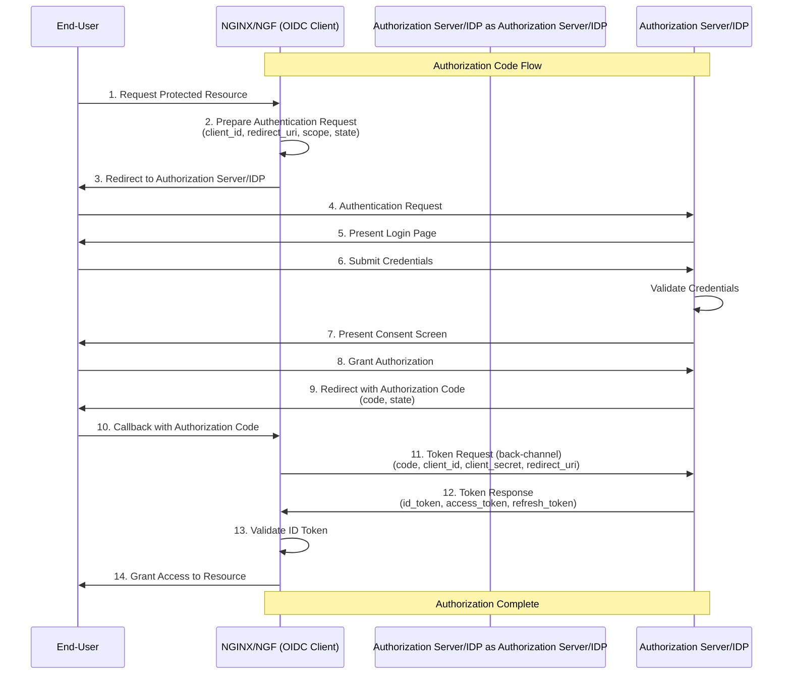

# Enhancement Proposal 4687: OpenID Connect

- Issue: [4687](https://github.com/nginx/nginx-gateway-fabric/issues/4687)
- Status: Implementable

## Summary

Enable NGINX Gateway Fabric to support centralized authentication enforcement using OpenID Connect (OIDC). This feature will be available only for NGINX Plus users.

## Goals

- Design a solution to support OIDC authentication that is compatible with multiple OpenID Providers (IDPs).
- Extend the AuthenticationFilter CRD to allow users to configure OIDC authentication settings.

## Non-Goals

- Define implementation details for OIDC authorization.
- Support OIDC authorization for TCP and UDP routes.
- This design will not determine or enforce what actions a user is allowed to perform.
- Support authentication mechanisms outside of OIDC.

## Introduction

OpenID Connect (OIDC) is an identity layer built on top of OAuth 2.0 that allows applications to delegate user authentication to a trusted OpenID Provider (such as Keycloak, Okta, or Auth0) rather than managing credentials directly. In this design, NGINX Gateway Fabric acts as the OIDC client (Relying Party), redirecting unauthenticated users to the configured OpenID Provider for login and receiving verified identity tokens upon successful authentication.

This design extends the [AuthenticationFilter CRD](https://github.com/nginx/nginx-gateway-fabric/blob/main/docs/proposals/authentication-filter.md) to support OIDC authentication using the Authorization Code Flow, which works as follows:

- The client (NGINX) redirects the user to the Authorization Server.
- The user authenticates and consents to the requested scopes.
- The Authorization Server returns an Authorization Code to the client (NGINX).
- The client (NGINX)  exchanges the code for an ID Token and Access Token via a back-channel request.
- The Authorization Server may authenticate the client (NGINX, using a Client Secret) before issuing tokens.

The following diagram illustrates the Authorization Code Flow:



### NGINX directives

The initial design will support the following directives from [`ngx_http_oidc_module`](https://nginx.org/en/docs/http/ngx_http_oidc_module.html):

- [`oidc_provider`](https://nginx.org/en/docs/http/ngx_http_oidc_module.html#oidc_provider) - Defines an OpenID Provider configuration for use with the `auth_oidc` directive. This directive is specified at the `http` level.

- [`auth_oidc`](https://nginx.org/en/docs/http/ngx_http_oidc_module.html#auth_oidc) - Enables end-user authentication using the specified OpenID Provider. This directive is specified at the `location` level to enable OIDC authentication for specific paths.

- [`issuer`](https://nginx.org/en/docs/http/ngx_http_oidc_module.html#issuer) - Sets the Issuer Identifier URL of the OpenID Provider. This is a required directive, typically formatted as `https://<openid-issuer>/realms/<realm_name>`.

- [`client_id`](https://nginx.org/en/docs/http/ngx_http_oidc_module.html#client_id) - Specifies the client ID used to identify the authenticating server. This is a required directive.

- [`client_secret`](https://nginx.org/en/docs/http/ngx_http_oidc_module.html#client_secret) - Specifies the secret value used to authenticate the server with the OpenID Provider.

- [`config_url`](https://nginx.org/en/docs/http/ngx_http_oidc_module.html#config_url) - Sets a custom URL for retrieving OpenID Provider metadata. By default, NGINX constructs this URL by appending `.well-known/openid-configuration` to the issuer URL. Use this directive if your metadata URL differs from the default.

- [`cookie_name`](https://nginx.org/en/docs/http/ngx_http_oidc_module.html#cookie_name) - Sets the name of the session cookie. The default value is `NGX_OIDC_SESSION`. Sessions are maintained per user and stored in the NGINX worker process memory.

- [`extra_auth_args`](https://nginx.org/en/docs/http/ngx_http_oidc_module.html#extra_auth_args) - Appends additional query arguments to the authentication request URL. For example, `extra_auth_args "prompt=login"` forces the user to re-authenticate on each request.

- [`frontchannel_logout_uri`](https://nginx.org/en/docs/http/ngx_http_oidc_module.html#frontchannel_logout_uri) - Defines the URI path for front-channel logout. The OpenID Provider sends logout requests with specific claims (via iframes) to this URI to clear session data from NGINX shared state.

- [`pkce`](https://nginx.org/en/docs/http/ngx_http_oidc_module.html#pkce) - Explicitly enables or disables PKCE (Proof Key for Code Exchange). By default, NGINX automatically enables PKCE if the OpenID Provider requires the S256 code challenge method. S256 uses SHA-256 hashing to verify that the client initiating the login is the same client exchanging the authorization code for tokens.

- [`logout_uri`](https://nginx.org/en/docs/http/ngx_http_oidc_module.html#logout_uri) - Defines the URI path for initiating session logout.

- [`post_logout_uri`](https://nginx.org/en/docs/http/ngx_http_oidc_module.html#post_logout_uri) - Defines the path or absolute URI where users are redirected after logout completes.

- [`logout_token_hint`](https://nginx.org/en/docs/http/ngx_http_oidc_module.html#logout_token_hint) -  Includes the `id_token_hint` argument in the logout request sent to the OpenID Provider's logout endpoint.

- [`scope`](https://nginx.org/en/docs/http/ngx_http_oidc_module.html#scope) - Sets the requested scopes. The default scope is `openid`.

- [`session_timeout`](https://nginx.org/en/docs/http/ngx_http_oidc_module.html#session_timeout) - Sets the session expiration timeout. The timeout resets each time the user accesses the protected resource.

- [`ssl_trusted_certificate`](https://nginx.org/en/docs/http/ngx_http_oidc_module.html#ssl_trusted_certificate) - Specifies a PEM-formatted file containing trusted CA certificates used to verify OpenID Provider endpoint certificates. The default is system CA.

- [`ssl_crl`](https://nginx.org/en/docs/http/ngx_http_oidc_module.html#ssl_crl) - Specifies a PEM-formatted file containing a certificate revocation list (CRL) used to verify that the OpenID Provider's certificate has not been revoked.

## API, Customer Driven Interfaces, and User Experience

### Extended AuthenticationFilter CRD for OIDC

```go
// AuthenticationFilterSpec defines the desired configuration.
// +kubebuilder:validation:XValidation:message="for type=Basic, spec.basic must be set",rule="!(!has(self.basic) && self.type == 'Basic')"
// +kubebuilder:validation:XValidation:message="for type=OIDC, spec.oidc must be set",rule="!(!has(self.oidc) && self.type == 'OIDC')"
//
//nolint:lll
type AuthenticationFilterSpec struct {
	// OIDC configures OpenID Connect Authentication.
	//
	// +optional
	OIDC *OIDCAuth `json:"oidc,omitempty"`

	// Type selects the authentication mechanism.
	Type AuthType `json:"type"`
}

// AuthType defines the authentication mechanism.
//
// +kubebuilder:validation:Enum=Basic;OIDC
type AuthType string

const (
	// AuthTypeOIDC is the OpenID Connect Authentication mechanism.
	AuthTypeOIDC AuthType = "OIDC"
)

// OIDCAuth configures OpenID Connect Authentication.
type OIDCAuth struct {
	// Issuer is the URL of the OpenID Provider.
	// Must exactly match the "issuer" value from the provider's
	// .well-known/openid-configuration endpoint.
	// Directive: https://nginx.org/en/docs/http/ngx_http_oidc_module.html#issuer
	// Examples:
	//   - Keycloak: "https://keycloak.example.com/realms/my-realm"
	//   - Okta: "https://dev-123456.okta.com/oauth2/default"
	//   - Auth0: "https://my-tenant.auth0.com/"
	//
	// +kubebuilder:validation:MinLength=1
	// +kubebuilder:validation:Pattern=`^https://`
	Issuer string `json:"issuer"`

	// ClientID is the client identifier registered with the OpenID Provider.
	// Directive: https://nginx.org/en/docs/http/ngx_http_oidc_module.html#client_id
	//
	// +kubebuilder:validation:MinLength=1
	ClientID string `json:"clientID"`

	// The Kubernetes secret which contains the OIDC client secret to be used in the
	// [Authentication Request](https://openid.net/specs/openid-connect-core-1_0.html#AuthRequest).
	// Directive: https://nginx.org/en/docs/http/ngx_http_oidc_module.html#client_secret
	//
	// This is an Opaque secret. The client secret should be stored in the key
	// "client-secret".
	ClientSecret LocalObjectReference `json:"clientSecret"`

	// CACertificateRefs references a secret containing trusted CA certificates
	// in PEM format used to verify the certificates of the OpenID Provider endpoints.
    // The CA certificates must be stored in a key named `ca.crt`.
	// If not specified, the system CA bundle is used.
	//
	// Directive: https://nginx.org/en/docs/http/ngx_http_oidc_module.html#ssl_trusted_certificate
	// NGINX Default: system CA bundle
	//
	// +optional
    // +kubebuilder:validation:MaxItems=8
	CACertificateRefs []LocalObjectReference `json:"caCertificateRefs,omitempty"`

    // CertificateRevocationList references a Secret containing a certificate
    // revocation list in PEM format. The CRL must be stored in a key
    // named `ca.crl`. This is used to verify that certificates presented
    // by the OpenID Provider endpoints have not been revoked.
	//
	// +optional
	CertificateRevocationList *LocalObjectReference `json:"certificateRevocationList,omitempty"`

	// ConfigURL sets a custom URL to retrieve the OpenID Provider metadata.
	// Directive: https://nginx.org/en/docs/http/ngx_http_oidc_module.html#config_url
	// NGINX Default: <issuer>/.well-known/openid-configuration
	//
	// +kubebuilder:validation:Pattern=`^https://`
	// +optional
	ConfigURL *string `json:"configURL,omitempty"`

	// The OIDC scopes to be used in the Authentication Request.
	// The "openid" scope is always added to the list of scopes if not already
	// specified.
	// Directive: https://nginx.org/en/docs/http/ngx_http_oidc_module.html#scope
	//
	// +optional
	Scopes []string `json:"scopes,omitempty"`

	// PKCE enables Proof Key for Code Exchange (PKCE) for the authentication flow.
    // If nil, NGINX automatically enables PKCE when the OpenID Provider requires it.
	// Directive: https://nginx.org/en/docs/http/ngx_http_oidc_module.html#pkce
	//
	// +optional
	PKCE *bool `json:"pkce,omitempty"`

	// ExtraAuthArgs sets additional query arguments for the authentication request URL.
	// Arguments are appended with "&". For example: "prompt=consent&audience=api".
	// Directive: https://nginx.org/en/docs/http/ngx_http_oidc_module.html#extra_auth_args
	//
	// +optional
	ExtraAuthArgs map[string]string `json:"extraAuthArgs,omitempty"`

	// Session configures session management for OIDC authentication.
	//
	// +optional
	Session *OIDCSessionConfig `json:"session,omitempty"`

	// Logout defines the logout behavior for OIDC authentication.
	//
	// +optional
	Logout *OIDCLogoutConfig `json:"logout,omitempty"`
}

// OIDCSessionConfig configures session management for OIDC authentication.
type OIDCSessionConfig struct {
	// CookieName sets the name of the session cookie.
	// Directive: https://nginx.org/en/docs/http/ngx_http_oidc_module.html#cookie_name
	// NGINX Default: NGX_OIDC_SESSION
	//
	// +optional
	CookieName *string `json:"cookieName,omitempty"`

	// Timeout sets the session timeout duration.
	// Directive: https://nginx.org/en/docs/http/ngx_http_oidc_module.html#session_timeout
	// NGINX Default: 8h
	//
	// +optional
	Timeout *Duration `json:"timeout,omitempty"`
}

// OIDCLogoutConfig defines the logout behavior for OIDC authentication.
type OIDCLogoutConfig struct {
	// URI defines the path for initiating session logout.
	// Directive: https://nginx.org/en/docs/http/ngx_http_oidc_module.html#logout_uri
	// Example: /logout
	//
	// +optional
	// +kubebuilder:validation:Pattern=`^(?:http?:\/\/)?[a-z0-9]([a-z0-9-]{0,61}[a-z0-9])?(?:\.[a-z0-9]([a-z0-9-]{0,61}[a-z0-9])?)*(?::\d{1,5})?$`
	URI *string `json:"uri,omitempty"`

	// PostLogoutURI defines the path to redirect to after logout.
	// Must match the configuration on the Provider's side.
	// Directive: https://nginx.org/en/docs/http/ngx_http_oidc_module.html#post_logout_uri
	// Example: /logged_out.html
	//
	// +optional
	// +kubebuilder:validation:Pattern=`^(?:http?:\/\/)?[a-z0-9]([a-z0-9-]{0,61}[a-z0-9])?(?:\.[a-z0-9]([a-z0-9-]{0,61}[a-z0-9])?)*(?::\d{1,5})?$`
	PostLogoutURI *string `json:"postLogoutURI,omitempty"`

	// FrontChannelLogoutURI defines the path for front-channel logout.
	// The OpenID Provider should be configured to set "iss" and "sid" arguments.
	// Directive: https://nginx.org/en/docs/http/ngx_http_oidc_module.html#frontchannel_logout_uri
	//
	// +optional
	// +kubebuilder:validation:Pattern=`^(?:http?:\/\/)?[a-z0-9]([a-z0-9-]{0,61}[a-z0-9])?(?:\.[a-z0-9]([a-z0-9-]{0,61}[a-z0-9])?)*(?::\d{1,5})?$`
	FrontChannelLogoutURI *string `json:"frontChannelLogoutURI,omitempty"`

	// TokenHint adds the id_token_hint argument to the Provider's Logout Endpoint.
	// Some OpenID Providers require this.
	// Directive: https://nginx.org/en/docs/http/ngx_http_oidc_module.html#logout_token_hint
	// NGINX Default: false
	//
	// +optional
	TokenHint *bool `json:"tokenHint,omitempty"`
}
```

For simplicity, only one OIDC provider can be configured at this time. To set up authentication with an OpenID Provider, you must specify the issuer URL, client ID, and client secret.

TLS is required in two places:

- Incoming connections from the browser after the OpenID Provider redirects the user back to NGINX: The AuthenticationFilter must be attached to a route using an HTTPS listener, as the `redirect_uri` callback from the IdP must be served over HTTPS. The Gateway listener's `tls.certificateRefs` provides the TLS certificate for this incoming connection.
- Outgoing connections from NGINX to the OpenID Provider for token exchange: NGINX connects to the OpenID Provider over TLS for token requests. To verify the IdP's certificate, specify a CA bundle using the `caCertificateRefs` field; if omitted, the system CA bundle is used by default.

An authenticationFilter with complete OIDC configuration would look like:

```yaml
apiVersion: gateway.nginx.org/v1alpha1
kind: AuthenticationFilter
metadata:
  name: keycloak-oidc-auth
  namespace: default
spec:
  type: OIDC
  oidc:
    issuer: "https://keycloak.example.com/realms/my-realm"
    clientID: nginx-gateway
    clientSecret:
      name: oidc-client-secret

    caCertificateRefs:
      - name: oidc-ca-cert
    certificateRevocationList:
      name: oidc-crl

    # provider metadata (optional override)
    configURL: "https://keycloak.example.com/realms/my-realm/.well-known/openid-configuration"

    scopes:
      - openid
      - profile
      - email

    pkce: true

    extraAuthArgs:
      display: "page"
      prompt: "login"
      audience: "my-api"

    session:
      cookieName: "MY_OIDC_SESSION"
      timeout: "4h"

    logout:
      uri: "/logout"
      postLogoutURI: "/logged-out"
      frontChannelLogoutURI: "/frontchannel-logout"
      tokenHint: true
---
# clientSecret references a Kubernetes Secret containing the OIDC client secret
# The OpenID Provider uses this to verify that token requests come from a legitimate client
apiVersion: v1
kind: Secret
metadata:
  name: oidc-client-secret
  namespace: default
type: Opaque
stringData:
  client-secret: "secret-value"
---
# CA bundle used to verify the IdP's certificate when NGINX connects to it.
apiVersion: v1
kind: Secret
metadata:
  name: oidc-ca-cert
  namespace: default
type: Opaque
stringData:
  ca.crt: |
    -----BEGIN CERTIFICATE-----
    MIIDXTCCAkWgAwIBAgIJAJC1HiIAZAiUMA0Gcg...
    -----END CERTIFICATE-----
---
apiVersion: v1
kind: Secret
metadata:
  name: oidc-crl
  namespace: default
type: Opaque
stringData:
  ca.crl: |
    -----BEGIN X509 CRL-----
    MIIBYDCBygIBATANBgkqhkiG9w0BAQsFADA...
    -----END X509 CRL-----
```

OIDC Authentication Filters can only be attached to HTTPS Listeners.

```yaml
apiVersion: gateway.networking.k8s.io/v1
kind: Gateway
metadata:
  name: gateway
spec:
  gatewayClassName: nginx
  listeners:
  - name: https
    port: 443
    protocol: HTTPS
    tls:
      mode: Terminate
      certificateRefs:
      - kind: Secret
        name: cafe-secret   # TLS certificate NGINX presents to incoming browser connections
        namespace: certificate
```

The Route attaching the AuthenticationFilter which is required to have a TLS listener(https):

```yaml
apiVersion: gateway.networking.k8s.io/v1
kind: HTTPRoute
metadata:
  name: coffee
spec:
  parentRefs:
  - name: gateway
    sectionName: https
  hostnames:
  - "cafe.example.com"
  rules:
  - matches:
    - path:
        type: PathPrefix
        value: /coffee
    backendRefs:
    - name: coffee
      port: 80
    filters:
    - type: ExtensionRef
      extensionRef:
        group: gateway.nginx.org
        kind: AuthenticationFilter
        name: keycloak-oidc-auth
```

The generated NGINX configuration uses the OIDC module by defining the `oidc_provider` at the `http` level and referencing it in the required location blocks:

```nginx
http {
    oidc_provider <generated-internal-name> {
        issuer https://keycloak.example.com/realms/my-realm;
        client_id nginx-gateway;
        client_secret "client-secret-value-from-k8s-secret";

        ssl_trusted_certificate /etc/nginx/certs/ca.crt;
        ssl_crl /etc/nginx/certs/ca.crl;
        config_url https://keycloak.example.com/realms/my-realm/.well-known/openid-configuration;

        scope openid profile email;
        pkce on;
        extra_auth_args "display=page&prompt=login&audience=my-api";

        cookie_name MY_OIDC_SESSION;
        session_timeout 4h;

        logout_uri /logout;
        post_logout_uri /logged-out;
        frontchannel_logout_uri /frontchannel-logout;
        logout_token_hint on;
    }

    server {
        listen 443 ssl;
        listen [::]:443 ssl;

        ssl_certificate /etc/nginx/secrets/ssl_keypair_certificate_cafe-secret.pem;
        ssl_certificate_key /etc/nginx/secrets/ssl_keypair_certificate_cafe-secret.pem;

        server_name cafe.example.com;

        location ^~ /coffee/ {
            auth_oidc keycloak;

            proxy_pass http://default_coffee_80$request_uri;
        }

        location = /coffee {
            auth_oidc keycloak;

            proxy_pass http://default_coffee_80$request_uri;
        }
    }
}
```

### Understanding Certificate Revocation List

A Certificate Revocation List (CRL) is a list of certificate serial numbers that a Certificate Authority (CA) has revoked before their expiration. When NGINX connects to the OpenID Provider over TLS, it checks the provider's certificate serial number against the CRL — if found, the connection is rejected. The CRL must be stored in a Secret with the key ca.crl in PEM format. Unlike CA certificates which rarely change, CRLs are updated frequently as certificates get revoked, which is why `certificateRevocationList` is a separate field from `caCertificateRefs` which allows users to update the CRL independently. Users are responsible for keeping the CRL Secret current. Stale CRLs may fail to detect recently revoked certificates. An alternative approach is OCSP (Online Certificate Status Protocol) stapling, which verifies revocation status in real-time rather than relying on periodically updated lists. This is noted as future work.


### Error Handling

1. The OpenID Provider is down - When the OpenID provider is unreachable during initial authentication, NGINX returns a 302 redirect to the OpenID provider's authorization endpoint. The connection failure occurs client-side when the browser attempts to reach the OpenID provider, resulting in a "connection refused" error. NGINX does not validate OpenID providers availability before issuing the redirect.
2. If the referenced `clientSecret` or `caCertificateRefs` resources don't exist, the AuthenticationFilter should not report an error condition and the route should not be programmed.
3. If the `client-secret` is incorrect for OpenID provider, the redirect to the provider succeeds but the redirect back to NGINX fails and the error is reflected in logs as `token error: unauthorized_client: Invalid client or Invalid client credentials while sending to client`
4. If the OIDC authentication filter is attached to a Route with a non-HTTPS listener, it should not be `Accepted`.

## Use Cases

- Defining OIDC once in AuthenticationFilter provides centralized authentication which can be reused across multiple HTTPRoutes, allowing backends to receive pre-authenticated requests without implementing OAuth flows.
- Authenticating users once through the OIDC provider enables single sign-on across all protected routes, with session management handled via `oidc.session` and unified logout through `oidc.logout`.
- Enterprise environments with internal Certificate Authorities can use `caCertificateRefs` to trust their CA bundle, enabling secure connections to internally-hosted identity providers.

## Testing

- Unit Tests and CEL tests should be added.
- Functional tests for the AuthenticationFilter CRD should be added as outlined in the [Authentication Filter](https://github.com/nginx/nginx-gateway-fabric/blob/main/docs/proposals/authentication-filter.md#testing) proposal, including verification that OIDC module directives are correctly generated in the NGINX configuration. Additionally, tests should ensure that routes using non-TLS listeners are rejected when an OIDC auth filter is applied.

## Security Considerations

- Threat Model Assessment is required since NGINX makes an outgoing TLS connection to OpenID providers for OIDC authentication.

## Alternatives

NGINX Plus also offers an NJS-based OIDC module, but this design uses the native OIDC module introduced in NGINX Plus R33, which is only compatible with R33 and above.

If the user uses the new OIDC module with a previous version of Plus, we run into configuration errors about the directives not being valid which will be reported back to Gateway Status.

The user guide will have explicit mention about this incompatibility.

## Future Work

- Forwarding OIDC claims as headers to backend services is out of scope for this iteration. This could be achieved by extending `RequestHeaderModifier` to allow OIDC variables (e.g. $oidc_claim_sub) or by extending the AuthenticationFilter CRD later.
- Adding support for OCSP (Online Certificate Status Protocol) stapling to verify certificate revocation status in real-time, eliminating the need for manually managed CRL Secrets.

## Glossary

- OpenID Provider: The service that authenticates users (e.g. Keycloak, Okta)
- Relying Party (RP): The application requesting authentication (NGINX in this case).
- Authorization Code Flow: The OAuth 2.0 flow used for server-side applications.
- PKCE: Proof Key for Code Exchange—prevents authorization code interception attacks.
- Claims: Pieces of information about the user (e.g. email, name).

## References

- [NGINX OIDC Module](https://nginx.org/en/docs/http/ngx_http_oidc_module.html)
- [Single Sign-On with OpenID Connect and Identity Providers](https://docs.nginx.com/nginx/admin-guide/security-controls/configuring-oidc)
- [How OpenID connect works](https://openid.net/developers/how-connect-works/)
