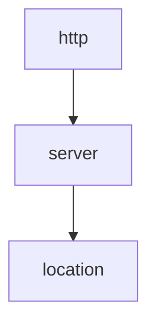

# Enhancement Proposal-4067: Proxy Settings Policy

- Issue: https://github.com/nginx/nginx-gateway-fabric/issues/4067
- Status: Implementable

## Summary

This Enhancement Proposal introduces the `ProxySettingsPolicy` API that allows Cluster Operators and Application Developers to configure NGINX's proxy buffering and connection settings between the NGINX Gateway Fabric dataplane and upstream applications.

## Goals

- Define proxy settings for buffering configuration.
- Define an API for proxy settings that is extensible to support additional proxy directives in the future.
- Outline the attachment points (Gateway and HTTPRoute/GRPCRoute) for the proxy settings policy.
- Describe the inheritance behavior of proxy settings when multiple policies exist at different levels.

## Non-Goals

- Define the complete set of all proxy directives (only buffering directives are in scope for initial implementation).
- Support for stream (TCP/UDP) proxy buffering configurations (only HTTP/GRPCRoutes are in scope for initial implementation).

## Introduction

### Proxy Settings

Proxy settings are NGINX directives that affect how NGINX handles requests and responses between itself and upstream applications. This proposal focuses specifically on proxy buffering configuration.

To begin, the Proxy Settings Policy will include the following NGINX directives related to buffering:

- [`proxy_buffering`](https://nginx.org/en/docs/http/ngx_http_proxy_module.html#proxy_buffering) - Enables or disables buffering of responses from the proxied server.
- [`proxy_buffer_size`](https://nginx.org/en/docs/http/ngx_http_proxy_module.html#proxy_buffer_size) - Sets the size of the buffer used for reading the first part of the response received from the proxied server (typically the response header).
- [`proxy_buffers`](https://nginx.org/en/docs/http/ngx_http_proxy_module.html#proxy_buffers) - Sets the number and size of buffers used for reading a response from the proxied server.
- [`proxy_busy_buffers_size`](https://nginx.org/en/docs/http/ngx_http_proxy_module.html#proxy_busy_buffers_size) - Limits the total size of buffers that can be busy sending a response to the client while the response is not yet fully read.

These directives are available in the `http`, `server`, and `location` contexts in NGINX, which aligns well with the Gateway API inheritance model where policies attached to a Gateway (mapped to `server` context) can be inherited by Routes (mapped to `location` context).

In the future, we can extend the Proxy Settings Policy to include more proxy-related directives, such as timeout settings (`proxy_connect_timeout`, `proxy_read_timeout`, `proxy_send_timeout`) and retry behavior (`proxy_next_upstream`, `proxy_next_upstream_timeout`, `proxy_next_upstream_tries`).

## Use Cases

- As a Cluster Operator, I want to set defaults for proxy buffering settings that will work for most applications so that most Application Developers will not have to tweak these settings.
- As an Application Developer, I want to be able to configure proxy buffering for my application based on its behavior or requirements. For example:
  - My application sends large responses that benefit from buffering to improve performance.
  - My application is a streaming service where I want to disable buffering to reduce latency.
  - My application requires specific buffer sizes to handle response headers with custom metadata.
- As an Application Developer, I want to override the defaults for proxy settings set by the Cluster Operator because the defaults do not satisfy my application's requirements or behavior.

## API

The `ProxySettingsPolicy` API is a CRD that is a part of the `gateway.nginx.org` Group. It adheres to the guidelines and requirements of an Inherited Policy as outlined in the [Policy Attachment GEP (GEP-713)](https://gateway-api.sigs.k8s.io/geps/gep-713/).

The policy uses `targetRefs` (plural) to support targeting multiple resources with a single policy instance. This follows the current GEP-713 guidance and provides better user experience by:

- Avoiding policy duplication when applying the same settings to multiple targets
- Reducing maintenance burden and risk of configuration inconsistencies
- Preventing future migration challenges from singular to plural forms

Below is the Golang API for the `ProxySettingsPolicy` API:

### Go

```go
package v1alpha1

import (
    metav1 "k8s.io/apimachinery/pkg/apis/meta/v1"
    gatewayv1alpha2 "sigs.k8s.io/gateway-api/apis/v1alpha2"
)

// ProxySettingsPolicy is an Inherited Attached Policy. It provides a way to configure the behavior of the
// connection between NGINX and the upstream applications.
//
// +genclient
// +kubebuilder:object:root=true
// +kubebuilder:storageversion
// +kubebuilder:subresource:status
// +kubebuilder:resource:categories=gateway-api,scope=Namespaced
// +kubebuilder:printcolumn:name="Age",type=date,JSONPath=`.metadata.creationTimestamp`
// +kubebuilder:metadata:labels="gateway.networking.k8s.io/policy=inherited"
type ProxySettingsPolicy struct {
    metav1.TypeMeta   `json:",inline"`
    metav1.ObjectMeta `json:"metadata,omitempty"`

    // Spec defines the desired state of the ProxySettingsPolicy.
    Spec ProxySettingsPolicySpec `json:"spec"`

    // Status defines the state of the ProxySettingsPolicy.
    Status gatewayv1.PolicyStatus `json:"status,omitempty"`
}

// ProxySettingsPolicySpec defines the desired state of the ProxySettingsPolicy.
type ProxySettingsPolicySpec struct {
    // TargetRefs identifies API object(s) to apply the policy to.
    // Objects must be in the same namespace as the policy.
    //
    // Support: Gateway, HTTPRoute, GRPCRoute
    //
    // +kubebuilder:validation:MinItems=1
    // +kubebuilder:validation:MaxItems=16
    // +kubebuilder:validation:XValidation:message="TargetRefs entries must have kind Gateway, HTTPRoute, or GRPCRoute",rule="self.all(t, t.kind == 'Gateway' || t.kind == 'HTTPRoute' || t.kind == 'GRPCRoute')"
    // +kubebuilder:validation:XValidation:message="TargetRefs entries must have group gateway.networking.k8s.io",rule="self.all(t, t.group == 'gateway.networking.k8s.io')"
    // +kubebuilder:validation:XValidation:message="TargetRefs must be unique",rule="self.all(t1, self.exists_one(t2, t1.group == t2.group && t1.kind == t2.kind && t1.name == t2.name))"
    TargetRefs []gatewayv1.LocalPolicyTargetReference `json:"targetRefs"`

    // Buffering defines the proxy buffering settings.
    //
    // +optional
    Buffering *ProxyBuffering `json:"buffering,omitempty"`
}

// ProxyBuffering contains settings for proxy buffering.
type ProxyBuffering struct {
    // Disable disables buffering of responses from the proxied server.
    // When not disabled, NGINX receives a response from the proxied server as soon as possible,
    // saving it into buffers. When disabled, the response is passed to a client synchronously,
    // immediately as it is received.
    //
    // Default: false (buffering is enabled by default in NGINX)
    // Directive: https://nginx.org/en/docs/http/ngx_http_proxy_module.html#proxy_buffering
    //
    // +optional
    Disable *bool `json:"disable,omitempty"`

    // BufferSize sets the size of the buffer used for reading the first part of the response
    // received from the proxied server. This part usually contains a small response header.
    //
    // Default: "4k|8k" (one memory page, platform dependent)
    // Directive: https://nginx.org/en/docs/http/ngx_http_proxy_module.html#proxy_buffer_size
    //
    // +optional
    BufferSize *Size `json:"bufferSize,omitempty"`

    // Buffers sets the number and size of the buffers used for reading a response from the
    // proxied server, for a single connection.
    //
    // Default: "8 4k|8k" (8 buffers of one memory page, platform dependent)
    // Directive: https://nginx.org/en/docs/http/ngx_http_proxy_module.html#proxy_buffers
    //
    // +optional
    Buffers *ProxyBuffers `json:"buffers,omitempty"`

    // BusyBuffersSize limits the total size of buffers that can be busy sending a response
    // to the client while the response is not yet fully read.
    //
    // Default: "8k|16k" (platform dependent)
    // Directive: https://nginx.org/en/docs/http/ngx_http_proxy_module.html#proxy_busy_buffers_size
    //
    // +optional
    // +kubebuilder:validation:XValidation:message="BusyBuffersSize must be greater than or equal to BufferSize",rule="!has(self.busyBuffersSize) || !has(self.bufferSize) || self.busyBuffersSize >= self.bufferSize"
    BusyBuffersSize *Size `json:"busyBuffersSize,omitempty"`
}

// ProxyBuffers defines the number and size of buffers.
type ProxyBuffers struct {
    // Number sets the number of buffers.
    //
    // +kubebuilder:validation:Minimum=2
    // +kubebuilder:validation:Maximum=256
    Number int32 `json:"number"`

    // Size sets the size of each buffer.
    Size Size `json:"size"`
}

// Size is a string value representing a size. Size can be specified in bytes, kilobytes (suffix k),
// or megabytes (suffix m).
// Examples: 1024, 8k, 1m.
//
// +kubebuilder:validation:Pattern=`^\d+[kKmM]?$`
type Size string

// ProxySettingsPolicyList contains a list of ProxySettingsPolicies.
//
// +kubebuilder:object:root=true
type ProxySettingsPolicyList struct {
    metav1.TypeMeta `json:",inline"`
    metav1.ListMeta `json:"metadata,omitempty"`
    Items           []ProxySettingsPolicy `json:"items"`
}
```

### Versioning and Installation

The version of the `ProxySettingsPolicy` API will be `v1alpha1`.

The `ProxySettingsPolicy` CRD will be installed by the Cluster Operator via Helm or with manifests. It will be required, and if the `ProxySettingsPolicy` CRD does not exist in the cluster, NGINX Gateway Fabric will log errors until it is installed.

### Status

#### CRD Label

According to the [Policy Attachment GEP (GEP-713)](https://gateway-api.sigs.k8s.io/geps/gep-713/), the `ProxySettingsPolicy` CRD must have the `gateway.networking.k8s.io/policy: inherited` label to specify that it is an inherited policy.
This label will help with discoverability and will be used by Gateway API tooling.

#### Conditions

According to the [Policy Attachment GEP (GEP-713)](https://gateway-api.sigs.k8s.io/geps/gep-713/), the `ProxySettingsPolicy` CRD must include a `status` stanza with a slice of Conditions.

The following Conditions must be populated on the `ProxySettingsPolicy` CRD:

- `Accepted`: Indicates whether the policy has been accepted by the controller. This condition uses the reasons defined in the [PolicyCondition API](https://github.com/kubernetes-sigs/gateway-api/blob/main/apis/v1alpha2/policy_types.go).
- `Programmed`: Indicates whether the policy configuration has been propagated to the data plane. This helps users understand if their policy changes are active.

Note: The `Programmed` condition is part of the updated GEP-713 specification and should be implemented for this policy. Existing policies (ClientSettingsPolicy, UpstreamSettingsPolicy, ObservabilityPolicy) may not have implemented this condition yet and should be updated in future work.

Additionally, when a Route-level policy specifies buffer size fields (`bufferSize`, `buffers`, or `busyBuffersSize`) but inherits `disable: true` from a Gateway-level policy without explicitly setting `disable: false`, the following condition will be set:

- **Condition Type**: `Programmed`
- **Status**: `False`
- **Reason**: `PartiallyInvalid` (implementation-specific reason)
- **Message**: "Policy is not fully programmed: buffer size fields (bufferSize, buffers, busyBuffersSize) are ignored because buffering is disabled by an ancestor policy. Set disable to false to enable buffering and apply buffer size settings."

This condition informs users that their policy configuration has not been fully programmed to the data plane due to inherited configuration conflicts.

#### Setting Status on Objects Affected by a Policy

In the Policy Attachment GEP, there's a provisional status described [here](https://gateway-api.sigs.k8s.io/geps/gep-713/#target-object-status) that involves adding a Condition to all objects affected by a Policy.

This solution gives the object owners some knowledge that their object is affected by a policy but minimizes status updates by limiting them to when the affected object starts or stops being affected by a policy.

Implementing this involves defining a new Condition type and reason:

```go
package conditions

import (
    gatewayv1alpha2 "sigs.k8s.io/gateway-api/apis/v1alpha2"
)

const (
    ProxySettingsPolicyAffected gatewayv1alpha2.PolicyConditionType = "gateway.nginx.org/ProxySettingsPolicyAffected"
    PolicyAffectedReason gatewayv1alpha2.PolicyConditionReason = "PolicyAffected"
)
```

NGINX Gateway Fabric must set this Condition on all HTTPRoutes, GRPCRoutes, and Gateways affected by a `ProxySettingsPolicy`.
Below is an example of what this Condition may look like:

```yaml
Conditions:
  Type:                  gateway.nginx.org/ProxySettingsPolicyAffected
  Message:               Object affected by a ProxySettingsPolicy.
  Observed Generation:   1
  Reason:                PolicyAffected
  Status:                True
```

Some additional rules:

- This Condition should be added when the affected object starts being affected by a `ProxySettingsPolicy`.
- If an object is affected by multiple `ProxySettingsPolicy` instances, only one Condition should exist.
- When the last `ProxySettingsPolicy` affecting that object is removed, the Condition should be removed.
- The Observed Generation is the generation of the affected object, not the generation of the `ProxySettingsPolicy`.

### YAML

Below is an example of `ProxySettingsPolicy` YAML definition:

```yaml
apiVersion: gateway.nginx.org/v1alpha1
kind: ProxySettingsPolicy
metadata:
  name: example-proxy-settings
  namespace: default
spec:
  targetRefs:
  - group: gateway.networking.k8s.io
    kind: Gateway
    name: example-gateway
  buffering:
    disable: false
    bufferSize: 8k
    buffers:
      number: 16
      size: 8k
    busyBuffersSize: 16k
status:
  ancestors:
  - ancestorRef:
      group: gateway.networking.k8s.io
      kind: Gateway
      name: example-gateway
      namespace: default
    conditions:
    - type: Accepted
      status: "True"
      reason: Accepted
      message: Policy is accepted
    - type: Programmed
      status: "True"
      reason: Programmed
      message: Policy is programmed
```

And an example attached to an HTTPRoute:

```yaml
apiVersion: gateway.nginx.org/v1alpha1
kind: ProxySettingsPolicy
metadata:
  name: streaming-proxy-settings
  namespace: default
spec:
  targetRefs:
  - group: gateway.networking.k8s.io
    kind: HTTPRoute
    name: streaming-route
  buffering:
    disable: true  # Disable buffering for streaming applications
```

## Attachment and Inheritance

The `ProxySettingsPolicy` may be attached to Gateways, HTTPRoutes, and GRPCRoutes.

There are three possible attachment scenarios:

**1. Gateway Attachment**

When a `ProxySettingsPolicy` is attached to a Gateway only, all the HTTPRoutes and GRPCRoutes attached to the Gateway inherit the proxy settings.

**2: Route Attachment**

When a `ProxySettingsPolicy` is attached to an HTTPRoute or GRPCRoute only, the settings in that policy apply to that Route only. Other Routes attached to the same Gateway will use the default NGINX values for proxy settings.

**3: Gateway and Route Attachment**

When a `ProxySettingsPolicy` is attached to a Gateway and one or more of the Routes that are attached to that Gateway, the effective policy is calculated by accepting the "lowest" default configured.

For example:

- A Route with a `ProxySettingsPolicy` attached that sets both `bufferSize` and `disable` will use those values, even if the Gateway also has a policy that sets these values.
- A Route with a `ProxySettingsPolicy` that only sets `bufferSize` will inherit the `disable` value from the Gateway's policy (if present).
- A Route without a policy attached will inherit all settings from the Gateway's policy.

**Important:** If a Gateway policy disables buffering (`disable: true`), and a Route policy specifies buffer size fields (`bufferSize`, `buffers`, or `busyBuffersSize`) without explicitly setting `disable: false`, the buffer size fields will be ignored since buffering is disabled. A Condition will be set on the Route policy to indicate that these fields are being ignored. To use buffer size settings when the Gateway has disabled buffering, the Route policy must explicitly set `disable: false`.

For more information on how to calculate effective policies, see the [hierarchy](https://gateway-api.sigs.k8s.io/geps/gep-713/#hierarchy-of-target-kinds) and [merge strategies](https://gateway-api.sigs.k8s.io/geps/gep-713/#designing-a-merge-strategy) sections in the Policy Attachment GEP.

### NGINX Inheritance Behavior

The proxy settings NGINX directives are available in three NGINX contexts: `http`, `server`, and `location`. Similar to Gateway API resources, there is a hierarchy among these contexts:



NGINX directives inherit downwards only. The `location` context inherits values set above it in the `server` and `http` contexts, and the `server` context inherits values set in the `http` context. Additionally, directives specified in a lower context will replace those specified in a higher context.

### Creating the Effective Policy in NGINX Config

The strategy for implementing the effective policy is:

- When a `ProxySettingsPolicy` is attached to a Gateway, add the corresponding NGINX directives to the `http` block.
- When a `ProxySettingsPolicy` is attached to an HTTPRoute or GRPCRoute, add the corresponding NGINX directives to the final `location` blocks generated for the Route.

We can rely on NGINX to compute the effective policy by applying its own inheritance rules. Since each Gateway has a 1-1 relationship with an NGINX deployment, Gateway-level policies naturally map to the `http` context, and Route-level policies in the `location` context can override them as needed.

## Testing

- Unit tests for the API validation.
- Functional tests that test the attachment and inheritance behavior, including:
  - Policy attached to Gateway only
  - Policy attached to Route only
  - Policy attached to both Gateway and Route (with inheritance and override scenarios)
  - Policy with buffering enabled vs disabled
  - Policy with various buffer size configurations
  - Validation tests for invalid configurations
  - Gateway policy disables buffering, Route policy specifies buffer sizes without setting `disable: false` (should set PartiallyInvalid condition)
  - Gateway policy disables buffering, Route policy explicitly sets `disable: false` and specifies buffer sizes (should work correctly)

## Security Considerations

### Validation

Validating all fields in the `ProxySettingsPolicy` is critical to ensuring that the NGINX config generated by NGINX Gateway Fabric is correct and secure.

All fields in the `ProxySettingsPolicy` will be validated with OpenAPI Schema validation. If the OpenAPI Schema validation rules are not sufficient, we will use [CEL](https://kubernetes.io/docs/tasks/extend-kubernetes/custom-resources/custom-resource-definitions/#validation-rules).

Key validation rules:

- `Size` fields must match the pattern `^\d+[kKmM]?$` to ensure valid NGINX size values
- `Number` of buffers must be between 2 and 256
- `BusyBuffersSize` should be validated to be greater than or equal to `BufferSize` when both are specified
- TargetRef must reference Gateway, HTTPRoute, or GRPCRoute only

### Resource Limits

Large buffer configurations could potentially consume significant memory. While this policy allows configuration of buffer sizes, the actual memory consumption is bounded by NGINX's per-connection behavior and worker process limits. Cluster operators should monitor memory usage when applying policies with large buffer sizes.

## Future Work

- Add support for more proxy-related directives:
  - Timeout settings: `proxy_connect_timeout`, `proxy_read_timeout`, `proxy_send_timeout`
  - Retry behavior: `proxy_next_upstream`, `proxy_next_upstream_timeout`, `proxy_next_upstream_tries`
  - Additional buffering directives: `proxy_max_temp_file_size`, `proxy_temp_file_write_size`, `proxy_temp_path`

## Alternatives

- **Direct Policy**: If there's no strong use case for the Cluster Operator setting sane defaults for these settings, we could use a Direct Policy. However, since these settings are available in the `http`, `server`, and `location` contexts, there is already inheritance involved in NGINX, making an Inherited Policy a more natural fit.
- **Phased implementation approach**: We could implement all proxy directives (buffering, timeouts, and retry settings) in the initial release instead of taking a phased approach. However, starting with buffering directives allows us to validate the API design and gather user feedback before adding additional fields, reducing risk of API changes.
- **ExtensionRef approach**: We could use Gateway API's extensionRef mechanism instead of a Policy. However, Policy attachment is more appropriate for this use case as it follows the established pattern in NGINX Gateway Fabric and provides better status reporting.

## References

- [NGINX Extensions Enhancement Proposal](nginx-extensions.md)
- [Policy Attachment GEP (GEP-713)](https://gateway-api.sigs.k8s.io/geps/gep-713/)
- [NGINX proxy_module documentation](https://nginx.org/en/docs/http/ngx_http_proxy_module.html)
- [Kubernetes API Conventions](https://github.com/kubernetes/community/blob/master/contributors/devel/sig-architecture/api-conventions.md)
- [Client Settings Policy Enhancement Proposal](client-settings.md)
