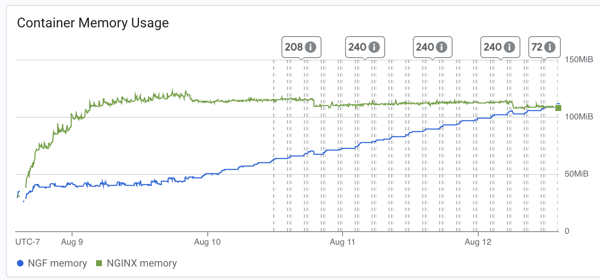

# Results

## Test environment

NGINX Plus: true

NGINX Gateway Fabric:

- Commit: 00112a4f92025967d82b04fccc9df98b314e06b8
- Date: 2025-08-08T19:16:31Z
- Dirty: false

GKE Cluster:

- Node count: 3
- k8s version: v1.33.2-gke.1240000
- vCPUs per node: 2
- RAM per node: 4015668Ki
- Max pods per node: 110
- Zone: us-central1-c
- Instance Type: e2-medium

## Summary:

- Results may be incomplete as traffic statistics weren't collected. This could be due to test run user error, or due to the plethora of errors which occurred. 
- CPU usage remained consistant with past results. 
- NGINX memory remained consistant with past results while NGF memory seemed to continually climb. 
- Errors seen seem to be similar to the singular error in the 1.6.0 plus test run. 


## Traffic

HTTP:

```text
```

HTTPS:

```text
```

## Key Metrics

### Containers memory



### NGF Container Memory


### Containers CPU


## Error Logs

### nginx-gateway

Logs have been reduced with some information and unique logs kept. However most were the "failed to list" or "cannot watch resource".
Quite a few logs on lock issues.

error=failed to list *v2.HorizontalPodAutoscaler: Unauthorized;level=error;logger=controller-runtime.cache.UnhandledError;msg=Failed to watch;reflector=pkg/mod/k8s.io/client-go@v0.33.3/tools/cache/reflector.go:285;stacktrace=k8s.io/apimachinery/pkg/util/runtime.logError
	pkg/mod/k8s.io/apimachinery@v0.33.3/pkg/util/runtime/runtime.go:226
k8s.io/apimachinery/pkg/util/runtime.handleError
	pkg/mod/k8s.io/apimachinery@v0.33.3/pkg/util/runtime/runtime.go:217
k8s.io/apimachinery/pkg/util/runtime.HandleErrorWithContext
	pkg/mod/k8s.io/apimachinery@v0.33.3/pkg/util/runtime/runtime.go:203
k8s.io/client-go/tools/cache.DefaultWatchErrorHandler
	pkg/mod/k8s.io/client-go@v0.33.3/tools/cache/reflector.go:200
k8s.io/client-go/tools/cache.(*Reflector).RunWithContext.func1
	pkg/mod/k8s.io/client-go@v0.33.3/tools/cache/reflector.go:360
k8s.io/apimachinery/pkg/util/wait.BackoffUntil.func1
	pkg/mod/k8s.io/apimachinery@v0.33.3/pkg/util/wait/backoff.go:233
k8s.io/apimachinery/pkg/util/wait.BackoffUntilWithContext.func1
	pkg/mod/k8s.io/apimachinery@v0.33.3/pkg/util/wait/backoff.go:255
k8s.io/apimachinery/pkg/util/wait.BackoffUntilWithContext
	pkg/mod/k8s.io/apimachinery@v0.33.3/pkg/util/wait/backoff.go:256
k8s.io/apimachinery/pkg/util/wait.BackoffUntil
	pkg/mod/k8s.io/apimachinery@v0.33.3/pkg/util/wait/backoff.go:233
k8s.io/client-go/tools/cache.(*Reflector).RunWithContext
	pkg/mod/k8s.io/client-go@v0.33.3/tools/cache/reflector.go:358
k8s.io/client-go/tools/cache.(*controller).RunWithContext.(*Group).StartWithContext.func3
	pkg/mod/k8s.io/apimachinery@v0.33.3/pkg/util/wait/wait.go:63
k8s.io/apimachinery/pkg/util/wait.(*Group).Start.func1
	pkg/mod/k8s.io/apimachinery@v0.33.3/pkg/util/wait/wait.go:72;ts=2025-08-12T22:49:01Z;type=*v2.HorizontalPodAutoscaler
error=failed to list *v1.EndpointSlice: Unauthorized;level=error;logger=controller-runtime.cache.UnhandledError;msg=Failed to watch;reflector=pkg/mod/k8s.io/client-go@v0.33.3/tools/cache/reflector.go:285;stacktrace=k8s.io/apimachinery/pkg/util/runtime.logError
	pkg/mod/k8s.io/apimachinery@v0.33.3/pkg/util/runtime/runtime.go:226
k8s.io/apimachinery/pkg/util/runtime.handleError
	pkg/mod/k8s.io/apimachinery@v0.33.3/pkg/util/runtime/runtime.go:217
k8s.io/apimachinery/pkg/util/runtime.HandleErrorWithContext
	pkg/mod/k8s.io/apimachinery@v0.33.3/pkg/util/runtime/runtime.go:203
k8s.io/client-go/tools/cache.DefaultWatchErrorHandler
	pkg/mod/k8s.io/client-go@v0.33.3/tools/cache/reflector.go:200
k8s.io/client-go/tools/cache.(*Reflector).RunWithContext.func1
	pkg/mod/k8s.io/client-go@v0.33.3/tools/cache/reflector.go:360
k8s.io/apimachinery/pkg/util/wait.BackoffUntil.func1
	pkg/mod/k8s.io/apimachinery@v0.33.3/pkg/util/wait/backoff.go:233
k8s.io/apimachinery/pkg/util/wait.BackoffUntilWithContext.func1
	pkg/mod/k8s.io/apimachinery@v0.33.3/pkg/util/wait/backoff.go:255
k8s.io/apimachinery/pkg/util/wait.BackoffUntilWithContext
	pkg/mod/k8s.io/apimachinery@v0.33.3/pkg/util/wait/backoff.go:256
k8s.io/apimachinery/pkg/util/wait.BackoffUntil
	pkg/mod/k8s.io/apimachinery@v0.33.3/pkg/util/wait/backoff.go:233
k8s.io/client-go/tools/cache.(*Reflector).RunWithContext
	pkg/mod/k8s.io/client-go@v0.33.3/tools/cache/reflector.go:358
k8s.io/client-go/tools/cache.(*controller).RunWithContext.(*Group).StartWithContext.func3
	pkg/mod/k8s.io/apimachinery@v0.33.3/pkg/util/wait/wait.go:63
k8s.io/apimachinery/pkg/util/wait.(*Group).Start.func1
	pkg/mod/k8s.io/apimachinery@v0.33.3/pkg/util/wait/wait.go:72;ts=2025-08-12T22:48:59Z;type=*v1.EndpointSlice
..
error=Unauthorized;event={'name': 'ngf-longevity-nginx-gateway-fabric-leader-election.185b269a5517109a', 'namespace': 'nginx-gateway'};level=error;msg=Server rejected event (will not retry!);stacktrace=k8s.io/client-go/tools/record.recordEvent
	pkg/mod/k8s.io/client-go@v0.33.3/tools/record/event.go:359
k8s.io/client-go/tools/record.(*eventBroadcasterImpl).recordToSink
	pkg/mod/k8s.io/client-go@v0.33.3/tools/record/event.go:302
k8s.io/client-go/tools/record.(*eventBroadcasterImpl).StartRecordingToSink.func1
	pkg/mod/k8s.io/client-go@v0.33.3/tools/record/event.go:279
k8s.io/client-go/tools/record.(*eventBroadcasterImpl).StartEventWatcher.func1
	pkg/mod/k8s.io/client-go@v0.33.3/tools/record/event.go:418;ts=2025-08-12T22:48:44Z
error=leader election lost;level=error;msg=error received after stop sequence was engaged;stacktrace=sigs.k8s.io/controller-runtime/pkg/manager.(*controllerManager).engageStopProcedure.func1
	pkg/mod/sigs.k8s.io/controller-runtime@v0.21.0/pkg/manager/internal.go:512;ts=2025-08-12T22:48:44Z
level=error;msg=error retrieving resource lock nginx-gateway/ngf-longevity-nginx-gateway-fabric-leader-election: context deadline exceeded;stacktrace=k8s.io/client-go/tools/leaderelection.(*LeaderElector).tryAcquireOrRenew
	pkg/mod/k8s.io/client-go@v0.33.3/tools/leaderelection/leaderelection.go:436
k8s.io/client-go/tools/leaderelection.(*LeaderElector).renew.func1.1
	pkg/mod/k8s.io/client-go@v0.33.3/tools/leaderelection/leaderelection.go:285
k8s.io/apimachinery/pkg/util/wait.loopConditionUntilContext.func2
	pkg/mod/k8s.io/apimachinery@v0.33.3/pkg/util/wait/loop.go:87
k8s.io/apimachinery/pkg/util/wait.loopConditionUntilContext
	pkg/mod/k8s.io/apimachinery@v0.33.3/pkg/util/wait/loop.go:88
k8s.io/apimachinery/pkg/util/wait.PollUntilContextTimeout
	pkg/mod/k8s.io/apimachinery@v0.33.3/pkg/util/wait/poll.go:48
k8s.io/client-go/tools/leaderelection.(*LeaderElector).renew.func1
	pkg/mod/k8s.io/client-go@v0.33.3/tools/leaderelection/leaderelection.go:283
k8s.io/apimachinery/pkg/util/wait.BackoffUntil.func1
	pkg/mod/k8s.io/apimachinery@v0.33.3/pkg/util/wait/backoff.go:233
k8s.io/apimachinery/pkg/util/wait.BackoffUntilWithContext.func1
	pkg/mod/k8s.io/apimachinery@v0.33.3/pkg/util/wait/backoff.go:255
k8s.io/apimachinery/pkg/util/wait.BackoffUntilWithContext
	pkg/mod/k8s.io/apimachinery@v0.33.3/pkg/util/wait/backoff.go:256
k8s.io/apimachinery/pkg/util/wait.BackoffUntil
	pkg/mod/k8s.io/apimachinery@v0.33.3/pkg/util/wait/backoff.go:233
k8s.io/apimachinery/pkg/util/wait.JitterUntil
	pkg/mod/k8s.io/apimachinery@v0.33.3/pkg/util/wait/backoff.go:210
k8s.io/apimachinery/pkg/util/wait.Until
	pkg/mod/k8s.io/apimachinery@v0.33.3/pkg/util/wait/backoff.go:163
k8s.io/client-go/tools/leaderelection.(*LeaderElector).renew
	pkg/mod/k8s.io/client-go@v0.33.3/tools/leaderelection/leaderelection.go:282
k8s.io/client-go/tools/leaderelection.(*LeaderElector).Run
	pkg/mod/k8s.io/client-go@v0.33.3/tools/leaderelection/leaderelection.go:221
sigs.k8s.io/controller-runtime/pkg/manager.(*controllerManager).Start.func3
	pkg/mod/sigs.k8s.io/controller-runtime@v0.21.0/pkg/manager/internal.go:449;ts=2025-08-12T22:48:44Z
level=error;msg=Failed to update lock optimistically: context deadline exceeded, falling back to slow path;stacktrace=k8s.io/client-go/tools/leaderelection.(*LeaderElector).tryAcquireOrRenew
	pkg/mod/k8s.io/client-go@v0.33.3/tools/leaderelection/leaderelection.go:429
k8s.io/client-go/tools/leaderelection.(*LeaderElector).renew.func1.1
	pkg/mod/k8s.io/client-go@v0.33.3/tools/leaderelection/leaderelection.go:285
k8s.io/apimachinery/pkg/util/wait.loopConditionUntilContext.func2
	pkg/mod/k8s.io/apimachinery@v0.33.3/pkg/util/wait/loop.go:87
k8s.io/apimachinery/pkg/util/wait.loopConditionUntilContext
	pkg/mod/k8s.io/apimachinery@v0.33.3/pkg/util/wait/loop.go:88
k8s.io/apimachinery/pkg/util/wait.PollUntilContextTimeout
	pkg/mod/k8s.io/apimachinery@v0.33.3/pkg/util/wait/poll.go:48
k8s.io/client-go/tools/leaderelection.(*LeaderElector).renew.func1
	pkg/mod/k8s.io/client-go@v0.33.3/tools/leaderelection/leaderelection.go:283
k8s.io/apimachinery/pkg/util/wait.BackoffUntil.func1
	pkg/mod/k8s.io/apimachinery@v0.33.3/pkg/util/wait/backoff.go:233
k8s.io/apimachinery/pkg/util/wait.BackoffUntilWithContext.func1
	pkg/mod/k8s.io/apimachinery@v0.33.3/pkg/util/wait/backoff.go:255
k8s.io/apimachinery/pkg/util/wait.BackoffUntilWithContext
	pkg/mod/k8s.io/apimachinery@v0.33.3/pkg/util/wait/backoff.go:256
k8s.io/apimachinery/pkg/util/wait.BackoffUntil
	pkg/mod/k8s.io/apimachinery@v0.33.3/pkg/util/wait/backoff.go:233
k8s.io/apimachinery/pkg/util/wait.JitterUntil
	pkg/mod/k8s.io/apimachinery@v0.33.3/pkg/util/wait/backoff.go:210
k8s.io/apimachinery/pkg/util/wait.Until
	pkg/mod/k8s.io/apimachinery@v0.33.3/pkg/util/wait/backoff.go:163
k8s.io/client-go/tools/leaderelection.(*LeaderElector).renew
	pkg/mod/k8s.io/client-go@v0.33.3/tools/leaderelection/leaderelection.go:282
k8s.io/client-go/tools/leaderelection.(*LeaderElector).Run
	pkg/mod/k8s.io/client-go@v0.33.3/tools/leaderelection/leaderelection.go:221
sigs.k8s.io/controller-runtime/pkg/manager.(*controllerManager).Start.func3
	pkg/mod/sigs.k8s.io/controller-runtime@v0.21.0/pkg/manager/internal.go:449;ts=2025-08-12T22:48:44Z
..
level=error;msg=error retrieving resource lock nginx-gateway/ngf-longevity-nginx-gateway-fabric-leader-election: Unauthorized;stacktrace=k8s.io/client-go/tools/leaderelection.(*LeaderElector).tryAcquireOrRenew
..
level=error;msg=Failed to update lock optimistically: Unauthorized, falling back to slow path;stacktrace=k8s.io/client-go/tools/leaderelection.(*LeaderElector).tryAcquireOrRenew
..
..
error=Unauthorized;level=error;logger=controller-runtime.cache.UnhandledError;msg=Failed to watch;reflector=pkg/mod/k8s.io/client-go@v0.33.3/tools/cache/reflector.go:285;stacktrace=k8s.io/apimachinery/pkg/util/runtime.logError
..
error=failed to list *v1alpha1.NginxGateway: nginxgateways.gateway.nginx.org is forbidden: User "system:serviceaccount:nginx-gateway:ngf-longevity-nginx-gateway-fabric" cannot list resource "nginxgateways" in API group "gateway.nginx.org" at the cluster scope;level=error;logger=controller-runtime.cache.UnhandledError;msg=Failed to watch;reflector=pkg/mod/k8s.io/client-go@v0.33.3/tools/cache/reflector.go:285;stacktrace=k8s.io/apimachinery/pkg/util/runtime.logError
..
error=failed to list *v1.PartialObjectMetadata: customresourcedefinitions.apiextensions.k8s.io is forbidden: User "system:serviceaccount:nginx-gateway:ngf-longevity-nginx-gateway-fabric" cannot list resource "customresourcedefinitions" in API group "apiextensions.k8s.io" at the cluster scope;level=error;logger=controller-runtime.cache.UnhandledError;msg=Failed to watch;reflector=pkg/mod/k8s.io/client-go@v0.33.3/tools/cache/reflector.go:285;stacktrace=k8s.io/apimachinery/pkg/util/runtime.logError
	pkg/mod/k8s.io/apimachinery@v0.33.3/pkg/util/runtime/runtime.go:226
k8s.io/apimachinery/pkg/util/runtime.handleError
	pkg/mod/k8s.io/apimachinery@v0.33.3/pkg/util/runtime/runtime.go:217
k8s.io/apimachinery/pkg/util/runtime.HandleErrorWithContext
	pkg/mod/k8s.io/apimachinery@v0.33.3/pkg/util/runtime/runtime.go:203
k8s.io/client-go/tools/cache.DefaultWatchErrorHandler
	pkg/mod/k8s.io/client-go@v0.33.3/tools/cache/reflector.go:200
k8s.io/client-go/tools/cache.(*Reflector).RunWithContext.func1
	pkg/mod/k8s.io/client-go@v0.33.3/tools/cache/reflector.go:360
k8s.io/apimachinery/pkg/util/wait.BackoffUntil.func1
	pkg/mod/k8s.io/apimachinery@v0.33.3/pkg/util/wait/backoff.go:233
k8s.io/apimachinery/pkg/util/wait.BackoffUntilWithContext.func1
	pkg/mod/k8s.io/apimachinery@v0.33.3/pkg/util/wait/backoff.go:255
k8s.io/apimachinery/pkg/util/wait.BackoffUntilWithContext
	pkg/mod/k8s.io/apimachinery@v0.33.3/pkg/util/wait/backoff.go:256
k8s.io/apimachinery/pkg/util/wait.BackoffUntil
	pkg/mod/k8s.io/apimachinery@v0.33.3/pkg/util/wait/backoff.go:233
k8s.io/client-go/tools/cache.(*Reflector).RunWithContext
	pkg/mod/k8s.io/client-go@v0.33.3/tools/cache/reflector.go:358
k8s.io/client-go/tools/cache.(*controller).RunWithContext.(*Group).StartWithContext.func3
	pkg/mod/k8s.io/apimachinery@v0.33.3/pkg/util/wait/wait.go:63
k8s.io/apimachinery/pkg/util/wait.(*Group).Start.func1
	pkg/mod/k8s.io/apimachinery@v0.33.3/pkg/util/wait/wait.go:72;ts=2025-08-12T22:48:34Z;type=*v1.PartialObjectMetadata
..
level=error;msg=Failed to update lock optimistically: leases.coordination.k8s.io "ngf-longevity-nginx-gateway-fabric-leader-election" is forbidden: User "system:serviceaccount:nginx-gateway:ngf-longevity-nginx-gateway-fabric" cannot update resource "leases" in API group "coordination.k8s.io" in the namespace "nginx-gateway", falling back to slow path;stacktrace=k8s.io/client-go/tools/leaderelection.(*LeaderElector).tryAcquireOrRenew
..

### nginx

Make command errored because there were so many errors in nginx-gateway that none were recorded if any. 
