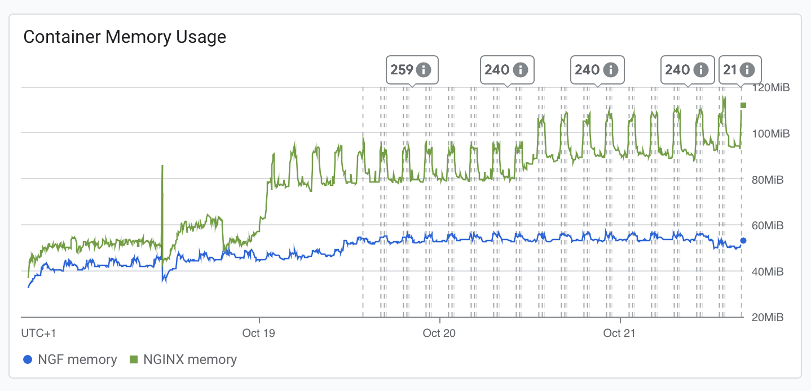
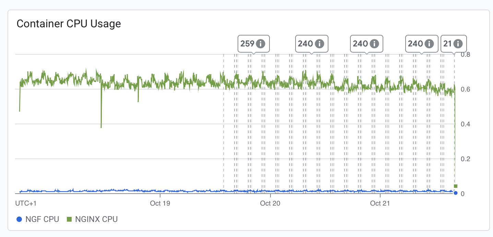

# Results

## Test environment

NGINX Plus: false

NGINX Gateway Fabric:

- Commit: e4eed2dad213387e6493e76100d285483ccbf261
- Date: 2025-10-17T14:41:02Z
- Dirty: false

GKE Cluster:

- Node count: 3
- k8s version: v1.33.5-gke.1080000
- vCPUs per node: 2
- RAM per node: 4015668Ki
- Max pods per node: 110
- Zone: europe-west2-a
- Instance Type: e2-medium

## Summary:

- Still a lot of non-2xx or 3xx responses, but vastly improved on the last test run.
- This indicates that while most of the Agent - control plane connection issues have been resolved, some issues remain.
- All the observed 502s happened within the one window of time, which at least indicates the system was able to recover - although it is unclear what triggered Agent 
- The increase in memory usage for NGF seen in the previous test run appears to have been resolved.
- We observe a steady increase in NGINX memory usage over time which could indicate a memory leak.
- CPU usage remained consistent with past results. 
- Errors seem to be related to cluster upgrade or some other external factor (excluding the resolved inferences pool status error).

## Traffic

HTTP:

```text
Running 5760m test @ http://cafe.example.com/coffee
  2 threads and 100 connections
  Thread Stats   Avg      Stdev     Max   +/- Stdev
    Latency   202.19ms  150.51ms   2.00s    83.62%
    Req/Sec   272.67    178.26     2.59k    63.98%
  183598293 requests in 5760.00m, 62.80GB read
  Socket errors: connect 0, read 338604, write 82770, timeout 57938
  Non-2xx or 3xx responses: 33893
Requests/sec:    531.24
Transfer/sec:    190.54KB
```

HTTPS:

```text
Running 5760m test @ https://cafe.example.com/tea
  2 threads and 100 connections
  Thread Stats   Avg      Stdev     Max   +/- Stdev
    Latency   189.21ms  108.25ms   2.00s    66.82%
    Req/Sec   271.64    178.03     1.96k    63.33%
  182905321 requests in 5760.00m, 61.55GB read
  Socket errors: connect 10168, read 332301, write 0, timeout 96
Requests/sec:    529.24
Transfer/sec:    186.76KB
```

## Key Metrics

### Containers memory



### Containers CPU



## Error Logs

### nginx-gateway

- msg: Config apply failed, rolling back config; error: error getting file data for name:"/etc/nginx/conf.d/http.conf"  hash:"Luqynx2dkxqzXH21wmiV0nj5bHyGiIq7/2gOoM6aKew="  permissions:"0644"  size:5430: rpc error: code = NotFound desc = file not found -> happened twice in the 4 days, related to agent reconciliation during token rotation
  - {hashFound: jmeyy1p+6W1icH2x2YGYffH1XtooWxvizqUVd+WdzQ4=, hashWanted: Luqynx2dkxqzXH21wmiV0nj5bHyGiIq7/2gOoM6aKew=, level: debug, logger: nginxUpdater.fileService, msg: File found had wrong hash, ts: 2025-10-18T18:11:24Z}
  - The error indicates Agent requested a file that had since changed

- msg: Failed to update lock optimistically: the server was unable to return a response in the time allotted, but may still be processing the request (put leases.coordination.k8s.io ngf-longevity-nginx-gateway-fabric-leader-election), falling back to slow path -> same leader election error as on plus, seems out of scope of our product

- msg: no matches for kind "InferencePool" in version "inference.networking.k8s.io/v1" -> Thousands of these, but fixed in PR 4104

### nginx

Traffic: nearly 34000 502s

- These all happened in the same window of less than a minute (approx 2025-10-18T18:11:11 - 2025-10-18T18:11:50), and resolved once NGINX restarted
- It's unclear what triggered NGINX to restart, though it does appear a memory spike was observed around this time
- The outage correlates with the config apply error seen in the control plane logs
