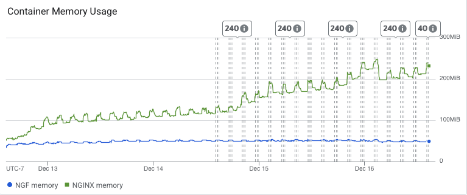
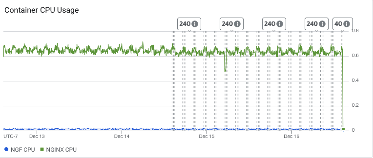

# Results

## Test environment

NGINX Plus: false

NGINX Gateway Fabric:

- Commit: 89aee48bf6e660a828ffd32ca35fc7f52e358e00
- Date: 2025-12-12T20:04:38Z
- Dirty: false

GKE Cluster:

- Node count: 3
- k8s version: v1.33.5-gke.1308000
- vCPUs per node: 2
- RAM per node: 4015672Ki
- Max pods per node: 110
- Zone: us-west2-a
- Instance Type: e2-medium

## Summary:

- Still a lot of non-2xx or 3xx responses, many more than last time. Socket errors are all mostly read errors, with no write errors and fewer timeout errors.
- We observe a continual increase in NGINX memory usage over time which could indicate a memory leak. Will bring this up with the Agent team.
- CPU usage remained consistent with past results.
- Error contacting TokenReview API, but may be a one-off.

## Traffic

HTTP:

```text
Running 5760m test @ http://cafe.example.com/coffee
  2 threads and 100 connections
  Thread Stats   Avg      Stdev     Max   +/- Stdev
    Latency   190.35ms  141.74ms   2.00s    83.52%
    Req/Sec   289.84    187.59     3.52k    63.68%
  195509968 requests in 5760.00m, 66.75GB read
  Socket errors: connect 0, read 315485, write 0, timeout 6584
  Non-2xx or 3xx responses: 1763516
Requests/sec:    565.71
Transfer/sec:    202.53KB
```

HTTPS:

```text
Running 5760m test @ https://cafe.example.com/tea
  2 threads and 100 connections
  Thread Stats   Avg      Stdev     Max   +/- Stdev
    Latency   180.03ms  106.92ms   1.94s    67.25%
    Req/Sec   287.34    184.95     1.73k    63.36%
  193842103 requests in 5760.00m, 65.22GB read
  Socket errors: connect 0, read 309621, write 0, timeout 1
Requests/sec:    560.89
Transfer/sec:    197.88KB
```
## Key Metrics

### Containers memory



### Containers CPU



## Error Logs

### nginx-gateway

error=rpc error: code = Internal desc = error creating TokenReview: context canceled;level=error;logger=agentGRPCServer;msg=error validating connection;stacktrace=github.com/nginx/nginx-gateway-fabric/v2/internal/controller/nginx/agent/grpc/interceptor.(*ContextSetter).Stream.ContextSetter.Stream.func1
	/opt/actions-runner/_work/nginx-gateway-fabric/nginx-gateway-fabric/internal/controller/nginx/agent/grpc/interceptor/interceptor.go:62
google.golang.org/grpc.(*Server).processStreamingRPC
	/opt/actions-runner/_work/nginx-gateway-fabric/nginx-gateway-fabric/.gocache/google.golang.org/grpc@v1.77.0/server.go:1721
google.golang.org/grpc.(*Server).handleStream
	/opt/actions-runner/_work/nginx-gateway-fabric/nginx-gateway-fabric/.gocache/google.golang.org/grpc@v1.77.0/server.go:1836
google.golang.org/grpc.(*Server).serveStreams.func2.1
	/opt/actions-runner/_work/nginx-gateway-fabric/nginx-gateway-fabric/.gocache/google.golang.org/grpc@v1.77.0/server.go:1063;ts=2025-12-16T17:35:17Z

### nginx
