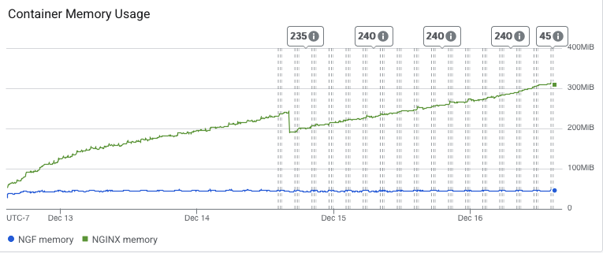
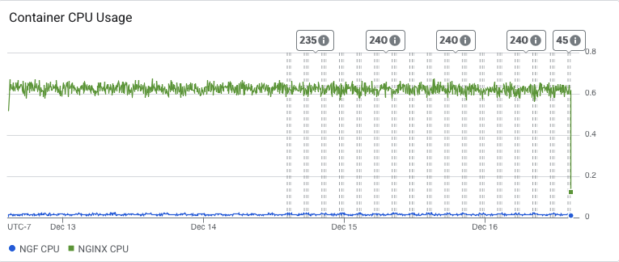

# Results

## Test environment

NGINX Plus: false

NGINX Gateway Fabric:

- Commit: 89aee48bf6e660a828ffd32ca35fc7f52e358e00
- Date: 2025-12-12T20:04:38Z
- Dirty: false

GKE Cluster:

- Node count: 3
- k8s version: v1.33.5-gke.1308000
- vCPUs per node: 2
- RAM per node: 4015672Ki
- Max pods per node: 110
- Zone: us-west2-a
- Instance Type: e2-medium

## Summary:

- Consistent traffic results from 2.2.
- We observe a continual increase in NGINX memory usage over time which could indicate a memory leak. Will bring this up with the Agent team.
- CPU usage remained consistent with past results.
- Still get some "no live upstreams" errors.

## Traffic

HTTP:

```text
Running 5760m test @ http://cafe.example.com/coffee
  2 threads and 100 connections
  Thread Stats   Avg      Stdev     Max   +/- Stdev
    Latency   184.82ms  102.91ms   1.45s    65.52%
    Req/Sec   284.19    179.74     1.52k    63.62%
  192198367 requests in 5760.00m, 65.91GB read
  Socket errors: connect 0, read 0, write 0, timeout 108
  Non-2xx or 3xx responses: 5
Requests/sec:    556.13
Transfer/sec:    199.96KB
```

HTTPS:

```text
Running 5760m test @ https://cafe.example.com/tea
  2 threads and 100 connections
  Thread Stats   Avg      Stdev     Max   +/- Stdev
    Latency   185.02ms  102.92ms   1.50s    65.52%
    Req/Sec   283.70    179.19     1.43k    63.75%
  191866398 requests in 5760.00m, 64.73GB read
  Socket errors: connect 0, read 0, write 0, timeout 114
  Non-2xx or 3xx responses: 6
Requests/sec:    555.17
Transfer/sec:    196.40KB
```
## Key Metrics

### Containers memory



### Containers CPU



## Error Logs

### nginx-gateway

### nginx


10.168.0.90 - - [16/Dec/2025:15:47:08 +0000] "GET /tea HTTP/1.1" 502 150 "-" "-"
2025/12/16 15:47:08 [error] 26#26: *361983622 no live upstreams while connecting to upstream, client: 10.168.0.90, server: cafe.example.com, request: "GET /tea HTTP/1.1", upstream: "http://longevity_tea_80/tea", host: "cafe.example.com"
10.168.0.90 - - [16/Dec/2025:12:49:07 +0000] "GET /coffee HTTP/1.1" 502 150 "-" "-"
2025/12/16 12:49:07 [error] 25#25: *350621339 no live upstreams while connecting to upstream, client: 10.168.0.90, server: cafe.example.com, request: "GET /coffee HTTP/1.1", upstream: "http://longevity_coffee_80/coffee", host: "cafe.example.com"
