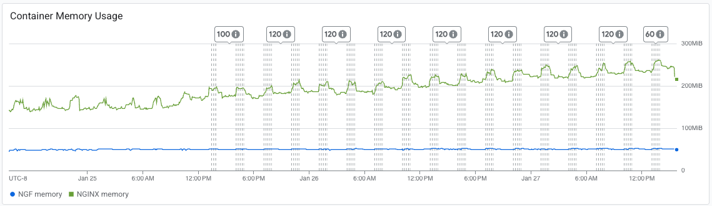
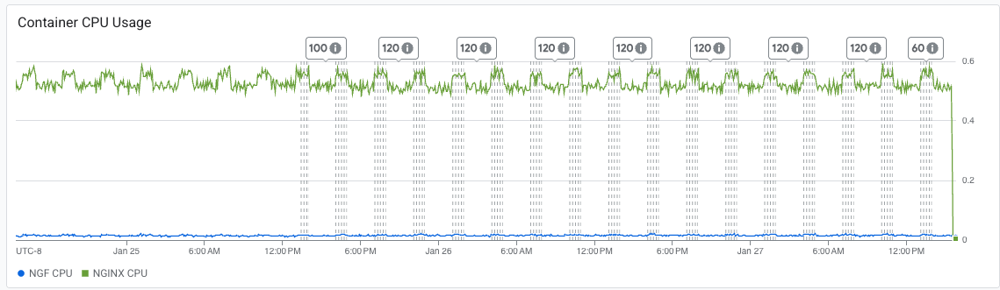

# Results

## Test environment

NGINX Plus: false

NGINX Gateway Fabric:

- Commit: fbfa2b711647e238d0d6907ac6af2327b7080a42
- Date: 2026-01-23T21:46:07Z
- Dirty: true

GKE Cluster:

- Node count: 3
- k8s version: v1.33.5-gke.2072000
- vCPUs per node: 2
- RAM per node: 4015664Ki
- Max pods per node: 110
- Zone: us-central1-c
- Instance Type: e2-medium

## Summary:

- Socket errors are all mostly read errors, with no write errors and same amount of timeout errors. This follows previous trends.
- No report on Non-2xx or 3xx responses. This could be a testing error or an indicator that we don't have this issue anymore. In the previous 1.x tests, some of them similarly do not show Non-2xx or 3xx responses, so this could mean we got 0. Big shift in trends from previous results.
- Increase in memory is consistent with previous results.
- CPU usage remained consistent with past results.
- Error creating/validating TokenReview API is still present from 2.3.0 result.

## Traffic

HTTP:

```text
Running 5760m test @ http://cafe.example.com/coffee
  2 threads and 100 connections
  Thread Stats   Avg      Stdev     Max   +/- Stdev
    Latency   139.68ms  135.15ms   2.00s    92.61%
    Req/Sec   412.23    279.05     3.36k    65.48%
  278963401 requests in 5760.00m, 95.45GB read
  Socket errors: connect 0, read 452260, write 0, timeout 6754
Requests/sec:    807.19
Transfer/sec:    289.60KB
```

HTTPS:

```text
Running 5760m test @ https://cafe.example.com/tea
  2 threads and 100 connections
  Thread Stats   Avg      Stdev     Max   +/- Stdev
    Latency   129.27ms  100.74ms   1.43s    74.85%
    Req/Sec   410.69    279.04     3.41k    64.92%
  277913854 requests in 5760.00m, 93.57GB read
  Socket errors: connect 0, read 447537, write 0, timeout 0
Requests/sec:    804.15
Transfer/sec:    283.89KB
```
## Key Metrics

### Containers memory



### Containers CPU



## Error Logs

### nginx-gateway

error=rpc error: code = Internal desc = error creating TokenReview: Post "https://34.118.224.1:443/apis/authentication.k8s.io/v1/tokenreviews?timeout=10s": context canceled;level=error;logger=agentGRPCServer;msg=error validating connection;stacktrace=github.com/nginx/nginx-gateway-fabric/v2/internal/controller/nginx/agent/grpc/interceptor.(*ContextSetter).Stream.ContextSetter.Stream.func1
	/opt/actions-runner/_work/nginx-gateway-fabric/nginx-gateway-fabric/internal/controller/nginx/agent/grpc/interceptor/interceptor.go:59
google.golang.org/grpc.(*Server).processStreamingRPC
	/opt/actions-runner/_work/nginx-gateway-fabric/nginx-gateway-fabric/.gocache/google.golang.org/grpc@v1.78.0/server.go:1721
google.golang.org/grpc.(*Server).handleStream
	/opt/actions-runner/_work/nginx-gateway-fabric/nginx-gateway-fabric/.gocache/google.golang.org/grpc@v1.78.0/server.go:1836
google.golang.org/grpc.(*Server).serveStreams.func2.1
	/opt/actions-runner/_work/nginx-gateway-fabric/nginx-gateway-fabric/.gocache/google.golang.org/grpc@v1.78.0/server.go:1063;ts=2026-01-27T18:57:43Z

### nginx
