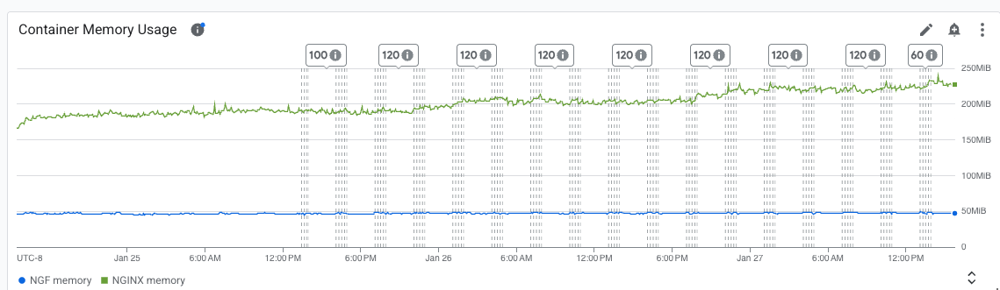
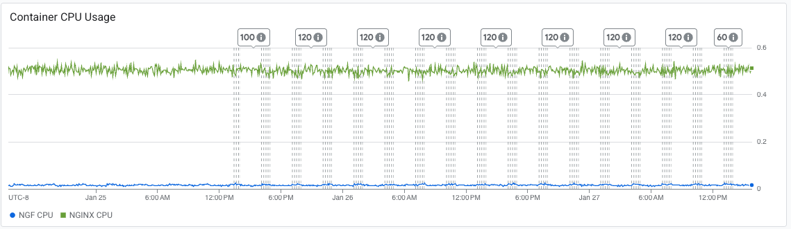

# Results

## Test environment

NGINX Plus: true

NGINX Gateway Fabric:

- Commit: fbfa2b711647e238d0d6907ac6af2327b7080a42
- Date: 2026-01-23T21:46:07Z
- Dirty: true

GKE Cluster:

- Node count: 3
- k8s version: v1.33.5-gke.2072000
- vCPUs per node: 2
- RAM per node: 4015664Ki
- Max pods per node: 110
- Zone: us-central1-c
- Instance Type: e2-medium

## Summary:

- Consistent traffic results from 2.3.
- Decrease in memory usage from 2.3 results, and not as much of a steady increase.
- CPU usage remained consistent with past results.
- Still get some "no live upstreams" errors.
- Error creating/validating TokenReview API was not present in 2.3 plus results.

## Traffic

HTTP:

```text
Running 5760m test @ http://cafe.example.com/coffee
  2 threads and 100 connections
  Thread Stats   Avg      Stdev     Max   +/- Stdev
    Latency   129.30ms  101.44ms   1.72s    75.55%
    Req/Sec   423.89    279.69     5.91k    64.92%
  286722218 requests in 5760.00m, 98.31GB read
  Non-2xx or 3xx responses: 11
Requests/sec:    829.64
Transfer/sec:    298.27KB
```

HTTPS:

```text
Running 5760m test @ https://cafe.example.com/tea
  2 threads and 100 connections
  Thread Stats   Avg      Stdev     Max   +/- Stdev
    Latency   129.42ms  101.50ms   1.74s    75.55%
    Req/Sec   423.05    279.19     3.37k    64.96%
  286142373 requests in 5760.00m, 96.64GB read
  Non-2xx or 3xx responses: 3
Requests/sec:    827.96
Transfer/sec:    293.21KB
```
## Key Metrics

### Containers memory



### Containers CPU



## Error Logs

### nginx-gateway

error=rpc error: code = Internal desc = error creating TokenReview: Post "https://34.118.224.1:443/apis/authentication.k8s.io/v1/tokenreviews?timeout=10s": context canceled;level=error;logger=agentGRPCServer;msg=error validating connection;stacktrace=github.com/nginx/nginx-gateway-fabric/v2/internal/controller/nginx/agent/grpc/interceptor.(*ContextSetter).Stream.ContextSetter.Stream.func1
	/opt/actions-runner/_work/nginx-gateway-fabric/nginx-gateway-fabric/internal/controller/nginx/agent/grpc/interceptor/interceptor.go:59
google.golang.org/grpc.(*Server).processStreamingRPC
	/opt/actions-runner/_work/nginx-gateway-fabric/nginx-gateway-fabric/.gocache/google.golang.org/grpc@v1.78.0/server.go:1721
google.golang.org/grpc.(*Server).handleStream
	/opt/actions-runner/_work/nginx-gateway-fabric/nginx-gateway-fabric/.gocache/google.golang.org/grpc@v1.78.0/server.go:1836
google.golang.org/grpc.(*Server).serveStreams.func2.1
	/opt/actions-runner/_work/nginx-gateway-fabric/nginx-gateway-fabric/.gocache/google.golang.org/grpc@v1.78.0/server.go:1063;ts=2026-01-27T08:39:38Z
error=rpc error: code = Internal desc = error creating TokenReview: context canceled;level=error;logger=agentGRPCServer;msg=error validating connection;stacktrace=github.com/nginx/nginx-gateway-fabric/v2/internal/controller/nginx/agent/grpc/interceptor.(*ContextSetter).Stream.ContextSetter.Stream.func1
	/opt/actions-runner/_work/nginx-gateway-fabric/nginx-gateway-fabric/internal/controller/nginx/agent/grpc/interceptor/interceptor.go:59
google.golang.org/grpc.(*Server).processStreamingRPC
	/opt/actions-runner/_work/nginx-gateway-fabric/nginx-gateway-fabric/.gocache/google.golang.org/grpc@v1.78.0/server.go:1721
google.golang.org/grpc.(*Server).handleStream
	/opt/actions-runner/_work/nginx-gateway-fabric/nginx-gateway-fabric/.gocache/google.golang.org/grpc@v1.78.0/server.go:1836
google.golang.org/grpc.(*Server).serveStreams.func2.1
	/opt/actions-runner/_work/nginx-gateway-fabric/nginx-gateway-fabric/.gocache/google.golang.org/grpc@v1.78.0/server.go:1063;ts=2026-01-27T07:51:17Z
error=rpc error: code = Internal desc = error creating TokenReview: context canceled;level=error;logger=agentGRPCServer;msg=error validating connection;stacktrace=github.com/nginx/nginx-gateway-fabric/v2/internal/controller/nginx/agent/grpc/interceptor.(*ContextSetter).Stream.ContextSetter.Stream.func1
	/opt/actions-runner/_work/nginx-gateway-fabric/nginx-gateway-fabric/internal/controller/nginx/agent/grpc/interceptor/interceptor.go:59
google.golang.org/grpc.(*Server).processStreamingRPC
	/opt/actions-runner/_work/nginx-gateway-fabric/nginx-gateway-fabric/.gocache/google.golang.org/grpc@v1.78.0/server.go:1721
google.golang.org/grpc.(*Server).handleStream
	/opt/actions-runner/_work/nginx-gateway-fabric/nginx-gateway-fabric/.gocache/google.golang.org/grpc@v1.78.0/server.go:1836
google.golang.org/grpc.(*Server).serveStreams.func2.1
	/opt/actions-runner/_work/nginx-gateway-fabric/nginx-gateway-fabric/.gocache/google.golang.org/grpc@v1.78.0/server.go:1063;ts=2026-01-27T03:00:38Z

### nginx
2026/01/27 09:04:08 [error] 26#26: *26905480 no live upstreams while connecting to upstream, client: 10.128.0.77, server: cafe.example.com, request: "GET /tea HTTP/1.1", upstream: "http://longevity_tea_80/tea", host: "cafe.example.com"

10.128.0.77 - - [27/Jan/2026:09:04:08 +0000] "GET /tea HTTP/1.1" 502 150 "-" "-"
2026/01/27 09:04:08 [error] 26#26: *26905480 no live upstreams while connecting to upstream, client: 10.128.0.77, server: cafe.example.com, request: "GET /tea HTTP/1.1", upstream: "http://longevity_tea_80/tea", host: "cafe.example.com"
