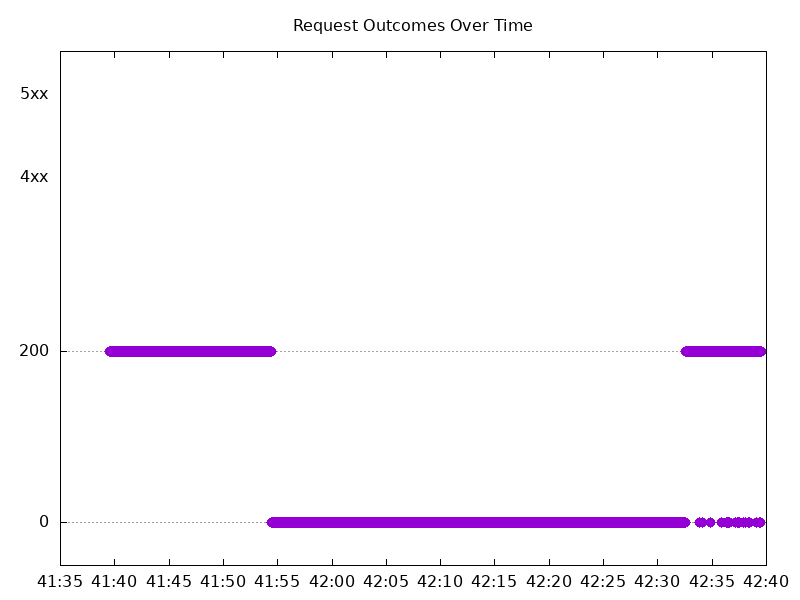
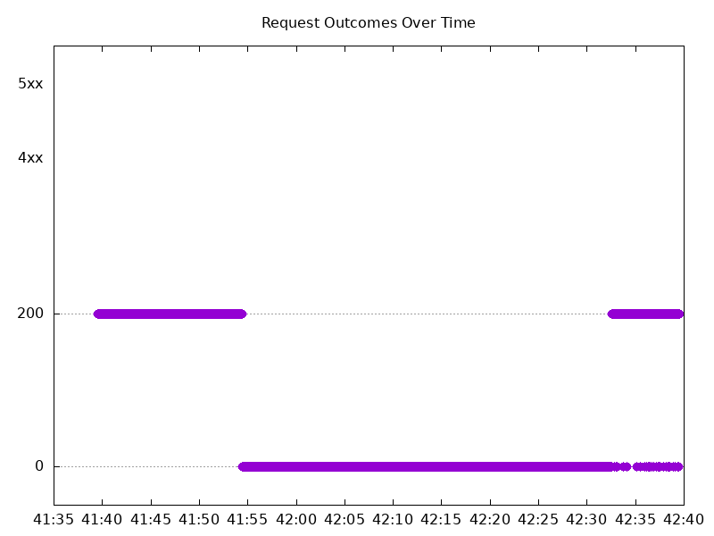

# Results

## Test environment

NGINX Plus: false

NGINX Gateway Fabric:

- Commit: 43424f7eafc27e3fed07cef693614a7f389a3359
- Date: 2025-08-12T16:35:50Z
- Dirty: false

GKE Cluster:

- Node count: 12
- k8s version: v1.33.2-gke.1240000
- vCPUs per node: 16
- RAM per node: 65851524Ki
- Max pods per node: 110
- Zone: us-west1-b
- Instance Type: n2d-standard-16

## Summary:

- This is the first test result since the 2.0 architecture change since you cannot upgrade from 1.6 -> 2.0. With this test setup, there is downtime when upgrading NGF. 
- There is a manual workaround for this release which involves uninstalling then re-installing NGF, which should lead to no downtime on the data plane. Hopefully our new readiness probe will fix this issue in the next release.

## Test: Send https /tea traffic

```text
Requests      [total, rate, throughput]         6000, 100.01, 25.74
Duration      [total, attack, wait]             1m23s, 59.992s, 23.188s
Latencies     [min, mean, 50, 90, 95, 99, max]  374.346µs, 19.546s, 30s, 30.001s, 30.001s, 30.001s, 30.003s
Bytes In      [total, mean]                     333996, 55.67
Bytes Out     [total, mean]                     0, 0.00
Success       [ratio]                           35.68%
Status Codes  [code:count]                      0:3859  200:2141  
Error Set:
Get "https://cafe.example.com/tea": dial tcp 0.0.0.0:0->10.138.0.49:443: connect: connection refused
Get "https://cafe.example.com/tea": context deadline exceeded (Client.Timeout exceeded while awaiting headers)
```



## Test: Send http /coffee traffic

```text
Requests      [total, rate, throughput]         6000, 100.01, 25.60
Duration      [total, attack, wait]             1m23s, 59.991s, 23.397s
Latencies     [min, mean, 50, 90, 95, 99, max]  369.068µs, 19.374s, 30s, 30.001s, 30.001s, 30.001s, 30.006s
Bytes In      [total, mean]                     346576, 57.76
Bytes Out     [total, mean]                     0, 0.00
Success       [ratio]                           35.58%
Status Codes  [code:count]                      0:3865  200:2135  
Error Set:
Get "http://cafe.example.com/coffee": dial tcp 0.0.0.0:0->10.138.0.49:80: connect: connection refused
Get "http://cafe.example.com/coffee": context deadline exceeded (Client.Timeout exceeded while awaiting headers)
```


