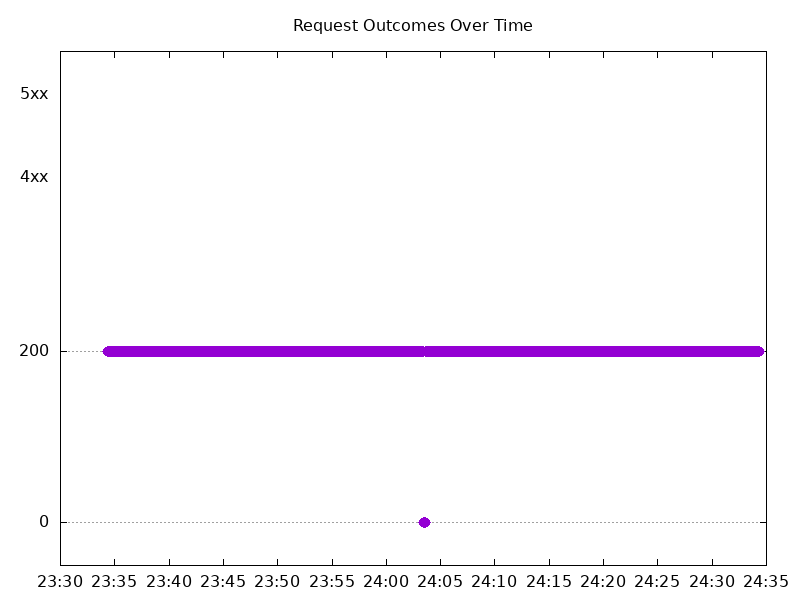

# Results

## Test environment

NGINX Plus: true

NGINX Gateway Fabric:

- Commit: 9fbef714ea22a35c4f1a8c97bd5b4e406ae0c1e9
- Date: 2025-10-21T10:57:37Z
- Dirty: false

GKE Cluster:

- Node count: 12
- k8s version: v1.33.5-gke.1080000
- vCPUs per node: 16
- RAM per node: 65851524Ki
- Max pods per node: 110
- Zone: us-west1-b
- Instance Type: n2d-standard-16

## Summary:

- The 2.2.0 release shows massive improvements in upgrade behavior:
- 2.1.0 Issue: The summary noted significant downtime during upgrades, with a manual uninstall/reinstall workaround recommended
- 2.2.0 Fix: The new readiness probe (mentioned in 2.1.0 summary as a planned fix) appears to have successfully resolved the upgrade downtime issue
- Remaining Failures: The 19 connection refused errors in 2.2.0 (0.32% failure rate) likely represent the minimal unavoidable disruption during pod replacement
- 99.68% success rate during live upgrade is a production-acceptable result
- System maintains near-normal throughput during upgrades

## Test: Send http /coffee traffic

```text
Requests      [total, rate, throughput]         6000, 100.01, 99.69
Duration      [total, attack, wait]             59.994s, 59.992s, 2ms
Latencies     [min, mean, 50, 90, 95, 99, max]  652.591µs, 460.812ms, 1.096ms, 1.49s, 4.421s, 6.756s, 7.315s
Bytes In      [total, mean]                     946988, 157.83
Bytes Out     [total, mean]                     0, 0.00
Success       [ratio]                           99.68%
Status Codes  [code:count]                      0:19  200:5981  
Error Set:
Get "http://cafe.example.com/coffee": read tcp 10.138.0.107:48757->10.138.0.108:80: read: connection reset by peer
Get "http://cafe.example.com/coffee": read tcp 10.138.0.107:36243->10.138.0.108:80: read: connection reset by peer
Get "http://cafe.example.com/coffee": read tcp 10.138.0.107:34647->10.138.0.108:80: read: connection reset by peer
Get "http://cafe.example.com/coffee": dial tcp 0.0.0.0:0->10.138.0.108:80: connect: connection refused
```


## Test: Send https /tea traffic

```text
Requests      [total, rate, throughput]         6000, 100.01, 99.69
Duration      [total, attack, wait]             59.994s, 59.992s, 1.92ms
Latencies     [min, mean, 50, 90, 95, 99, max]  635.09µs, 470.47ms, 1.133ms, 1.533s, 4.46s, 6.804s, 7.35s
Bytes In      [total, mean]                     911101, 151.85
Bytes Out     [total, mean]                     0, 0.00
Success       [ratio]                           99.68%
Status Codes  [code:count]                      0:19  200:5981  
Error Set:
Get "https://cafe.example.com/tea": read tcp 10.138.0.107:44145->10.138.0.108:443: read: connection reset by peer
Get "https://cafe.example.com/tea": read tcp 10.138.0.107:45323->10.138.0.108:443: read: connection reset by peer
Get "https://cafe.example.com/tea": read tcp 10.138.0.107:44743->10.138.0.108:443: read: connection reset by peer
Get "https://cafe.example.com/tea": dial tcp 0.0.0.0:0->10.138.0.108:443: connect: connection refused
```


