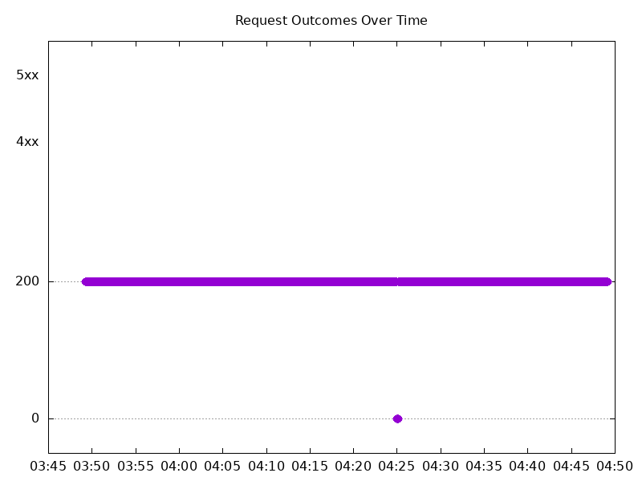

# Results

## Test environment

NGINX Plus: false

NGINX Gateway Fabric:

- Commit: 89aee48bf6e660a828ffd32ca35fc7f52e358e00
- Date: 2025-12-12T20:04:38Z
- Dirty: false

GKE Cluster:

- Node count: 12
- k8s version: v1.33.5-gke.1308000
- vCPUs per node: 16
- RAM per node: 65851520Ki
- Max pods per node: 110
- Zone: us-west1-b
- Instance Type: n2d-standard-16

## Summary:

- Similar results to 2.2, with a brief interruption in traffic.
- Latency numbers slightly improved.

## Test: Send https /tea traffic

```text
Requests      [total, rate, throughput]         6000, 100.01, 99.69
Duration      [total, attack, wait]             59.993s, 59.992s, 1.424ms
Latencies     [min, mean, 50, 90, 95, 99, max]  513.564µs, 281.334ms, 1.334ms, 147.299ms, 2.817s, 5.097s, 5.652s
Bytes In      [total, mean]                     915093, 152.52
Bytes Out     [total, mean]                     0, 0.00
Success       [ratio]                           99.68%
Status Codes  [code:count]                      0:19  200:5981  
Error Set:
Get "https://cafe.example.com/tea": dial tcp 0.0.0.0:0->10.138.0.126:443: connect: connection refused
```


## Test: Send http /coffee traffic

```text
Requests      [total, rate, throughput]         6000, 100.01, 99.69
Duration      [total, attack, wait]             59.993s, 59.992s, 1.33ms
Latencies     [min, mean, 50, 90, 95, 99, max]  671.146µs, 273.786ms, 1.334ms, 47.986ms, 2.714s, 5.05s, 5.616s
Bytes In      [total, mean]                     952904, 158.82
Bytes Out     [total, mean]                     0, 0.00
Success       [ratio]                           99.68%
Status Codes  [code:count]                      0:19  200:5981  
Error Set:
Get "http://cafe.example.com/coffee": dial tcp 0.0.0.0:0->10.138.0.126:80: connect: connection refused
```


