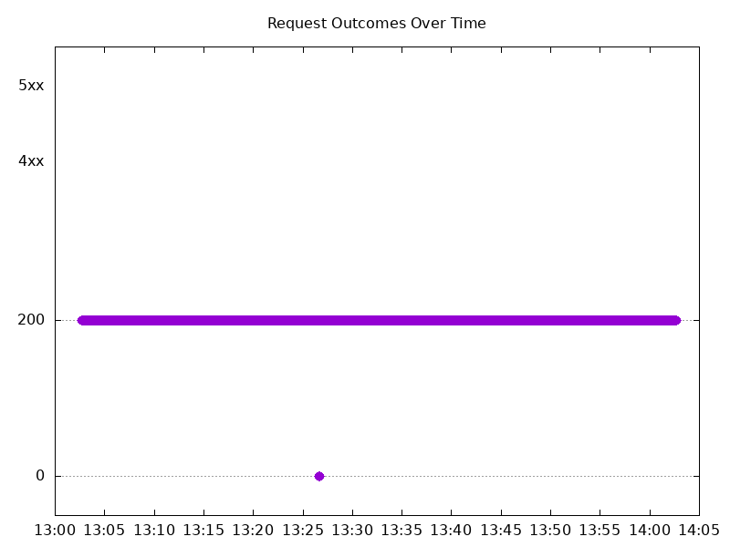

# Results

## Test environment

NGINX Plus: false

NGINX Gateway Fabric:

- Commit: fbfa2b711647e238d0d6907ac6af2327b7080a42
- Date: 2026-01-23T21:46:07Z
- Dirty: false

GKE Cluster:

- Node count: 12
- k8s version: v1.33.5-gke.2100000
- vCPUs per node: 16
- RAM per node: 65851520Ki
- Max pods per node: 110
- Zone: us-west1-b
- Instance Type: n2d-standard-16

## Summary:

- Similar results to 2.3, with a brief interruption in traffic.
- Latency numbers increased.

## Test: Send http /coffee traffic

```text
Requests      [total, rate, throughput]         6000, 100.01, 99.78
Duration      [total, attack, wait]             59.994s, 59.993s, 1.313ms
Latencies     [min, mean, 50, 90, 95, 99, max]  461.499µs, 446.326ms, 1.009ms, 1.392s, 4.289s, 6.608s, 7.173s
Bytes In      [total, mean]                     965757, 160.96
Bytes Out     [total, mean]                     0, 0.00
Success       [ratio]                           99.77%
Status Codes  [code:count]                      0:14  200:5986  
Error Set:
Get "http://cafe.example.com/coffee": dial tcp 0.0.0.0:0->10.138.0.43:80: connect: connection refused
```



## Test: Send https /tea traffic

```text
Requests      [total, rate, throughput]         6000, 100.01, 99.78
Duration      [total, attack, wait]             59.994s, 59.992s, 1.913ms
Latencies     [min, mean, 50, 90, 95, 99, max]  524.102µs, 449.249ms, 1.138ms, 1.442s, 4.308s, 6.618s, 7.181s
Bytes In      [total, mean]                     929810, 154.97
Bytes Out     [total, mean]                     0, 0.00
Success       [ratio]                           99.77%
Status Codes  [code:count]                      0:14  200:5986  
Error Set:
Get "https://cafe.example.com/tea": dial tcp 0.0.0.0:0->10.138.0.43:443: connect: connection refused
```


