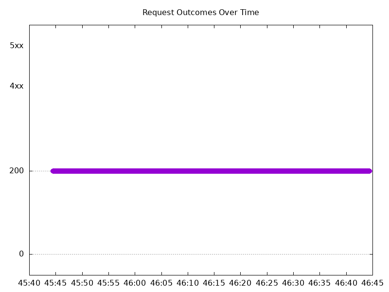

# Results

## Test environment

NGINX Plus: false

NGINX Gateway Fabric:

- Commit: 76a2cea7c19f4aeb19d6610048db93fe3545dedc
- Date: 2025-12-03T19:53:07Z
- Dirty: false

GKE Cluster:

- Node count: 12
- k8s version: v1.33.5-gke.1201000
- vCPUs per node: 16
- RAM per node: 65851520Ki
- Max pods per node: 110
- Zone: us-west1-b
- Instance Type: n2d-standard-16

## Test: Send https /tea traffic

```text
Requests      [total, rate, throughput]         6000, 100.01, 99.80
Duration      [total, attack, wait]             59.997s, 59.993s, 4.183ms
Latencies     [min, mean, 50, 90, 95, 99, max]  519.547µs, 1.833s, 1.186ms, 8.79s, 11.649s, 13.963s, 14.52s
Bytes In      [total, mean]                     922152, 153.69
Bytes Out     [total, mean]                     0, 0.00
Success       [ratio]                           99.80%
Status Codes  [code:count]                      0:12  200:5988  
Error Set:
Get "https://cafe.example.com/tea": dial tcp 0.0.0.0:0->10.138.0.56:443: connect: connection refused
```



## Test: Send http /coffee traffic

```text
Requests      [total, rate, throughput]         6000, 100.01, 99.80
Duration      [total, attack, wait]             59.997s, 59.993s, 4.518ms
Latencies     [min, mean, 50, 90, 95, 99, max]  437.037µs, 1.822s, 1.135ms, 8.517s, 11.638s, 13.967s, 14.524s
Bytes In      [total, mean]                     958080, 159.68
Bytes Out     [total, mean]                     0, 0.00
Success       [ratio]                           99.80%
Status Codes  [code:count]                      0:12  200:5988  
Error Set:
Get "http://cafe.example.com/coffee": dial tcp 0.0.0.0:0->10.138.0.56:80: connect: connection refused
```


