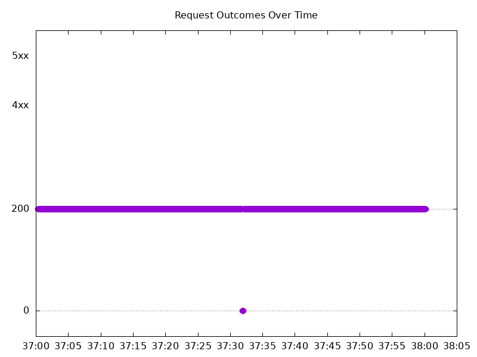

# Results

## Test environment

NGINX Plus: false

NGINX Gateway Fabric:

- Commit: 394bdf0e0c8ae008009546b7a21d8f80248d52be
- Date: 2026-07-30T17:54:44Z
- Dirty: false

GKE Cluster:

- Node count: 12
- k8s version: v1.35.6-gke.1250000
- vCPUs per node: 16
- RAM per node: 65848292Ki
- Max pods per node: 110
- Zone: us-west1-b
- Instance Type: n2d-standard-16

## Test: Send https /tea traffic

```text
Requests      [total, rate, throughput]         6000, 100.01, 99.68
Duration      [total, attack, wait]             59.993s, 59.992s, 1.214ms
Latencies     [min, mean, 50, 90, 95, 99, max]  622.439µs, 108.653ms, 985.745µs, 1.4ms, 632.39ms, 2.942s, 3.519s
Bytes In      [total, mean]                     914940, 152.49
Bytes Out     [total, mean]                     0, 0.00
Success       [ratio]                           99.67%
Status Codes  [code:count]                      0:20  200:5980  
Error Set:
Get "https://cafe.example.com/tea": read tcp 10.138.0.126:47429->10.138.0.95:443: read: connection reset by peer
Get "https://cafe.example.com/tea": read tcp 10.138.0.126:55737->10.138.0.95:443: read: connection reset by peer
Get "https://cafe.example.com/tea": read tcp 10.138.0.126:34103->10.138.0.95:443: read: connection reset by peer
Get "https://cafe.example.com/tea": dial tcp 0.0.0.0:0->10.138.0.95:443: connect: connection refused
```


## Test: Send http /coffee traffic

```text
Requests      [total, rate, throughput]         6000, 100.01, 99.68
Duration      [total, attack, wait]             59.993s, 59.992s, 1.223ms
Latencies     [min, mean, 50, 90, 95, 99, max]  630.25µs, 108.455ms, 960.991µs, 1.324ms, 674.002ms, 2.93s, 3.505s
Bytes In      [total, mean]                     952956, 158.83
Bytes Out     [total, mean]                     0, 0.00
Success       [ratio]                           99.67%
Status Codes  [code:count]                      0:20  200:5980  
Error Set:
Get "http://cafe.example.com/coffee": read tcp 10.138.0.126:33441->10.138.0.95:80: read: connection reset by peer
Get "http://cafe.example.com/coffee": read tcp 10.138.0.126:49411->10.138.0.95:80: read: connection reset by peer
Get "http://cafe.example.com/coffee": read tcp 10.138.0.126:51573->10.138.0.95:80: read: connection reset by peer
Get "http://cafe.example.com/coffee": dial tcp 0.0.0.0:0->10.138.0.95:80: connect: connection refused
```


