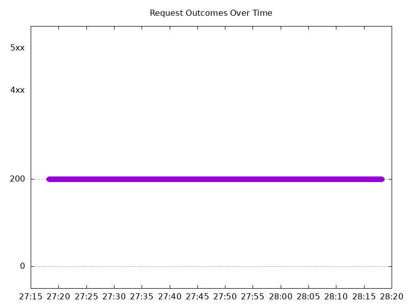
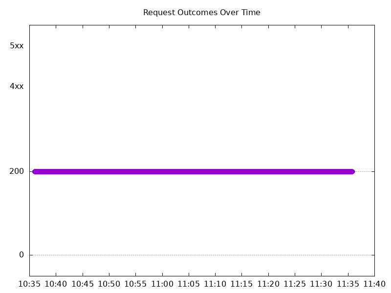

# Results

## Test environment

NGINX Plus: true

NGINX Gateway Fabric:

- Commit: b41c973c8399458984def3c2a8a268a237c864c8
- Date: 2025-10-30T03:04:40Z
- Dirty: false

GKE Cluster:

- Node count: 12
- k8s version: v1.33.5-gke.1162000
- vCPUs per node: 16
- RAM per node: 65851520Ki
- Max pods per node: 110
- Zone: us-west1-b
- Instance Type: n2d-standard-16

## Test: Send http /coffee traffic

```text
Requests      [total, rate, throughput]         6000, 100.02, 100.01
Duration      [total, attack, wait]             59.991s, 59.99s, 1.067ms
Latencies     [min, mean, 50, 90, 95, 99, max]  795.356µs, 1.082ms, 1.067ms, 1.203ms, 1.254ms, 1.38ms, 9.67ms
Bytes In      [total, mean]                     966000, 161.00
Bytes Out     [total, mean]                     0, 0.00
Success       [ratio]                           100.00%
Status Codes  [code:count]                      200:6000  
Error Set:
```



## Test: Send https /tea traffic

```text
Requests      [total, rate, throughput]         6000, 100.02, 100.01
Duration      [total, attack, wait]             59.991s, 59.99s, 985.482µs
Latencies     [min, mean, 50, 90, 95, 99, max]  794.318µs, 1.163ms, 1.142ms, 1.285ms, 1.332ms, 1.432ms, 10.328ms
Bytes In      [total, mean]                     931950, 155.32
Bytes Out     [total, mean]                     0, 0.00
Success       [ratio]                           100.00%
Status Codes  [code:count]                      200:6000  
Error Set:
```


