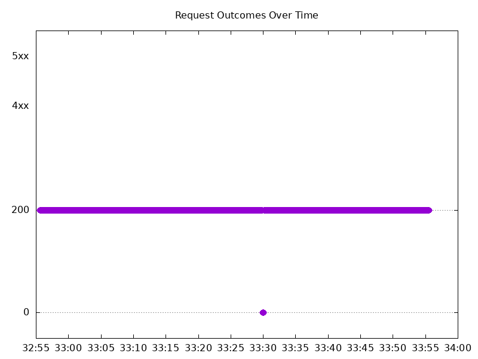

# Results

## Test environment

NGINX Plus: true

NGINX Gateway Fabric:

- Commit: 394bdf0e0c8ae008009546b7a21d8f80248d52be
- Date: 2026-07-30T17:54:44Z
- Dirty: false

GKE Cluster:

- Node count: 12
- k8s version: v1.35.6-gke.1250000
- vCPUs per node: 16
- RAM per node: 65848284Ki
- Max pods per node: 110
- Zone: us-west1-b
- Instance Type: n2d-standard-16

## Test: Send https /tea traffic

```text
Requests      [total, rate, throughput]         6000, 100.01, 99.76
Duration      [total, attack, wait]             59.996s, 59.993s, 2.911ms
Latencies     [min, mean, 50, 90, 95, 99, max]  592.044µs, 1.406s, 927.575µs, 6.784s, 9.867s, 12.168s, 12.73s
Bytes In      [total, mean]                     915705, 152.62
Bytes Out     [total, mean]                     0, 0.00
Success       [ratio]                           99.75%
Status Codes  [code:count]                      0:15  200:5985  
Error Set:
Get "https://cafe.example.com/tea": read tcp 10.138.0.127:44385->10.138.15.193:443: read: connection reset by peer
Get "https://cafe.example.com/tea": read tcp 10.138.0.127:40089->10.138.15.193:443: read: connection reset by peer
Get "https://cafe.example.com/tea": write tcp 10.138.0.127:37933->10.138.15.193:443: write: connection reset by peer
Get "https://cafe.example.com/tea": dial tcp 0.0.0.0:0->10.138.15.193:443: connect: connection refused
```


## Test: Send http /coffee traffic

```text
Requests      [total, rate, throughput]         6000, 100.01, 99.76
Duration      [total, attack, wait]             59.996s, 59.992s, 3.746ms
Latencies     [min, mean, 50, 90, 95, 99, max]  587.451µs, 1.403s, 901.715µs, 6.655s, 9.808s, 12.154s, 12.728s
Bytes In      [total, mean]                     951615, 158.60
Bytes Out     [total, mean]                     0, 0.00
Success       [ratio]                           99.75%
Status Codes  [code:count]                      0:15  200:5985  
Error Set:
Get "http://cafe.example.com/coffee": read tcp 10.138.0.127:34183->10.138.15.193:80: read: connection reset by peer
Get "http://cafe.example.com/coffee": read tcp 10.138.0.127:33849->10.138.15.193:80: read: connection reset by peer
Get "http://cafe.example.com/coffee": read tcp 10.138.0.127:38575->10.138.15.193:80: read: connection reset by peer
Get "http://cafe.example.com/coffee": dial tcp 0.0.0.0:0->10.138.15.193:80: connect: connection refused
```


