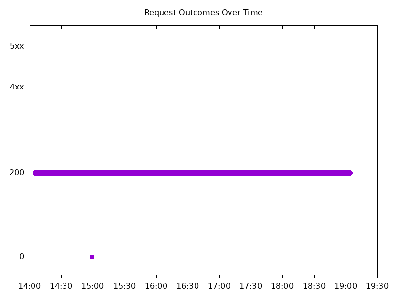
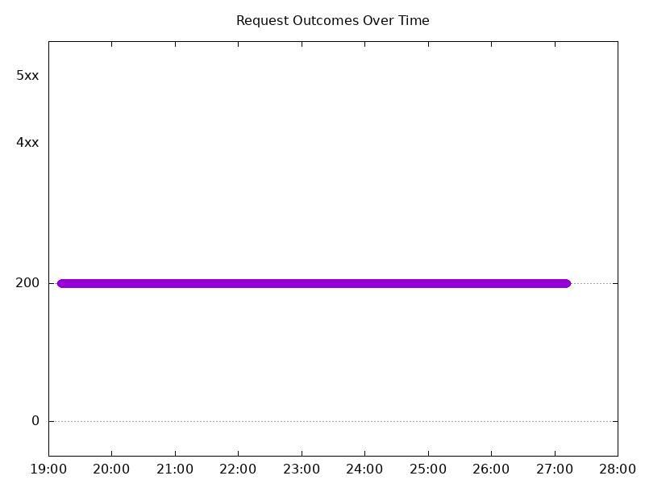
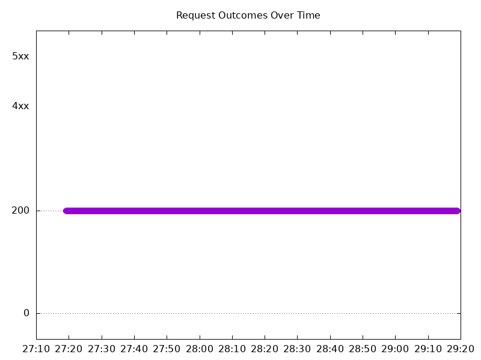
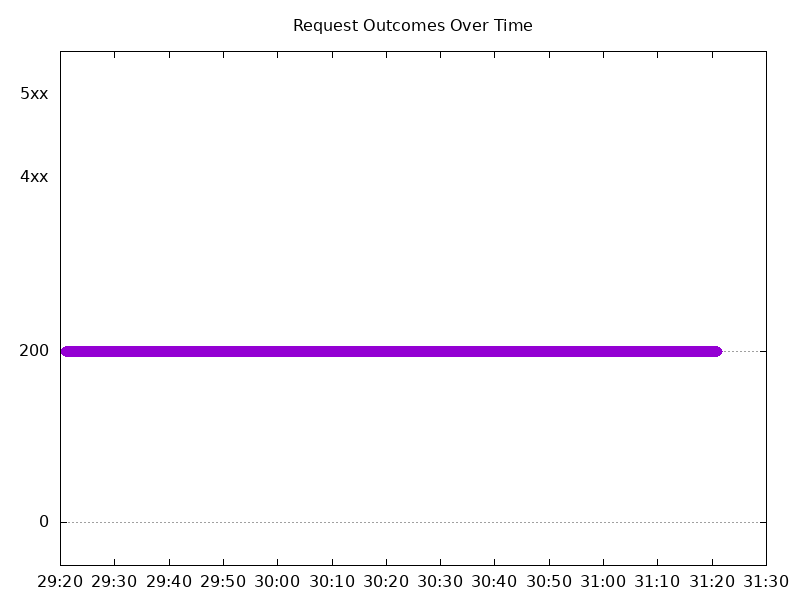
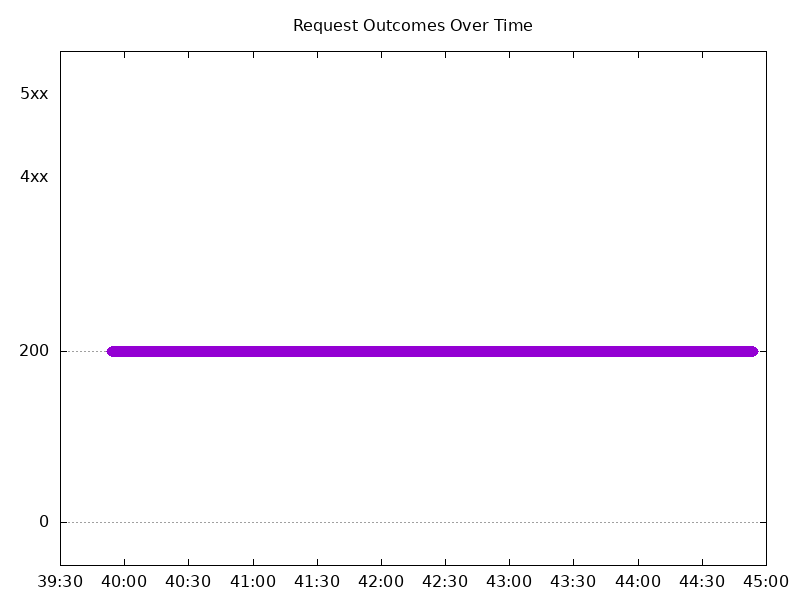
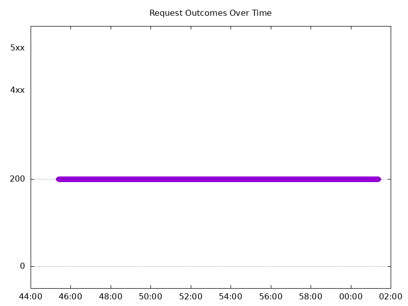
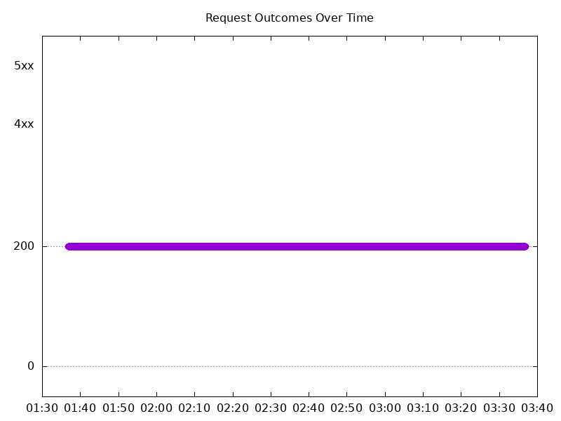
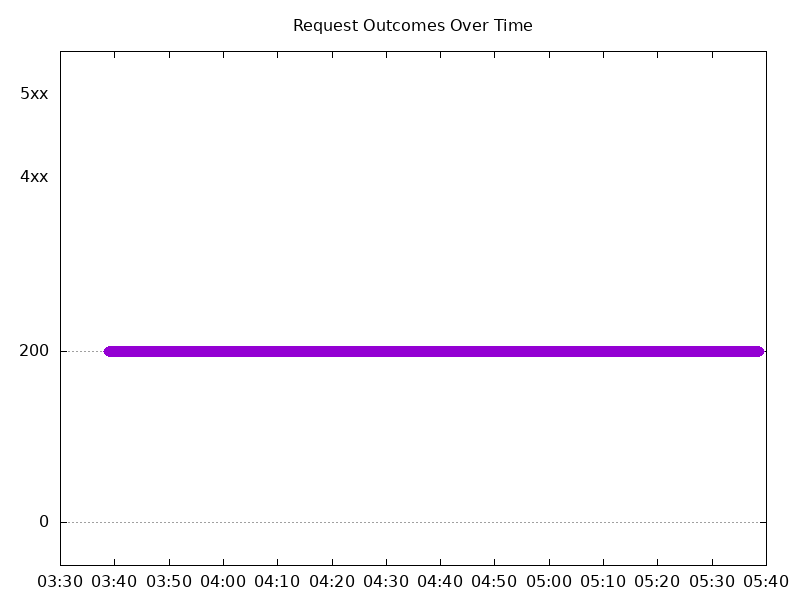

# Results

## Test environment

NGINX Plus: false

NGINX Gateway Fabric:

- Commit: 43424f7eafc27e3fed07cef693614a7f389a3359
- Date: 2025-08-12T16:35:50Z
- Dirty: false

GKE Cluster:

- Node count: 12
- k8s version: v1.33.2-gke.1240000
- vCPUs per node: 16
- RAM per node: 65851524Ki
- Max pods per node: 110
- Zone: us-west1-b
- Instance Type: n2d-standard-16

## Summary:

- Decreased latency in requests across all tests by an insignificant amount. 

## One NGINX Pod runs per node Test Results

### Scale Up Gradually

#### Test: Send http /coffee traffic

```text
Requests      [total, rate, throughput]         30000, 100.00, 100.00
Duration      [total, attack, wait]             5m0s, 5m0s, 1.177ms
Latencies     [min, mean, 50, 90, 95, 99, max]  271.226µs, 1.208ms, 1.128ms, 1.442ms, 1.565ms, 2.119ms, 248.605ms
Bytes In      [total, mean]                     4832720, 161.09
Bytes Out     [total, mean]                     0, 0.00
Success       [ratio]                           99.99%
Status Codes  [code:count]                      0:2  200:29998  
Error Set:
Get "http://cafe.example.com/coffee": dial tcp 0.0.0.0:0->10.138.0.14:80: connect: network is unreachable
```



#### Test: Send https /tea traffic

```text
Requests      [total, rate, throughput]         30000, 100.00, 100.00
Duration      [total, attack, wait]             5m0s, 5m0s, 1.136ms
Latencies     [min, mean, 50, 90, 95, 99, max]  236.862µs, 1.285ms, 1.181ms, 1.479ms, 1.605ms, 2.314ms, 252.017ms
Bytes In      [total, mean]                     4652901, 155.10
Bytes Out     [total, mean]                     0, 0.00
Success       [ratio]                           100.00%
Status Codes  [code:count]                      0:1  200:29999  
Error Set:
Get "https://cafe.example.com/tea": dial tcp 0.0.0.0:0->10.138.0.14:443: connect: network is unreachable
```


### Scale Down Gradually

#### Test: Send https /tea traffic

```text
Requests      [total, rate, throughput]         48000, 100.00, 100.00
Duration      [total, attack, wait]             8m0s, 8m0s, 1.376ms
Latencies     [min, mean, 50, 90, 95, 99, max]  642.962µs, 1.144ms, 1.134ms, 1.288ms, 1.351ms, 1.652ms, 35.611ms
Bytes In      [total, mean]                     7444806, 155.10
Bytes Out     [total, mean]                     0, 0.00
Success       [ratio]                           100.00%
Status Codes  [code:count]                      200:48000  
Error Set:
```



#### Test: Send http /coffee traffic

```text
Requests      [total, rate, throughput]         48000, 100.00, 100.00
Duration      [total, attack, wait]             8m0s, 8m0s, 1.04ms
Latencies     [min, mean, 50, 90, 95, 99, max]  589.239µs, 1.086ms, 1.078ms, 1.241ms, 1.302ms, 1.6ms, 35.636ms
Bytes In      [total, mean]                     7732850, 161.10
Bytes Out     [total, mean]                     0, 0.00
Success       [ratio]                           100.00%
Status Codes  [code:count]                      200:48000  
Error Set:
```


### Scale Up Abruptly

#### Test: Send https /tea traffic

```text
Requests      [total, rate, throughput]         12000, 100.01, 100.01
Duration      [total, attack, wait]             2m0s, 2m0s, 1.166ms
Latencies     [min, mean, 50, 90, 95, 99, max]  635.472µs, 1.14ms, 1.131ms, 1.287ms, 1.346ms, 1.604ms, 12.365ms
Bytes In      [total, mean]                     1861212, 155.10
Bytes Out     [total, mean]                     0, 0.00
Success       [ratio]                           100.00%
Status Codes  [code:count]                      200:12000  
Error Set:
```


#### Test: Send http /coffee traffic

```text
Requests      [total, rate, throughput]         12000, 100.01, 100.01
Duration      [total, attack, wait]             2m0s, 2m0s, 1.26ms
Latencies     [min, mean, 50, 90, 95, 99, max]  602.076µs, 1.079ms, 1.076ms, 1.233ms, 1.285ms, 1.445ms, 12.338ms
Bytes In      [total, mean]                     1933235, 161.10
Bytes Out     [total, mean]                     0, 0.00
Success       [ratio]                           100.00%
Status Codes  [code:count]                      200:12000  
Error Set:
```



### Scale Down Abruptly

#### Test: Send https /tea traffic

```text
Requests      [total, rate, throughput]         12000, 100.01, 100.01
Duration      [total, attack, wait]             2m0s, 2m0s, 1.148ms
Latencies     [min, mean, 50, 90, 95, 99, max]  657.765µs, 1.151ms, 1.135ms, 1.298ms, 1.365ms, 1.715ms, 62.444ms
Bytes In      [total, mean]                     1861272, 155.11
Bytes Out     [total, mean]                     0, 0.00
Success       [ratio]                           100.00%
Status Codes  [code:count]                      200:12000  
Error Set:
```


#### Test: Send http /coffee traffic

```text
Requests      [total, rate, throughput]         12000, 100.01, 100.01
Duration      [total, attack, wait]             2m0s, 2m0s, 1.35ms
Latencies     [min, mean, 50, 90, 95, 99, max]  580.673µs, 1.068ms, 1.062ms, 1.217ms, 1.266ms, 1.417ms, 63.405ms
Bytes In      [total, mean]                     1933160, 161.10
Bytes Out     [total, mean]                     0, 0.00
Success       [ratio]                           100.00%
Status Codes  [code:count]                      200:12000  
Error Set:
```



## Multiple NGINX Pods run per node Test Results

### Scale Up Gradually

#### Test: Send http /coffee traffic

```text
Requests      [total, rate, throughput]         30000, 100.00, 100.00
Duration      [total, attack, wait]             5m0s, 5m0s, 976.371µs
Latencies     [min, mean, 50, 90, 95, 99, max]  595.016µs, 1.121ms, 1.097ms, 1.312ms, 1.427ms, 1.887ms, 22.787ms
Bytes In      [total, mean]                     4833005, 161.10
Bytes Out     [total, mean]                     0, 0.00
Success       [ratio]                           100.00%
Status Codes  [code:count]                      200:30000  
Error Set:
```


#### Test: Send https /tea traffic

```text
Requests      [total, rate, throughput]         30000, 100.00, 100.00
Duration      [total, attack, wait]             5m0s, 5m0s, 1.557ms
Latencies     [min, mean, 50, 90, 95, 99, max]  650.263µs, 1.184ms, 1.146ms, 1.349ms, 1.477ms, 1.986ms, 22.968ms
Bytes In      [total, mean]                     4652987, 155.10
Bytes Out     [total, mean]                     0, 0.00
Success       [ratio]                           100.00%
Status Codes  [code:count]                      200:30000  
Error Set:
```



### Scale Down Gradually

#### Test: Send http /coffee traffic

```text
Requests      [total, rate, throughput]         96000, 100.00, 100.00
Duration      [total, attack, wait]             16m0s, 16m0s, 1.199ms
Latencies     [min, mean, 50, 90, 95, 99, max]  584.14µs, 1.14ms, 1.116ms, 1.331ms, 1.44ms, 1.887ms, 52.98ms
Bytes In      [total, mean]                     15465773, 161.10
Bytes Out     [total, mean]                     0, 0.00
Success       [ratio]                           100.00%
Status Codes  [code:count]                      200:96000  
Error Set:
```


#### Test: Send https /tea traffic

```text
Requests      [total, rate, throughput]         96000, 100.00, 100.00
Duration      [total, attack, wait]             16m0s, 16m0s, 1.031ms
Latencies     [min, mean, 50, 90, 95, 99, max]  634.745µs, 1.196ms, 1.169ms, 1.374ms, 1.471ms, 1.909ms, 39.725ms
Bytes In      [total, mean]                     14889673, 155.10
Bytes Out     [total, mean]                     0, 0.00
Success       [ratio]                           100.00%
Status Codes  [code:count]                      200:96000  
Error Set:
```



### Scale Up Abruptly

#### Test: Send https /tea traffic

```text
Requests      [total, rate, throughput]         12000, 100.01, 100.01
Duration      [total, attack, wait]             2m0s, 2m0s, 1.135ms
Latencies     [min, mean, 50, 90, 95, 99, max]  664.466µs, 1.184ms, 1.173ms, 1.35ms, 1.418ms, 1.738ms, 10.866ms
Bytes In      [total, mean]                     1861227, 155.10
Bytes Out     [total, mean]                     0, 0.00
Success       [ratio]                           100.00%
Status Codes  [code:count]                      200:12000  
Error Set:
```


#### Test: Send http /coffee traffic

```text
Requests      [total, rate, throughput]         12000, 100.01, 100.01
Duration      [total, attack, wait]             2m0s, 2m0s, 1.245ms
Latencies     [min, mean, 50, 90, 95, 99, max]  628.895µs, 1.111ms, 1.109ms, 1.287ms, 1.346ms, 1.633ms, 12.711ms
Bytes In      [total, mean]                     1933228, 161.10
Bytes Out     [total, mean]                     0, 0.00
Success       [ratio]                           100.00%
Status Codes  [code:count]                      200:12000  
Error Set:
```



### Scale Down Abruptly

#### Test: Send https /tea traffic

```text
Requests      [total, rate, throughput]         12000, 100.01, 100.01
Duration      [total, attack, wait]             2m0s, 2m0s, 1.302ms
Latencies     [min, mean, 50, 90, 95, 99, max]  658.812µs, 1.227ms, 1.176ms, 1.351ms, 1.42ms, 1.676ms, 152.248ms
Bytes In      [total, mean]                     1861205, 155.10
Bytes Out     [total, mean]                     0, 0.00
Success       [ratio]                           100.00%
Status Codes  [code:count]                      200:12000  
Error Set:
```


#### Test: Send http /coffee traffic

```text
Requests      [total, rate, throughput]         12000, 100.01, 100.01
Duration      [total, attack, wait]             2m0s, 2m0s, 1.311ms
Latencies     [min, mean, 50, 90, 95, 99, max]  635.464µs, 1.167ms, 1.119ms, 1.319ms, 1.4ms, 1.684ms, 150.548ms
Bytes In      [total, mean]                     1933174, 161.10
Bytes Out     [total, mean]                     0, 0.00
Success       [ratio]                           100.00%
Status Codes  [code:count]                      200:12000  
Error Set:
```


