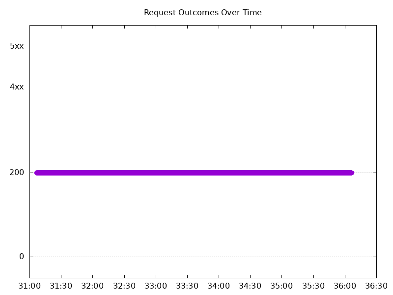
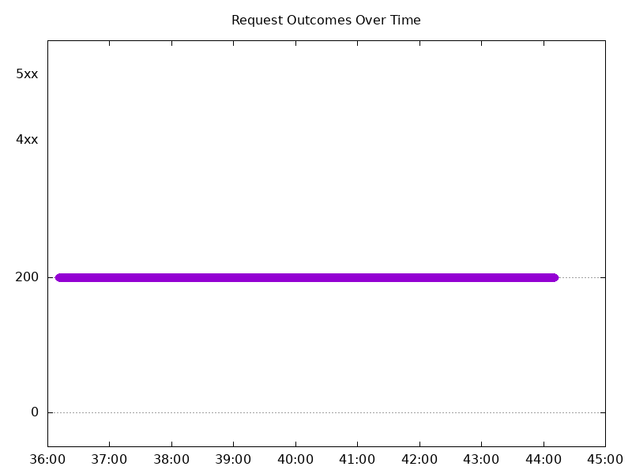
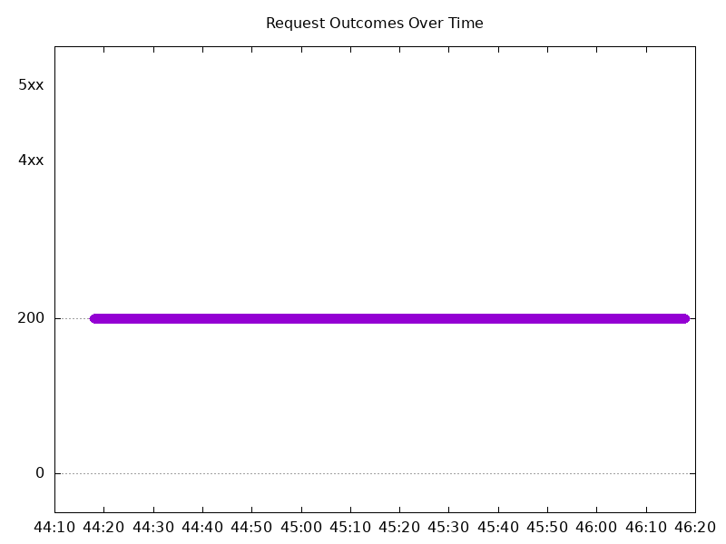
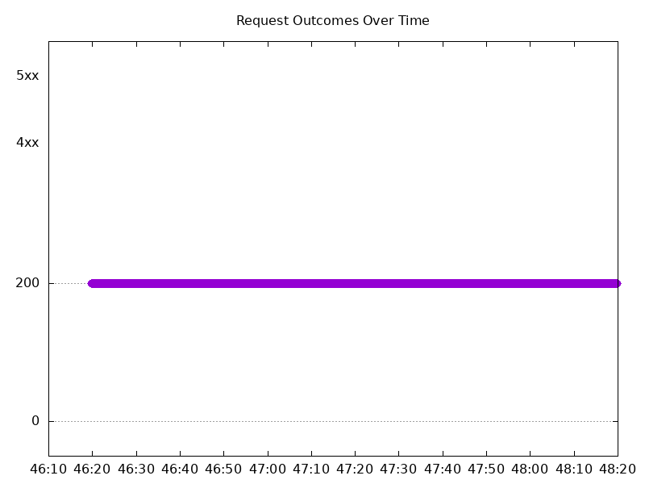
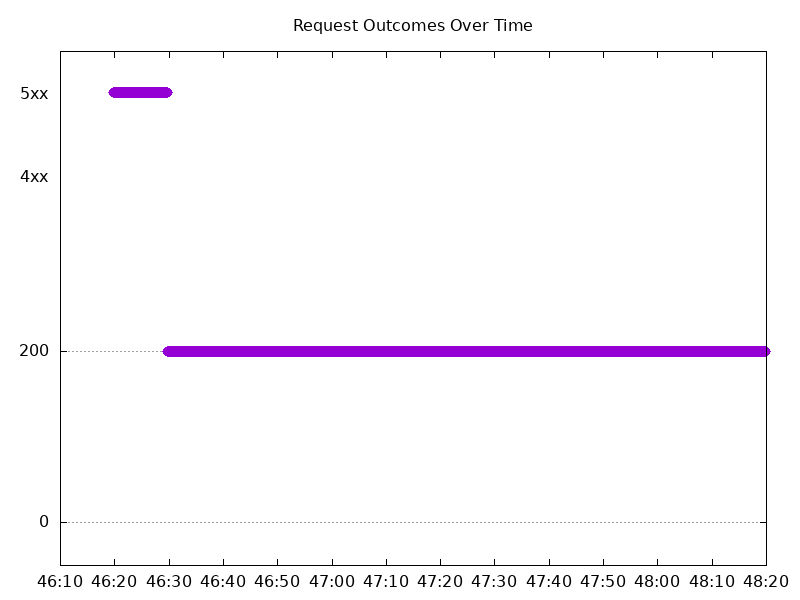
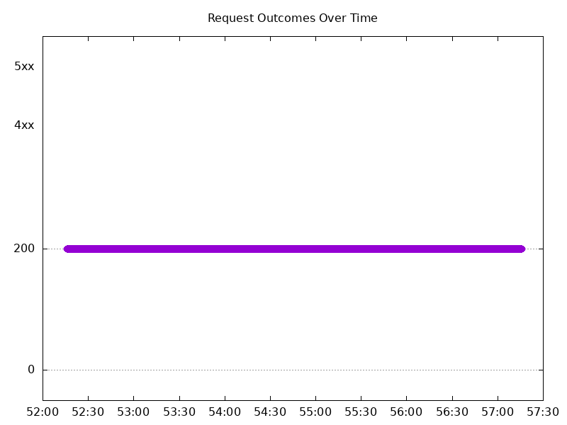
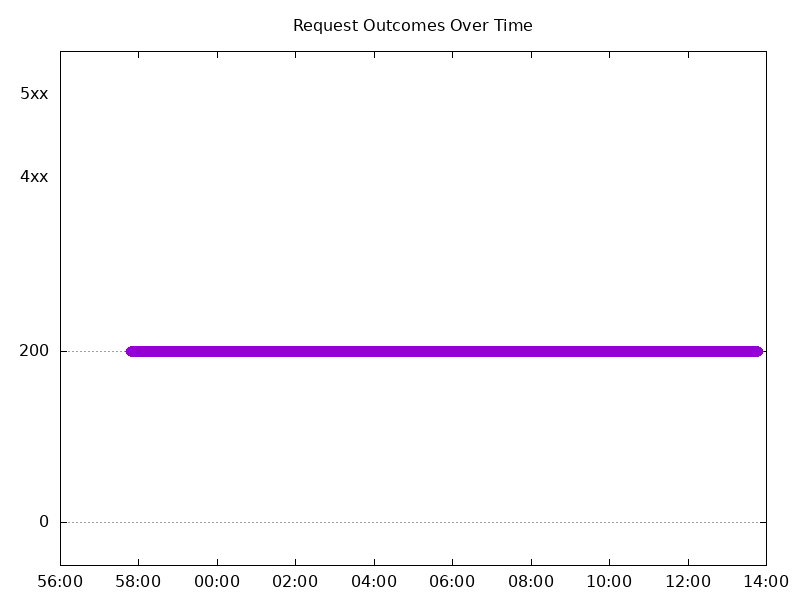
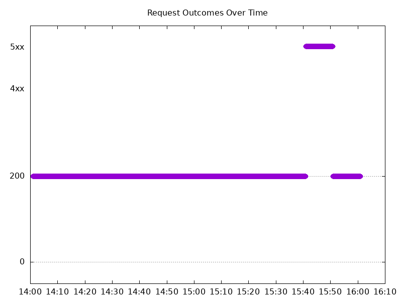
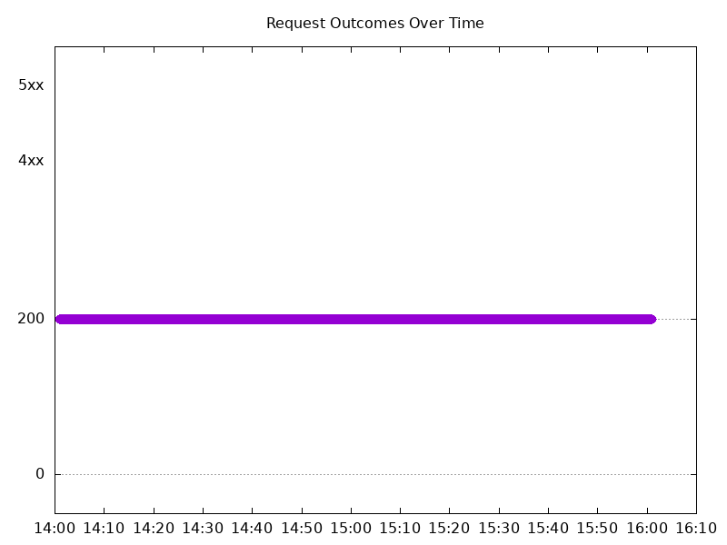

# Results

## Test environment

NGINX Plus: true

NGINX Gateway Fabric:

- Commit: 43424f7eafc27e3fed07cef693614a7f389a3359
- Date: 2025-08-12T16:35:50Z
- Dirty: false

GKE Cluster:

- Node count: 12
- k8s version: v1.33.2-gke.1240000
- vCPUs per node: 16
- RAM per node: 65851524Ki
- Max pods per node: 110
- Zone: us-west1-b
- Instance Type: n2d-standard-16

## Summary:

- Latency in requests remained consistent with 2.0 results.
- 502 errors from 2.0 results still remain, but have decreased in frequency (success rate is higher and number of tests which have errors have decreased). 

## One NGINX Pod runs per node Test Results

### Scale Up Gradually

#### Test: Send https /tea traffic

```text
Requests      [total, rate, throughput]         30000, 100.00, 100.00
Duration      [total, attack, wait]             5m0s, 5m0s, 1.125ms
Latencies     [min, mean, 50, 90, 95, 99, max]  645.849µs, 1.172ms, 1.161ms, 1.333ms, 1.401ms, 1.687ms, 22.886ms
Bytes In      [total, mean]                     4628916, 154.30
Bytes Out     [total, mean]                     0, 0.00
Success       [ratio]                           100.00%
Status Codes  [code:count]                      200:30000  
Error Set:
```


#### Test: Send http /coffee traffic

```text
Requests      [total, rate, throughput]         30000, 100.00, 100.00
Duration      [total, attack, wait]             5m0s, 5m0s, 1.213ms
Latencies     [min, mean, 50, 90, 95, 99, max]  586.397µs, 1.108ms, 1.098ms, 1.279ms, 1.338ms, 1.571ms, 23.119ms
Bytes In      [total, mean]                     4805911, 160.20
Bytes Out     [total, mean]                     0, 0.00
Success       [ratio]                           100.00%
Status Codes  [code:count]                      200:30000  
Error Set:
```



### Scale Down Gradually

#### Test: Send https /tea traffic

```text
Requests      [total, rate, throughput]         48000, 100.00, 100.00
Duration      [total, attack, wait]             8m0s, 8m0s, 1.204ms
Latencies     [min, mean, 50, 90, 95, 99, max]  662.632µs, 1.16ms, 1.15ms, 1.313ms, 1.37ms, 1.605ms, 43.776ms
Bytes In      [total, mean]                     7406590, 154.30
Bytes Out     [total, mean]                     0, 0.00
Success       [ratio]                           100.00%
Status Codes  [code:count]                      200:48000  
Error Set:
```



#### Test: Send http /coffee traffic

```text
Requests      [total, rate, throughput]         48000, 100.00, 100.00
Duration      [total, attack, wait]             8m0s, 8m0s, 1.295ms
Latencies     [min, mean, 50, 90, 95, 99, max]  615.262µs, 1.104ms, 1.098ms, 1.271ms, 1.326ms, 1.531ms, 26.719ms
Bytes In      [total, mean]                     7689520, 160.20
Bytes Out     [total, mean]                     0, 0.00
Success       [ratio]                           100.00%
Status Codes  [code:count]                      200:48000  
Error Set:
```


### Scale Up Abruptly

#### Test: Send http /coffee traffic

```text
Requests      [total, rate, throughput]         12000, 100.01, 100.01
Duration      [total, attack, wait]             2m0s, 2m0s, 1.09ms
Latencies     [min, mean, 50, 90, 95, 99, max]  596.91µs, 1.104ms, 1.092ms, 1.262ms, 1.318ms, 1.472ms, 75.02ms
Bytes In      [total, mean]                     1922425, 160.20
Bytes Out     [total, mean]                     0, 0.00
Success       [ratio]                           100.00%
Status Codes  [code:count]                      200:12000  
Error Set:
```



#### Test: Send https /tea traffic

```text
Requests      [total, rate, throughput]         12000, 100.01, 100.01
Duration      [total, attack, wait]             2m0s, 2m0s, 1.477ms
Latencies     [min, mean, 50, 90, 95, 99, max]  659.422µs, 1.16ms, 1.144ms, 1.303ms, 1.36ms, 1.568ms, 80.463ms
Bytes In      [total, mean]                     1851563, 154.30
Bytes Out     [total, mean]                     0, 0.00
Success       [ratio]                           100.00%
Status Codes  [code:count]                      200:12000  
Error Set:
```


### Scale Down Abruptly

#### Test: Send https /tea traffic

```text
Requests      [total, rate, throughput]         12000, 100.01, 100.01
Duration      [total, attack, wait]             2m0s, 2m0s, 1.395ms
Latencies     [min, mean, 50, 90, 95, 99, max]  687.681µs, 1.195ms, 1.189ms, 1.354ms, 1.415ms, 1.589ms, 42.939ms
Bytes In      [total, mean]                     1851631, 154.30
Bytes Out     [total, mean]                     0, 0.00
Success       [ratio]                           100.00%
Status Codes  [code:count]                      200:12000  
Error Set:
```



#### Test: Send http /coffee traffic

```text
Requests      [total, rate, throughput]         12000, 100.01, 91.67
Duration      [total, attack, wait]             2m0s, 2m0s, 1.068ms
Latencies     [min, mean, 50, 90, 95, 99, max]  398.026µs, 1.092ms, 1.119ms, 1.304ms, 1.362ms, 1.495ms, 42.972ms
Bytes In      [total, mean]                     1912272, 159.36
Bytes Out     [total, mean]                     0, 0.00
Success       [ratio]                           91.67%
Status Codes  [code:count]                      200:11000  502:1000  
Error Set:
502 Bad Gateway
```



## Multiple NGINX Pods run per node Test Results

### Scale Up Gradually

#### Test: Send https /tea traffic

```text
Requests      [total, rate, throughput]         30000, 100.00, 100.00
Duration      [total, attack, wait]             5m0s, 5m0s, 1.146ms
Latencies     [min, mean, 50, 90, 95, 99, max]  665.252µs, 1.154ms, 1.141ms, 1.299ms, 1.362ms, 1.716ms, 30.787ms
Bytes In      [total, mean]                     4644007, 154.80
Bytes Out     [total, mean]                     0, 0.00
Success       [ratio]                           100.00%
Status Codes  [code:count]                      200:30000  
Error Set:
```



#### Test: Send http /coffee traffic

```text
Requests      [total, rate, throughput]         30000, 100.00, 100.00
Duration      [total, attack, wait]             5m0s, 5m0s, 950.679µs
Latencies     [min, mean, 50, 90, 95, 99, max]  594.605µs, 1.106ms, 1.091ms, 1.268ms, 1.335ms, 1.644ms, 31.101ms
Bytes In      [total, mean]                     4817925, 160.60
Bytes Out     [total, mean]                     0, 0.00
Success       [ratio]                           100.00%
Status Codes  [code:count]                      200:30000  
Error Set:
```


### Scale Down Gradually

#### Test: Send http /coffee traffic

```text
Requests      [total, rate, throughput]         96000, 100.00, 100.00
Duration      [total, attack, wait]             16m0s, 16m0s, 1.243ms
Latencies     [min, mean, 50, 90, 95, 99, max]  592.946µs, 1.116ms, 1.105ms, 1.293ms, 1.366ms, 1.623ms, 49.022ms
Bytes In      [total, mean]                     15417717, 160.60
Bytes Out     [total, mean]                     0, 0.00
Success       [ratio]                           100.00%
Status Codes  [code:count]                      200:96000  
Error Set:
```



#### Test: Send https /tea traffic

```text
Requests      [total, rate, throughput]         96000, 100.00, 100.00
Duration      [total, attack, wait]             16m0s, 16m0s, 1.229ms
Latencies     [min, mean, 50, 90, 95, 99, max]  635.568µs, 1.18ms, 1.167ms, 1.342ms, 1.417ms, 1.684ms, 50.865ms
Bytes In      [total, mean]                     14860641, 154.80
Bytes Out     [total, mean]                     0, 0.00
Success       [ratio]                           100.00%
Status Codes  [code:count]                      200:96000  
Error Set:
```


### Scale Up Abruptly

#### Test: Send http /coffee traffic

```text
Requests      [total, rate, throughput]         12000, 100.01, 91.67
Duration      [total, attack, wait]             2m0s, 2m0s, 1.23ms
Latencies     [min, mean, 50, 90, 95, 99, max]  427.612µs, 1.133ms, 1.127ms, 1.336ms, 1.402ms, 1.562ms, 136.445ms
Bytes In      [total, mean]                     1916585, 159.72
Bytes Out     [total, mean]                     0, 0.00
Success       [ratio]                           91.67%
Status Codes  [code:count]                      200:11000  502:1000  
Error Set:
502 Bad Gateway
```



#### Test: Send https /tea traffic

```text
Requests      [total, rate, throughput]         12000, 100.01, 100.01
Duration      [total, attack, wait]             2m0s, 2m0s, 1.151ms
Latencies     [min, mean, 50, 90, 95, 99, max]  709.412µs, 1.247ms, 1.2ms, 1.39ms, 1.463ms, 1.662ms, 149.538ms
Bytes In      [total, mean]                     1857573, 154.80
Bytes Out     [total, mean]                     0, 0.00
Success       [ratio]                           100.00%
Status Codes  [code:count]                      200:12000  
Error Set:
```



### Scale Down Abruptly

#### Test: Send http /coffee traffic

```text
Requests      [total, rate, throughput]         12000, 100.01, 100.01
Duration      [total, attack, wait]             2m0s, 2m0s, 1.559ms
Latencies     [min, mean, 50, 90, 95, 99, max]  612.804µs, 1.127ms, 1.124ms, 1.317ms, 1.374ms, 1.524ms, 17.905ms
Bytes In      [total, mean]                     1927261, 160.61
Bytes Out     [total, mean]                     0, 0.00
Success       [ratio]                           100.00%
Status Codes  [code:count]                      200:12000  
Error Set:
```


#### Test: Send https /tea traffic

```text
Requests      [total, rate, throughput]         12000, 100.01, 100.01
Duration      [total, attack, wait]             2m0s, 2m0s, 1.342ms
Latencies     [min, mean, 50, 90, 95, 99, max]  684.64µs, 1.197ms, 1.187ms, 1.367ms, 1.432ms, 1.596ms, 44.068ms
Bytes In      [total, mean]                     1857584, 154.80
Bytes Out     [total, mean]                     0, 0.00
Success       [ratio]                           100.00%
Status Codes  [code:count]                      200:12000  
Error Set:
```


