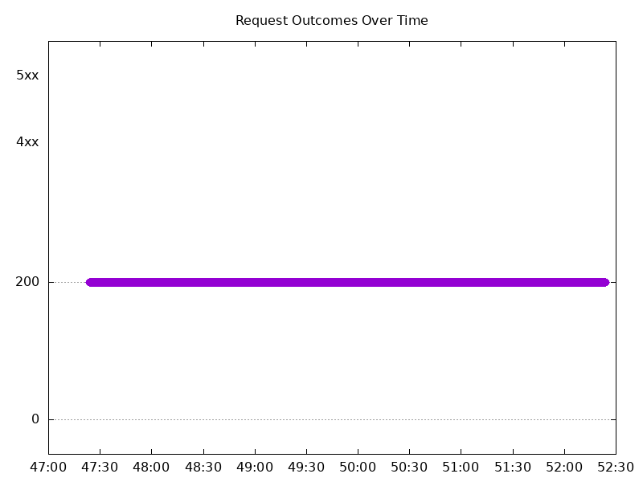
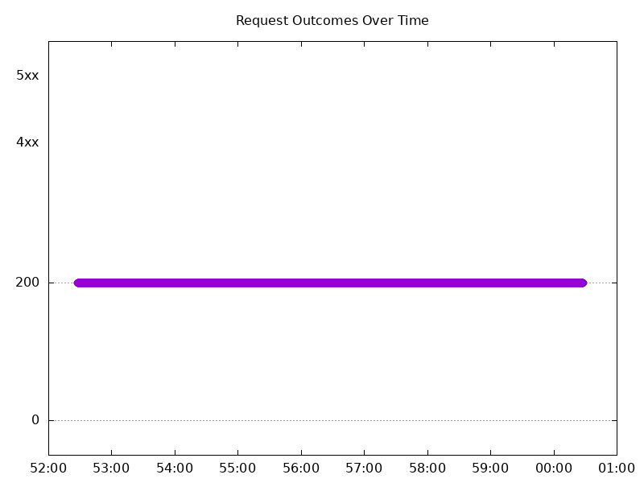
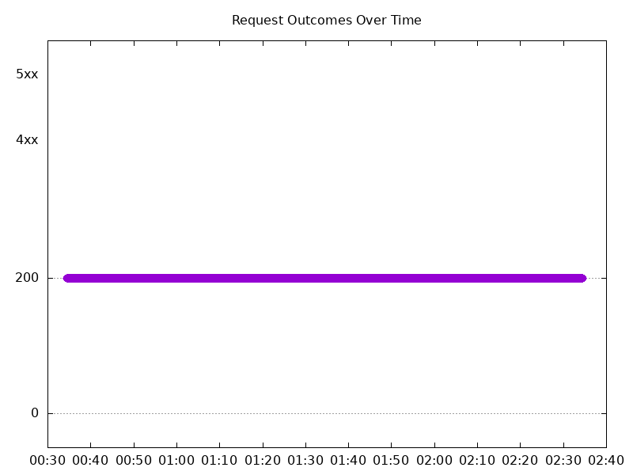
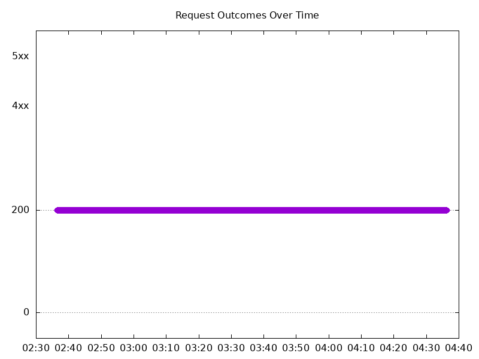
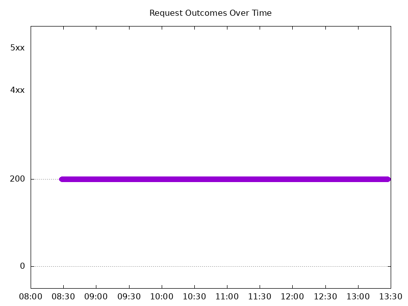
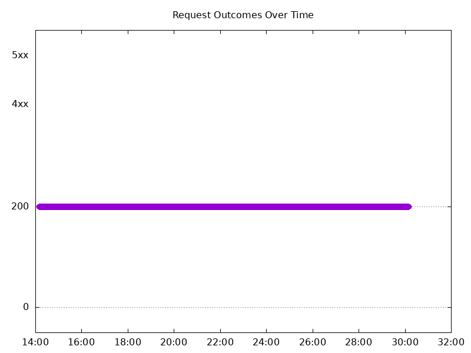
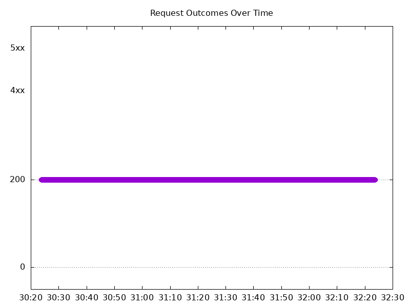
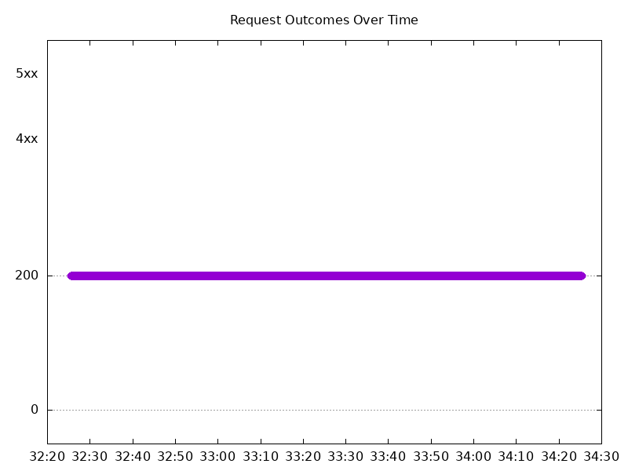

# Results

## Test environment

NGINX Plus: false

NGINX Gateway Fabric:

- Commit: 9fbef714ea22a35c4f1a8c97bd5b4e406ae0c1e9
- Date: 2025-10-21T10:57:37Z
- Dirty: false

GKE Cluster:

- Node count: 12
- k8s version: v1.33.5-gke.1080000
- vCPUs per node: 16
- RAM per node: 65851524Ki
- Max pods per node: 110
- Zone: us-west1-b
- Instance Type: n2d-standard-16

## One NGINX Pod runs per node Test Results

### Scale Up Gradually

#### Test: Send http /coffee traffic

```text
Requests      [total, rate, throughput]         30000, 100.00, 100.00
Duration      [total, attack, wait]             5m0s, 5m0s, 1.023ms
Latencies     [min, mean, 50, 90, 95, 99, max]  592.096µs, 1.141ms, 1.121ms, 1.36ms, 1.437ms, 1.764ms, 13.043ms
Bytes In      [total, mean]                     4806070, 160.20
Bytes Out     [total, mean]                     0, 0.00
Success       [ratio]                           100.00%
Status Codes  [code:count]                      200:30000  
Error Set:
```



#### Test: Send https /tea traffic

```text
Requests      [total, rate, throughput]         30000, 100.00, 100.00
Duration      [total, attack, wait]             5m0s, 5m0s, 1.046ms
Latencies     [min, mean, 50, 90, 95, 99, max]  623.382µs, 1.237ms, 1.213ms, 1.456ms, 1.539ms, 1.923ms, 13.245ms
Bytes In      [total, mean]                     4626014, 154.20
Bytes Out     [total, mean]                     0, 0.00
Success       [ratio]                           100.00%
Status Codes  [code:count]                      200:30000  
Error Set:
```


### Scale Down Gradually

#### Test: Send http /coffee traffic

```text
Requests      [total, rate, throughput]         48000, 100.00, 100.00
Duration      [total, attack, wait]             8m0s, 8m0s, 737.868µs
Latencies     [min, mean, 50, 90, 95, 99, max]  585.662µs, 1.166ms, 1.11ms, 1.35ms, 1.43ms, 1.679ms, 1.036s
Bytes In      [total, mean]                     7689575, 160.20
Bytes Out     [total, mean]                     0, 0.00
Success       [ratio]                           100.00%
Status Codes  [code:count]                      200:48000  
Error Set:
```



#### Test: Send https /tea traffic

```text
Requests      [total, rate, throughput]         48000, 100.00, 100.00
Duration      [total, attack, wait]             8m0s, 8m0s, 1.169ms
Latencies     [min, mean, 50, 90, 95, 99, max]  618.883µs, 1.214ms, 1.186ms, 1.424ms, 1.517ms, 1.811ms, 34.086ms
Bytes In      [total, mean]                     7401581, 154.20
Bytes Out     [total, mean]                     0, 0.00
Success       [ratio]                           100.00%
Status Codes  [code:count]                      200:48000  
Error Set:
```


### Scale Up Abruptly

#### Test: Send https /tea traffic

```text
Requests      [total, rate, throughput]         12000, 100.01, 100.01
Duration      [total, attack, wait]             2m0s, 2m0s, 1.179ms
Latencies     [min, mean, 50, 90, 95, 99, max]  629.496µs, 1.154ms, 1.127ms, 1.317ms, 1.386ms, 1.663ms, 59.679ms
Bytes In      [total, mean]                     1850428, 154.20
Bytes Out     [total, mean]                     0, 0.00
Success       [ratio]                           100.00%
Status Codes  [code:count]                      200:12000  
Error Set:
```


#### Test: Send http /coffee traffic

```text
Requests      [total, rate, throughput]         12000, 100.01, 100.01
Duration      [total, attack, wait]             2m0s, 2m0s, 1.962ms
Latencies     [min, mean, 50, 90, 95, 99, max]  566.08µs, 1.152ms, 1.126ms, 1.375ms, 1.462ms, 1.735ms, 61.502ms
Bytes In      [total, mean]                     1922394, 160.20
Bytes Out     [total, mean]                     0, 0.00
Success       [ratio]                           100.00%
Status Codes  [code:count]                      200:12000  
Error Set:
```



### Scale Down Abruptly

#### Test: Send http /coffee traffic

```text
Requests      [total, rate, throughput]         12000, 100.01, 100.01
Duration      [total, attack, wait]             2m0s, 2m0s, 1.288ms
Latencies     [min, mean, 50, 90, 95, 99, max]  568.924µs, 1.046ms, 1.044ms, 1.229ms, 1.279ms, 1.452ms, 23.729ms
Bytes In      [total, mean]                     1922357, 160.20
Bytes Out     [total, mean]                     0, 0.00
Success       [ratio]                           100.00%
Status Codes  [code:count]                      200:12000  
Error Set:
```



#### Test: Send https /tea traffic

```text
Requests      [total, rate, throughput]         12000, 100.01, 100.01
Duration      [total, attack, wait]             2m0s, 2m0s, 1.06ms
Latencies     [min, mean, 50, 90, 95, 99, max]  660.702µs, 1.149ms, 1.13ms, 1.297ms, 1.36ms, 1.589ms, 23.808ms
Bytes In      [total, mean]                     1850371, 154.20
Bytes Out     [total, mean]                     0, 0.00
Success       [ratio]                           100.00%
Status Codes  [code:count]                      200:12000  
Error Set:
```


## Multiple NGINX Pods run per node Test Results

### Scale Up Gradually

#### Test: Send http /coffee traffic

```text
Requests      [total, rate, throughput]         30000, 100.00, 100.00
Duration      [total, attack, wait]             5m0s, 5m0s, 1.166ms
Latencies     [min, mean, 50, 90, 95, 99, max]  607.656µs, 1.221ms, 1.162ms, 1.505ms, 1.646ms, 2.139ms, 36.577ms
Bytes In      [total, mean]                     4805940, 160.20
Bytes Out     [total, mean]                     0, 0.00
Success       [ratio]                           100.00%
Status Codes  [code:count]                      200:30000  
Error Set:
```


#### Test: Send https /tea traffic

```text
Requests      [total, rate, throughput]         30000, 100.00, 100.00
Duration      [total, attack, wait]             5m0s, 5m0s, 1.054ms
Latencies     [min, mean, 50, 90, 95, 99, max]  690.539µs, 1.305ms, 1.228ms, 1.574ms, 1.7ms, 2.287ms, 17.947ms
Bytes In      [total, mean]                     4625838, 154.19
Bytes Out     [total, mean]                     0, 0.00
Success       [ratio]                           100.00%
Status Codes  [code:count]                      200:30000  
Error Set:
```



### Scale Down Gradually

#### Test: Send http /coffee traffic

```text
Requests      [total, rate, throughput]         96000, 100.00, 100.00
Duration      [total, attack, wait]             16m0s, 16m0s, 1.317ms
Latencies     [min, mean, 50, 90, 95, 99, max]  594.473µs, 1.112ms, 1.102ms, 1.294ms, 1.365ms, 1.699ms, 41.689ms
Bytes In      [total, mean]                     15379382, 160.20
Bytes Out     [total, mean]                     0, 0.00
Success       [ratio]                           100.00%
Status Codes  [code:count]                      200:96000  
Error Set:
```



#### Test: Send https /tea traffic

```text
Requests      [total, rate, throughput]         96000, 100.00, 100.00
Duration      [total, attack, wait]             16m0s, 16m0s, 1.103ms
Latencies     [min, mean, 50, 90, 95, 99, max]  640.04µs, 1.188ms, 1.168ms, 1.371ms, 1.453ms, 1.785ms, 41.426ms
Bytes In      [total, mean]                     14803242, 154.20
Bytes Out     [total, mean]                     0, 0.00
Success       [ratio]                           100.00%
Status Codes  [code:count]                      200:96000  
Error Set:
```


### Scale Up Abruptly

#### Test: Send https /tea traffic

```text
Requests      [total, rate, throughput]         12000, 100.03, 100.03
Duration      [total, attack, wait]             2m0s, 2m0s, 1.134ms
Latencies     [min, mean, 50, 90, 95, 99, max]  663.551µs, 1.203ms, 1.169ms, 1.34ms, 1.394ms, 1.541ms, 106.432ms
Bytes In      [total, mean]                     1850430, 154.20
Bytes Out     [total, mean]                     0, 0.00
Success       [ratio]                           100.00%
Status Codes  [code:count]                      200:12000  
Error Set:
```



#### Test: Send http /coffee traffic

```text
Requests      [total, rate, throughput]         12000, 100.03, 100.03
Duration      [total, attack, wait]             2m0s, 2m0s, 1.25ms
Latencies     [min, mean, 50, 90, 95, 99, max]  594.934µs, 1.127ms, 1.108ms, 1.283ms, 1.337ms, 1.504ms, 32.039ms
Bytes In      [total, mean]                     1922429, 160.20
Bytes Out     [total, mean]                     0, 0.00
Success       [ratio]                           100.00%
Status Codes  [code:count]                      200:12000  
Error Set:
```


### Scale Down Abruptly

#### Test: Send https /tea traffic

```text
Requests      [total, rate, throughput]         12000, 100.01, 100.01
Duration      [total, attack, wait]             2m0s, 2m0s, 837.597µs
Latencies     [min, mean, 50, 90, 95, 99, max]  653.918µs, 1.178ms, 1.175ms, 1.346ms, 1.41ms, 1.608ms, 25.063ms
Bytes In      [total, mean]                     1850359, 154.20
Bytes Out     [total, mean]                     0, 0.00
Success       [ratio]                           100.00%
Status Codes  [code:count]                      200:12000  
Error Set:
```


#### Test: Send http /coffee traffic

```text
Requests      [total, rate, throughput]         12000, 100.01, 100.01
Duration      [total, attack, wait]             2m0s, 2m0s, 1.22ms
Latencies     [min, mean, 50, 90, 95, 99, max]  585.48µs, 1.082ms, 1.081ms, 1.255ms, 1.311ms, 1.473ms, 25.498ms
Bytes In      [total, mean]                     1922346, 160.20
Bytes Out     [total, mean]                     0, 0.00
Success       [ratio]                           100.00%
Status Codes  [code:count]                      200:12000  
Error Set:
```


