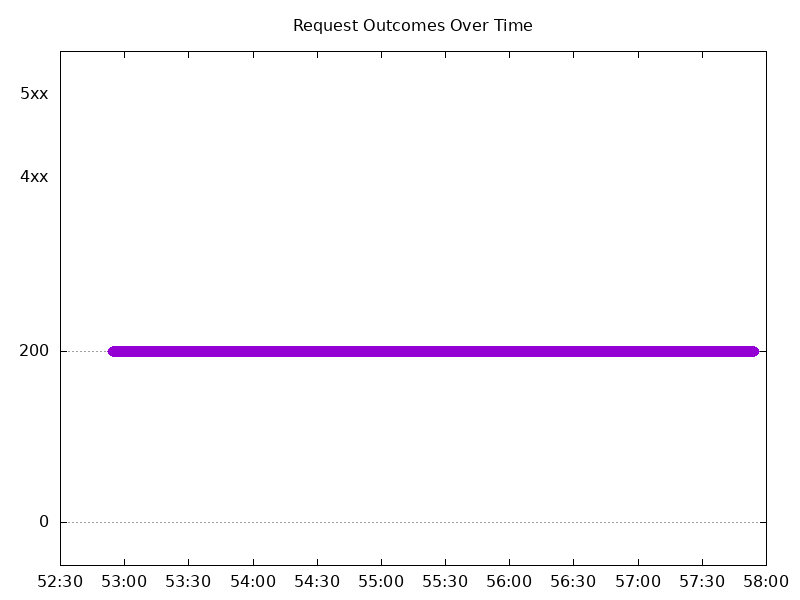
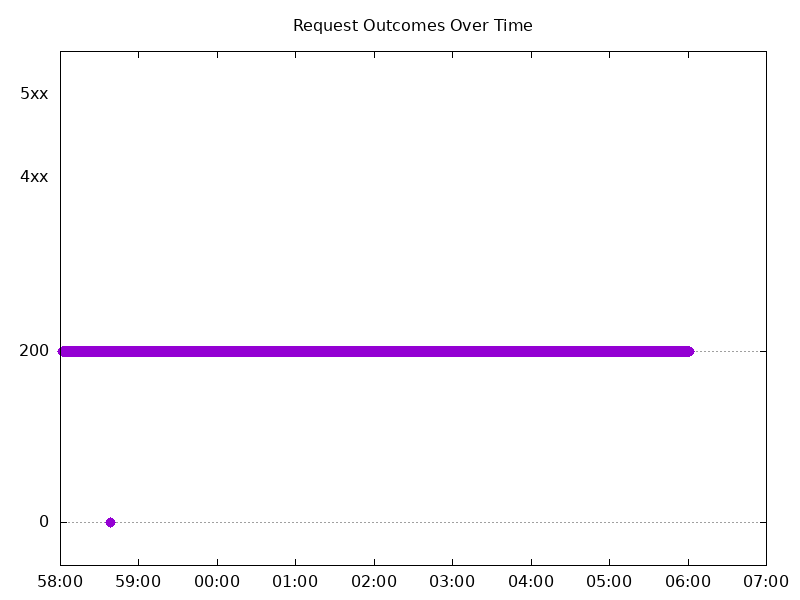
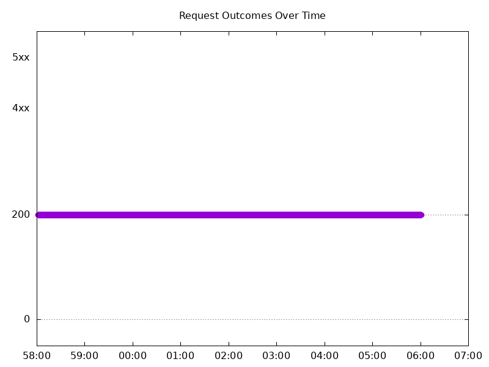
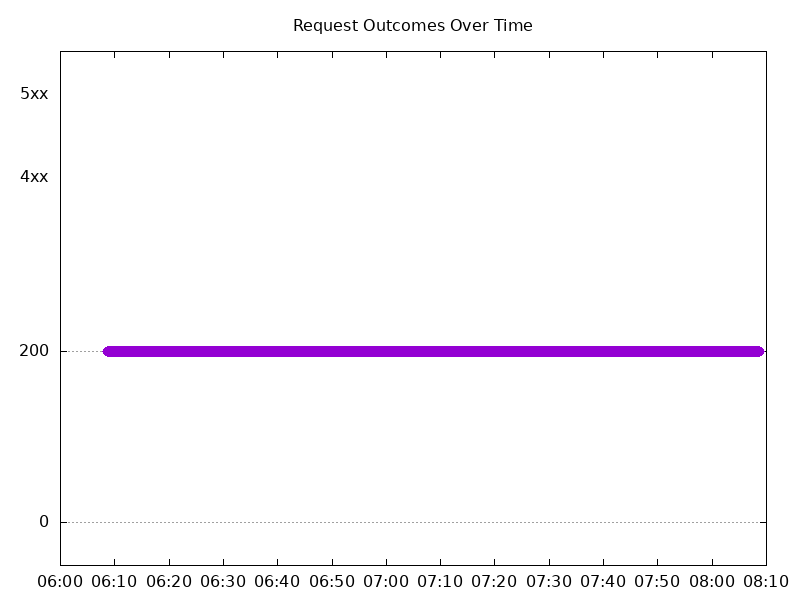
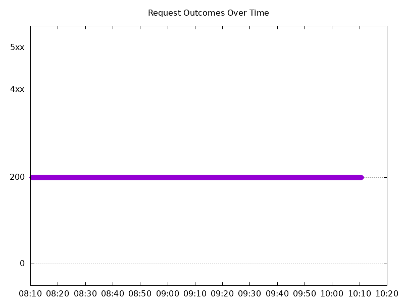
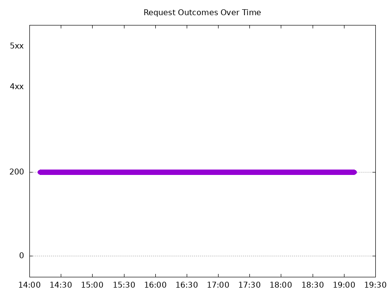
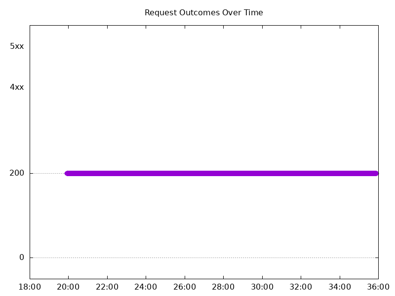
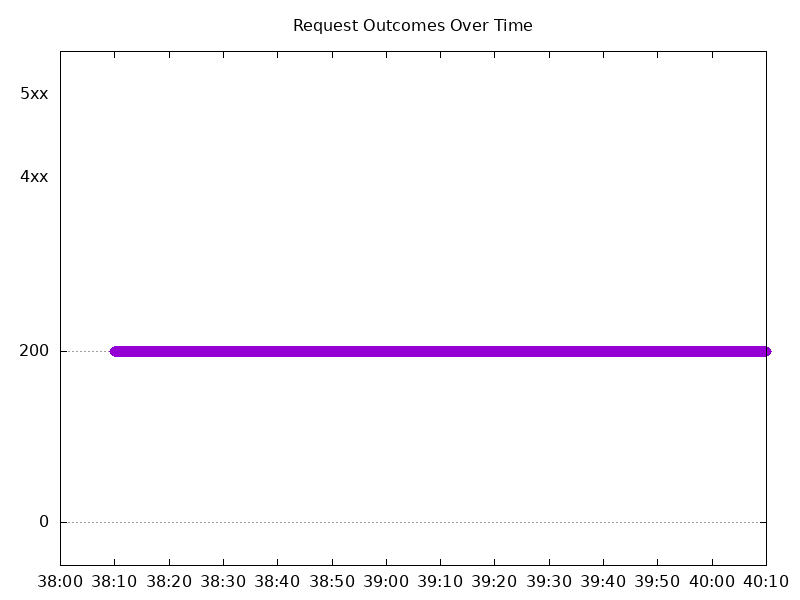

# Results

## Test environment

NGINX Plus: true

NGINX Gateway Fabric:

- Commit: 9fbef714ea22a35c4f1a8c97bd5b4e406ae0c1e9
- Date: 2025-10-21T10:57:37Z
- Dirty: false

GKE Cluster:

- Node count: 12
- k8s version: v1.33.5-gke.1080000
- vCPUs per node: 16
- RAM per node: 65851524Ki
- Max pods per node: 110
- Zone: us-west1-b
- Instance Type: n2d-standard-16

## One NGINX Pod runs per node Test Results

### Scale Up Gradually

#### Test: Send http /coffee traffic

```text
Requests      [total, rate, throughput]         30000, 100.00, 100.00
Duration      [total, attack, wait]             5m0s, 5m0s, 1.426ms
Latencies     [min, mean, 50, 90, 95, 99, max]  696.349µs, 1.211ms, 1.2ms, 1.384ms, 1.458ms, 1.744ms, 17.023ms
Bytes In      [total, mean]                     4776047, 159.20
Bytes Out     [total, mean]                     0, 0.00
Success       [ratio]                           100.00%
Status Codes  [code:count]                      200:30000  
Error Set:
```


#### Test: Send https /tea traffic

```text
Requests      [total, rate, throughput]         30000, 100.00, 100.00
Duration      [total, attack, wait]             5m0s, 5m0s, 1.894ms
Latencies     [min, mean, 50, 90, 95, 99, max]  678.401µs, 1.262ms, 1.246ms, 1.426ms, 1.506ms, 1.781ms, 17.338ms
Bytes In      [total, mean]                     4595937, 153.20
Bytes Out     [total, mean]                     0, 0.00
Success       [ratio]                           100.00%
Status Codes  [code:count]                      200:30000  
Error Set:
```



### Scale Down Gradually

#### Test: Send http /coffee traffic

```text
Requests      [total, rate, throughput]         48000, 100.00, 100.00
Duration      [total, attack, wait]             8m0s, 8m0s, 1.299ms
Latencies     [min, mean, 50, 90, 95, 99, max]  659.541µs, 1.374ms, 1.309ms, 1.655ms, 1.76ms, 1.992ms, 250.434ms
Bytes In      [total, mean]                     7641307, 159.19
Bytes Out     [total, mean]                     0, 0.00
Success       [ratio]                           100.00%
Status Codes  [code:count]                      0:1  200:47999  
Error Set:
Get "http://cafe.example.com/coffee": dial tcp 0.0.0.0:0->10.138.0.92:80: connect: network is unreachable
```



#### Test: Send https /tea traffic

```text
Requests      [total, rate, throughput]         48000, 100.00, 100.00
Duration      [total, attack, wait]             8m0s, 8m0s, 1.301ms
Latencies     [min, mean, 50, 90, 95, 99, max]  758.883µs, 1.422ms, 1.343ms, 1.682ms, 1.781ms, 2.052ms, 250.731ms
Bytes In      [total, mean]                     7353607, 153.20
Bytes Out     [total, mean]                     0, 0.00
Success       [ratio]                           100.00%
Status Codes  [code:count]                      200:48000  
Error Set:
```



### Scale Up Abruptly

#### Test: Send https /tea traffic

```text
Requests      [total, rate, throughput]         12000, 100.01, 100.01
Duration      [total, attack, wait]             2m0s, 2m0s, 1.168ms
Latencies     [min, mean, 50, 90, 95, 99, max]  757.428µs, 1.293ms, 1.272ms, 1.441ms, 1.503ms, 1.695ms, 61.896ms
Bytes In      [total, mean]                     1838384, 153.20
Bytes Out     [total, mean]                     0, 0.00
Success       [ratio]                           100.00%
Status Codes  [code:count]                      200:12000  
Error Set:
```


#### Test: Send http /coffee traffic

```text
Requests      [total, rate, throughput]         12000, 100.01, 100.01
Duration      [total, attack, wait]             2m0s, 2m0s, 1.297ms
Latencies     [min, mean, 50, 90, 95, 99, max]  727.622µs, 1.239ms, 1.227ms, 1.4ms, 1.454ms, 1.648ms, 61.895ms
Bytes In      [total, mean]                     1910476, 159.21
Bytes Out     [total, mean]                     0, 0.00
Success       [ratio]                           100.00%
Status Codes  [code:count]                      200:12000  
Error Set:
```



### Scale Down Abruptly

#### Test: Send https /tea traffic

```text
Requests      [total, rate, throughput]         12000, 100.01, 100.01
Duration      [total, attack, wait]             2m0s, 2m0s, 1.312ms
Latencies     [min, mean, 50, 90, 95, 99, max]  747.968µs, 1.299ms, 1.285ms, 1.459ms, 1.521ms, 1.666ms, 25.442ms
Bytes In      [total, mean]                     1838381, 153.20
Bytes Out     [total, mean]                     0, 0.00
Success       [ratio]                           100.00%
Status Codes  [code:count]                      200:12000  
Error Set:
```



#### Test: Send http /coffee traffic

```text
Requests      [total, rate, throughput]         12000, 100.01, 100.01
Duration      [total, attack, wait]             2m0s, 2m0s, 1.465ms
Latencies     [min, mean, 50, 90, 95, 99, max]  731.346µs, 1.24ms, 1.235ms, 1.412ms, 1.474ms, 1.635ms, 25.212ms
Bytes In      [total, mean]                     1910387, 159.20
Bytes Out     [total, mean]                     0, 0.00
Success       [ratio]                           100.00%
Status Codes  [code:count]                      200:12000  
Error Set:
```


## Multiple NGINX Pods run per node Test Results

### Scale Up Gradually

#### Test: Send https /tea traffic

```text
Requests      [total, rate, throughput]         30000, 100.00, 100.00
Duration      [total, attack, wait]             5m0s, 5m0s, 1.263ms
Latencies     [min, mean, 50, 90, 95, 99, max]  707.129µs, 1.269ms, 1.258ms, 1.425ms, 1.491ms, 1.866ms, 26.038ms
Bytes In      [total, mean]                     4596034, 153.20
Bytes Out     [total, mean]                     0, 0.00
Success       [ratio]                           100.00%
Status Codes  [code:count]                      200:30000  
Error Set:
```


#### Test: Send http /coffee traffic

```text
Requests      [total, rate, throughput]         30000, 100.00, 100.00
Duration      [total, attack, wait]             5m0s, 5m0s, 959.384µs
Latencies     [min, mean, 50, 90, 95, 99, max]  657.946µs, 1.222ms, 1.215ms, 1.382ms, 1.443ms, 1.784ms, 23.305ms
Bytes In      [total, mean]                     4776015, 159.20
Bytes Out     [total, mean]                     0, 0.00
Success       [ratio]                           100.00%
Status Codes  [code:count]                      200:30000  
Error Set:
```



### Scale Down Gradually

#### Test: Send http /coffee traffic

```text
Requests      [total, rate, throughput]         96000, 100.00, 100.00
Duration      [total, attack, wait]             16m0s, 16m0s, 1.274ms
Latencies     [min, mean, 50, 90, 95, 99, max]  681.455µs, 1.213ms, 1.206ms, 1.368ms, 1.425ms, 1.687ms, 43.825ms
Bytes In      [total, mean]                     15283157, 159.20
Bytes Out     [total, mean]                     0, 0.00
Success       [ratio]                           100.00%
Status Codes  [code:count]                      200:96000  
Error Set:
```



#### Test: Send https /tea traffic

```text
Requests      [total, rate, throughput]         96000, 100.00, 100.00
Duration      [total, attack, wait]             16m0s, 16m0s, 1.154ms
Latencies     [min, mean, 50, 90, 95, 99, max]  706.001µs, 1.242ms, 1.231ms, 1.394ms, 1.454ms, 1.742ms, 66.449ms
Bytes In      [total, mean]                     14707235, 153.20
Bytes Out     [total, mean]                     0, 0.00
Success       [ratio]                           100.00%
Status Codes  [code:count]                      200:96000  
Error Set:
```


### Scale Up Abruptly

#### Test: Send https /tea traffic

```text
Requests      [total, rate, throughput]         12000, 100.01, 100.01
Duration      [total, attack, wait]             2m0s, 2m0s, 1.182ms
Latencies     [min, mean, 50, 90, 95, 99, max]  757.525µs, 1.293ms, 1.247ms, 1.407ms, 1.464ms, 1.67ms, 117.053ms
Bytes In      [total, mean]                     1838423, 153.20
Bytes Out     [total, mean]                     0, 0.00
Success       [ratio]                           100.00%
Status Codes  [code:count]                      200:12000  
Error Set:
```


#### Test: Send http /coffee traffic

```text
Requests      [total, rate, throughput]         12000, 100.01, 100.01
Duration      [total, attack, wait]             2m0s, 2m0s, 1.197ms
Latencies     [min, mean, 50, 90, 95, 99, max]  716.034µs, 1.253ms, 1.214ms, 1.377ms, 1.432ms, 1.711ms, 117.41ms
Bytes In      [total, mean]                     1910335, 159.19
Bytes Out     [total, mean]                     0, 0.00
Success       [ratio]                           100.00%
Status Codes  [code:count]                      200:12000  
Error Set:
```


### Scale Down Abruptly

#### Test: Send https /tea traffic

```text
Requests      [total, rate, throughput]         12000, 100.01, 100.01
Duration      [total, attack, wait]             2m0s, 2m0s, 1.277ms
Latencies     [min, mean, 50, 90, 95, 99, max]  729.233µs, 1.245ms, 1.233ms, 1.398ms, 1.46ms, 1.702ms, 41.318ms
Bytes In      [total, mean]                     1838383, 153.20
Bytes Out     [total, mean]                     0, 0.00
Success       [ratio]                           100.00%
Status Codes  [code:count]                      200:12000  
Error Set:
```



#### Test: Send http /coffee traffic

```text
Requests      [total, rate, throughput]         12000, 100.01, 100.01
Duration      [total, attack, wait]             2m0s, 2m0s, 1.36ms
Latencies     [min, mean, 50, 90, 95, 99, max]  719.887µs, 1.201ms, 1.201ms, 1.363ms, 1.422ms, 1.622ms, 34.401ms
Bytes In      [total, mean]                     1910414, 159.20
Bytes Out     [total, mean]                     0, 0.00
Success       [ratio]                           100.00%
Status Codes  [code:count]                      200:12000  
Error Set:
```


