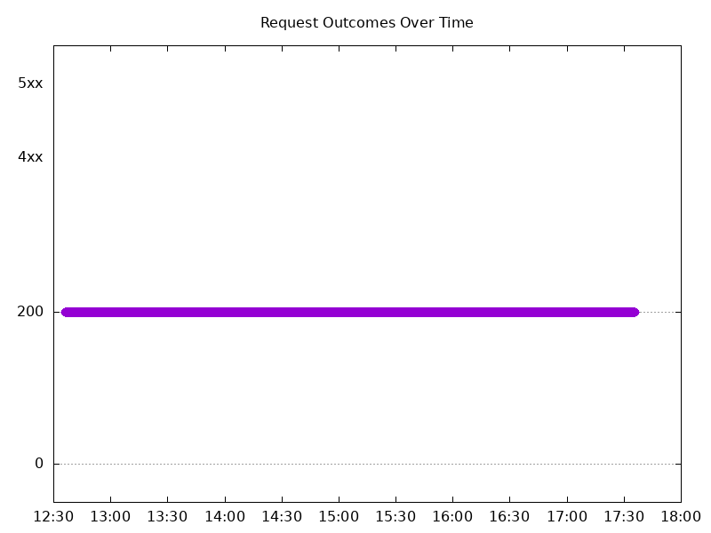
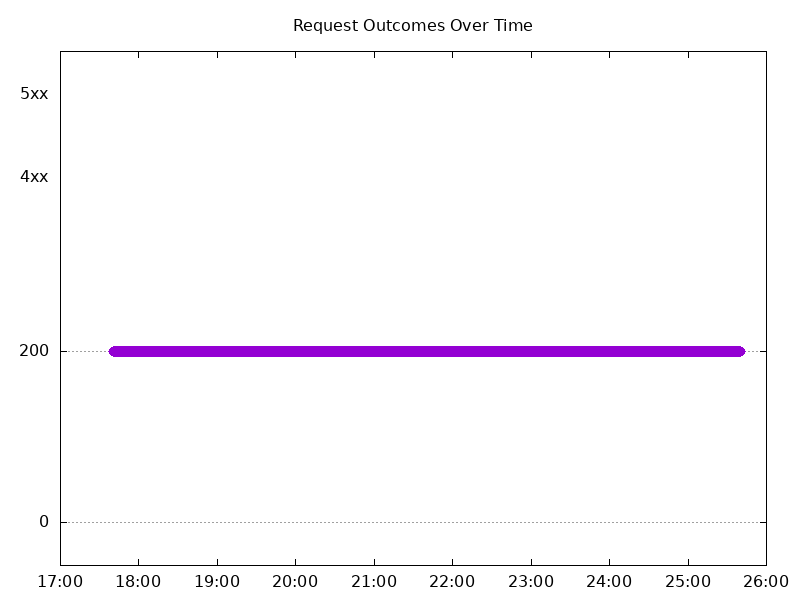
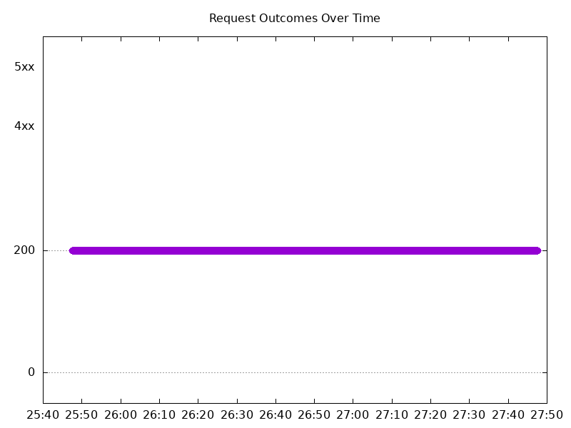
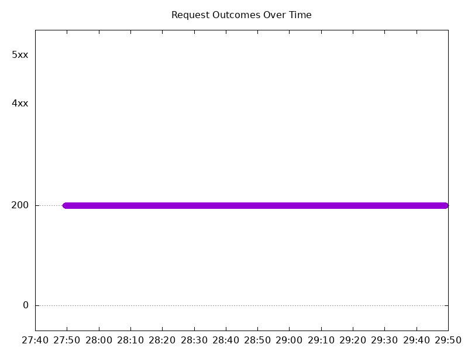
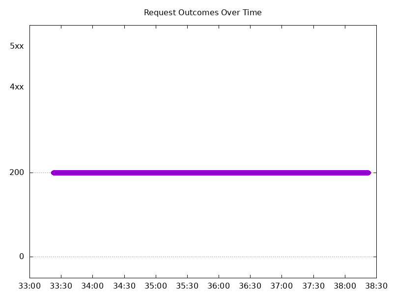
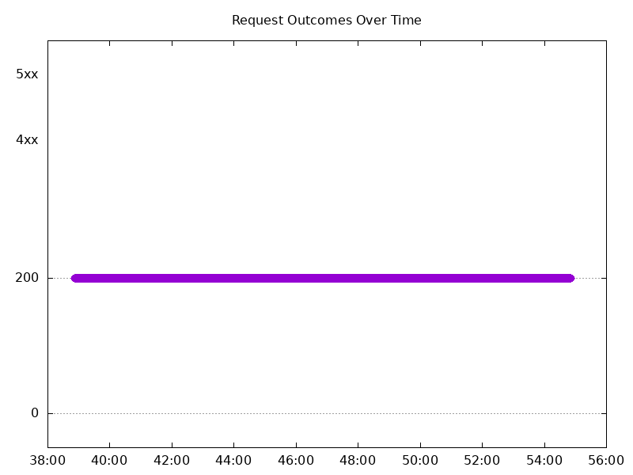
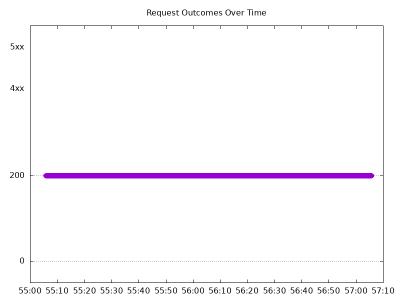
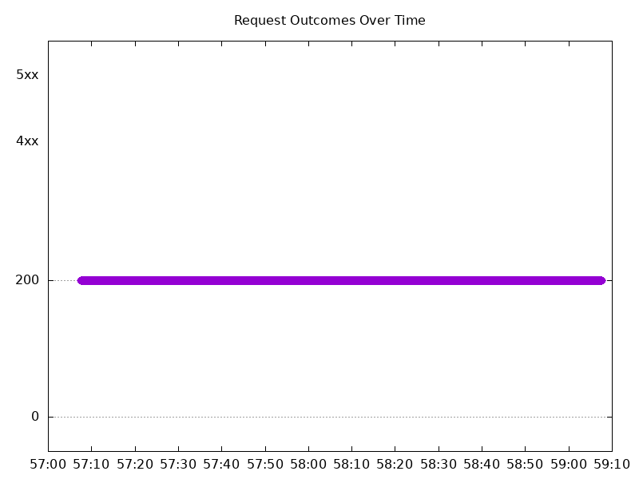

# Results

## Test environment

NGINX Plus: false

NGINX Gateway Fabric:

- Commit: 89aee48bf6e660a828ffd32ca35fc7f52e358e00
- Date: 2025-12-12T20:04:38Z
- Dirty: false

GKE Cluster:

- Node count: 12
- k8s version: v1.33.5-gke.1308000
- vCPUs per node: 16
- RAM per node: 65851520Ki
- Max pods per node: 110
- Zone: us-west1-b
- Instance Type: n2d-standard-16

## Summary:

- Latency increase overall

## One NGINX Pod runs per node Test Results

### Scale Up Gradually

#### Test: Send https /tea traffic

```text
Requests      [total, rate, throughput]         30000, 100.00, 100.00
Duration      [total, attack, wait]             5m0s, 5m0s, 1.464ms
Latencies     [min, mean, 50, 90, 95, 99, max]  779.563µs, 1.456ms, 1.396ms, 1.698ms, 1.815ms, 2.282ms, 44.725ms
Bytes In      [total, mean]                     4595990, 153.20
Bytes Out     [total, mean]                     0, 0.00
Success       [ratio]                           100.00%
Status Codes  [code:count]                      200:30000  
Error Set:
```


#### Test: Send http /coffee traffic

```text
Requests      [total, rate, throughput]         30000, 100.00, 100.00
Duration      [total, attack, wait]             5m0s, 5m0s, 1.298ms
Latencies     [min, mean, 50, 90, 95, 99, max]  720.788µs, 1.387ms, 1.339ms, 1.639ms, 1.763ms, 2.216ms, 27.813ms
Bytes In      [total, mean]                     4776056, 159.20
Bytes Out     [total, mean]                     0, 0.00
Success       [ratio]                           100.00%
Status Codes  [code:count]                      200:30000  
Error Set:
```



### Scale Down Gradually

#### Test: Send http /coffee traffic

```text
Requests      [total, rate, throughput]         48000, 100.00, 100.00
Duration      [total, attack, wait]             8m0s, 8m0s, 955.665µs
Latencies     [min, mean, 50, 90, 95, 99, max]  747.455µs, 1.321ms, 1.321ms, 1.5ms, 1.566ms, 1.823ms, 41.076ms
Bytes In      [total, mean]                     7641697, 159.20
Bytes Out     [total, mean]                     0, 0.00
Success       [ratio]                           100.00%
Status Codes  [code:count]                      200:48000  
Error Set:
```



#### Test: Send https /tea traffic

```text
Requests      [total, rate, throughput]         48000, 100.00, 100.00
Duration      [total, attack, wait]             8m0s, 8m0s, 1.426ms
Latencies     [min, mean, 50, 90, 95, 99, max]  787.618µs, 1.39ms, 1.376ms, 1.556ms, 1.623ms, 1.955ms, 40.524ms
Bytes In      [total, mean]                     7353670, 153.20
Bytes Out     [total, mean]                     0, 0.00
Success       [ratio]                           100.00%
Status Codes  [code:count]                      200:48000  
Error Set:
```


### Scale Up Abruptly

#### Test: Send http /coffee traffic

```text
Requests      [total, rate, throughput]         12000, 100.01, 100.01
Duration      [total, attack, wait]             2m0s, 2m0s, 1.348ms
Latencies     [min, mean, 50, 90, 95, 99, max]  741.955µs, 1.33ms, 1.321ms, 1.521ms, 1.591ms, 1.851ms, 59.155ms
Bytes In      [total, mean]                     1910356, 159.20
Bytes Out     [total, mean]                     0, 0.00
Success       [ratio]                           100.00%
Status Codes  [code:count]                      200:12000  
Error Set:
```



#### Test: Send https /tea traffic

```text
Requests      [total, rate, throughput]         12000, 100.01, 100.01
Duration      [total, attack, wait]             2m0s, 2m0s, 1.518ms
Latencies     [min, mean, 50, 90, 95, 99, max]  819.53µs, 1.415ms, 1.384ms, 1.6ms, 1.687ms, 1.98ms, 59.923ms
Bytes In      [total, mean]                     1838355, 153.20
Bytes Out     [total, mean]                     0, 0.00
Success       [ratio]                           100.00%
Status Codes  [code:count]                      200:12000  
Error Set:
```


### Scale Down Abruptly

#### Test: Send https /tea traffic

```text
Requests      [total, rate, throughput]         12000, 100.01, 100.01
Duration      [total, attack, wait]             2m0s, 2m0s, 1.512ms
Latencies     [min, mean, 50, 90, 95, 99, max]  809.533µs, 1.362ms, 1.349ms, 1.52ms, 1.58ms, 1.761ms, 12.114ms
Bytes In      [total, mean]                     1838386, 153.20
Bytes Out     [total, mean]                     0, 0.00
Success       [ratio]                           100.00%
Status Codes  [code:count]                      200:12000  
Error Set:
```


#### Test: Send http /coffee traffic

```text
Requests      [total, rate, throughput]         12000, 100.01, 100.01
Duration      [total, attack, wait]             2m0s, 2m0s, 1.339ms
Latencies     [min, mean, 50, 90, 95, 99, max]  783.615µs, 1.301ms, 1.307ms, 1.483ms, 1.543ms, 1.703ms, 7.6ms
Bytes In      [total, mean]                     1910421, 159.20
Bytes Out     [total, mean]                     0, 0.00
Success       [ratio]                           100.00%
Status Codes  [code:count]                      200:12000  
Error Set:
```



## Multiple NGINX Pods run per node Test Results

### Scale Up Gradually

#### Test: Send https /tea traffic

```text
Requests      [total, rate, throughput]         30000, 100.00, 100.00
Duration      [total, attack, wait]             5m0s, 5m0s, 1.537ms
Latencies     [min, mean, 50, 90, 95, 99, max]  744.494µs, 1.356ms, 1.326ms, 1.534ms, 1.622ms, 2.045ms, 36.468ms
Bytes In      [total, mean]                     4626044, 154.20
Bytes Out     [total, mean]                     0, 0.00
Success       [ratio]                           100.00%
Status Codes  [code:count]                      200:30000  
Error Set:
```



#### Test: Send http /coffee traffic

```text
Requests      [total, rate, throughput]         30000, 100.00, 100.00
Duration      [total, attack, wait]             5m0s, 5m0s, 1.319ms
Latencies     [min, mean, 50, 90, 95, 99, max]  703.359µs, 1.298ms, 1.284ms, 1.477ms, 1.555ms, 1.991ms, 32.196ms
Bytes In      [total, mean]                     4796995, 159.90
Bytes Out     [total, mean]                     0, 0.00
Success       [ratio]                           100.00%
Status Codes  [code:count]                      200:30000  
Error Set:
```


### Scale Down Gradually

#### Test: Send http /coffee traffic

```text
Requests      [total, rate, throughput]         96000, 100.00, 100.00
Duration      [total, attack, wait]             16m0s, 16m0s, 1.55ms
Latencies     [min, mean, 50, 90, 95, 99, max]  693.199µs, 1.306ms, 1.293ms, 1.494ms, 1.571ms, 1.875ms, 45.651ms
Bytes In      [total, mean]                     15350348, 159.90
Bytes Out     [total, mean]                     0, 0.00
Success       [ratio]                           100.00%
Status Codes  [code:count]                      200:96000  
Error Set:
```



#### Test: Send https /tea traffic

```text
Requests      [total, rate, throughput]         96000, 100.00, 100.00
Duration      [total, attack, wait]             16m0s, 16m0s, 1.528ms
Latencies     [min, mean, 50, 90, 95, 99, max]  757.281µs, 1.362ms, 1.339ms, 1.534ms, 1.616ms, 1.946ms, 47.495ms
Bytes In      [total, mean]                     14803358, 154.20
Bytes Out     [total, mean]                     0, 0.00
Success       [ratio]                           100.00%
Status Codes  [code:count]                      200:96000  
Error Set:
```


### Scale Up Abruptly

#### Test: Send https /tea traffic

```text
Requests      [total, rate, throughput]         12000, 100.01, 100.01
Duration      [total, attack, wait]             2m0s, 2m0s, 1.309ms
Latencies     [min, mean, 50, 90, 95, 99, max]  811.146µs, 1.421ms, 1.359ms, 1.566ms, 1.64ms, 1.938ms, 127.273ms
Bytes In      [total, mean]                     1850483, 154.21
Bytes Out     [total, mean]                     0, 0.00
Success       [ratio]                           100.00%
Status Codes  [code:count]                      200:12000  
Error Set:
```


#### Test: Send http /coffee traffic

```text
Requests      [total, rate, throughput]         12000, 100.01, 100.01
Duration      [total, attack, wait]             2m0s, 2m0s, 1.152ms
Latencies     [min, mean, 50, 90, 95, 99, max]  733.236µs, 1.328ms, 1.294ms, 1.47ms, 1.528ms, 1.77ms, 127.086ms
Bytes In      [total, mean]                     1918812, 159.90
Bytes Out     [total, mean]                     0, 0.00
Success       [ratio]                           100.00%
Status Codes  [code:count]                      200:12000  
Error Set:
```



### Scale Down Abruptly

#### Test: Send https /tea traffic

```text
Requests      [total, rate, throughput]         12000, 100.01, 100.01
Duration      [total, attack, wait]             2m0s, 2m0s, 1.285ms
Latencies     [min, mean, 50, 90, 95, 99, max]  789.904µs, 1.417ms, 1.362ms, 1.551ms, 1.622ms, 1.859ms, 217.854ms
Bytes In      [total, mean]                     1850381, 154.20
Bytes Out     [total, mean]                     0, 0.00
Success       [ratio]                           100.00%
Status Codes  [code:count]                      200:12000  
Error Set:
```


#### Test: Send http /coffee traffic

```text
Requests      [total, rate, throughput]         12000, 100.01, 100.01
Duration      [total, attack, wait]             2m0s, 2m0s, 1.336ms
Latencies     [min, mean, 50, 90, 95, 99, max]  762.121µs, 1.374ms, 1.332ms, 1.52ms, 1.59ms, 1.818ms, 217.464ms
Bytes In      [total, mean]                     1918767, 159.90
Bytes Out     [total, mean]                     0, 0.00
Success       [ratio]                           100.00%
Status Codes  [code:count]                      200:12000  
Error Set:
```


