# Results

## Test environment

NGINX Plus: true

NGINX Gateway Fabric:

- Commit: 89aee48bf6e660a828ffd32ca35fc7f52e358e00
- Date: 2025-12-12T20:04:38Z
- Dirty: false

GKE Cluster:

- Node count: 12
- k8s version: v1.33.5-gke.1308000
- vCPUs per node: 16
- RAM per node: 65851520Ki
- Max pods per node: 110
- Zone: us-west1-b
- Instance Type: n2d-standard-16

## Summary:

- Sections of dropped traffic when abruptly scaling with NGINX Plus. These weren't present in the most recent `edge` run, so could be intermittent one-off.
- Latency increase overall

## One NGINX Pod runs per node Test Results

### Scale Up Gradually

#### Test: Send https /tea traffic

```text
Requests      [total, rate, throughput]         30000, 100.00, 100.00
Duration      [total, attack, wait]             5m0s, 5m0s, 991.258µs
Latencies     [min, mean, 50, 90, 95, 99, max]  680.726µs, 1.238ms, 1.228ms, 1.438ms, 1.517ms, 1.798ms, 22.376ms
Bytes In      [total, mean]                     4626086, 154.20
Bytes Out     [total, mean]                     0, 0.00
Success       [ratio]                           100.00%
Status Codes  [code:count]                      200:30000  
Error Set:
```


#### Test: Send http /coffee traffic

```text
Requests      [total, rate, throughput]         30000, 100.00, 100.00
Duration      [total, attack, wait]             5m0s, 5m0s, 1.197ms
Latencies     [min, mean, 50, 90, 95, 99, max]  659.439µs, 1.179ms, 1.174ms, 1.378ms, 1.445ms, 1.678ms, 21.74ms
Bytes In      [total, mean]                     4802954, 160.10
Bytes Out     [total, mean]                     0, 0.00
Success       [ratio]                           100.00%
Status Codes  [code:count]                      200:30000  
Error Set:
```

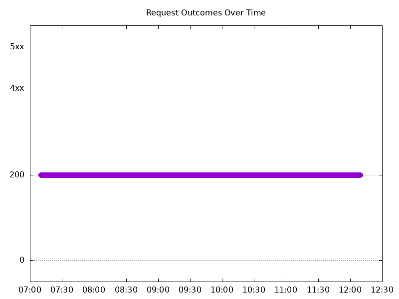

### Scale Down Gradually

#### Test: Send http /coffee traffic

```text
Requests      [total, rate, throughput]         48000, 100.00, 100.00
Duration      [total, attack, wait]             8m0s, 8m0s, 1.573ms
Latencies     [min, mean, 50, 90, 95, 99, max]  631.557µs, 1.237ms, 1.223ms, 1.455ms, 1.534ms, 1.77ms, 36.655ms
Bytes In      [total, mean]                     7684890, 160.10
Bytes Out     [total, mean]                     0, 0.00
Success       [ratio]                           100.00%
Status Codes  [code:count]                      200:48000  
Error Set:
```

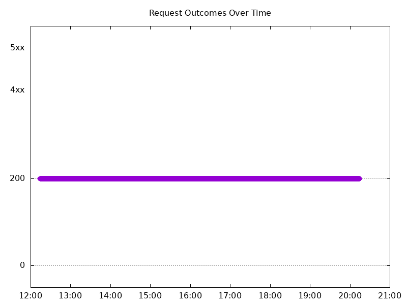

#### Test: Send https /tea traffic

```text
Requests      [total, rate, throughput]         48000, 100.00, 100.00
Duration      [total, attack, wait]             8m0s, 8m0s, 1.786ms
Latencies     [min, mean, 50, 90, 95, 99, max]  698.854µs, 1.291ms, 1.271ms, 1.512ms, 1.593ms, 1.823ms, 39.156ms
Bytes In      [total, mean]                     7401761, 154.20
Bytes Out     [total, mean]                     0, 0.00
Success       [ratio]                           100.00%
Status Codes  [code:count]                      200:48000  
Error Set:
```


### Scale Up Abruptly

#### Test: Send http /coffee traffic

```text
Requests      [total, rate, throughput]         12000, 100.01, 83.34
Duration      [total, attack, wait]             2m0s, 2m0s, 1.401ms
Latencies     [min, mean, 50, 90, 95, 99, max]  482.708µs, 1.184ms, 1.233ms, 1.504ms, 1.583ms, 1.809ms, 11.639ms
Bytes In      [total, mean]                     1901033, 158.42
Bytes Out     [total, mean]                     0, 0.00
Success       [ratio]                           83.33%
Status Codes  [code:count]                      200:10000  502:2000  
Error Set:
502 Bad Gateway
```

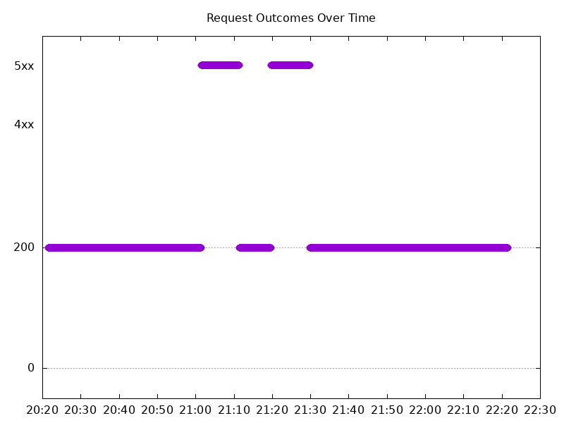

#### Test: Send https /tea traffic

```text
Requests      [total, rate, throughput]         12000, 100.01, 100.01
Duration      [total, attack, wait]             2m0s, 2m0s, 1.151ms
Latencies     [min, mean, 50, 90, 95, 99, max]  730.737µs, 1.306ms, 1.283ms, 1.547ms, 1.635ms, 1.846ms, 11.673ms
Bytes In      [total, mean]                     1850415, 154.20
Bytes Out     [total, mean]                     0, 0.00
Success       [ratio]                           100.00%
Status Codes  [code:count]                      200:12000  
Error Set:
```

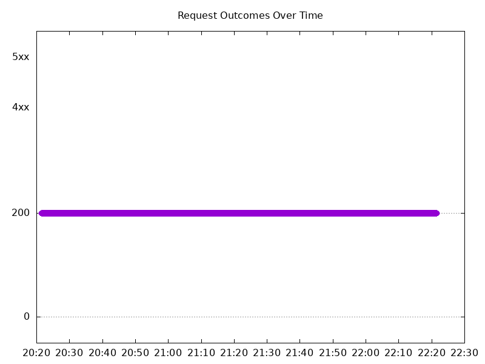

### Scale Down Abruptly

#### Test: Send https /tea traffic

```text
Requests      [total, rate, throughput]         12000, 100.01, 100.01
Duration      [total, attack, wait]             2m0s, 2m0s, 1.598ms
Latencies     [min, mean, 50, 90, 95, 99, max]  787.786µs, 1.412ms, 1.386ms, 1.64ms, 1.711ms, 1.91ms, 59.855ms
Bytes In      [total, mean]                     1850435, 154.20
Bytes Out     [total, mean]                     0, 0.00
Success       [ratio]                           100.00%
Status Codes  [code:count]                      200:12000  
Error Set:
```

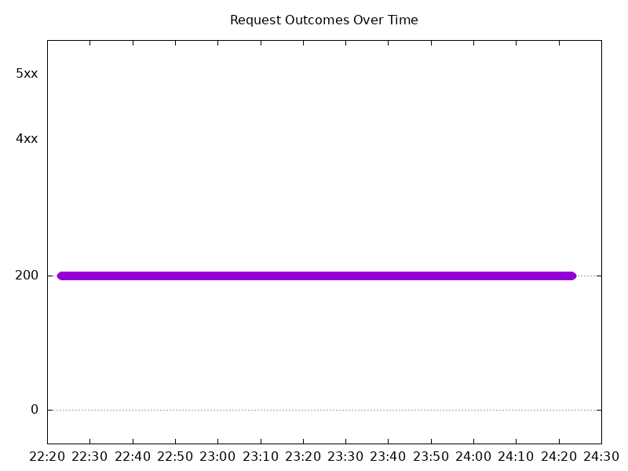

#### Test: Send http /coffee traffic

```text
Requests      [total, rate, throughput]         12000, 100.01, 92.18
Duration      [total, attack, wait]             2m0s, 2m0s, 1.36ms
Latencies     [min, mean, 50, 90, 95, 99, max]  507.819µs, 1.281ms, 1.294ms, 1.57ms, 1.652ms, 1.833ms, 60.126ms
Bytes In      [total, mean]                     1911756, 159.31
Bytes Out     [total, mean]                     0, 0.00
Success       [ratio]                           92.17%
Status Codes  [code:count]                      200:11061  502:939  
Error Set:
502 Bad Gateway
```

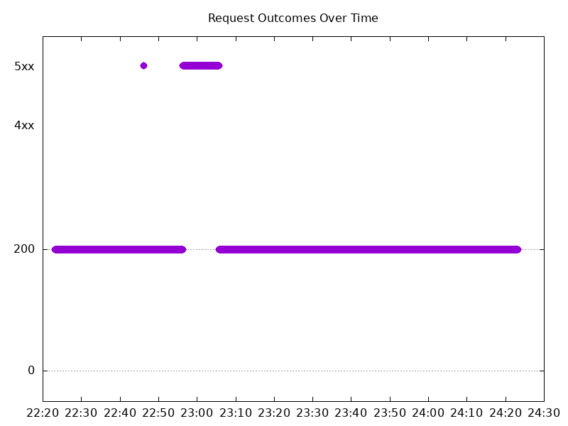

## Multiple NGINX Pods run per node Test Results

### Scale Up Gradually

#### Test: Send http /coffee traffic

```text
Requests      [total, rate, throughput]         30000, 100.00, 100.00
Duration      [total, attack, wait]             5m0s, 5m0s, 1.43ms
Latencies     [min, mean, 50, 90, 95, 99, max]  647.201µs, 1.171ms, 1.161ms, 1.359ms, 1.43ms, 1.767ms, 26.335ms
Bytes In      [total, mean]                     4818099, 160.60
Bytes Out     [total, mean]                     0, 0.00
Success       [ratio]                           100.00%
Status Codes  [code:count]                      200:30000  
Error Set:
```


#### Test: Send https /tea traffic

```text
Requests      [total, rate, throughput]         30000, 100.00, 100.00
Duration      [total, attack, wait]             5m0s, 5m0s, 1.251ms
Latencies     [min, mean, 50, 90, 95, 99, max]  695.593µs, 1.224ms, 1.211ms, 1.413ms, 1.491ms, 1.776ms, 26.121ms
Bytes In      [total, mean]                     4646968, 154.90
Bytes Out     [total, mean]                     0, 0.00
Success       [ratio]                           100.00%
Status Codes  [code:count]                      200:30000  
Error Set:
```

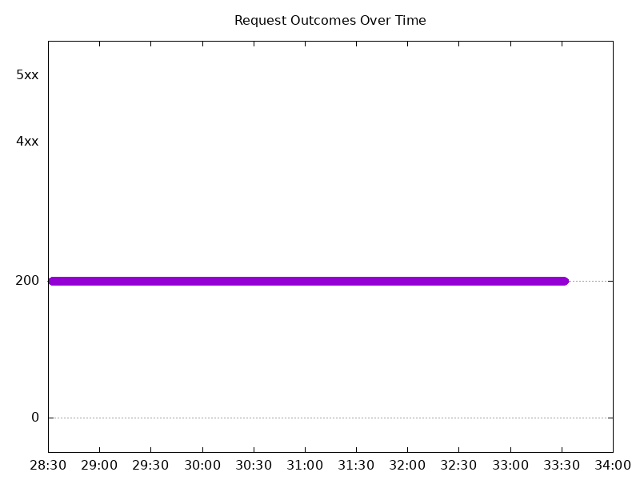

### Scale Down Gradually

#### Test: Send http /coffee traffic

```text
Requests      [total, rate, throughput]         96000, 100.00, 100.00
Duration      [total, attack, wait]             16m0s, 16m0s, 1.168ms
Latencies     [min, mean, 50, 90, 95, 99, max]  638.326µs, 1.196ms, 1.185ms, 1.395ms, 1.464ms, 1.716ms, 51.332ms
Bytes In      [total, mean]                     15417583, 160.60
Bytes Out     [total, mean]                     0, 0.00
Success       [ratio]                           100.00%
Status Codes  [code:count]                      200:96000  
Error Set:
```

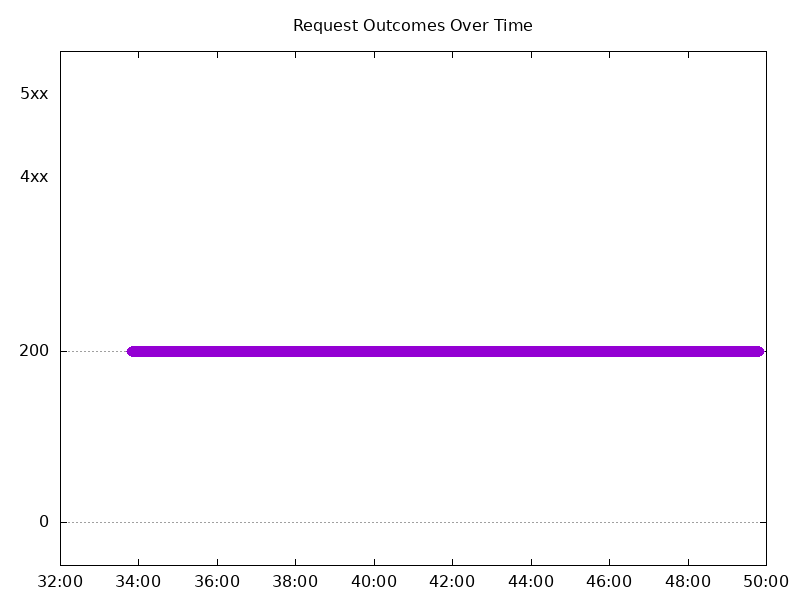

#### Test: Send https /tea traffic

```text
Requests      [total, rate, throughput]         96000, 100.00, 100.00
Duration      [total, attack, wait]             16m0s, 16m0s, 958.252µs
Latencies     [min, mean, 50, 90, 95, 99, max]  688.331µs, 1.27ms, 1.258ms, 1.463ms, 1.535ms, 1.786ms, 38.16ms
Bytes In      [total, mean]                     14870456, 154.90
Bytes Out     [total, mean]                     0, 0.00
Success       [ratio]                           100.00%
Status Codes  [code:count]                      200:96000  
Error Set:
```


### Scale Up Abruptly

#### Test: Send https /tea traffic

```text
Requests      [total, rate, throughput]         12000, 100.01, 100.01
Duration      [total, attack, wait]             2m0s, 2m0s, 1.684ms
Latencies     [min, mean, 50, 90, 95, 99, max]  707.159µs, 1.345ms, 1.3ms, 1.619ms, 1.72ms, 1.983ms, 24.916ms
Bytes In      [total, mean]                     1858834, 154.90
Bytes Out     [total, mean]                     0, 0.00
Success       [ratio]                           100.00%
Status Codes  [code:count]                      200:12000  
Error Set:
```

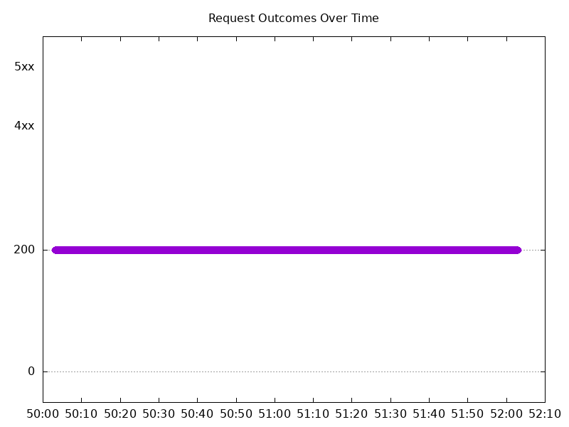

#### Test: Send http /coffee traffic

```text
Requests      [total, rate, throughput]         12000, 100.01, 100.01
Duration      [total, attack, wait]             2m0s, 2m0s, 1.34ms
Latencies     [min, mean, 50, 90, 95, 99, max]  713.635µs, 1.307ms, 1.267ms, 1.59ms, 1.692ms, 1.932ms, 20.645ms
Bytes In      [total, mean]                     1927152, 160.60
Bytes Out     [total, mean]                     0, 0.00
Success       [ratio]                           100.00%
Status Codes  [code:count]                      200:12000  
Error Set:
```


### Scale Down Abruptly

#### Test: Send https /tea traffic

```text
Requests      [total, rate, throughput]         12000, 100.01, 100.01
Duration      [total, attack, wait]             2m0s, 2m0s, 1.444ms
Latencies     [min, mean, 50, 90, 95, 99, max]  775.553µs, 1.714ms, 1.445ms, 1.773ms, 1.871ms, 2.264ms, 252.329ms
Bytes In      [total, mean]                     1858855, 154.90
Bytes Out     [total, mean]                     0, 0.00
Success       [ratio]                           100.00%
Status Codes  [code:count]                      200:12000  
Error Set:
```

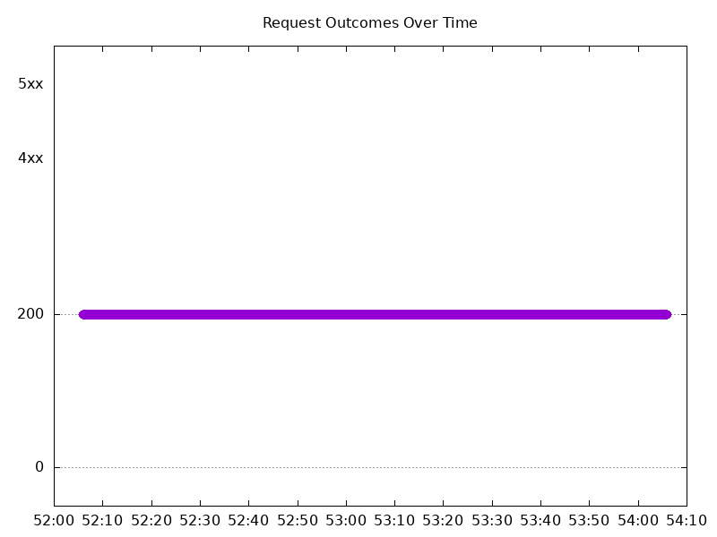

#### Test: Send http /coffee traffic

```text
Requests      [total, rate, throughput]         12000, 100.01, 100.00
Duration      [total, attack, wait]             2m0s, 2m0s, 1.331ms
Latencies     [min, mean, 50, 90, 95, 99, max]  705.454µs, 1.649ms, 1.379ms, 1.725ms, 1.832ms, 2.241ms, 252.445ms
Bytes In      [total, mean]                     1927165, 160.60
Bytes Out     [total, mean]                     0, 0.00
Success       [ratio]                           99.99%
Status Codes  [code:count]                      200:11999  502:1  
Error Set:
502 Bad Gateway
```

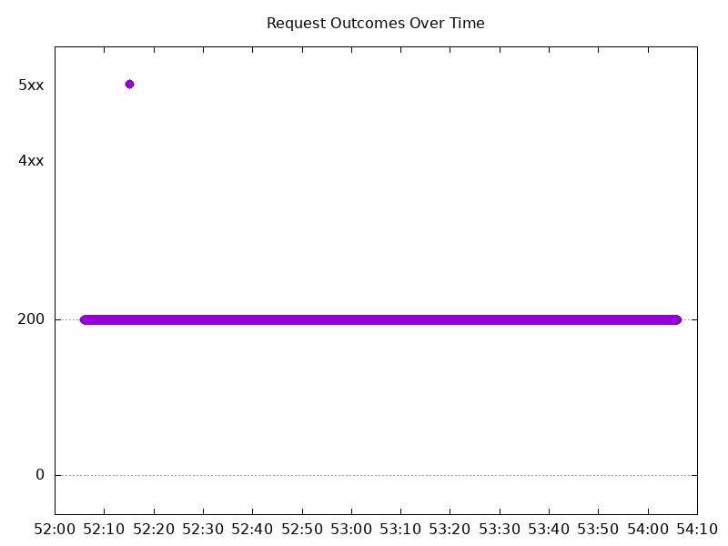
