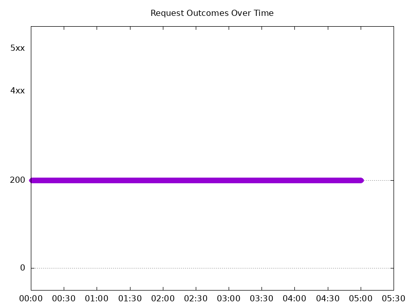
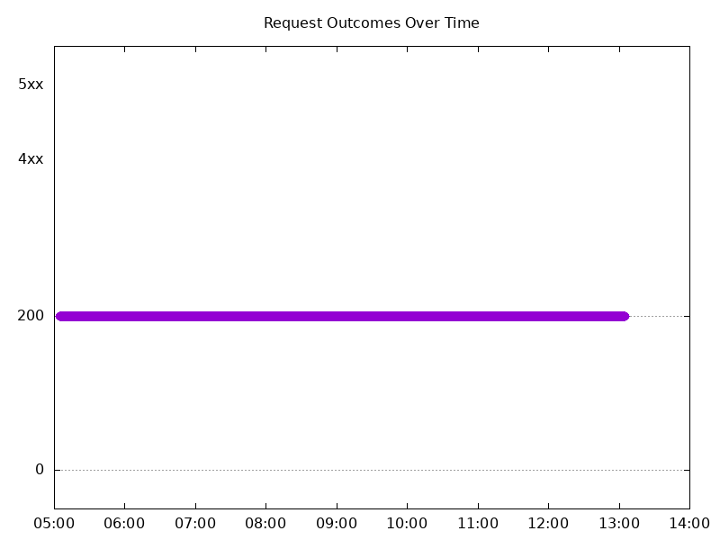
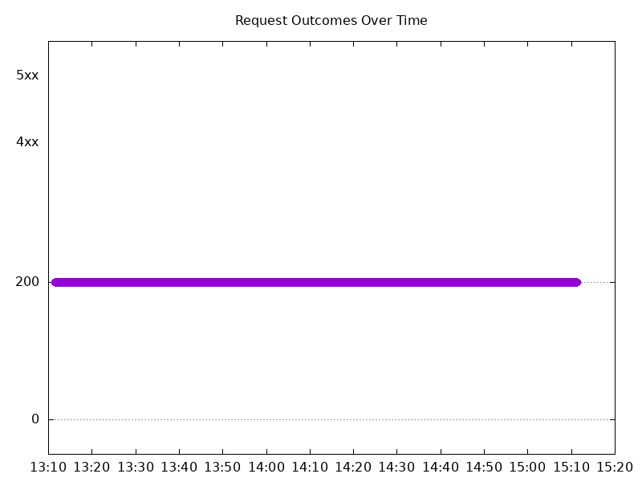
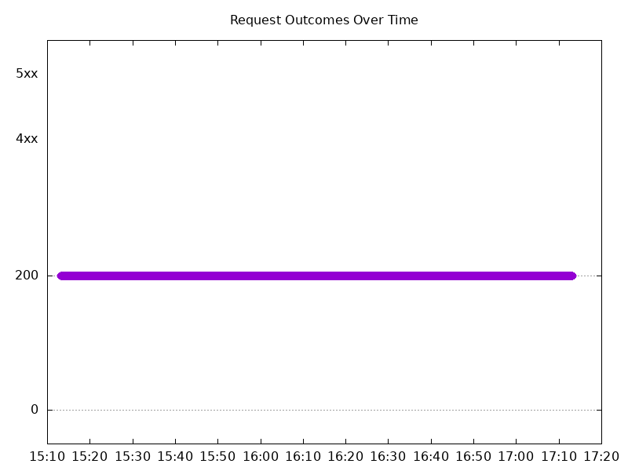
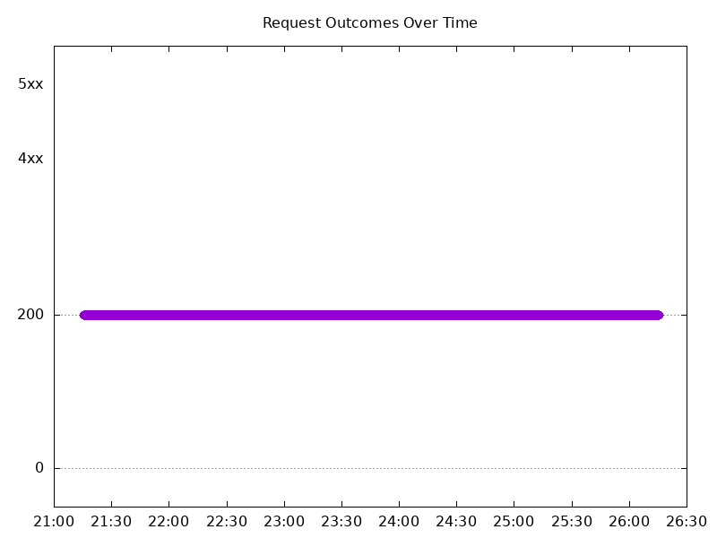
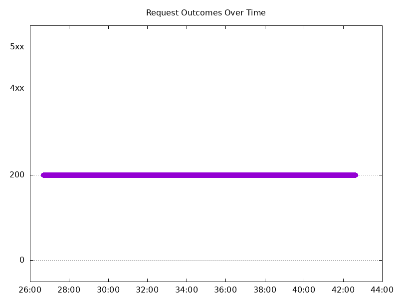
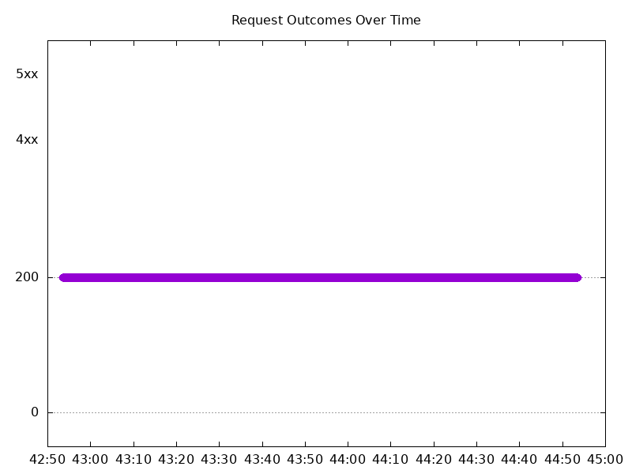
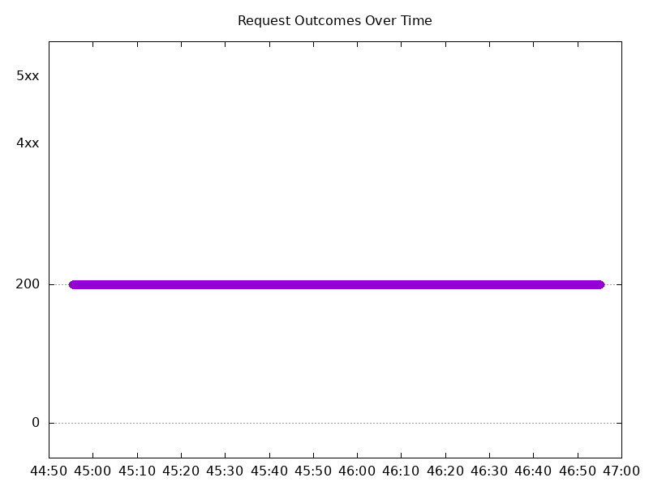

# Results

## Test environment

NGINX Plus: false

NGINX Gateway Fabric:

- Commit: fbfa2b711647e238d0d6907ac6af2327b7080a42
- Date: 2026-01-23T21:46:07Z
- Dirty: false

GKE Cluster:

- Node count: 12
- k8s version: v1.33.5-gke.2100000
- vCPUs per node: 16
- RAM per node: 65851520Ki
- Max pods per node: 110
- Zone: us-west1-b
- Instance Type: n2d-standard-16

## Summary:

- Latency decrease overall, reversing the trend seen in 2.3 results.

## One NGINX Pod runs per node Test Results

### Scale Up Gradually

#### Test: Send https /tea traffic

```text
Requests      [total, rate, throughput]         30000, 100.00, 100.00
Duration      [total, attack, wait]             5m0s, 5m0s, 1.072ms
Latencies     [min, mean, 50, 90, 95, 99, max]  619.289µs, 1.029ms, 1.004ms, 1.169ms, 1.233ms, 1.693ms, 16.446ms
Bytes In      [total, mean]                     4625980, 154.20
Bytes Out     [total, mean]                     0, 0.00
Success       [ratio]                           100.00%
Status Codes  [code:count]                      200:30000  
Error Set:
```


#### Test: Send http /coffee traffic

```text
Requests      [total, rate, throughput]         30000, 100.00, 100.00
Duration      [total, attack, wait]             5m0s, 5m0s, 933.978µs
Latencies     [min, mean, 50, 90, 95, 99, max]  573.818µs, 963.969µs, 949.885µs, 1.113ms, 1.171ms, 1.573ms, 16.779ms
Bytes In      [total, mean]                     4806087, 160.20
Bytes Out     [total, mean]                     0, 0.00
Success       [ratio]                           100.00%
Status Codes  [code:count]                      200:30000  
Error Set:
```



### Scale Down Gradually

#### Test: Send http /coffee traffic

```text
Requests      [total, rate, throughput]         48000, 100.00, 100.00
Duration      [total, attack, wait]             8m0s, 8m0s, 772.52µs
Latencies     [min, mean, 50, 90, 95, 99, max]  550.761µs, 960.63µs, 947.708µs, 1.116ms, 1.177ms, 1.539ms, 39.22ms
Bytes In      [total, mean]                     7689701, 160.20
Bytes Out     [total, mean]                     0, 0.00
Success       [ratio]                           100.00%
Status Codes  [code:count]                      200:48000  
Error Set:
```



#### Test: Send https /tea traffic

```text
Requests      [total, rate, throughput]         48000, 100.00, 100.00
Duration      [total, attack, wait]             8m0s, 8m0s, 1.128ms
Latencies     [min, mean, 50, 90, 95, 99, max]  602.798µs, 1.006ms, 986.683µs, 1.143ms, 1.205ms, 1.509ms, 38.545ms
Bytes In      [total, mean]                     7401552, 154.20
Bytes Out     [total, mean]                     0, 0.00
Success       [ratio]                           100.00%
Status Codes  [code:count]                      200:48000  
Error Set:
```


### Scale Up Abruptly

#### Test: Send https /tea traffic

```text
Requests      [total, rate, throughput]         12000, 100.01, 100.01
Duration      [total, attack, wait]             2m0s, 2m0s, 1.03ms
Latencies     [min, mean, 50, 90, 95, 99, max]  613.7µs, 977.715µs, 954.975µs, 1.084ms, 1.127ms, 1.431ms, 59.48ms
Bytes In      [total, mean]                     1850387, 154.20
Bytes Out     [total, mean]                     0, 0.00
Success       [ratio]                           100.00%
Status Codes  [code:count]                      200:12000  
Error Set:
```



#### Test: Send http /coffee traffic

```text
Requests      [total, rate, throughput]         12000, 100.01, 100.01
Duration      [total, attack, wait]             2m0s, 2m0s, 889.796µs
Latencies     [min, mean, 50, 90, 95, 99, max]  558.984µs, 917.525µs, 901.333µs, 1.044ms, 1.095ms, 1.41ms, 19.176ms
Bytes In      [total, mean]                     1922411, 160.20
Bytes Out     [total, mean]                     0, 0.00
Success       [ratio]                           100.00%
Status Codes  [code:count]                      200:12000  
Error Set:
```


### Scale Down Abruptly

#### Test: Send https /tea traffic

```text
Requests      [total, rate, throughput]         12000, 100.01, 100.01
Duration      [total, attack, wait]             2m0s, 2m0s, 1.016ms
Latencies     [min, mean, 50, 90, 95, 99, max]  628.918µs, 989.007µs, 978.853µs, 1.108ms, 1.153ms, 1.282ms, 26.78ms
Bytes In      [total, mean]                     1850429, 154.20
Bytes Out     [total, mean]                     0, 0.00
Success       [ratio]                           100.00%
Status Codes  [code:count]                      200:12000  
Error Set:
```



#### Test: Send http /coffee traffic

```text
Requests      [total, rate, throughput]         12000, 100.01, 100.01
Duration      [total, attack, wait]             2m0s, 2m0s, 899.957µs
Latencies     [min, mean, 50, 90, 95, 99, max]  575.935µs, 933.951µs, 930.929µs, 1.07ms, 1.113ms, 1.238ms, 7.917ms
Bytes In      [total, mean]                     1922409, 160.20
Bytes Out     [total, mean]                     0, 0.00
Success       [ratio]                           100.00%
Status Codes  [code:count]                      200:12000  
Error Set:
```


## Multiple NGINX Pods run per node Test Results

### Scale Up Gradually

#### Test: Send http /coffee traffic

```text
Requests      [total, rate, throughput]         30000, 100.00, 100.00
Duration      [total, attack, wait]             5m0s, 5m0s, 914.775µs
Latencies     [min, mean, 50, 90, 95, 99, max]  551.626µs, 954.59µs, 930.912µs, 1.082ms, 1.14ms, 1.756ms, 26.964ms
Bytes In      [total, mean]                     4806060, 160.20
Bytes Out     [total, mean]                     0, 0.00
Success       [ratio]                           100.00%
Status Codes  [code:count]                      200:30000  
Error Set:
```


#### Test: Send https /tea traffic

```text
Requests      [total, rate, throughput]         30000, 100.00, 100.00
Duration      [total, attack, wait]             5m0s, 5m0s, 1.018ms
Latencies     [min, mean, 50, 90, 95, 99, max]  575.927µs, 1.007ms, 971.85µs, 1.117ms, 1.18ms, 1.804ms, 26.865ms
Bytes In      [total, mean]                     4625954, 154.20
Bytes Out     [total, mean]                     0, 0.00
Success       [ratio]                           100.00%
Status Codes  [code:count]                      200:30000  
Error Set:
```



### Scale Down Gradually

#### Test: Send https /tea traffic

```text
Requests      [total, rate, throughput]         96000, 100.00, 100.00
Duration      [total, attack, wait]             16m0s, 16m0s, 1.013ms
Latencies     [min, mean, 50, 90, 95, 99, max]  615.395µs, 1.011ms, 986.262µs, 1.128ms, 1.182ms, 1.637ms, 47.23ms
Bytes In      [total, mean]                     14803167, 154.20
Bytes Out     [total, mean]                     0, 0.00
Success       [ratio]                           100.00%
Status Codes  [code:count]                      200:96000  
Error Set:
```


#### Test: Send http /coffee traffic

```text
Requests      [total, rate, throughput]         96000, 100.00, 100.00
Duration      [total, attack, wait]             16m0s, 16m0s, 1.152ms
Latencies     [min, mean, 50, 90, 95, 99, max]  551.717µs, 965.648µs, 948.073µs, 1.103ms, 1.156ms, 1.562ms, 52.599ms
Bytes In      [total, mean]                     15379213, 160.20
Bytes Out     [total, mean]                     0, 0.00
Success       [ratio]                           100.00%
Status Codes  [code:count]                      200:96000  
Error Set:
```



### Scale Up Abruptly

#### Test: Send http /coffee traffic

```text
Requests      [total, rate, throughput]         12000, 100.01, 100.01
Duration      [total, attack, wait]             2m0s, 2m0s, 949.151µs
Latencies     [min, mean, 50, 90, 95, 99, max]  558.392µs, 919.019µs, 912.541µs, 1.052ms, 1.099ms, 1.349ms, 4.054ms
Bytes In      [total, mean]                     1922417, 160.20
Bytes Out     [total, mean]                     0, 0.00
Success       [ratio]                           100.00%
Status Codes  [code:count]                      200:12000  
Error Set:
```



#### Test: Send https /tea traffic

```text
Requests      [total, rate, throughput]         12000, 100.01, 100.01
Duration      [total, attack, wait]             2m0s, 2m0s, 997.969µs
Latencies     [min, mean, 50, 90, 95, 99, max]  610.061µs, 968.958µs, 954.977µs, 1.084ms, 1.126ms, 1.379ms, 10.369ms
Bytes In      [total, mean]                     1850335, 154.19
Bytes Out     [total, mean]                     0, 0.00
Success       [ratio]                           100.00%
Status Codes  [code:count]                      200:12000  
Error Set:
```


### Scale Down Abruptly

#### Test: Send https /tea traffic

```text
Requests      [total, rate, throughput]         12000, 100.01, 100.01
Duration      [total, attack, wait]             2m0s, 2m0s, 711.408µs
Latencies     [min, mean, 50, 90, 95, 99, max]  605.273µs, 1.026ms, 967.804µs, 1.1ms, 1.148ms, 1.372ms, 123.041ms
Bytes In      [total, mean]                     1850391, 154.20
Bytes Out     [total, mean]                     0, 0.00
Success       [ratio]                           100.00%
Status Codes  [code:count]                      200:12000  
Error Set:
```


#### Test: Send http /coffee traffic

```text
Requests      [total, rate, throughput]         12000, 100.01, 100.01
Duration      [total, attack, wait]             2m0s, 2m0s, 1.034ms
Latencies     [min, mean, 50, 90, 95, 99, max]  539.408µs, 957.905µs, 914.394µs, 1.061ms, 1.109ms, 1.291ms, 123.138ms
Bytes In      [total, mean]                     1922379, 160.20
Bytes Out     [total, mean]                     0, 0.00
Success       [ratio]                           100.00%
Status Codes  [code:count]                      200:12000  
Error Set:
```


