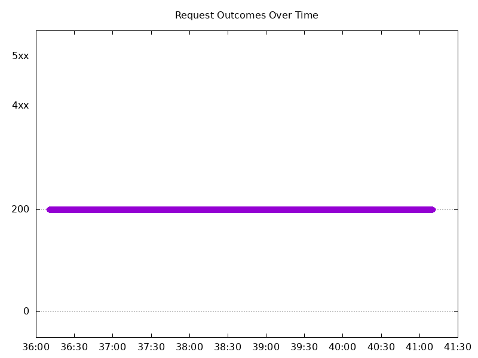
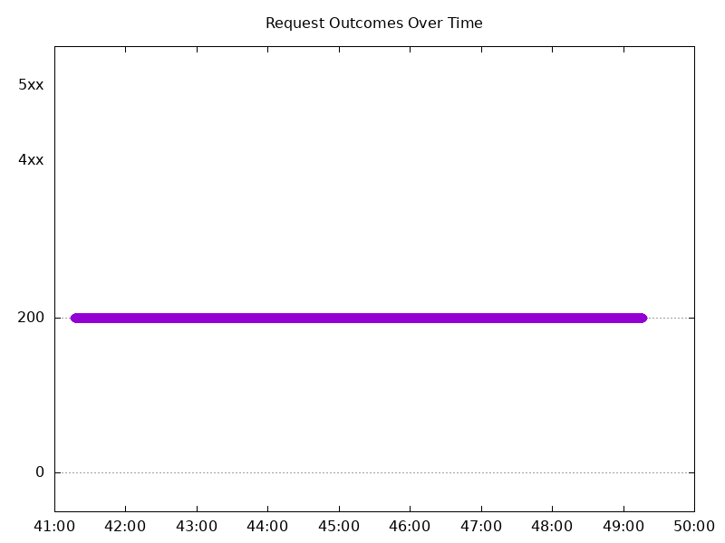
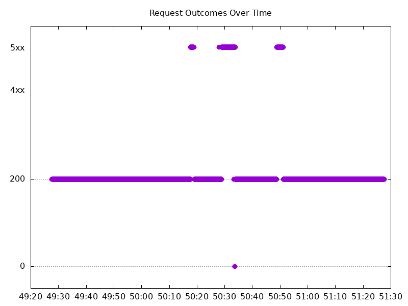
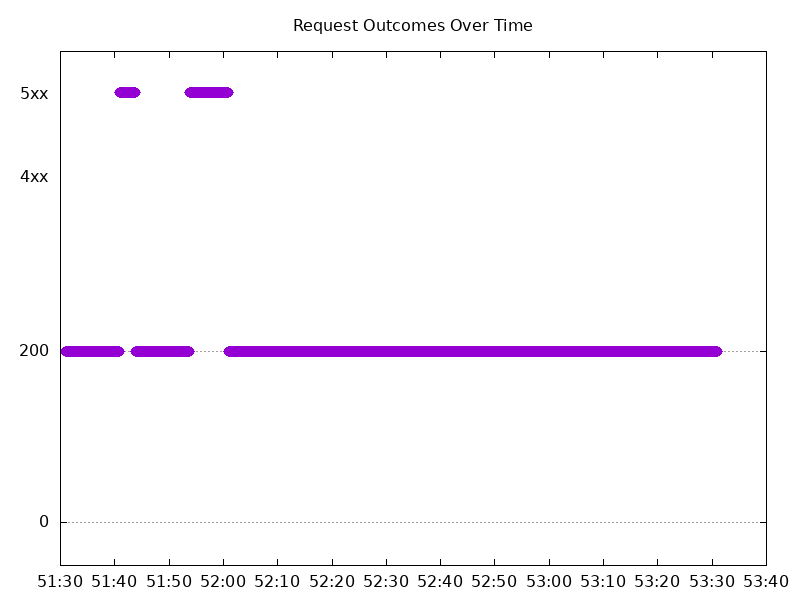
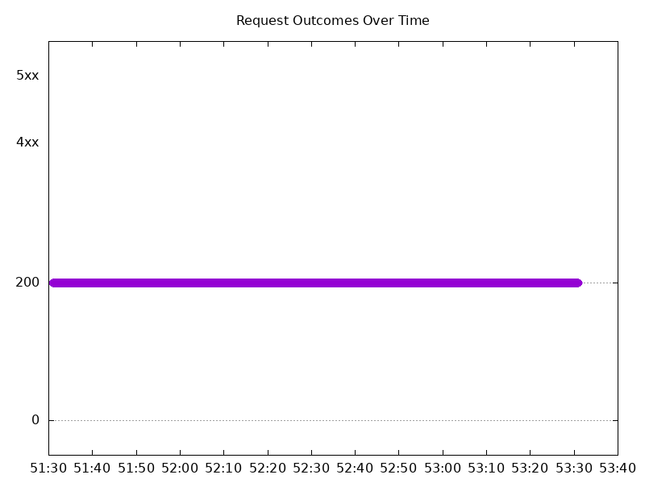
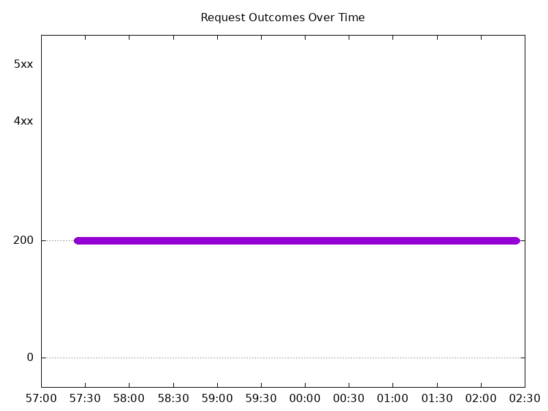
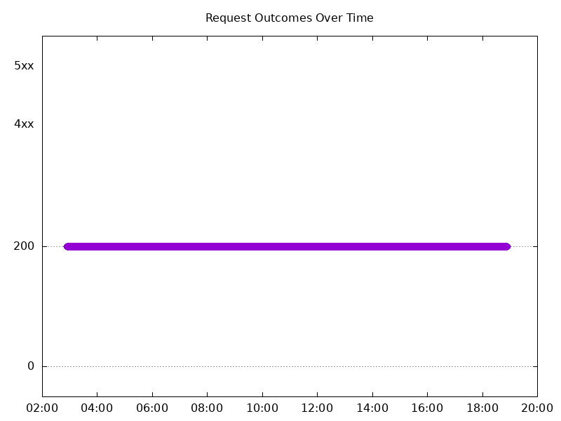
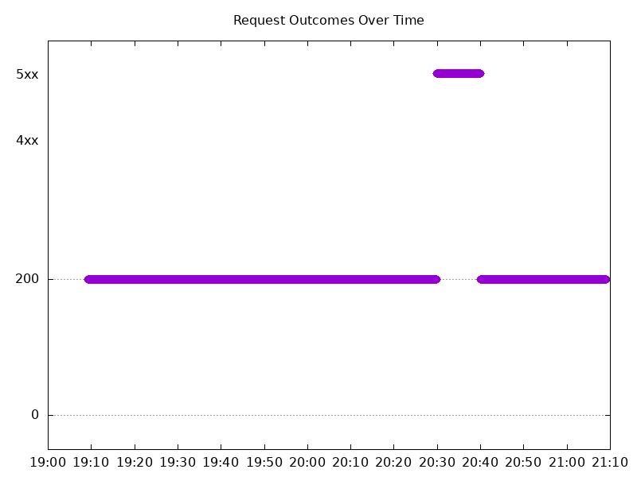
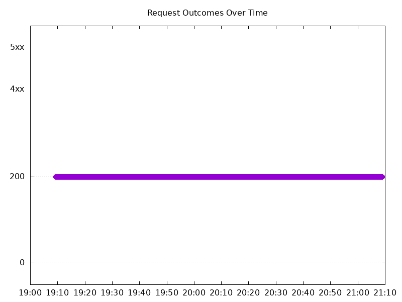
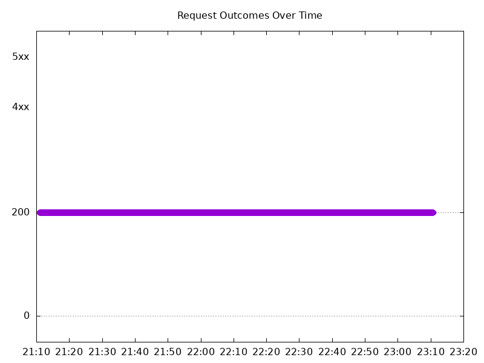

# Results

## Test environment

NGINX Plus: true

NGINX Gateway Fabric:

- Commit: fbfa2b711647e238d0d6907ac6af2327b7080a42
- Date: 2026-01-23T21:46:07Z
- Dirty: false

GKE Cluster:

- Node count: 12
- k8s version: v1.33.5-gke.2100000
- vCPUs per node: 16
- RAM per node: 65851520Ki
- Max pods per node: 110
- Zone: us-west1-b
- Instance Type: n2d-standard-16

## Summary:

- Sections of dropped traffic when abruptly scaling with NGINX Plus. First seen in 2.3 results, for the most part the same tests see the same dropped traffic, only occurring on http traffic. This is not seen on oss results. Opened tracking issue: https://github.com/nginx/nginx-gateway-fabric/issues/4683. 
- Latency decrease overall.

## One NGINX Pod runs per node Test Results

### Scale Up Gradually

#### Test: Send http /coffee traffic

```text
Requests      [total, rate, throughput]         30000, 100.00, 100.00
Duration      [total, attack, wait]             5m0s, 5m0s, 1.078ms
Latencies     [min, mean, 50, 90, 95, 99, max]  580.292µs, 974.619µs, 961.379µs, 1.115ms, 1.17ms, 1.485ms, 14.152ms
Bytes In      [total, mean]                     4805912, 160.20
Bytes Out     [total, mean]                     0, 0.00
Success       [ratio]                           100.00%
Status Codes  [code:count]                      200:30000  
Error Set:
```


#### Test: Send https /tea traffic

```text
Requests      [total, rate, throughput]         30000, 100.00, 100.00
Duration      [total, attack, wait]             5m0s, 5m0s, 1.233ms
Latencies     [min, mean, 50, 90, 95, 99, max]  628.766µs, 1.021ms, 1.005ms, 1.145ms, 1.201ms, 1.463ms, 14.158ms
Bytes In      [total, mean]                     4625929, 154.20
Bytes Out     [total, mean]                     0, 0.00
Success       [ratio]                           100.00%
Status Codes  [code:count]                      200:30000  
Error Set:
```



### Scale Down Gradually

#### Test: Send https /tea traffic

```text
Requests      [total, rate, throughput]         48000, 100.00, 100.00
Duration      [total, attack, wait]             8m0s, 8m0s, 2.184ms
Latencies     [min, mean, 50, 90, 95, 99, max]  654.635µs, 1.034ms, 1.008ms, 1.179ms, 1.277ms, 1.568ms, 34.276ms
Bytes In      [total, mean]                     7401577, 154.20
Bytes Out     [total, mean]                     0, 0.00
Success       [ratio]                           100.00%
Status Codes  [code:count]                      200:48000  
Error Set:
```


#### Test: Send http /coffee traffic

```text
Requests      [total, rate, throughput]         48000, 100.00, 100.00
Duration      [total, attack, wait]             8m0s, 8m0s, 1.608ms
Latencies     [min, mean, 50, 90, 95, 99, max]  600.492µs, 977.287µs, 960.079µs, 1.117ms, 1.192ms, 1.504ms, 24.588ms
Bytes In      [total, mean]                     7689538, 160.20
Bytes Out     [total, mean]                     0, 0.00
Success       [ratio]                           100.00%
Status Codes  [code:count]                      200:48000  
Error Set:
```



### Scale Up Abruptly

#### Test: Send https /tea traffic

```text
Requests      [total, rate, throughput]         12000, 100.01, 100.00
Duration      [total, attack, wait]             2m0s, 2m0s, 1.018ms
Latencies     [min, mean, 50, 90, 95, 99, max]  382.728µs, 1.383ms, 1.254ms, 1.591ms, 1.732ms, 2.189ms, 250.958ms
Bytes In      [total, mean]                     1850218, 154.18
Bytes Out     [total, mean]                     0, 0.00
Success       [ratio]                           99.99%
Status Codes  [code:count]                      0:1  200:11999  
Error Set:
Get "https://cafe.example.com/tea": dial tcp 0.0.0.0:0->10.138.0.20:443: connect: network is unreachable
```


#### Test: Send http /coffee traffic

```text
Requests      [total, rate, throughput]         12000, 100.01, 92.97
Duration      [total, attack, wait]             2m0s, 2m0s, 1.029ms
Latencies     [min, mean, 50, 90, 95, 99, max]  264.078µs, 1.265ms, 1.152ms, 1.503ms, 1.598ms, 1.994ms, 253.335ms
Bytes In      [total, mean]                     1913615, 159.47
Bytes Out     [total, mean]                     0, 0.00
Success       [ratio]                           92.97%
Status Codes  [code:count]                      0:1  200:11156  502:843  
Error Set:
502 Bad Gateway
Get "http://cafe.example.com/coffee": dial tcp 0.0.0.0:0->10.138.0.20:80: connect: network is unreachable
```



### Scale Down Abruptly

#### Test: Send http /coffee traffic

```text
Requests      [total, rate, throughput]         12000, 100.01, 91.67
Duration      [total, attack, wait]             2m0s, 2m0s, 988.883µs
Latencies     [min, mean, 50, 90, 95, 99, max]  516.852µs, 1.149ms, 1.093ms, 1.467ms, 1.545ms, 1.736ms, 26.068ms
Bytes In      [total, mean]                     1912228, 159.35
Bytes Out     [total, mean]                     0, 0.00
Success       [ratio]                           91.67%
Status Codes  [code:count]                      200:11000  502:1000  
Error Set:
502 Bad Gateway
```



#### Test: Send https /tea traffic

```text
Requests      [total, rate, throughput]         12000, 100.01, 100.01
Duration      [total, attack, wait]             2m0s, 2m0s, 1.55ms
Latencies     [min, mean, 50, 90, 95, 99, max]  657.5µs, 1.226ms, 1.183ms, 1.5ms, 1.578ms, 1.813ms, 19.997ms
Bytes In      [total, mean]                     1850398, 154.20
Bytes Out     [total, mean]                     0, 0.00
Success       [ratio]                           100.00%
Status Codes  [code:count]                      200:12000  
Error Set:
```



## Multiple NGINX Pods run per node Test Results

### Scale Up Gradually

#### Test: Send http /coffee traffic

```text
Requests      [total, rate, throughput]         30000, 100.00, 100.00
Duration      [total, attack, wait]             5m0s, 5m0s, 885.319µs
Latencies     [min, mean, 50, 90, 95, 99, max]  594.474µs, 974.158µs, 957.292µs, 1.106ms, 1.166ms, 1.552ms, 16.517ms
Bytes In      [total, mean]                     4805907, 160.20
Bytes Out     [total, mean]                     0, 0.00
Success       [ratio]                           100.00%
Status Codes  [code:count]                      200:30000  
Error Set:
```



#### Test: Send https /tea traffic

```text
Requests      [total, rate, throughput]         30000, 100.00, 100.00
Duration      [total, attack, wait]             5m0s, 5m0s, 12.993ms
Latencies     [min, mean, 50, 90, 95, 99, max]  636.017µs, 1.029ms, 1.007ms, 1.154ms, 1.22ms, 1.658ms, 16.651ms
Bytes In      [total, mean]                     4637958, 154.60
Bytes Out     [total, mean]                     0, 0.00
Success       [ratio]                           100.00%
Status Codes  [code:count]                      200:30000  
Error Set:
```


### Scale Down Gradually

#### Test: Send http /coffee traffic

```text
Requests      [total, rate, throughput]         96000, 100.00, 100.00
Duration      [total, attack, wait]             16m0s, 16m0s, 929.932µs
Latencies     [min, mean, 50, 90, 95, 99, max]  564.883µs, 974.914µs, 962.626µs, 1.095ms, 1.14ms, 1.411ms, 47.623ms
Bytes In      [total, mean]                     15379097, 160.20
Bytes Out     [total, mean]                     0, 0.00
Success       [ratio]                           100.00%
Status Codes  [code:count]                      200:96000  
Error Set:
```


#### Test: Send https /tea traffic

```text
Requests      [total, rate, throughput]         96000, 100.00, 100.00
Duration      [total, attack, wait]             16m0s, 16m0s, 848.508µs
Latencies     [min, mean, 50, 90, 95, 99, max]  645.454µs, 1.023ms, 1.009ms, 1.135ms, 1.179ms, 1.46ms, 48.318ms
Bytes In      [total, mean]                     14841661, 154.60
Bytes Out     [total, mean]                     0, 0.00
Success       [ratio]                           100.00%
Status Codes  [code:count]                      200:96000  
Error Set:
```



### Scale Up Abruptly

#### Test: Send http /coffee traffic

```text
Requests      [total, rate, throughput]         12000, 100.01, 91.67
Duration      [total, attack, wait]             2m0s, 2m0s, 845.92µs
Latencies     [min, mean, 50, 90, 95, 99, max]  524.524µs, 972.785µs, 926.666µs, 1.057ms, 1.094ms, 1.198ms, 116.244ms
Bytes In      [total, mean]                     1912144, 159.35
Bytes Out     [total, mean]                     0, 0.00
Success       [ratio]                           91.67%
Status Codes  [code:count]                      200:11000  502:1000  
Error Set:
502 Bad Gateway
```



#### Test: Send https /tea traffic

```text
Requests      [total, rate, throughput]         12000, 100.01, 100.01
Duration      [total, attack, wait]             2m0s, 2m0s, 1.001ms
Latencies     [min, mean, 50, 90, 95, 99, max]  671.892µs, 1.038ms, 978.452µs, 1.092ms, 1.131ms, 1.262ms, 114.661ms
Bytes In      [total, mean]                     1855192, 154.60
Bytes Out     [total, mean]                     0, 0.00
Success       [ratio]                           100.00%
Status Codes  [code:count]                      200:12000  
Error Set:
```



### Scale Down Abruptly

#### Test: Send http /coffee traffic

```text
Requests      [total, rate, throughput]         12000, 100.01, 100.01
Duration      [total, attack, wait]             2m0s, 2m0s, 904.226µs
Latencies     [min, mean, 50, 90, 95, 99, max]  630.248µs, 955.228µs, 947.595µs, 1.072ms, 1.111ms, 1.212ms, 28.753ms
Bytes In      [total, mean]                     1922455, 160.20
Bytes Out     [total, mean]                     0, 0.00
Success       [ratio]                           100.00%
Status Codes  [code:count]                      200:12000  
Error Set:
```



#### Test: Send https /tea traffic

```text
Requests      [total, rate, throughput]         12000, 100.01, 100.01
Duration      [total, attack, wait]             2m0s, 2m0s, 857.249µs
Latencies     [min, mean, 50, 90, 95, 99, max]  672.985µs, 999.686µs, 989.792µs, 1.103ms, 1.142ms, 1.249ms, 28.966ms
Bytes In      [total, mean]                     1855203, 154.60
Bytes Out     [total, mean]                     0, 0.00
Success       [ratio]                           100.00%
Status Codes  [code:count]                      200:12000  
Error Set:
```


