# Results

## Test environment

NGINX Plus: false

NGINX Gateway Fabric:

- Commit: 9010072ecd34a8fa99bfdd3d7580c9d725fb063e
- Date: 2025-10-01T09:39:27Z
- Dirty: false

GKE Cluster:

- Node count: 12
- k8s version: v1.33.4-gke.1172000
- vCPUs per node: 16
- RAM per node: 65851524Ki
- Max pods per node: 110
- Zone: us-west1-b
- Instance Type: n2d-standard-16

## One NGINX Pod runs per node Test Results

### Scale Up Gradually

#### Test: Send https /tea traffic

```text
Requests      [total, rate, throughput]         30000, 100.00, 100.00
Duration      [total, attack, wait]             5m0s, 5m0s, 1.694ms
Latencies     [min, mean, 50, 90, 95, 99, max]  662.439µs, 1.228ms, 1.196ms, 1.461ms, 1.575ms, 1.844ms, 16.954ms
Bytes In      [total, mean]                     4623001, 154.10
Bytes Out     [total, mean]                     0, 0.00
Success       [ratio]                           100.00%
Status Codes  [code:count]                      200:30000  
Error Set:
```

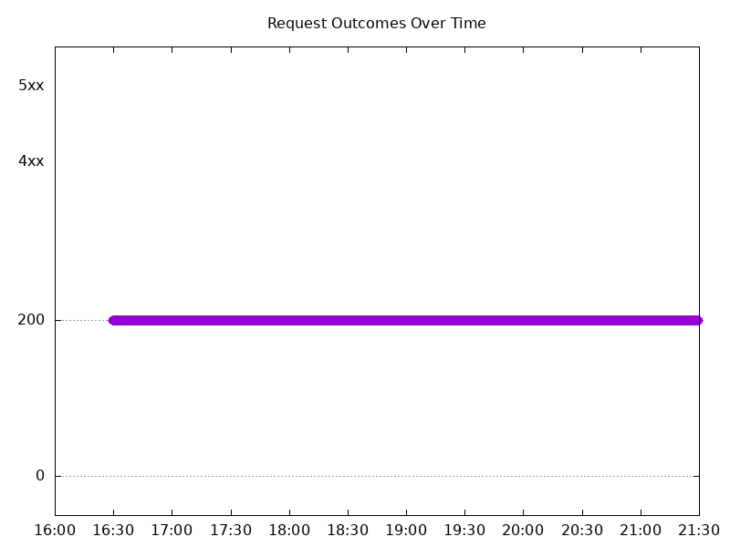

#### Test: Send http /coffee traffic

```text
Requests      [total, rate, throughput]         30000, 100.00, 100.00
Duration      [total, attack, wait]             5m0s, 5m0s, 1.643ms
Latencies     [min, mean, 50, 90, 95, 99, max]  628.394µs, 1.165ms, 1.141ms, 1.397ms, 1.526ms, 1.789ms, 17.085ms
Bytes In      [total, mean]                     4803057, 160.10
Bytes Out     [total, mean]                     0, 0.00
Success       [ratio]                           100.00%
Status Codes  [code:count]                      200:30000  
Error Set:
```

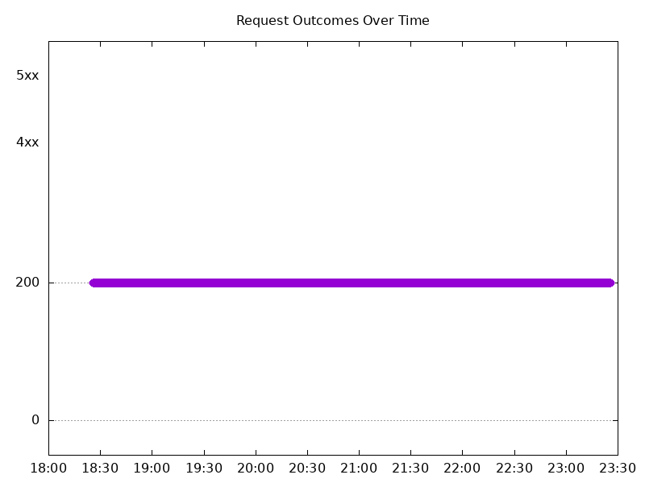

### Scale Down Gradually

#### Test: Send https /tea traffic

```text
Requests      [total, rate, throughput]         48000, 100.00, 100.00
Duration      [total, attack, wait]             8m0s, 8m0s, 1.431ms
Latencies     [min, mean, 50, 90, 95, 99, max]  430.333µs, 1.304ms, 1.241ms, 1.555ms, 1.663ms, 1.927ms, 205.674ms
Bytes In      [total, mean]                     7396333, 154.09
Bytes Out     [total, mean]                     0, 0.00
Success       [ratio]                           99.99%
Status Codes  [code:count]                      0:3  200:47997  
Error Set:
Get "https://cafe.example.com/tea": dial tcp 0.0.0.0:0->10.138.0.25:443: connect: network is unreachable
```

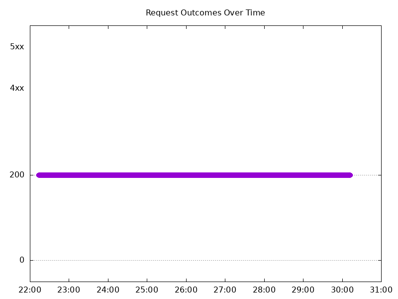

#### Test: Send http /coffee traffic

```text
Requests      [total, rate, throughput]         48000, 100.00, 99.99
Duration      [total, attack, wait]             8m0s, 8m0s, 835.968µs
Latencies     [min, mean, 50, 90, 95, 99, max]  394.135µs, 1.226ms, 1.177ms, 1.485ms, 1.604ms, 1.829ms, 205.978ms
Bytes In      [total, mean]                     7684162, 160.09
Bytes Out     [total, mean]                     0, 0.00
Success       [ratio]                           99.99%
Status Codes  [code:count]                      0:4  200:47996  
Error Set:
Get "http://cafe.example.com/coffee": dial tcp 0.0.0.0:0->10.138.0.25:80: connect: network is unreachable
```

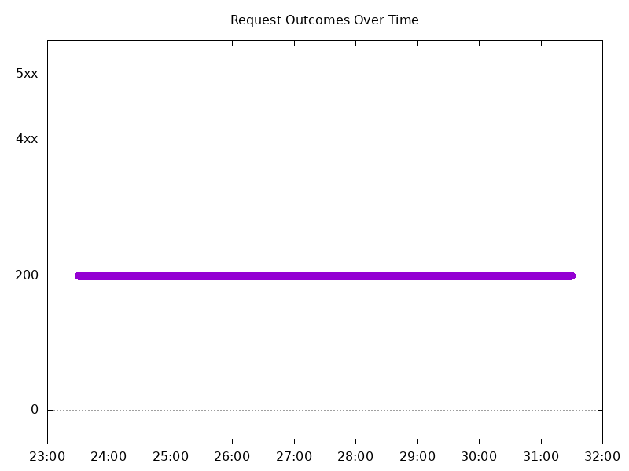

### Scale Up Abruptly

#### Test: Send http /coffee traffic

```text
Requests      [total, rate, throughput]         12000, 100.01, 100.01
Duration      [total, attack, wait]             2m0s, 2m0s, 1.026ms
Latencies     [min, mean, 50, 90, 95, 99, max]  642.534µs, 1.109ms, 1.105ms, 1.285ms, 1.352ms, 1.565ms, 5.831ms
Bytes In      [total, mean]                     1921212, 160.10
Bytes Out     [total, mean]                     0, 0.00
Success       [ratio]                           100.00%
Status Codes  [code:count]                      200:12000  
Error Set:
```


#### Test: Send https /tea traffic

```text
Requests      [total, rate, throughput]         12000, 100.01, 100.01
Duration      [total, attack, wait]             2m0s, 2m0s, 933.763µs
Latencies     [min, mean, 50, 90, 95, 99, max]  678.631µs, 1.184ms, 1.176ms, 1.356ms, 1.411ms, 1.627ms, 17.068ms
Bytes In      [total, mean]                     1849179, 154.10
Bytes Out     [total, mean]                     0, 0.00
Success       [ratio]                           100.00%
Status Codes  [code:count]                      200:12000  
Error Set:
```


### Scale Down Abruptly

#### Test: Send http /coffee traffic

```text
Requests      [total, rate, throughput]         12000, 100.01, 100.01
Duration      [total, attack, wait]             2m0s, 2m0s, 788.124µs
Latencies     [min, mean, 50, 90, 95, 99, max]  583.652µs, 1.057ms, 1.059ms, 1.216ms, 1.264ms, 1.379ms, 26.179ms
Bytes In      [total, mean]                     1921233, 160.10
Bytes Out     [total, mean]                     0, 0.00
Success       [ratio]                           100.00%
Status Codes  [code:count]                      200:12000  
Error Set:
```

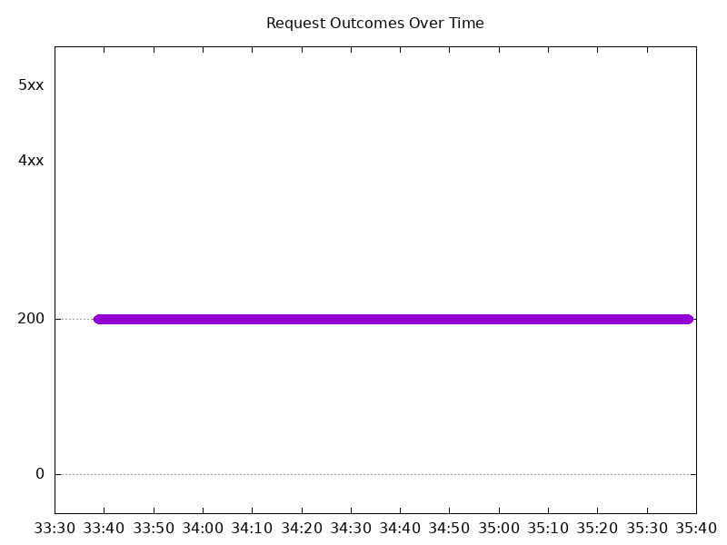

#### Test: Send https /tea traffic

```text
Requests      [total, rate, throughput]         12000, 100.01, 100.01
Duration      [total, attack, wait]             2m0s, 2m0s, 1.035ms
Latencies     [min, mean, 50, 90, 95, 99, max]  662.004µs, 1.128ms, 1.125ms, 1.275ms, 1.323ms, 1.45ms, 27.613ms
Bytes In      [total, mean]                     1849188, 154.10
Bytes Out     [total, mean]                     0, 0.00
Success       [ratio]                           100.00%
Status Codes  [code:count]                      200:12000  
Error Set:
```


## Multiple NGINX Pods run per node Test Results

### Scale Up Gradually

#### Test: Send http /coffee traffic

```text
Requests      [total, rate, throughput]         30000, 100.00, 100.00
Duration      [total, attack, wait]             5m0s, 5m0s, 1.424ms
Latencies     [min, mean, 50, 90, 95, 99, max]  606.284µs, 1.163ms, 1.148ms, 1.364ms, 1.45ms, 1.822ms, 23.642ms
Bytes In      [total, mean]                     4802963, 160.10
Bytes Out     [total, mean]                     0, 0.00
Success       [ratio]                           100.00%
Status Codes  [code:count]                      200:30000  
Error Set:
```

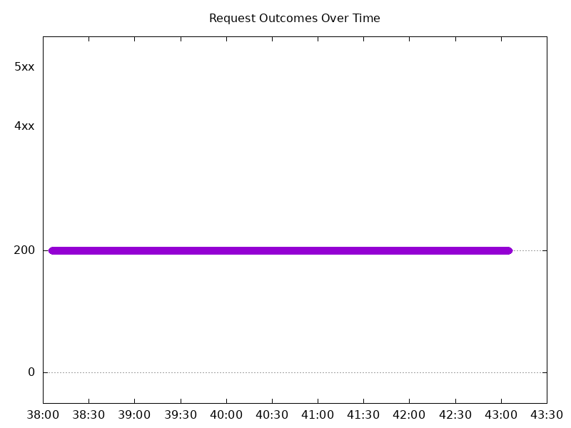

#### Test: Send https /tea traffic

```text
Requests      [total, rate, throughput]         30000, 100.00, 100.00
Duration      [total, attack, wait]             5m0s, 5m0s, 1.227ms
Latencies     [min, mean, 50, 90, 95, 99, max]  656.906µs, 1.226ms, 1.198ms, 1.411ms, 1.494ms, 1.89ms, 24.098ms
Bytes In      [total, mean]                     4622921, 154.10
Bytes Out     [total, mean]                     0, 0.00
Success       [ratio]                           100.00%
Status Codes  [code:count]                      200:30000  
Error Set:
```

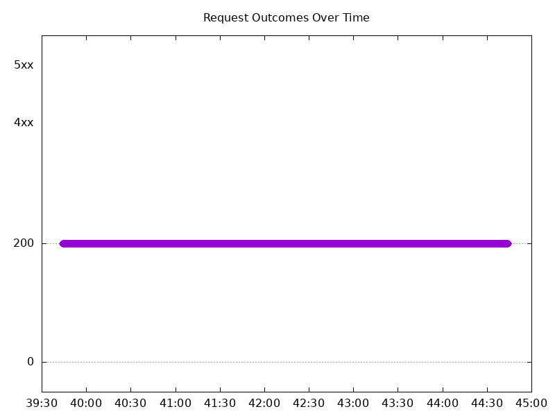

### Scale Down Gradually

#### Test: Send http /coffee traffic

```text
Requests      [total, rate, throughput]         96000, 100.00, 100.00
Duration      [total, attack, wait]             16m0s, 16m0s, 1.15ms
Latencies     [min, mean, 50, 90, 95, 99, max]  621.225µs, 1.216ms, 1.2ms, 1.42ms, 1.498ms, 1.762ms, 46.454ms
Bytes In      [total, mean]                     15369602, 160.10
Bytes Out     [total, mean]                     0, 0.00
Success       [ratio]                           100.00%
Status Codes  [code:count]                      200:96000  
Error Set:
```

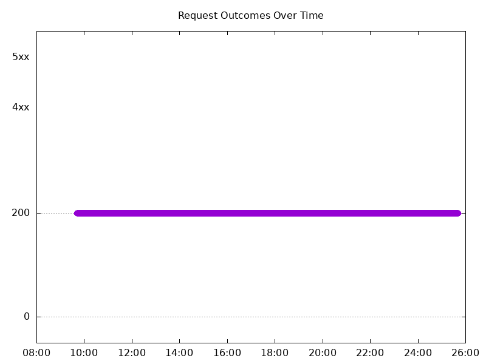

#### Test: Send https /tea traffic

```text
Requests      [total, rate, throughput]         96000, 100.00, 100.00
Duration      [total, attack, wait]             16m0s, 16m0s, 1.393ms
Latencies     [min, mean, 50, 90, 95, 99, max]  668.393µs, 1.28ms, 1.251ms, 1.484ms, 1.57ms, 1.889ms, 66.451ms
Bytes In      [total, mean]                     14793500, 154.10
Bytes Out     [total, mean]                     0, 0.00
Success       [ratio]                           100.00%
Status Codes  [code:count]                      200:96000  
Error Set:
```

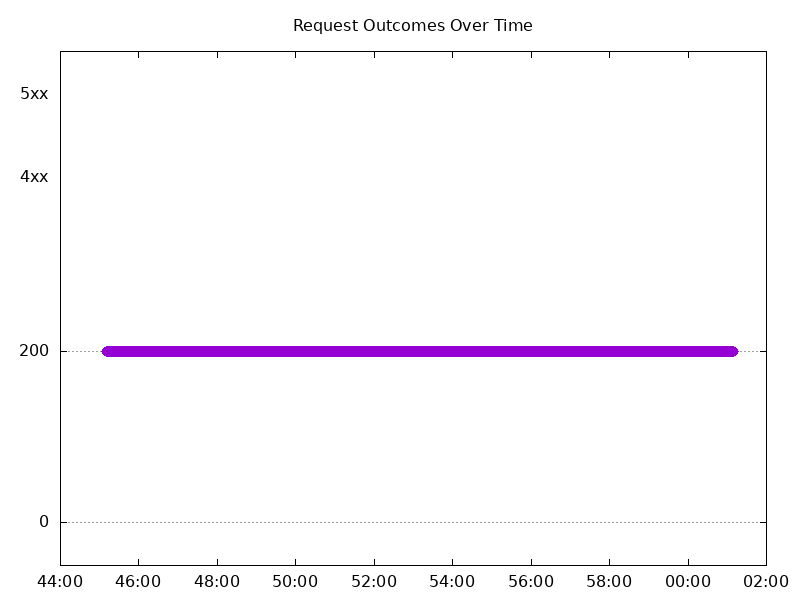

### Scale Up Abruptly

#### Test: Send http /coffee traffic

```text
Requests      [total, rate, throughput]         12000, 100.01, 100.01
Duration      [total, attack, wait]             2m0s, 2m0s, 1.662ms
Latencies     [min, mean, 50, 90, 95, 99, max]  660.472µs, 1.263ms, 1.224ms, 1.419ms, 1.478ms, 1.64ms, 114.375ms
Bytes In      [total, mean]                     1921121, 160.09
Bytes Out     [total, mean]                     0, 0.00
Success       [ratio]                           100.00%
Status Codes  [code:count]                      200:12000  
Error Set:
```

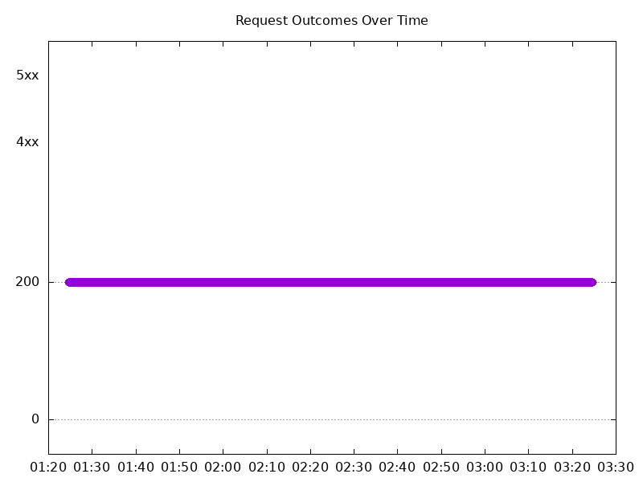

#### Test: Send https /tea traffic

```text
Requests      [total, rate, throughput]         12000, 100.01, 100.01
Duration      [total, attack, wait]             2m0s, 2m0s, 1.162ms
Latencies     [min, mean, 50, 90, 95, 99, max]  698.294µs, 1.303ms, 1.263ms, 1.459ms, 1.517ms, 1.66ms, 50.791ms
Bytes In      [total, mean]                     1849166, 154.10
Bytes Out     [total, mean]                     0, 0.00
Success       [ratio]                           100.00%
Status Codes  [code:count]                      200:12000  
Error Set:
```

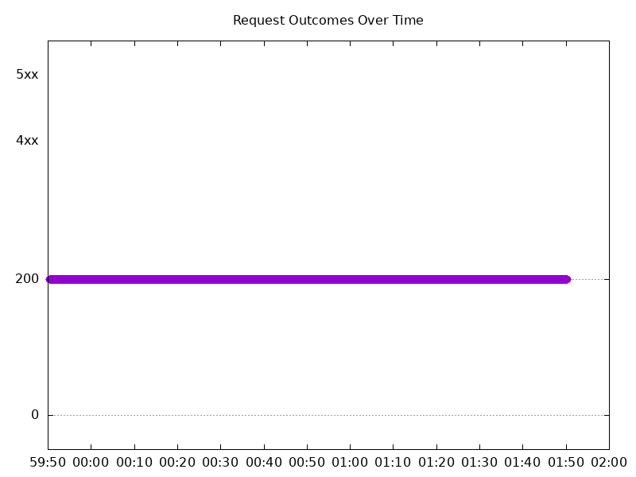

### Scale Down Abruptly

#### Test: Send http /coffee traffic

```text
Requests      [total, rate, throughput]         12000, 100.01, 100.01
Duration      [total, attack, wait]             2m0s, 2m0s, 1.422ms
Latencies     [min, mean, 50, 90, 95, 99, max]  691.331µs, 1.201ms, 1.2ms, 1.388ms, 1.446ms, 1.607ms, 34.517ms
Bytes In      [total, mean]                     1921157, 160.10
Bytes Out     [total, mean]                     0, 0.00
Success       [ratio]                           100.00%
Status Codes  [code:count]                      200:12000  
Error Set:
```

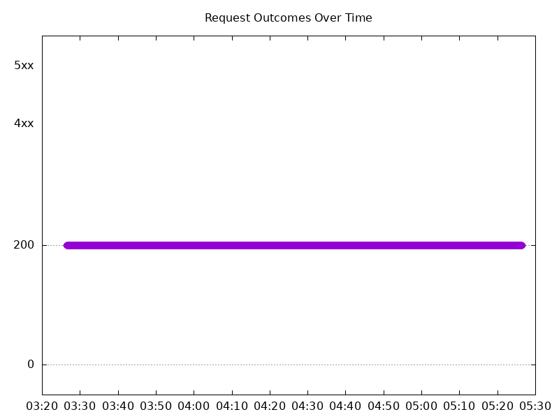

#### Test: Send https /tea traffic

```text
Requests      [total, rate, throughput]         12000, 100.01, 100.01
Duration      [total, attack, wait]             2m0s, 2m0s, 1.171ms
Latencies     [min, mean, 50, 90, 95, 99, max]  737.909µs, 1.274ms, 1.264ms, 1.458ms, 1.525ms, 1.718ms, 34.501ms
Bytes In      [total, mean]                     1849238, 154.10
Bytes Out     [total, mean]                     0, 0.00
Success       [ratio]                           100.00%
Status Codes  [code:count]                      200:12000  
Error Set:
```


