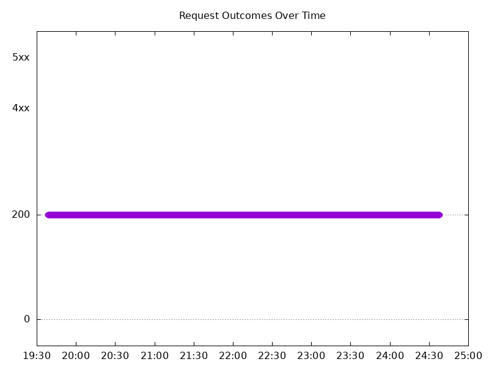
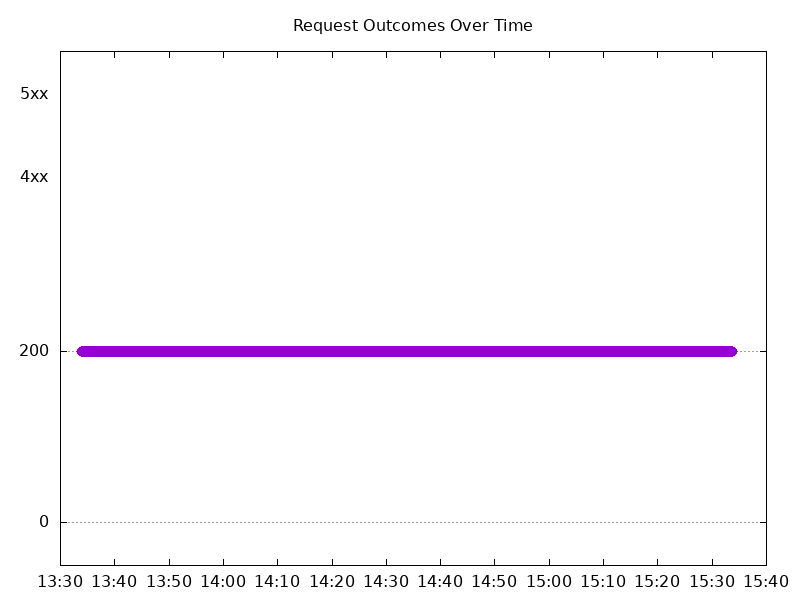
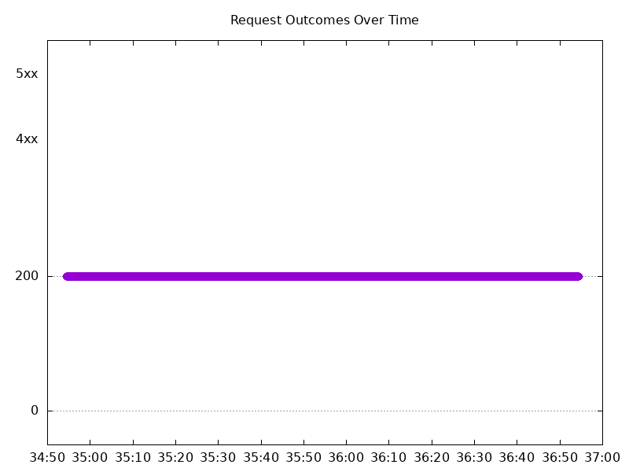
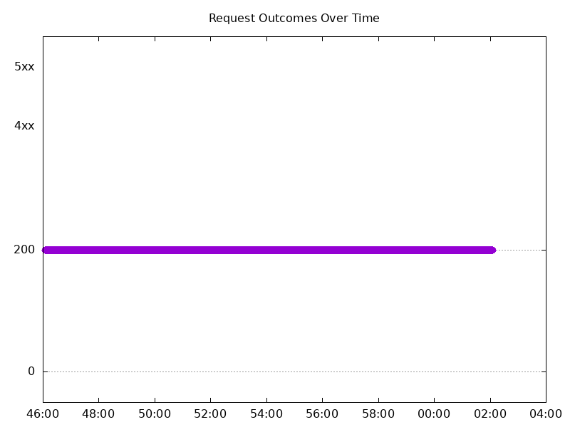
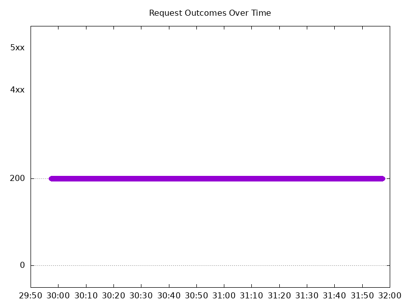

# Results

## Test environment

NGINX Plus: false

NGINX Gateway Fabric:

- Commit: cd422a074b2f5d3ac6db374b6bc9bb4bf1c67e59
- Date: 2026-05-15T14:36:06Z
- Dirty: false

GKE Cluster:

- Node count: 12
- k8s version: v1.35.3-gke.1389000
- vCPUs per node: 16
- RAM per node: 65848296Ki
- Max pods per node: 110
- Zone: us-west1-b
- Instance Type: n2d-standard-16

## One NGINX Pod runs per node Test Results

### Scale Up Gradually

#### Test: Send https /tea traffic

```text
Requests      [total, rate, throughput]         30000, 100.00, 100.00
Duration      [total, attack, wait]             5m0s, 5m0s, 1.073ms
Latencies     [min, mean, 50, 90, 95, 99, max]  646.179µs, 1.202ms, 1.173ms, 1.392ms, 1.473ms, 1.951ms, 20.515ms
Bytes In      [total, mean]                     4623123, 154.10
Bytes Out     [total, mean]                     0, 0.00
Success       [ratio]                           100.00%
Status Codes  [code:count]                      200:30000  
Error Set:
```



#### Test: Send http /coffee traffic

```text
Requests      [total, rate, throughput]         30000, 100.00, 100.00
Duration      [total, attack, wait]             5m0s, 5m0s, 1.18ms
Latencies     [min, mean, 50, 90, 95, 99, max]  637.98µs, 1.127ms, 1.108ms, 1.308ms, 1.386ms, 1.945ms, 20.235ms
Bytes In      [total, mean]                     4802985, 160.10
Bytes Out     [total, mean]                     0, 0.00
Success       [ratio]                           100.00%
Status Codes  [code:count]                      200:30000  
Error Set:
```


### Scale Down Gradually

#### Test: Send https /tea traffic

```text
Requests      [total, rate, throughput]         48000, 100.00, 100.00
Duration      [total, attack, wait]             8m0s, 8m0s, 1.387ms
Latencies     [min, mean, 50, 90, 95, 99, max]  709.579µs, 1.281ms, 1.25ms, 1.504ms, 1.594ms, 1.99ms, 38.276ms
Bytes In      [total, mean]                     7396709, 154.10
Bytes Out     [total, mean]                     0, 0.00
Success       [ratio]                           100.00%
Status Codes  [code:count]                      200:48000  
Error Set:
```


#### Test: Send http /coffee traffic

```text
Requests      [total, rate, throughput]         48000, 100.00, 100.00
Duration      [total, attack, wait]             8m0s, 8m0s, 1.066ms
Latencies     [min, mean, 50, 90, 95, 99, max]  638.505µs, 1.214ms, 1.194ms, 1.432ms, 1.516ms, 1.894ms, 41.135ms
Bytes In      [total, mean]                     7684744, 160.10
Bytes Out     [total, mean]                     0, 0.00
Success       [ratio]                           100.00%
Status Codes  [code:count]                      200:48000  
Error Set:
```


### Scale Up Abruptly

#### Test: Send https /tea traffic

```text
Requests      [total, rate, throughput]         12000, 100.01, 100.01
Duration      [total, attack, wait]             2m0s, 2m0s, 1.248ms
Latencies     [min, mean, 50, 90, 95, 99, max]  726.435µs, 1.255ms, 1.235ms, 1.466ms, 1.545ms, 1.867ms, 12.286ms
Bytes In      [total, mean]                     1849232, 154.10
Bytes Out     [total, mean]                     0, 0.00
Success       [ratio]                           100.00%
Status Codes  [code:count]                      200:12000  
Error Set:
```


#### Test: Send http /coffee traffic

```text
Requests      [total, rate, throughput]         12000, 100.01, 100.01
Duration      [total, attack, wait]             2m0s, 2m0s, 1.204ms
Latencies     [min, mean, 50, 90, 95, 99, max]  673.577µs, 1.205ms, 1.193ms, 1.431ms, 1.508ms, 1.839ms, 9.125ms
Bytes In      [total, mean]                     1921153, 160.10
Bytes Out     [total, mean]                     0, 0.00
Success       [ratio]                           100.00%
Status Codes  [code:count]                      200:12000  
Error Set:
```



### Scale Down Abruptly

#### Test: Send https /tea traffic

```text
Requests      [total, rate, throughput]         12000, 100.01, 100.01
Duration      [total, attack, wait]             2m0s, 2m0s, 1.218ms
Latencies     [min, mean, 50, 90, 95, 99, max]  766.268µs, 1.303ms, 1.271ms, 1.48ms, 1.56ms, 1.881ms, 77.568ms
Bytes In      [total, mean]                     1849199, 154.10
Bytes Out     [total, mean]                     0, 0.00
Success       [ratio]                           100.00%
Status Codes  [code:count]                      200:12000  
Error Set:
```


#### Test: Send http /coffee traffic

```text
Requests      [total, rate, throughput]         12000, 100.01, 100.01
Duration      [total, attack, wait]             2m0s, 2m0s, 1.23ms
Latencies     [min, mean, 50, 90, 95, 99, max]  687.757µs, 1.235ms, 1.206ms, 1.429ms, 1.51ms, 1.798ms, 69.889ms
Bytes In      [total, mean]                     1921217, 160.10
Bytes Out     [total, mean]                     0, 0.00
Success       [ratio]                           100.00%
Status Codes  [code:count]                      200:12000  
Error Set:
```



## Multiple NGINX Pods run per node Test Results

### Scale Up Gradually

#### Test: Send https /tea traffic

```text
Requests      [total, rate, throughput]         30000, 100.00, 100.00
Duration      [total, attack, wait]             5m0s, 5m0s, 1.063ms
Latencies     [min, mean, 50, 90, 95, 99, max]  700.936µs, 1.28ms, 1.238ms, 1.466ms, 1.567ms, 2.365ms, 27.543ms
Bytes In      [total, mean]                     4622987, 154.10
Bytes Out     [total, mean]                     0, 0.00
Success       [ratio]                           100.00%
Status Codes  [code:count]                      200:30000  
Error Set:
```


#### Test: Send http /coffee traffic

```text
Requests      [total, rate, throughput]         30000, 100.00, 100.00
Duration      [total, attack, wait]             5m0s, 5m0s, 1.264ms
Latencies     [min, mean, 50, 90, 95, 99, max]  649.792µs, 1.186ms, 1.164ms, 1.38ms, 1.467ms, 2.187ms, 26.584ms
Bytes In      [total, mean]                     4803008, 160.10
Bytes Out     [total, mean]                     0, 0.00
Success       [ratio]                           100.00%
Status Codes  [code:count]                      200:30000  
Error Set:
```


### Scale Down Gradually

#### Test: Send https /tea traffic

```text
Requests      [total, rate, throughput]         96000, 100.00, 100.00
Duration      [total, attack, wait]             16m0s, 16m0s, 1.371ms
Latencies     [min, mean, 50, 90, 95, 99, max]  696.292µs, 1.294ms, 1.26ms, 1.518ms, 1.614ms, 2.079ms, 48.386ms
Bytes In      [total, mean]                     14793387, 154.10
Bytes Out     [total, mean]                     0, 0.00
Success       [ratio]                           100.00%
Status Codes  [code:count]                      200:96000  
Error Set:
```


#### Test: Send http /coffee traffic

```text
Requests      [total, rate, throughput]         96000, 100.00, 100.00
Duration      [total, attack, wait]             16m0s, 16m0s, 1.35ms
Latencies     [min, mean, 50, 90, 95, 99, max]  649.469µs, 1.231ms, 1.204ms, 1.459ms, 1.554ms, 2.069ms, 45.746ms
Bytes In      [total, mean]                     15369623, 160.10
Bytes Out     [total, mean]                     0, 0.00
Success       [ratio]                           100.00%
Status Codes  [code:count]                      200:96000  
Error Set:
```



### Scale Up Abruptly

#### Test: Send https /tea traffic

```text
Requests      [total, rate, throughput]         12000, 100.01, 100.01
Duration      [total, attack, wait]             2m0s, 2m0s, 1.206ms
Latencies     [min, mean, 50, 90, 95, 99, max]  724.84µs, 1.331ms, 1.265ms, 1.48ms, 1.556ms, 2.056ms, 129.306ms
Bytes In      [total, mean]                     1849174, 154.10
Bytes Out     [total, mean]                     0, 0.00
Success       [ratio]                           100.00%
Status Codes  [code:count]                      200:12000  
Error Set:
```


#### Test: Send http /coffee traffic

```text
Requests      [total, rate, throughput]         12000, 100.01, 100.01
Duration      [total, attack, wait]             2m0s, 2m0s, 1.197ms
Latencies     [min, mean, 50, 90, 95, 99, max]  728.57µs, 1.295ms, 1.234ms, 1.443ms, 1.514ms, 1.943ms, 130.037ms
Bytes In      [total, mean]                     1921242, 160.10
Bytes Out     [total, mean]                     0, 0.00
Success       [ratio]                           100.00%
Status Codes  [code:count]                      200:12000  
Error Set:
```


### Scale Down Abruptly

#### Test: Send http /coffee traffic

```text
Requests      [total, rate, throughput]         12000, 100.01, 100.01
Duration      [total, attack, wait]             2m0s, 2m0s, 1.137ms
Latencies     [min, mean, 50, 90, 95, 99, max]  719.772µs, 1.214ms, 1.199ms, 1.416ms, 1.491ms, 1.741ms, 8.21ms
Bytes In      [total, mean]                     1921184, 160.10
Bytes Out     [total, mean]                     0, 0.00
Success       [ratio]                           100.00%
Status Codes  [code:count]                      200:12000  
Error Set:
```



#### Test: Send https /tea traffic

```text
Requests      [total, rate, throughput]         12000, 100.01, 100.01
Duration      [total, attack, wait]             2m0s, 2m0s, 1.377ms
Latencies     [min, mean, 50, 90, 95, 99, max]  741.051µs, 1.278ms, 1.256ms, 1.477ms, 1.554ms, 1.831ms, 12.449ms
Bytes In      [total, mean]                     1849226, 154.10
Bytes Out     [total, mean]                     0, 0.00
Success       [ratio]                           100.00%
Status Codes  [code:count]                      200:12000  
Error Set:
```


