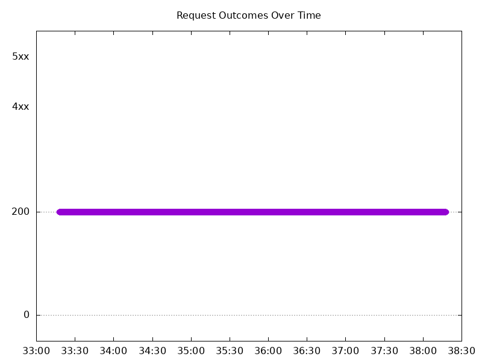
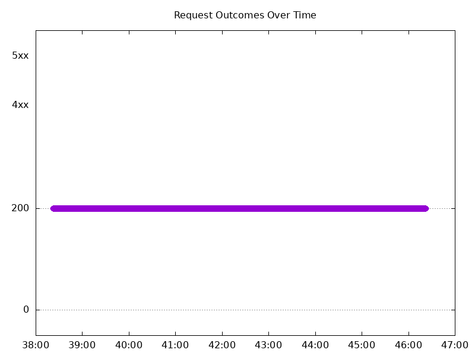
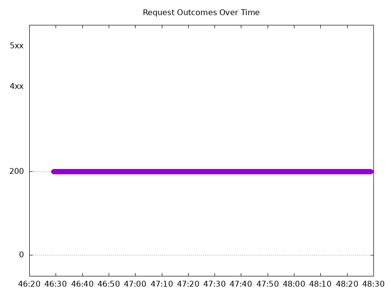
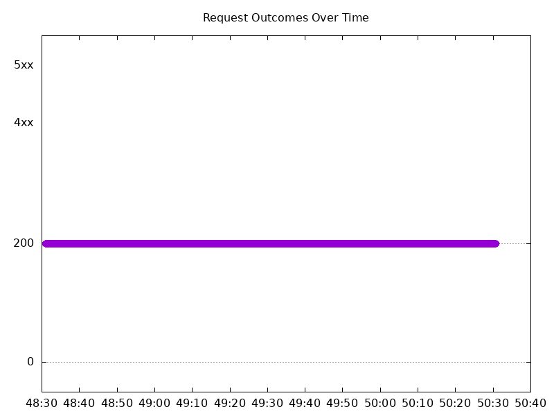
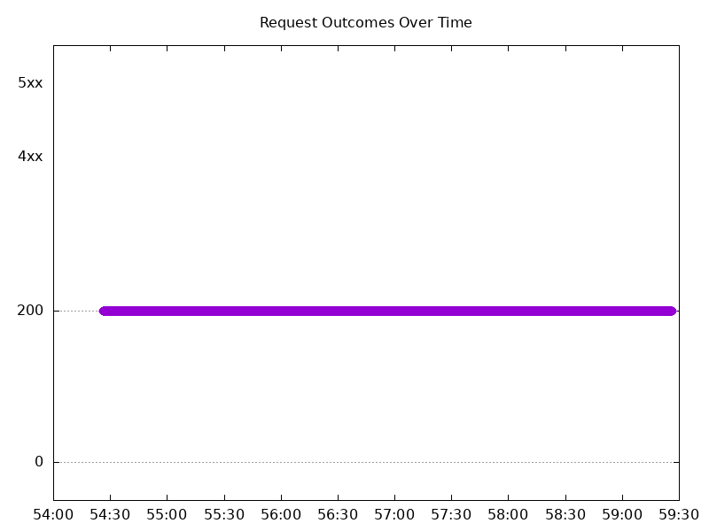
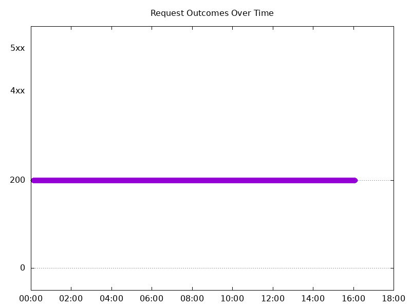
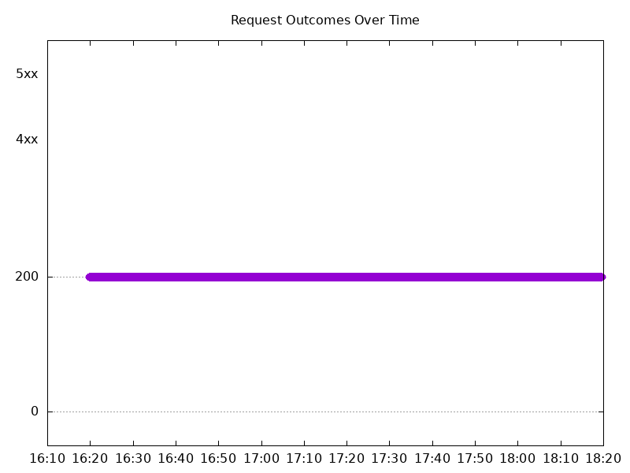
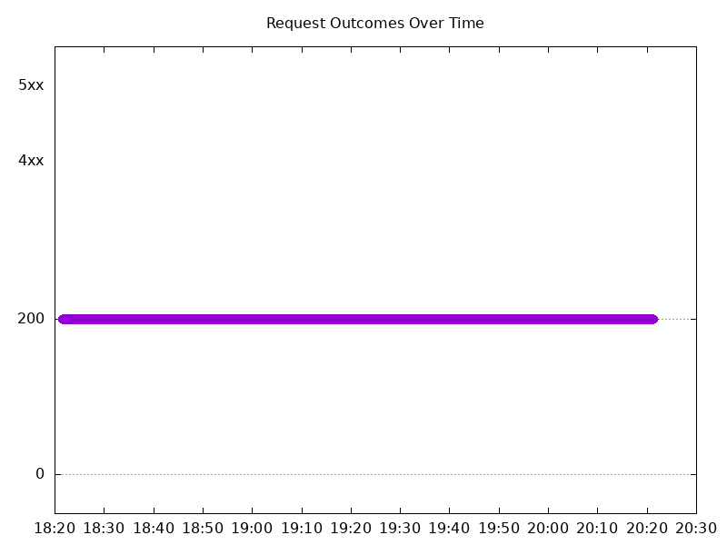

# Results

## Test environment

NGINX Plus: false

NGINX Gateway Fabric:

- Commit: 394bdf0e0c8ae008009546b7a21d8f80248d52be
- Date: 2026-07-30T17:54:44Z
- Dirty: false

GKE Cluster:

- Node count: 12
- k8s version: v1.35.6-gke.1250000
- vCPUs per node: 16
- RAM per node: 65848292Ki
- Max pods per node: 110
- Zone: us-west1-b
- Instance Type: n2d-standard-16

## One NGINX Pod runs per node Test Results

### Scale Up Gradually

#### Test: Send https /tea traffic

```text
Requests      [total, rate, throughput]         30000, 100.00, 100.00
Duration      [total, attack, wait]             5m0s, 5m0s, 1.196ms
Latencies     [min, mean, 50, 90, 95, 99, max]  700.807µs, 1.22ms, 1.189ms, 1.407ms, 1.512ms, 1.83ms, 18.362ms
Bytes In      [total, mean]                     4655905, 155.20
Bytes Out     [total, mean]                     0, 0.00
Success       [ratio]                           100.00%
Status Codes  [code:count]                      200:30000  
Error Set:
```



#### Test: Send http /coffee traffic

```text
Requests      [total, rate, throughput]         30000, 100.00, 100.00
Duration      [total, attack, wait]             5m0s, 5m0s, 1.029ms
Latencies     [min, mean, 50, 90, 95, 99, max]  627.347µs, 1.16ms, 1.137ms, 1.372ms, 1.471ms, 1.755ms, 17.485ms
Bytes In      [total, mean]                     4835956, 161.20
Bytes Out     [total, mean]                     0, 0.00
Success       [ratio]                           100.00%
Status Codes  [code:count]                      200:30000  
Error Set:
```


### Scale Down Gradually

#### Test: Send http /coffee traffic

```text
Requests      [total, rate, throughput]         48000, 100.00, 100.00
Duration      [total, attack, wait]             8m0s, 8m0s, 1.329ms
Latencies     [min, mean, 50, 90, 95, 99, max]  660.206µs, 1.177ms, 1.158ms, 1.35ms, 1.427ms, 1.696ms, 39.254ms
Bytes In      [total, mean]                     7737836, 161.20
Bytes Out     [total, mean]                     0, 0.00
Success       [ratio]                           100.00%
Status Codes  [code:count]                      200:48000  
Error Set:
```


#### Test: Send https /tea traffic

```text
Requests      [total, rate, throughput]         48000, 100.00, 100.00
Duration      [total, attack, wait]             8m0s, 8m0s, 1.24ms
Latencies     [min, mean, 50, 90, 95, 99, max]  715.163µs, 1.229ms, 1.205ms, 1.387ms, 1.472ms, 1.766ms, 40.496ms
Bytes In      [total, mean]                     7449573, 155.20
Bytes Out     [total, mean]                     0, 0.00
Success       [ratio]                           100.00%
Status Codes  [code:count]                      200:48000  
Error Set:
```



### Scale Up Abruptly

#### Test: Send https /tea traffic

```text
Requests      [total, rate, throughput]         12000, 100.01, 100.01
Duration      [total, attack, wait]             2m0s, 2m0s, 1.262ms
Latencies     [min, mean, 50, 90, 95, 99, max]  726.211µs, 1.189ms, 1.162ms, 1.294ms, 1.336ms, 1.574ms, 70.719ms
Bytes In      [total, mean]                     1862352, 155.20
Bytes Out     [total, mean]                     0, 0.00
Success       [ratio]                           100.00%
Status Codes  [code:count]                      200:12000  
Error Set:
```



#### Test: Send http /coffee traffic

```text
Requests      [total, rate, throughput]         12000, 100.01, 100.01
Duration      [total, attack, wait]             2m0s, 2m0s, 1.155ms
Latencies     [min, mean, 50, 90, 95, 99, max]  671.541µs, 1.151ms, 1.129ms, 1.266ms, 1.313ms, 1.518ms, 71.394ms
Bytes In      [total, mean]                     1934428, 161.20
Bytes Out     [total, mean]                     0, 0.00
Success       [ratio]                           100.00%
Status Codes  [code:count]                      200:12000  
Error Set:
```


### Scale Down Abruptly

#### Test: Send https /tea traffic

```text
Requests      [total, rate, throughput]         12000, 100.01, 100.01
Duration      [total, attack, wait]             2m0s, 2m0s, 1.177ms
Latencies     [min, mean, 50, 90, 95, 99, max]  690.709µs, 1.179ms, 1.165ms, 1.29ms, 1.329ms, 1.47ms, 33.043ms
Bytes In      [total, mean]                     1862387, 155.20
Bytes Out     [total, mean]                     0, 0.00
Success       [ratio]                           100.00%
Status Codes  [code:count]                      200:12000  
Error Set:
```



#### Test: Send http /coffee traffic

```text
Requests      [total, rate, throughput]         12000, 100.01, 100.01
Duration      [total, attack, wait]             2m0s, 2m0s, 1.083ms
Latencies     [min, mean, 50, 90, 95, 99, max]  704.603µs, 1.134ms, 1.125ms, 1.257ms, 1.298ms, 1.424ms, 32.623ms
Bytes In      [total, mean]                     1934423, 161.20
Bytes Out     [total, mean]                     0, 0.00
Success       [ratio]                           100.00%
Status Codes  [code:count]                      200:12000  
Error Set:
```


## Multiple NGINX Pods run per node Test Results

### Scale Up Gradually

#### Test: Send https /tea traffic

```text
Requests      [total, rate, throughput]         30000, 100.00, 100.00
Duration      [total, attack, wait]             5m0s, 5m0s, 1.091ms
Latencies     [min, mean, 50, 90, 95, 99, max]  724.246µs, 1.246ms, 1.219ms, 1.385ms, 1.458ms, 1.921ms, 30.618ms
Bytes In      [total, mean]                     4656002, 155.20
Bytes Out     [total, mean]                     0, 0.00
Success       [ratio]                           100.00%
Status Codes  [code:count]                      200:30000  
Error Set:
```


#### Test: Send http /coffee traffic

```text
Requests      [total, rate, throughput]         30000, 100.00, 100.00
Duration      [total, attack, wait]             5m0s, 5m0s, 1.243ms
Latencies     [min, mean, 50, 90, 95, 99, max]  615.945µs, 1.186ms, 1.172ms, 1.336ms, 1.399ms, 1.806ms, 29.389ms
Bytes In      [total, mean]                     4835978, 161.20
Bytes Out     [total, mean]                     0, 0.00
Success       [ratio]                           100.00%
Status Codes  [code:count]                      200:30000  
Error Set:
```



### Scale Down Gradually

#### Test: Send https /tea traffic

```text
Requests      [total, rate, throughput]         96000, 100.00, 100.00
Duration      [total, attack, wait]             16m0s, 16m0s, 1.245ms
Latencies     [min, mean, 50, 90, 95, 99, max]  717.997µs, 1.227ms, 1.195ms, 1.345ms, 1.397ms, 1.716ms, 113.946ms
Bytes In      [total, mean]                     14899057, 155.20
Bytes Out     [total, mean]                     0, 0.00
Success       [ratio]                           100.00%
Status Codes  [code:count]                      200:96000  
Error Set:
```



#### Test: Send http /coffee traffic

```text
Requests      [total, rate, throughput]         96000, 100.00, 100.00
Duration      [total, attack, wait]             16m0s, 16m0s, 1.265ms
Latencies     [min, mean, 50, 90, 95, 99, max]  645.142µs, 1.165ms, 1.144ms, 1.298ms, 1.349ms, 1.642ms, 126.73ms
Bytes In      [total, mean]                     15475111, 161.20
Bytes Out     [total, mean]                     0, 0.00
Success       [ratio]                           100.00%
Status Codes  [code:count]                      200:96000  
Error Set:
```


### Scale Up Abruptly

#### Test: Send http /coffee traffic

```text
Requests      [total, rate, throughput]         12000, 100.01, 100.01
Duration      [total, attack, wait]             2m0s, 2m0s, 1.241ms
Latencies     [min, mean, 50, 90, 95, 99, max]  699.297µs, 1.122ms, 1.119ms, 1.255ms, 1.3ms, 1.465ms, 11.624ms
Bytes In      [total, mean]                     1934314, 161.19
Bytes Out     [total, mean]                     0, 0.00
Success       [ratio]                           100.00%
Status Codes  [code:count]                      200:12000  
Error Set:
```



#### Test: Send https /tea traffic

```text
Requests      [total, rate, throughput]         12000, 100.01, 100.01
Duration      [total, attack, wait]             2m0s, 2m0s, 1.428ms
Latencies     [min, mean, 50, 90, 95, 99, max]  707.926µs, 1.176ms, 1.168ms, 1.309ms, 1.361ms, 1.636ms, 11.518ms
Bytes In      [total, mean]                     1862476, 155.21
Bytes Out     [total, mean]                     0, 0.00
Success       [ratio]                           100.00%
Status Codes  [code:count]                      200:12000  
Error Set:
```


### Scale Down Abruptly

#### Test: Send http /coffee traffic

```text
Requests      [total, rate, throughput]         12000, 100.01, 100.01
Duration      [total, attack, wait]             2m0s, 2m0s, 1.171ms
Latencies     [min, mean, 50, 90, 95, 99, max]  667.939µs, 1.16ms, 1.115ms, 1.263ms, 1.312ms, 1.521ms, 145.225ms
Bytes In      [total, mean]                     1934471, 161.21
Bytes Out     [total, mean]                     0, 0.00
Success       [ratio]                           100.00%
Status Codes  [code:count]                      200:12000  
Error Set:
```



#### Test: Send https /tea traffic

```text
Requests      [total, rate, throughput]         12000, 100.01, 100.01
Duration      [total, attack, wait]             2m0s, 2m0s, 1.216ms
Latencies     [min, mean, 50, 90, 95, 99, max]  753.943µs, 1.212ms, 1.159ms, 1.298ms, 1.349ms, 1.563ms, 129.125ms
Bytes In      [total, mean]                     1862362, 155.20
Bytes Out     [total, mean]                     0, 0.00
Success       [ratio]                           100.00%
Status Codes  [code:count]                      200:12000  
Error Set:
```


