# Results

## Test environment

NGINX Plus: true

NGINX Gateway Fabric:

- Commit: 89aee48bf6e660a828ffd32ca35fc7f52e358e00
- Date: 2025-12-12T20:04:38Z
- Dirty: false

GKE Cluster:

- Node count: 12
- k8s version: v1.33.5-gke.1308000
- vCPUs per node: 16
- RAM per node: 65851520Ki
- Max pods per node: 110
- Zone: us-west1-b
- Instance Type: n2d-standard-16

## One NGINX Pod runs per node Test Results

### Scale Up Gradually

#### Test: Send http /coffee traffic

```text
Requests      [total, rate, throughput]         30000, 100.00, 100.00
Duration      [total, attack, wait]             5m0s, 5m0s, 1.366ms
Latencies     [min, mean, 50, 90, 95, 99, max]  590.769µs, 1.029ms, 1.022ms, 1.175ms, 1.229ms, 1.477ms, 18.696ms
Bytes In      [total, mean]                     4866001, 162.20
Bytes Out     [total, mean]                     0, 0.00
Success       [ratio]                           100.00%
Status Codes  [code:count]                      200:30000  
Error Set:
```

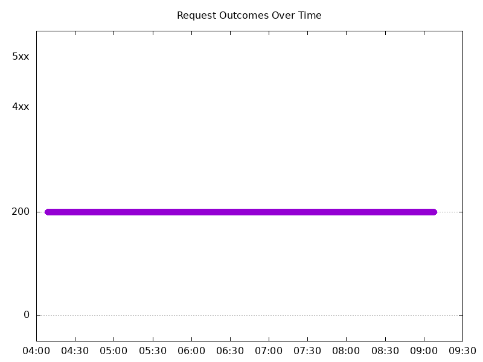

#### Test: Send https /tea traffic

```text
Requests      [total, rate, throughput]         30000, 100.00, 100.00
Duration      [total, attack, wait]             5m0s, 5m0s, 1.246ms
Latencies     [min, mean, 50, 90, 95, 99, max]  611.225µs, 1.072ms, 1.066ms, 1.209ms, 1.266ms, 1.519ms, 18.988ms
Bytes In      [total, mean]                     4685860, 156.20
Bytes Out     [total, mean]                     0, 0.00
Success       [ratio]                           100.00%
Status Codes  [code:count]                      200:30000  
Error Set:
```

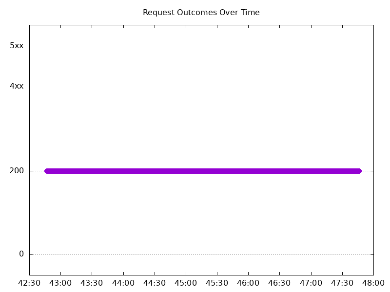

### Scale Down Gradually

#### Test: Send http /coffee traffic

```text
Requests      [total, rate, throughput]         48000, 100.00, 100.00
Duration      [total, attack, wait]             8m0s, 8m0s, 1.199ms
Latencies     [min, mean, 50, 90, 95, 99, max]  599.898µs, 1.039ms, 1.036ms, 1.188ms, 1.239ms, 1.416ms, 35.756ms
Bytes In      [total, mean]                     7785643, 162.20
Bytes Out     [total, mean]                     0, 0.00
Success       [ratio]                           100.00%
Status Codes  [code:count]                      200:48000  
Error Set:
```

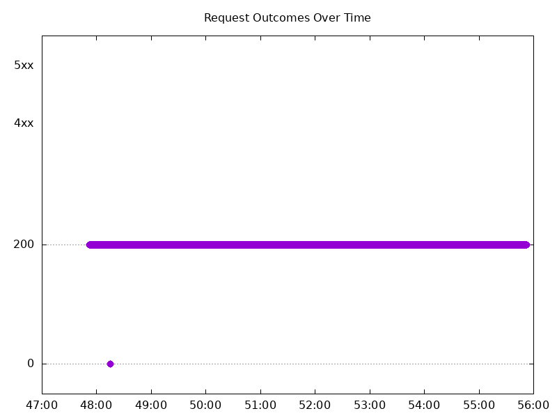

#### Test: Send https /tea traffic

```text
Requests      [total, rate, throughput]         48000, 100.00, 100.00
Duration      [total, attack, wait]             8m0s, 8m0s, 1.146ms
Latencies     [min, mean, 50, 90, 95, 99, max]  615.726µs, 1.083ms, 1.079ms, 1.222ms, 1.273ms, 1.47ms, 36.538ms
Bytes In      [total, mean]                     7497708, 156.20
Bytes Out     [total, mean]                     0, 0.00
Success       [ratio]                           100.00%
Status Codes  [code:count]                      200:48000  
Error Set:
```

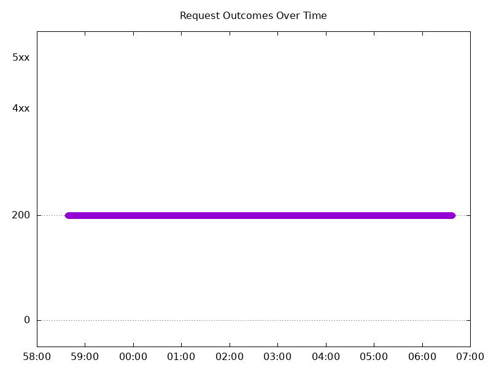

### Scale Up Abruptly

#### Test: Send https /tea traffic

```text
Requests      [total, rate, throughput]         12000, 100.01, 100.01
Duration      [total, attack, wait]             2m0s, 2m0s, 1.045ms
Latencies     [min, mean, 50, 90, 95, 99, max]  623.844µs, 1.072ms, 1.07ms, 1.205ms, 1.25ms, 1.411ms, 12.095ms
Bytes In      [total, mean]                     1874487, 156.21
Bytes Out     [total, mean]                     0, 0.00
Success       [ratio]                           100.00%
Status Codes  [code:count]                      200:12000  
Error Set:
```

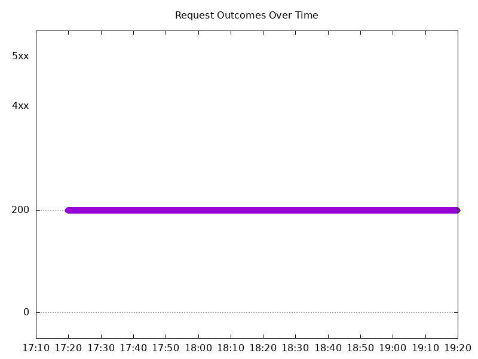

#### Test: Send http /coffee traffic

```text
Requests      [total, rate, throughput]         12000, 100.01, 100.01
Duration      [total, attack, wait]             2m0s, 2m0s, 1.138ms
Latencies     [min, mean, 50, 90, 95, 99, max]  598.854µs, 1.04ms, 1.04ms, 1.19ms, 1.235ms, 1.377ms, 12.3ms
Bytes In      [total, mean]                     1946441, 162.20
Bytes Out     [total, mean]                     0, 0.00
Success       [ratio]                           100.00%
Status Codes  [code:count]                      200:12000  
Error Set:
```

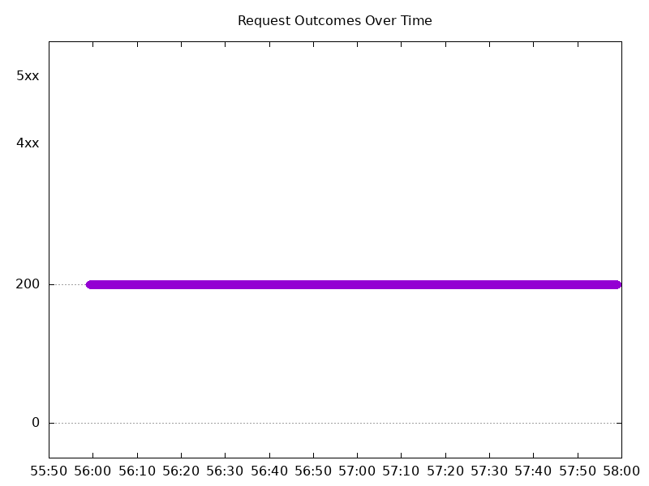

### Scale Down Abruptly

#### Test: Send https /tea traffic

```text
Requests      [total, rate, throughput]         12000, 100.01, 100.01
Duration      [total, attack, wait]             2m0s, 2m0s, 1.348ms
Latencies     [min, mean, 50, 90, 95, 99, max]  659.577µs, 1.104ms, 1.093ms, 1.238ms, 1.287ms, 1.437ms, 55.84ms
Bytes In      [total, mean]                     1874336, 156.19
Bytes Out     [total, mean]                     0, 0.00
Success       [ratio]                           100.00%
Status Codes  [code:count]                      200:12000  
Error Set:
```

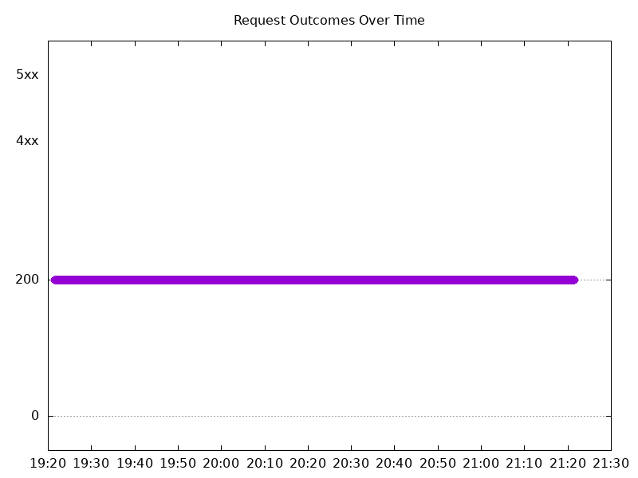

#### Test: Send http /coffee traffic

```text
Requests      [total, rate, throughput]         12000, 100.01, 100.01
Duration      [total, attack, wait]             2m0s, 2m0s, 1.194ms
Latencies     [min, mean, 50, 90, 95, 99, max]  606.934µs, 1.063ms, 1.054ms, 1.216ms, 1.262ms, 1.413ms, 56.205ms
Bytes In      [total, mean]                     1946401, 162.20
Bytes Out     [total, mean]                     0, 0.00
Success       [ratio]                           100.00%
Status Codes  [code:count]                      200:12000  
Error Set:
```

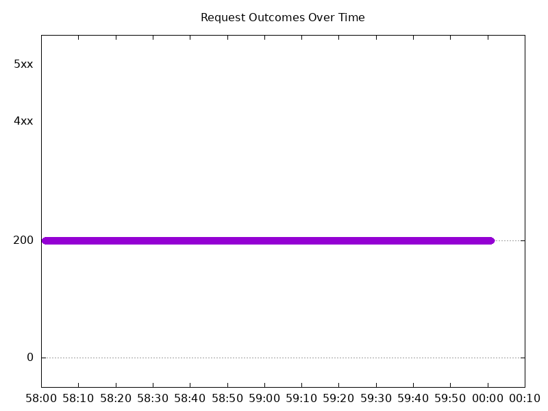

## Multiple NGINX Pods run per node Test Results

### Scale Up Gradually

#### Test: Send https /tea traffic

```text
Requests      [total, rate, throughput]         30000, 100.00, 100.00
Duration      [total, attack, wait]             5m0s, 5m0s, 1.007ms
Latencies     [min, mean, 50, 90, 95, 99, max]  601.869µs, 1.077ms, 1.067ms, 1.22ms, 1.276ms, 1.588ms, 19.103ms
Bytes In      [total, mean]                     4686058, 156.20
Bytes Out     [total, mean]                     0, 0.00
Success       [ratio]                           100.00%
Status Codes  [code:count]                      200:30000  
Error Set:
```

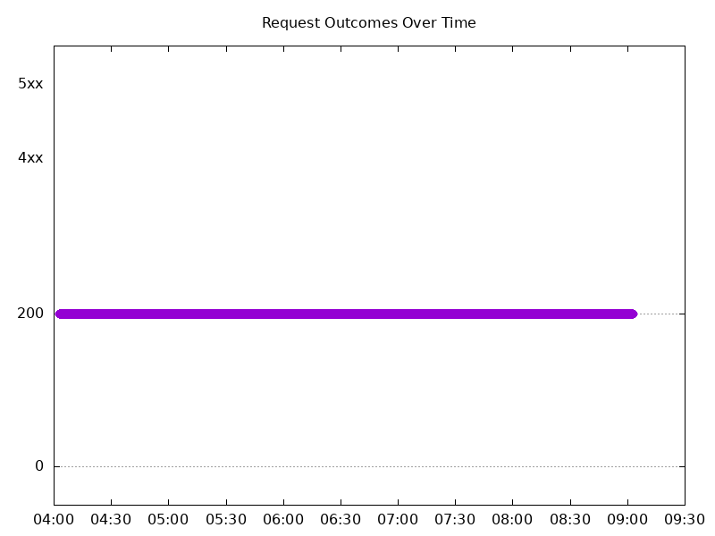

#### Test: Send http /coffee traffic

```text
Requests      [total, rate, throughput]         30000, 100.00, 100.00
Duration      [total, attack, wait]             5m0s, 5m0s, 778.992µs
Latencies     [min, mean, 50, 90, 95, 99, max]  561.553µs, 1.032ms, 1.023ms, 1.181ms, 1.236ms, 1.533ms, 19.108ms
Bytes In      [total, mean]                     4866047, 162.20
Bytes Out     [total, mean]                     0, 0.00
Success       [ratio]                           100.00%
Status Codes  [code:count]                      200:30000  
Error Set:
```

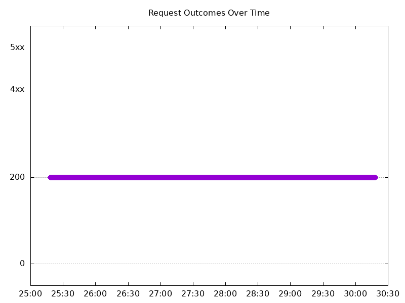

### Scale Down Gradually

#### Test: Send https /tea traffic

```text
Requests      [total, rate, throughput]         96000, 100.00, 100.00
Duration      [total, attack, wait]             16m0s, 16m0s, 1.105ms
Latencies     [min, mean, 50, 90, 95, 99, max]  609.103µs, 1.084ms, 1.076ms, 1.224ms, 1.279ms, 1.517ms, 52.476ms
Bytes In      [total, mean]                     14995375, 156.20
Bytes Out     [total, mean]                     0, 0.00
Success       [ratio]                           100.00%
Status Codes  [code:count]                      200:96000  
Error Set:
```

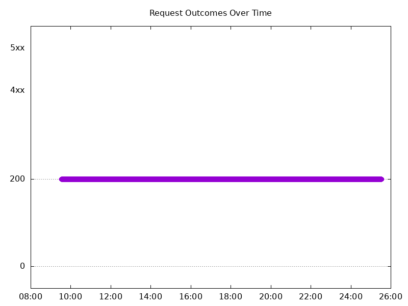

#### Test: Send http /coffee traffic

```text
Requests      [total, rate, throughput]         96000, 100.00, 100.00
Duration      [total, attack, wait]             16m0s, 16m0s, 1.17ms
Latencies     [min, mean, 50, 90, 95, 99, max]  578.883µs, 1.036ms, 1.03ms, 1.186ms, 1.236ms, 1.449ms, 44.578ms
Bytes In      [total, mean]                     15571144, 162.20
Bytes Out     [total, mean]                     0, 0.00
Success       [ratio]                           100.00%
Status Codes  [code:count]                      200:96000  
Error Set:
```


### Scale Up Abruptly

#### Test: Send https /tea traffic

```text
Requests      [total, rate, throughput]         12000, 100.01, 100.01
Duration      [total, attack, wait]             2m0s, 2m0s, 1.032ms
Latencies     [min, mean, 50, 90, 95, 99, max]  639.994µs, 1.082ms, 1.08ms, 1.214ms, 1.264ms, 1.448ms, 10.383ms
Bytes In      [total, mean]                     1874453, 156.20
Bytes Out     [total, mean]                     0, 0.00
Success       [ratio]                           100.00%
Status Codes  [code:count]                      200:12000  
Error Set:
```

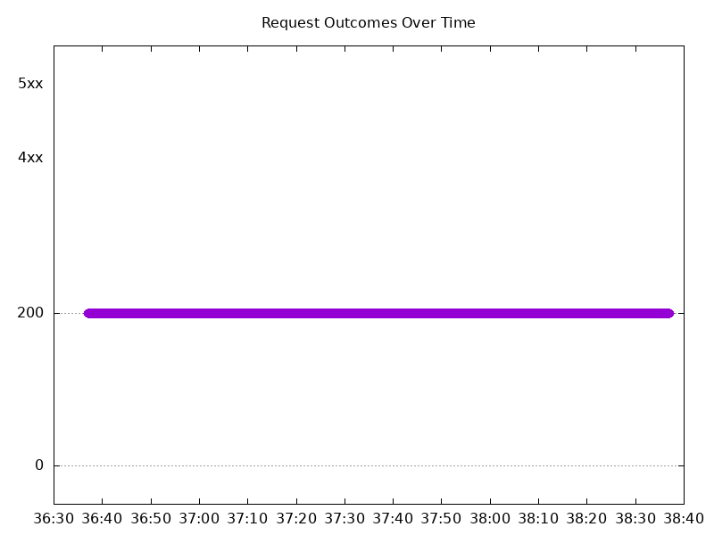

#### Test: Send http /coffee traffic

```text
Requests      [total, rate, throughput]         12000, 100.01, 100.01
Duration      [total, attack, wait]             2m0s, 2m0s, 989.701µs
Latencies     [min, mean, 50, 90, 95, 99, max]  575.716µs, 1.041ms, 1.043ms, 1.197ms, 1.245ms, 1.396ms, 4.02ms
Bytes In      [total, mean]                     1946381, 162.20
Bytes Out     [total, mean]                     0, 0.00
Success       [ratio]                           100.00%
Status Codes  [code:count]                      200:12000  
Error Set:
```

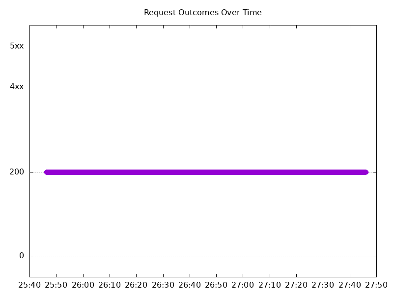

### Scale Down Abruptly

#### Test: Send https /tea traffic

```text
Requests      [total, rate, throughput]         12000, 100.01, 100.01
Duration      [total, attack, wait]             2m0s, 2m0s, 1.083ms
Latencies     [min, mean, 50, 90, 95, 99, max]  663.648µs, 1.12ms, 1.076ms, 1.209ms, 1.253ms, 1.383ms, 114.847ms
Bytes In      [total, mean]                     1874471, 156.21
Bytes Out     [total, mean]                     0, 0.00
Success       [ratio]                           100.00%
Status Codes  [code:count]                      200:12000  
Error Set:
```


#### Test: Send http /coffee traffic

```text
Requests      [total, rate, throughput]         12000, 100.01, 100.01
Duration      [total, attack, wait]             2m0s, 2m0s, 1.175ms
Latencies     [min, mean, 50, 90, 95, 99, max]  577.346µs, 1.059ms, 1.023ms, 1.175ms, 1.22ms, 1.363ms, 125.23ms
Bytes In      [total, mean]                     1946367, 162.20
Bytes Out     [total, mean]                     0, 0.00
Success       [ratio]                           100.00%
Status Codes  [code:count]                      200:12000  
Error Set:
```

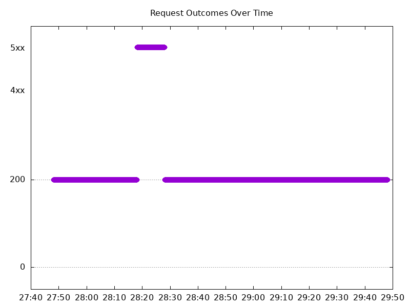
