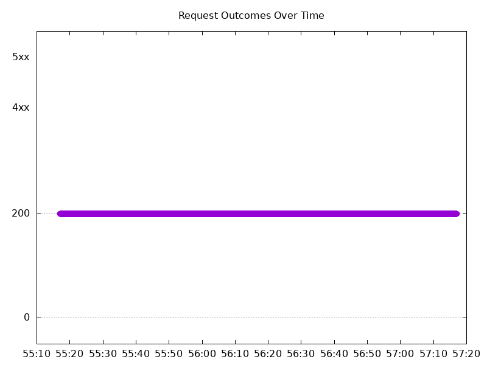
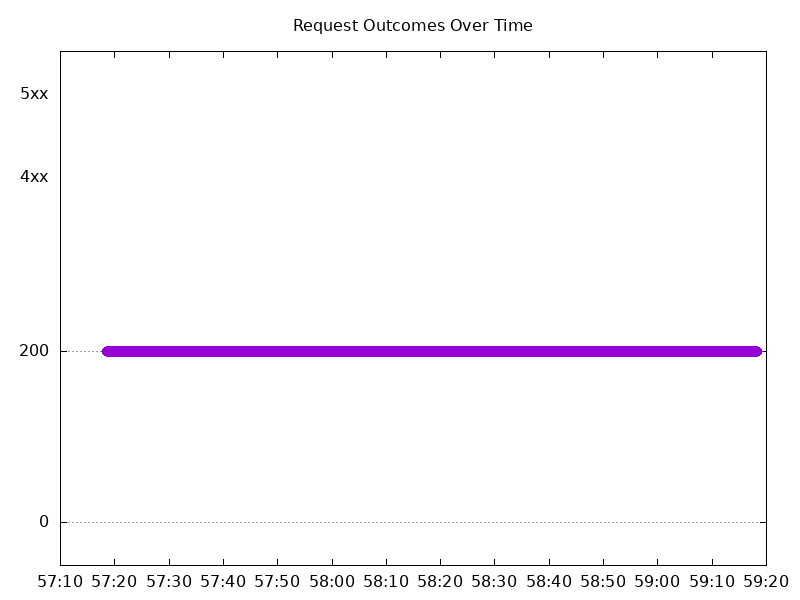
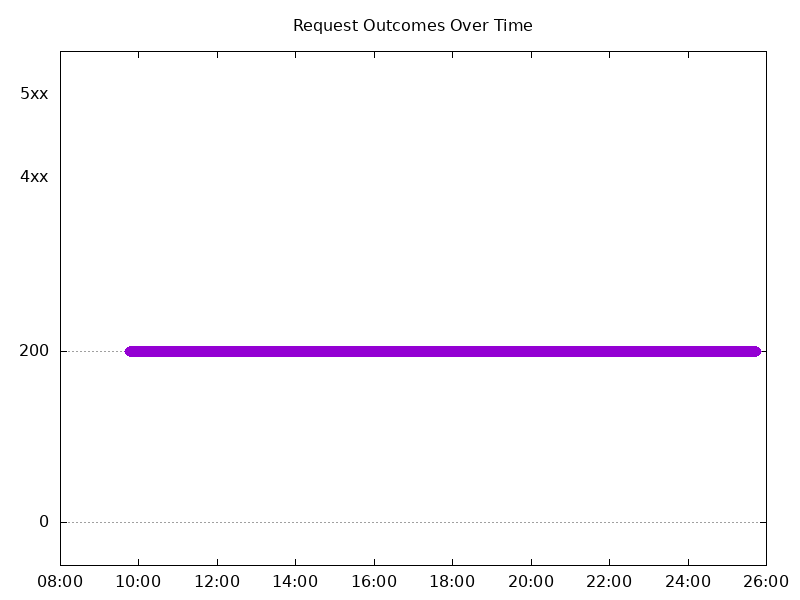
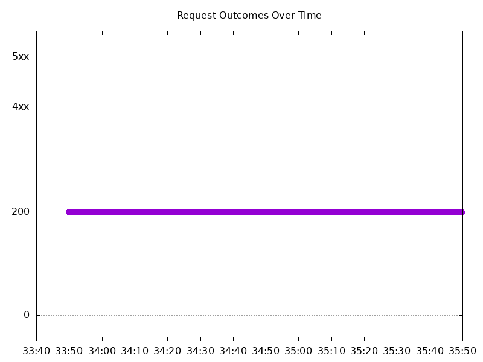

# Results

## Test environment

NGINX Plus: true

NGINX Gateway Fabric:

- Commit: abb4c6861bf41b5b3786b982af13408da5ec3db5
- Date: 2026-06-15T16:55:34Z
- Dirty: false

GKE Cluster:

- Node count: 12
- k8s version: v1.35.5-gke.1000000
- vCPUs per node: 16
- RAM per node: 65848300Ki
- Max pods per node: 110
- Zone: us-west1-b
- Instance Type: n2d-standard-16

## One NGINX Pod runs per node Test Results

### Scale Up Gradually

#### Test: Send http /coffee traffic

```text
Requests      [total, rate, throughput]         30000, 100.00, 100.00
Duration      [total, attack, wait]             5m0s, 5m0s, 1.011ms
Latencies     [min, mean, 50, 90, 95, 99, max]  642.436µs, 1.068ms, 1.052ms, 1.238ms, 1.306ms, 1.581ms, 13.679ms
Bytes In      [total, mean]                     4775907, 159.20
Bytes Out     [total, mean]                     0, 0.00
Success       [ratio]                           100.00%
Status Codes  [code:count]                      200:30000  
Error Set:
```


#### Test: Send https /tea traffic

```text
Requests      [total, rate, throughput]         30000, 100.00, 100.00
Duration      [total, attack, wait]             5m0s, 5m0s, 1.171ms
Latencies     [min, mean, 50, 90, 95, 99, max]  615.628µs, 1.128ms, 1.111ms, 1.294ms, 1.362ms, 1.675ms, 13.654ms
Bytes In      [total, mean]                     4595909, 153.20
Bytes Out     [total, mean]                     0, 0.00
Success       [ratio]                           100.00%
Status Codes  [code:count]                      200:30000  
Error Set:
```


### Scale Down Gradually

#### Test: Send http /coffee traffic

```text
Requests      [total, rate, throughput]         48000, 100.00, 99.99
Duration      [total, attack, wait]             8m0s, 8m0s, 7.277ms
Latencies     [min, mean, 50, 90, 95, 99, max]  216.079µs, 1.14ms, 1.085ms, 1.369ms, 1.493ms, 1.811ms, 250.281ms
Bytes In      [total, mean]                     7641142, 159.19
Bytes Out     [total, mean]                     0, 0.00
Success       [ratio]                           99.99%
Status Codes  [code:count]                      0:3  200:47997  
Error Set:
Get "http://cafe.example.com/coffee": dial tcp 0.0.0.0:0->10.138.15.197:80: connect: network is unreachable
```


#### Test: Send https /tea traffic

```text
Requests      [total, rate, throughput]         48000, 100.00, 100.00
Duration      [total, attack, wait]             8m0s, 8m0s, 1.288ms
Latencies     [min, mean, 50, 90, 95, 99, max]  291.372µs, 1.201ms, 1.126ms, 1.413ms, 1.529ms, 1.818ms, 260.91ms
Bytes In      [total, mean]                     7353375, 153.20
Bytes Out     [total, mean]                     0, 0.00
Success       [ratio]                           100.00%
Status Codes  [code:count]                      0:1  200:47999  
Error Set:
Get "https://cafe.example.com/tea": dial tcp 0.0.0.0:0->10.138.15.197:443: connect: network is unreachable
```


### Scale Up Abruptly

#### Test: Send https /tea traffic

```text
Requests      [total, rate, throughput]         12000, 100.01, 100.01
Duration      [total, attack, wait]             2m0s, 2m0s, 1.568ms
Latencies     [min, mean, 50, 90, 95, 99, max]  699.046µs, 1.409ms, 1.356ms, 1.669ms, 1.759ms, 2.01ms, 55.479ms
Bytes In      [total, mean]                     1838433, 153.20
Bytes Out     [total, mean]                     0, 0.00
Success       [ratio]                           100.00%
Status Codes  [code:count]                      200:12000  
Error Set:
```


#### Test: Send http /coffee traffic

```text
Requests      [total, rate, throughput]         12000, 100.01, 100.01
Duration      [total, attack, wait]             2m0s, 2m0s, 1.912ms
Latencies     [min, mean, 50, 90, 95, 99, max]  670.752µs, 1.384ms, 1.308ms, 1.661ms, 1.75ms, 1.992ms, 120.469ms
Bytes In      [total, mean]                     1910366, 159.20
Bytes Out     [total, mean]                     0, 0.00
Success       [ratio]                           100.00%
Status Codes  [code:count]                      200:12000  
Error Set:
```



### Scale Down Abruptly

#### Test: Send http /coffee traffic

```text
Requests      [total, rate, throughput]         12000, 100.01, 100.01
Duration      [total, attack, wait]             2m0s, 2m0s, 1.385ms
Latencies     [min, mean, 50, 90, 95, 99, max]  688.704µs, 1.169ms, 1.116ms, 1.458ms, 1.566ms, 1.779ms, 40.737ms
Bytes In      [total, mean]                     1910410, 159.20
Bytes Out     [total, mean]                     0, 0.00
Success       [ratio]                           100.00%
Status Codes  [code:count]                      200:12000  
Error Set:
```



#### Test: Send https /tea traffic

```text
Requests      [total, rate, throughput]         12000, 100.01, 100.01
Duration      [total, attack, wait]             2m0s, 2m0s, 1.192ms
Latencies     [min, mean, 50, 90, 95, 99, max]  734.126µs, 1.246ms, 1.179ms, 1.505ms, 1.605ms, 1.822ms, 44.616ms
Bytes In      [total, mean]                     1838359, 153.20
Bytes Out     [total, mean]                     0, 0.00
Success       [ratio]                           100.00%
Status Codes  [code:count]                      200:12000  
Error Set:
```


## Multiple NGINX Pods run per node Test Results

### Scale Up Gradually

#### Test: Send http /coffee traffic

```text
Requests      [total, rate, throughput]         30000, 100.00, 100.00
Duration      [total, attack, wait]             5m0s, 5m0s, 1.138ms
Latencies     [min, mean, 50, 90, 95, 99, max]  598.644µs, 1.102ms, 1.082ms, 1.278ms, 1.35ms, 1.806ms, 26.075ms
Bytes In      [total, mean]                     4778990, 159.30
Bytes Out     [total, mean]                     0, 0.00
Success       [ratio]                           100.00%
Status Codes  [code:count]                      200:30000  
Error Set:
```


#### Test: Send https /tea traffic

```text
Requests      [total, rate, throughput]         30000, 100.00, 100.00
Duration      [total, attack, wait]             5m0s, 5m0s, 1.083ms
Latencies     [min, mean, 50, 90, 95, 99, max]  674.92µs, 1.163ms, 1.135ms, 1.34ms, 1.42ms, 1.945ms, 27.005ms
Bytes In      [total, mean]                     4599022, 153.30
Bytes Out     [total, mean]                     0, 0.00
Success       [ratio]                           100.00%
Status Codes  [code:count]                      200:30000  
Error Set:
```


### Scale Down Gradually

#### Test: Send https /tea traffic

```text
Requests      [total, rate, throughput]         96000, 100.00, 100.00
Duration      [total, attack, wait]             16m0s, 16m0s, 1.363ms
Latencies     [min, mean, 50, 90, 95, 99, max]  670.444µs, 1.251ms, 1.217ms, 1.445ms, 1.522ms, 1.874ms, 125.757ms
Bytes In      [total, mean]                     14716908, 153.30
Bytes Out     [total, mean]                     0, 0.00
Success       [ratio]                           100.00%
Status Codes  [code:count]                      200:96000  
Error Set:
```


#### Test: Send http /coffee traffic

```text
Requests      [total, rate, throughput]         96000, 100.00, 100.00
Duration      [total, attack, wait]             16m0s, 16m0s, 1.366ms
Latencies     [min, mean, 50, 90, 95, 99, max]  590.193µs, 1.138ms, 1.105ms, 1.335ms, 1.411ms, 1.744ms, 82.355ms
Bytes In      [total, mean]                     15292763, 159.30
Bytes Out     [total, mean]                     0, 0.00
Success       [ratio]                           100.00%
Status Codes  [code:count]                      200:96000  
Error Set:
```



### Scale Up Abruptly

#### Test: Send http /coffee traffic

```text
Requests      [total, rate, throughput]         12000, 100.01, 100.01
Duration      [total, attack, wait]             2m0s, 2m0s, 1.134ms
Latencies     [min, mean, 50, 90, 95, 99, max]  695.559µs, 1.246ms, 1.106ms, 1.286ms, 1.348ms, 1.841ms, 259.01ms
Bytes In      [total, mean]                     1911632, 159.30
Bytes Out     [total, mean]                     0, 0.00
Success       [ratio]                           100.00%
Status Codes  [code:count]                      200:12000  
Error Set:
```


#### Test: Send https /tea traffic

```text
Requests      [total, rate, throughput]         12000, 100.01, 100.01
Duration      [total, attack, wait]             2m0s, 2m0s, 1.05ms
Latencies     [min, mean, 50, 90, 95, 99, max]  716.463µs, 1.305ms, 1.173ms, 1.348ms, 1.412ms, 1.895ms, 217.693ms
Bytes In      [total, mean]                     1839642, 153.30
Bytes Out     [total, mean]                     0, 0.00
Success       [ratio]                           100.00%
Status Codes  [code:count]                      200:12000  
Error Set:
```



### Scale Down Abruptly

#### Test: Send https /tea traffic

```text
Requests      [total, rate, throughput]         12000, 100.01, 100.01
Duration      [total, attack, wait]             2m0s, 2m0s, 1.314ms
Latencies     [min, mean, 50, 90, 95, 99, max]  740.773µs, 1.146ms, 1.127ms, 1.301ms, 1.362ms, 1.563ms, 29.594ms
Bytes In      [total, mean]                     1839631, 153.30
Bytes Out     [total, mean]                     0, 0.00
Success       [ratio]                           100.00%
Status Codes  [code:count]                      200:12000  
Error Set:
```


#### Test: Send http /coffee traffic

```text
Requests      [total, rate, throughput]         12000, 100.01, 100.01
Duration      [total, attack, wait]             2m0s, 2m0s, 1.004ms
Latencies     [min, mean, 50, 90, 95, 99, max]  671.361µs, 1.1ms, 1.092ms, 1.263ms, 1.321ms, 1.518ms, 3.352ms
Bytes In      [total, mean]                     1911605, 159.30
Bytes Out     [total, mean]                     0, 0.00
Success       [ratio]                           100.00%
Status Codes  [code:count]                      200:12000  
Error Set:
```


