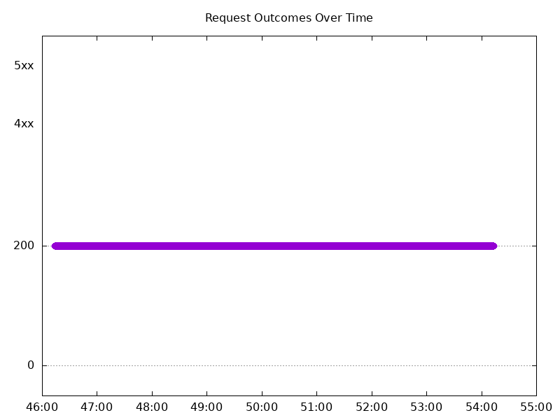
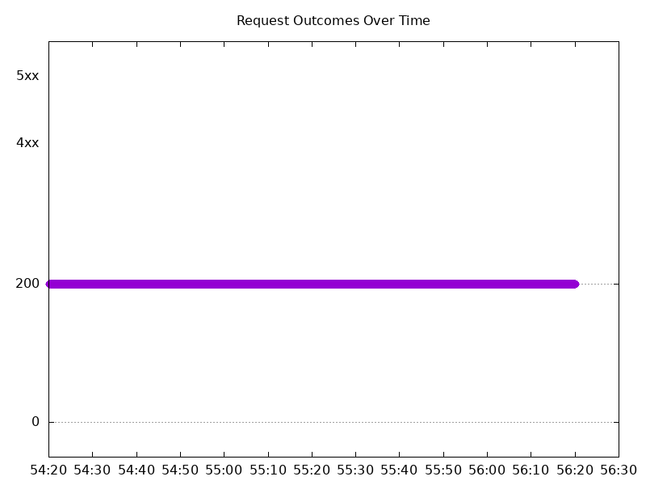
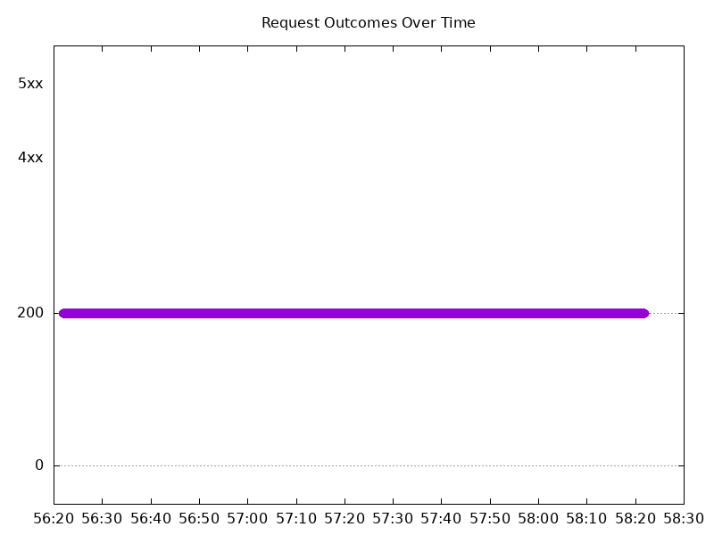
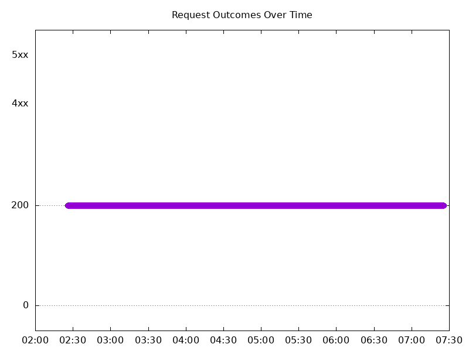
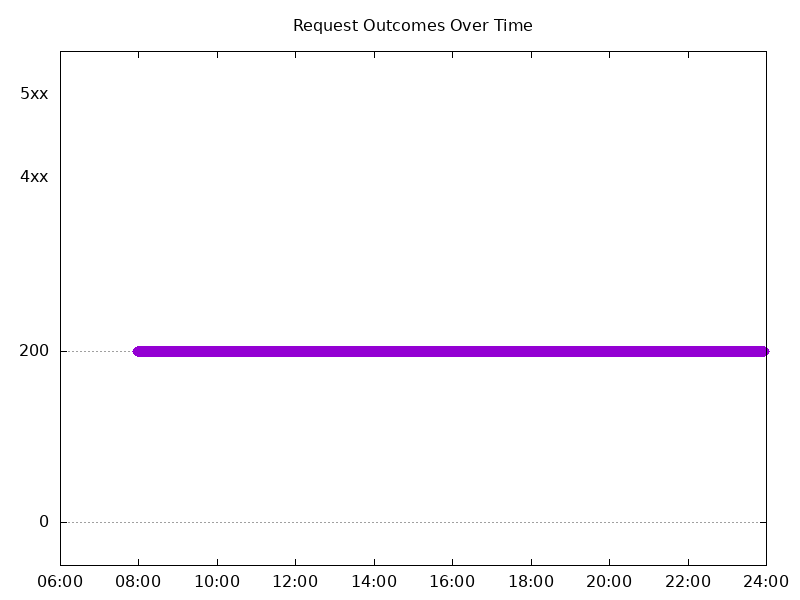
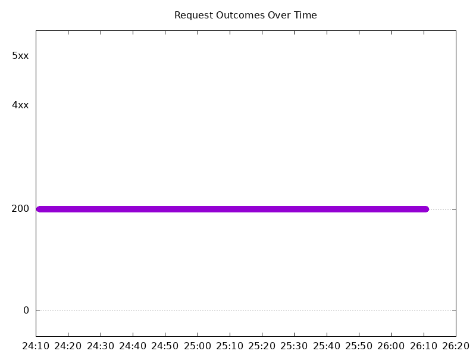

# Results

## Test environment

NGINX Plus: true

NGINX Gateway Fabric:

- Commit: 394bdf0e0c8ae008009546b7a21d8f80248d52be
- Date: 2026-07-30T17:54:44Z
- Dirty: false

GKE Cluster:

- Node count: 12
- k8s version: v1.35.6-gke.1250000
- vCPUs per node: 16
- RAM per node: 65848284Ki
- Max pods per node: 110
- Zone: us-west1-b
- Instance Type: n2d-standard-16

## One NGINX Pod runs per node Test Results

### Scale Up Gradually

#### Test: Send https /tea traffic

```text
Requests      [total, rate, throughput]         30000, 100.00, 100.00
Duration      [total, attack, wait]             5m0s, 5m0s, 1.27ms
Latencies     [min, mean, 50, 90, 95, 99, max]  617.874µs, 1.097ms, 1.084ms, 1.241ms, 1.309ms, 1.61ms, 18.278ms
Bytes In      [total, mean]                     4602184, 153.41
Bytes Out     [total, mean]                     0, 0.00
Success       [ratio]                           100.00%
Status Codes  [code:count]                      200:30000  
Error Set:
```


#### Test: Send http /coffee traffic

```text
Requests      [total, rate, throughput]         30000, 100.00, 100.00
Duration      [total, attack, wait]             5m0s, 5m0s, 1.19ms
Latencies     [min, mean, 50, 90, 95, 99, max]  567.173µs, 1.037ms, 1.029ms, 1.191ms, 1.25ms, 1.518ms, 18.082ms
Bytes In      [total, mean]                     4775838, 159.19
Bytes Out     [total, mean]                     0, 0.00
Success       [ratio]                           100.00%
Status Codes  [code:count]                      200:30000  
Error Set:
```


### Scale Down Gradually

#### Test: Send https /tea traffic

```text
Requests      [total, rate, throughput]         48000, 100.00, 100.00
Duration      [total, attack, wait]             8m0s, 8m0s, 1.284ms
Latencies     [min, mean, 50, 90, 95, 99, max]  643.93µs, 1.115ms, 1.097ms, 1.249ms, 1.311ms, 1.632ms, 58.726ms
Bytes In      [total, mean]                     7363212, 153.40
Bytes Out     [total, mean]                     0, 0.00
Success       [ratio]                           100.00%
Status Codes  [code:count]                      200:48000  
Error Set:
```


#### Test: Send http /coffee traffic

```text
Requests      [total, rate, throughput]         48000, 100.00, 100.00
Duration      [total, attack, wait]             8m0s, 8m0s, 1.144ms
Latencies     [min, mean, 50, 90, 95, 99, max]  627.985µs, 1.075ms, 1.057ms, 1.228ms, 1.292ms, 1.596ms, 46.514ms
Bytes In      [total, mean]                     7641568, 159.20
Bytes Out     [total, mean]                     0, 0.00
Success       [ratio]                           100.00%
Status Codes  [code:count]                      200:48000  
Error Set:
```



### Scale Up Abruptly

#### Test: Send https /tea traffic

```text
Requests      [total, rate, throughput]         12000, 100.01, 100.01
Duration      [total, attack, wait]             2m0s, 2m0s, 1.126ms
Latencies     [min, mean, 50, 90, 95, 99, max]  656.547µs, 1.141ms, 1.119ms, 1.285ms, 1.352ms, 1.522ms, 75.087ms
Bytes In      [total, mean]                     1840706, 153.39
Bytes Out     [total, mean]                     0, 0.00
Success       [ratio]                           100.00%
Status Codes  [code:count]                      200:12000  
Error Set:
```


#### Test: Send http /coffee traffic

```text
Requests      [total, rate, throughput]         12000, 100.01, 100.01
Duration      [total, attack, wait]             2m0s, 2m0s, 1.192ms
Latencies     [min, mean, 50, 90, 95, 99, max]  635.801µs, 1.088ms, 1.061ms, 1.244ms, 1.307ms, 1.482ms, 81.587ms
Bytes In      [total, mean]                     1910430, 159.20
Bytes Out     [total, mean]                     0, 0.00
Success       [ratio]                           100.00%
Status Codes  [code:count]                      200:12000  
Error Set:
```



### Scale Down Abruptly

#### Test: Send http /coffee traffic

```text
Requests      [total, rate, throughput]         12000, 100.01, 100.01
Duration      [total, attack, wait]             2m0s, 2m0s, 1.018ms
Latencies     [min, mean, 50, 90, 95, 99, max]  576.583µs, 1.031ms, 1.021ms, 1.2ms, 1.263ms, 1.431ms, 11.163ms
Bytes In      [total, mean]                     1910415, 159.20
Bytes Out     [total, mean]                     0, 0.00
Success       [ratio]                           100.00%
Status Codes  [code:count]                      200:12000  
Error Set:
```



#### Test: Send https /tea traffic

```text
Requests      [total, rate, throughput]         12000, 100.01, 100.01
Duration      [total, attack, wait]             2m0s, 2m0s, 945.537µs
Latencies     [min, mean, 50, 90, 95, 99, max]  673.08µs, 1.082ms, 1.067ms, 1.233ms, 1.292ms, 1.445ms, 43.319ms
Bytes In      [total, mean]                     1840804, 153.40
Bytes Out     [total, mean]                     0, 0.00
Success       [ratio]                           100.00%
Status Codes  [code:count]                      200:12000  
Error Set:
```


## Multiple NGINX Pods run per node Test Results

### Scale Up Gradually

#### Test: Send http /coffee traffic

```text
Requests      [total, rate, throughput]         30000, 100.00, 100.00
Duration      [total, attack, wait]             5m0s, 5m0s, 1.206ms
Latencies     [min, mean, 50, 90, 95, 99, max]  562.561µs, 1.071ms, 1.057ms, 1.223ms, 1.284ms, 1.613ms, 26.201ms
Bytes In      [total, mean]                     4791114, 159.70
Bytes Out     [total, mean]                     0, 0.00
Success       [ratio]                           100.00%
Status Codes  [code:count]                      200:30000  
Error Set:
```


#### Test: Send https /tea traffic

```text
Requests      [total, rate, throughput]         30000, 100.00, 100.00
Duration      [total, attack, wait]             5m0s, 5m0s, 1.141ms
Latencies     [min, mean, 50, 90, 95, 99, max]  611.214µs, 1.105ms, 1.092ms, 1.236ms, 1.292ms, 1.583ms, 26.378ms
Bytes In      [total, mean]                     4616958, 153.90
Bytes Out     [total, mean]                     0, 0.00
Success       [ratio]                           100.00%
Status Codes  [code:count]                      200:30000  
Error Set:
```



### Scale Down Gradually

#### Test: Send http /coffee traffic

```text
Requests      [total, rate, throughput]         96000, 100.00, 100.00
Duration      [total, attack, wait]             16m0s, 16m0s, 1.131ms
Latencies     [min, mean, 50, 90, 95, 99, max]  606.437µs, 1.078ms, 1.059ms, 1.222ms, 1.284ms, 1.551ms, 90.393ms
Bytes In      [total, mean]                     15331399, 159.70
Bytes Out     [total, mean]                     0, 0.00
Success       [ratio]                           100.00%
Status Codes  [code:count]                      200:96000  
Error Set:
```


#### Test: Send https /tea traffic

```text
Requests      [total, rate, throughput]         96000, 100.00, 100.00
Duration      [total, attack, wait]             16m0s, 16m0s, 1.036ms
Latencies     [min, mean, 50, 90, 95, 99, max]  650.27µs, 1.138ms, 1.115ms, 1.267ms, 1.333ms, 1.62ms, 115.335ms
Bytes In      [total, mean]                     14774178, 153.90
Bytes Out     [total, mean]                     0, 0.00
Success       [ratio]                           100.00%
Status Codes  [code:count]                      200:96000  
Error Set:
```



### Scale Up Abruptly

#### Test: Send http /coffee traffic

```text
Requests      [total, rate, throughput]         12000, 100.01, 100.01
Duration      [total, attack, wait]             2m0s, 2m0s, 1.208ms
Latencies     [min, mean, 50, 90, 95, 99, max]  652.658µs, 1.125ms, 1.054ms, 1.251ms, 1.344ms, 1.622ms, 132.576ms
Bytes In      [total, mean]                     1916334, 159.69
Bytes Out     [total, mean]                     0, 0.00
Success       [ratio]                           100.00%
Status Codes  [code:count]                      200:12000  
Error Set:
```



#### Test: Send https /tea traffic

```text
Requests      [total, rate, throughput]         12000, 100.01, 100.01
Duration      [total, attack, wait]             2m0s, 2m0s, 1.071ms
Latencies     [min, mean, 50, 90, 95, 99, max]  684.202µs, 1.217ms, 1.125ms, 1.375ms, 1.507ms, 1.939ms, 132.118ms
Bytes In      [total, mean]                     1846741, 153.90
Bytes Out     [total, mean]                     0, 0.00
Success       [ratio]                           100.00%
Status Codes  [code:count]                      200:12000  
Error Set:
```


### Scale Down Abruptly

#### Test: Send https /tea traffic

```text
Requests      [total, rate, throughput]         12000, 100.01, 100.01
Duration      [total, attack, wait]             2m0s, 2m0s, 1.326ms
Latencies     [min, mean, 50, 90, 95, 99, max]  712.182µs, 1.166ms, 1.149ms, 1.32ms, 1.393ms, 1.649ms, 11.909ms
Bytes In      [total, mean]                     1846748, 153.90
Bytes Out     [total, mean]                     0, 0.00
Success       [ratio]                           100.00%
Status Codes  [code:count]                      200:12000  
Error Set:
```


#### Test: Send http /coffee traffic

```text
Requests      [total, rate, throughput]         12000, 100.01, 100.01
Duration      [total, attack, wait]             2m0s, 2m0s, 1.089ms
Latencies     [min, mean, 50, 90, 95, 99, max]  616.181µs, 1.093ms, 1.081ms, 1.257ms, 1.313ms, 1.469ms, 11.896ms
Bytes In      [total, mean]                     1916386, 159.70
Bytes Out     [total, mean]                     0, 0.00
Success       [ratio]                           100.00%
Status Codes  [code:count]                      200:12000  
Error Set:
```


